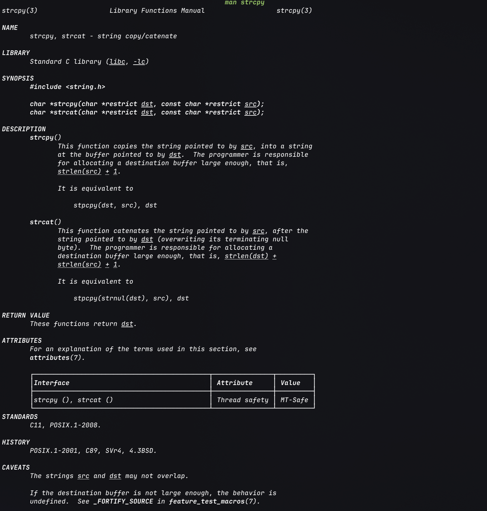
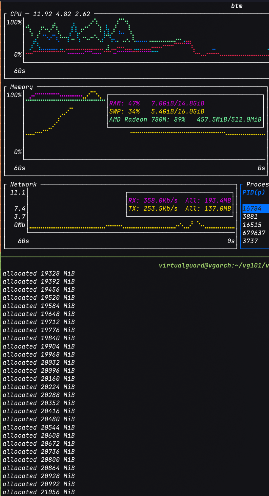

# 函数接口

> [函数接口 | Linux C编程一站式学习](https://akaedu.github.io/book/ch24.html)
>
> [strcpy / strncpy | cppreference](https://en.cppreference.com/w/c/string/byte/strcpy.html)
>
> [malloc / free | cppreference](https://en.cppreference.com/w/c/memory/malloc.html)
>
> [Variadic arguments | cppreference](https://en.cppreference.com/w/c/language/variadic.html)
>
> [qsort | cppreference](https://en.cppreference.com/w/c/algorithm/qsort.html)

!!! abstract
    - 读库函数时先看**原型**: 参数叫什么, `const` 标在哪, 返回什么类型. 这几项往往已经说明「谁提供内存 / 谁只读 / 谁拿结果」. 猜不准的细节 (能不能重叠, 失败时返回什么) 再去翻文档对应段落, 无需把整篇 Man Page 从头读到尾.

    - [指针](指针详解.md)使接口变灵活. 同一指针参数 `T *` 按数据流动方向可以分为以下三类:

        - **传入** (`const T *`): 调用者填好数据, 函数只读.

        - **传出** (`T *`): 调用者先准备好一块空间, 函数往里写, 返回后调用者再读.

        - **Value-result** (类型也常是 `T *`): 调用者先写入初值, 函数读完再改写同一块, 文档会说明「先读后写」. 后两种在原型上可能长得一样, 角色只能靠文档区分, 不能只靠类型硬猜.

    - 堆内存要成对处理: 谁 `malloc` (或提供 `alloc_xxx`), 谁就应提供对应的 `free` / `free_xxx`. `free(p)` 之后 `p` 里的地址值不会自动更新, 调用者应立刻写 `p = NULL`, 避免之后误当成仍有效去解引用.

    - 有些函数返回指向**自己内部静态缓冲区**的指针 (多次调用共用同一块). 不要在同一个表达式里调用两次再同时使用两个返回值, 例如 `printf("%s %s", f(0), f(1))`: 后一次调用会覆盖前一次写入的内容, 两个指针实际指向同一块已被改写的缓冲.

    - `printf` 这类带 `...` 的可变参数**没有**编译期类型检查. 后面有几个实参, 各是什么类型, 全靠格式串 (或文档规定的哨兵如 `NULL`) 与调用者对齐. 对不上就会触发[未定义行为](数据类型详解.md#三种行为).

## 接口即契约

调用前, 调用者提供约定条件; 返回时, 实现者履行约定义务. 契约首先写在**函数接口**上: 名字合理, 类型准确, 调用者单看原型就能猜用法. 接口表达不了的语义 (例如 `src` 与 `dest` 不可重叠, `n` 截断后可能无 `'\0'`) 就回过头看文档, Man Page 是范本.

函数接口与指针结合后, 用法就多了, 常见用法大致有这几类:

1. **改调用方的对象**: 传对象地址 `T *`, 函数里写 `*p`. 例如 `scanf("%d", &n)`, 或自己写的 `swap(int *a, int *b)`.

2. **只读传入大块数据**: `const T *`, 避免拷贝整份结构体 / 字符串, 又向调用者保证不改内容. 例如 `strlen(const char *s)`, `strcpy` 的 `src`.

3. **往调用方准备好的缓冲区里填结果**: 仍是 `T *`, 但是传出角色. 例如 `strcpy` 的 `dest`, `strftime` 的输出缓冲.

4. **改调用方手里的指针本身** (让它指向别处, 或指向新 `malloc` 的块): 形参升成 `T **`, 实参传 `&p`. 例如链表头插入 `add_to_front(node_t **head, ...)`, 或 `getaddrinfo(..., struct addrinfo **res)`.

5. **用返回值交出指针**: 返回 `T *`. 可能指向静态缓冲 (`localtime`), 也可能指向新堆块 (`malloc`, `strdup`). 两种原型长得一样, 寿命与是否要 `free` 必须看文档.

6. **把「一段行为」当作参数**: 函数指针做成回调, 常配 `void *` 用户数据. 例如 `qsort` 的比较函数, GUI / 信号里的注册回调.

分析时重点分清「改的是形参副本还是调用方的对象 / 指针」.

## 从库函数看接口设计

### `strcpy` / `strncpy`

```c
char *strcpy(char *restrict dest, const char *restrict src);
char *strncpy(char *restrict dest, const char *restrict src, size_t n);
```

- `dest` 是 `char *` (可写) → 传出缓冲区; `src` 是 `const char *` → 传入只读串.

- 实现者不知道缓冲区长度: **不越界是调用者的责任**. `src` 必须 `'\0'` 结尾; `dest` 必须够大.

- `strncpy` 的 `n` 限制最多拷 `n` 字节. `src` 长度 `>= n` 时**不一定**写入结尾 `'\0'`. 需要 C 字符串时调用后应自行保证终止, 例如 `dest[n ? n - 1 : 0] = '\0'` (并先确认 `n > 0`).

- 返回 `dest` 便于把调用嵌进表达式, 例如 `puts(strcpy(buf, "hi"))`, 并不提供新信息.

- 缓冲区溢出属严重漏洞. 新代码优先考虑带长度的安全接口 (如 `snprintf` 拼串), 并始终核对文档.

!!! example "Man Page 的用法"
    以 `strcpy(3)` 为例(页名常写作 `func_name(n)`, 括号里的 `n` 表示库函数章节), 可以按如下顺序阅读, 无需每次都通读全文:

    

    1. **SYNOPSIS**: 要 `#include` 哪个头文件, 原型长什么样. 参数名往往带下划线强调 (如 `dest`, `src`), 便于在正文里用搜索跳到对应说明.

    2. **先猜接口, 再补文档**: 看到 `strcpy` 的函数接口原型, 不难猜到 `dest` 指代 Destination (`char *`, 可写), `src` 指代 Source (`const char *`, 只读),  这样很容易就可以猜出函数的功能是把 `src` 指向的串拷贝到 `dest` 指向的空间. `strncpy` 多出来的 `n` 单靠类型猜不出含义, 才需要往下读 DESCRIPTION / NOTES.

    3. **DESCRIPTION / NOTES / BUGS**: 字段则用于[阐明接口说不清的契约](#接口即契约). 以 `strcpy` 为例:

        - `strcpy` 会连同结尾 `'\0'` 一起拷; 但实现者不知道长度, **dest 够大, src 以 `'\0'` 结尾, 且两块内存不重叠**, 都是调用者的责任

        - `strncpy` 最多拷 `n` 字节; `src` 长度 `>= n` 时 dest **可能没有**结尾 `'\0'` (页里常标 Warning). 需要 C 字符串时要自己补终止符, 且注意 `n == 0` 时不要写 `buf[n - 1]`

        - *BUGS* 会强调 `strcpy` 更容易缓冲区溢出: 越界当时未必崩, 可能在函数返回时才段错误, 甚至被利用

    4. **RETURN VALUE**: 二者都返回 `dest`. 信息量不大, 主要为了能嵌进表达式, 如 `printf("%s\n", strcpy(buf, "hello"))`.

    5. **CONFORMING TO**: 标明属于 C 标准还是 POSIX. 例如 `strcpy` 是 C 库函数; 以后见到的 `write(2)` 是 POSIX / 系统调用 (章节号 `2`).

#### 简易的函数接口实现

> [vglab/lang/c/stringop.c](https://github.com/vglab/lang/blob/main/c/stringop.c)

##### `strcpy` 简易实现

对照`strcpy`的接口文档. 

把 `src` (含结尾 `'\0'`) 拷贝到调用者提供的 `dest`, 并**返回原先的 `dest`** (拷贝过程中写指针会前进, 若不先保存就无法返回原地址).

若不考虑可读性, 可以把赋值表达式直接当作 `while` 的条件, 函数体就只需要三行代码:

```c
/**
 * @brief `strcpy` 简易实现. 将 `src` 复制到 `dest` 中, 并返回 `dest` 的指针.
 * 
 * @param dest 目标字符串的指针.
 * @param src 源字符串的指针.
 * @return `dest` 的指针, 便于链式调用.
 * @note 最简写法可将函数体压成三行: 先保存返回用的 dest, 再用
 *       `while ((*dest++ = *src++) != '\0');` 边拷边前进 —— 赋值表达式的值就是
 *       刚写入的字节, 写到 '\0' 时条件为假, 循环结束, 因而无需再单独补结尾.
 */
char *strcpy_sim(char *dest, const char *src)
{
	char *ret = dest;
	while (*src != '\0') {
		*dest++ = *src++;
	}
	*dest = '\0';

	// /* In simply */
	// char* ret = dest;
	// while ((*dest++ = *src++) != '\0');

	return ret;
}
```

`(*dest++ = *src++)` 这个**赋值表达式的值就是刚写入的字节**, 当写入 `'\0'` 时条件为假, 循环结束, 因而无需再单独写结尾.

##### `shrink_space`

给定一个接口标准:

```c
char *shrink_space(char *dest, const char *src, size_t n);
```

语义如下:

- 把 `src` 里一段或多段连续空白 (`' '` / `'\t'` / `'\n'` / `'\r'`) **压缩成恰好一个空格**写入 `dest`; 

- 非空白原样拷贝; 

- 最多写 `n` 字节, 若结果不足 `n` 则剩余位置填 `'\0'`; 

- 若恰好写满 `n` 字节则**不保证**以 `'\0'` 结尾. 

- 返回原 `dest`.

仔细观察一下可以发现其实和 `strncpy` 的语义类似, 只是多了个处理空白段的逻辑.

实现上读写进度必须分开: `src` 扫描源串, 下标 `i` (或另一指针) 推进 `dest`. 遇到空白先整段吞掉, 再决定是否写入一个 `' '`.

空白判定要写成每次带入当前字符再求值的形式 (如宏或内联函数), 不能使用单个 `bool` 变量缓存(单变量缓存相当于只在进入函数时求值一次, 之后不会更新), 否则 `src` 前进后条件不更新, 内层循环会死循环或漏掉后面的空白段. 这里使用宏定义来判断空白:

```c
#define IS_SPACE(c) ((c) == ' ' || (c) == '\t' || (c) == '\n' || (c) == '\r')
```

完整实现如下:

```c
/**
 * @brief 将 `src` 中连续空白压缩后写入 `dest`, 接口语义类似 `strncpy`.
 * 
 * @note 这里的空白采用的是宏定义. 空白的求值必须采用「每次带入当前字符再求值」的
 *       形式 (宏或内联函数), 不能使用一个一次性的 bool 变量缓存起来(`int is_space = ...`):
 *       后者在 src 前进后不会更新, 会导致内层 while 死循环, 或漏掉串中间的空白段.
 *
 * @param dest 调用者提供的缓冲区, 至少 `n` 字节; 函数会改写其内容.
 * @param src  以 '\0' 结尾的源字符串; 只读.
 * @param n    最多写入 `dest` 的字节数. 若压缩结果不足 `n` 字节, 剩余位置
 *             填 '\0' (同 `strncpy`); 若恰好写满 `n` 字节, 不保证以 '\0' 结尾.
 * @return 原先的 `dest`, 便于当作表达式链式使用.
 *
 * @note 调用者须保证: `dest` 足够大、`src` 合法以 '\0' 结尾、二者指向的
 *       内存不重叠. 读写不越界是调用者的责任, 与 `strcpy` / `strncpy` 相同.
 */
char *shrink_space(char *dest, const char *src, size_t n)
{
	size_t i = 0;
	while (*src && i < n) {
		if (IS_SPACE(*src)) {
			while (IS_SPACE(*src)) {
				src++;
			}
			if (*src != '\0') {
				dest[i++] = ' ';
			}
		} else {
			dest[i++] = *src++;
		}
	}
	while (i < n) {
		dest[i++] = '\0';
	}

	return dest;
}
```

### `malloc` / `free`

```c
void *malloc(size_t size);  /* 失败返回 NULL; 成功返回对齐后的堆块首地址 */
void free(void *ptr);       /* free(NULL) 合法; 不可对同一指针 free 两次 */
```

- 返回 `void *`: 实现者不知道用户要存什么类型.

- `free(p)` **不能**把调用方的 `p` 改成 `NULL` (形参只是副本). 调用者应 `free(p); p = NULL;`.

- 嵌套分配先释放内层再释放外层. 丢失唯一指向堆块的指针会造成内存泄漏.

初学时可以把 `malloc` / `free` 想成使用[环形链表](../../数据结构与算法/408/线性表的链式表示.md#循环链表)串起来的空闲块: 每块开头有头节点, 内含 `next` (指向下一空闲头) 与 `size` (本块总长度); 分配时从某空闲块截一段 (含新头节点), 返回**头后面**的地址, 新头不进 freelist; `free` 把头节点重新链回环, 相邻空闲尽量合并; 空间不够就 `brk`/`sbrk` **抬高** Break:

<iframe src="../assets/func-interface/c-func-malloc-free.html"
        title="简易 malloc free 演示"
        style="width:100%;height:760px;border:0;">
</iframe>

真实 libc 远复杂于此, 但用这个模型足以理解野指针, 越界砸坏 `next`/`size`, 以及「`free` 不立刻把内存还给内核」等问题.

#### 内存泄漏

**内存泄漏** ([Memory Leak](C-Memory-Management.md#Common-Heap-Bugs)) 是指堆上通过 `malloc` 等内存操作接口申请到的块, 在进程退出前再也无法 `free` 的现象. 常见原因是丢掉了唯一指向该块的指针, 或分配与释放不成对.

出现泄漏时往往不引起段错误, 且不会立刻出现程序崩溃等异常现象. 短生命周期程序退出时 OS 会收回整个地址空间, 问题被掩盖. 长跑进程 (如服务器进程, 循环里反复分配) 则会慢慢占满内存, 变慢甚至触发操作系统的保护机制.

下面就是一个典型的会引起内存泄露的代码示例:

```c
void foo(void)
{
    char *p = malloc(10);
    /* 用完却忘记 free; 返回后局部指针 p 消失, 地址丢失 */
}
```

!!! example
    内存泄露在C程序中是个致命但很容易犯的错误. 每次 `malloc` 成功后没有对应的 `free`, 指针直接丢弃或不再使用, 堆上的分配的内存块就会一直占着.

    值得注意的是, 由于 Linux 通常会开启 [memory overcommit](https://www.kernel.org/doc/html/latest/mm/overcommit-accounting.html), 只 `malloc` 不写页时, 虚拟地址空间很容易一直分配成功. 这也是操作系统为了应对内存过量分配的一种机制.
    
    因此在示例实现上, 对整块 `memset` (或其它写入) 才会真正提交物理页, 才更容易看到 `malloc` 返回 `NULL`, 或进程被 [OOM killer](https://www.kernel.org/doc/gorman/html/understand/understand016.html) 杀掉, 两种结局都是内存过量分配时可能会观察到的现象:

    ```c
    enum { CHUNK = 1 << 20 };  /* 1 << 20 == 2^20 字节 (1 MiB) */

    size_t mem_consume(void)
    {
        size_t total = 0;

        for (;;) {
            void *p = malloc(CHUNK);
            if (p == NULL)
                return total;          /* 先判失败, 再谈累计 */
            memset(p, 0, CHUNK);       /* 触碰页面, 逼出真实占用 */
            total += CHUNK;
            if ((total / CHUNK) % 64 == 0)
                printf("allocated %zu MiB\n", total >> 20);
            /* 故意不 free: 教学上的可控泄漏 */
        }
    }
    ```

    下面是被操作系统 [OOM killer](https://www.kernel.org/doc/gorman/html/understand/understand016.html) 杀掉的示例:

    

    真实的业务代码里应避免泄漏, 谁 `malloc` 谁提供成对的 `free`, 出错提前返回时也要释放已申请成功的块; 可用 [Valgrind](C-Memory-Management.md#Common-Heap-Bugs) 等工具辅助排查.

## 传入, 传出与 Value-result

| 角色 | 典型类型 | 调用者 | 实现者 |
|:-----|:---------|:-------|:-------|
| 传入 | `const T *` | 分配并填好数据后传入 | 只读 `*p` |
| 传出 | `T *` | 分配空间, 调用后读取 | 写入 `*p` |
| Value-result | `T *` | 先填初值, 调用后再读 | 先读后改 |

```c
typedef struct {
    int number;
    char msg[20];
} unit_t;

void set_unit(unit_t *p)  /* 传出 */
{
    if (p == NULL)
        return;
    p->number = 3;
    strcpy(p->msg, "Hello World!");
}

int main(void)
{
    unit_t u;
    set_unit(&u);  /* 调用者提供对象的地址 */
    printf("%d %s\n", u.number, u.msg);
}
```

`const` 写在指针形参上才有「实现者不改对象」的契约含义. `void f(const int x)` 里的 `const` 只约束形参副本, 对调用者几乎无信息.

系统调用里 `NULL` 常有特殊语义: 传入表示默认属性, 传出表示调用者不要结果. 必须写进文档. 传出与 Value-result 的原型可以完全相同, **靠文档区分**.

## 两层指针的参数

要改的是调用方的**指针变量本身** (让它指向别处, 或指向新分配的堆块), 形参类型为 `T **`, 实参传 `&p`.

### 传出已有对象的地址

```c
static const char *msg[] = {
    "Sunday", "Monday", "Tuesday", "Wednesday",
    "Thursday", "Friday", "Saturday"
};

void get_a_day(const char **pp)
{
    static int i = 0;
    *pp = msg[i % 7];
    i++;
}

const char *day = NULL;
get_a_day(&day);  /* day 被改成指向静态字符串 */
```

这里 `const` 约束的是**最终字符**只读 (`**pp` 不可写), 不是「参数只能传入」. 函数仍可通过 `*pp = ...` 改调用方的指针.

### 在函数内分配并传出

```c
void alloc_unit(unit_t **pp)
{
    unit_t *p = malloc(sizeof(unit_t));
    if (p == NULL) { /* 处理失败 */ return; }
    p->number = 3;
    p->msg = malloc(20);
    strcpy(p->msg, "Hello World!");
    *pp = p;  /* 写回调用方的 unit_t * */
}

void free_unit(unit_t *p)
{
    free(p->msg);
    free(p);
}
```

为何不能写成 `void alloc_unit(unit_t *p)`? 形参 `p` 是调用方指针的**值副本**. `p = malloc(...)` 只改副本, 调用方的指针仍是旧值 (常为 `NULL`), 且堆块泄漏.

<iframe src="../assets/func-interface/c-func-double-ptr.html"
        title="两层指针传出参数演示"
        style="width:100%;height:640px;border:0;">
</iframe>

两种「传出指针」接口长得一样: (1) 指向静态或已有动态对象; (2) 函数内 `malloc` 再传出. 文档必须写清是哪一种, 以及谁负责 `free`.

## 返回值是指针

返回指针同样分两类, 且接口可以长得一样, 必须靠文档区分.

| 模式 | 示例 | 调用者义务 |
|:-----|:-----|:-----------|
| 指向静态 / 已有存储 | `localtime`, 下面的 `get_a_day` | 搞清寿命与是否可重入; 勿假设多次调用得到独立缓冲 |
| 指向新堆块 | `malloc`, `strdup` 类 | 保存返回值并在适当时 `free` |

### 静态缓冲区

```c
char *get_a_day(int idx)
{
    static char buf[20];
    strcpy(buf, msg[idx]);
    return buf;
}

printf("%s %s\n", get_a_day(0), get_a_day(1));
/* 常见结果是 Sunday Sunday, 而不是 Sunday Monday */
```

两次调用复用同一 `buf`. 后一次覆盖前一次内容; 两个返回值是同一地址. 实参求值顺序是[实现定义](数据类型详解.md#三种行为), 但无论左右谁先算, 「两个结果共享一块可变缓冲」这一事实不变.

<iframe src="../assets/func-interface/c-func-static-ret.html"
        title="返回静态缓冲区陷阱演示"
        style="width:100%;height:560px;border:0;">
</iframe>

### 堆分配并返回

```c
unit_t *alloc_unit(void)
{
    unit_t *p = malloc(sizeof(unit_t));
    /* 初始化... */
    return p;  /* 返回一层指针即可: 返回值本身会写进调用方的变量 */
}

unit_t *p = alloc_unit();
/* 使用后 */ free_unit(p); p = NULL;
```

对比: 通过**参数**交回新指针需要 `T **`; 通过**返回值**交回只需要 `T *`. 原因仍是值传递: 返回值会用来初始化 / 赋值给调用方的指针变量, 而形参赋值不会.

[不要返回指向本函数局部自动变量的指针!](指针详解.md#指针参数与返回值)

## 回调函数

参数是函数指针时, 调用者把「一段行为」交给实现者, 由实现者在适当时机调用, 称为**回调** (callback). 典型: `qsort`, `bsearch`.

```c
typedef void (*callback_t)(void *);

void repeat_three_times(callback_t f, void *para)
{
    f(para);
    f(para);
    f(para);
}

void say_hello(void *str)
{
    printf("Hello %s\n", (const char *)str);
}

repeat_three_times(say_hello, "Guys");
```

- 回调形参类型由**调用者**解释; 对实现者只是 `void *`, 原样转交.

- 同步回调: 调用者 → 库函数 → 再进入调用者提供的函数 (如比较函数).

- 异步回调: 先注册 (`sigaction`, 线程入口, GUI 按钮), 事件发生时再调.

[泛型](C-Generics-and-Function-Pointers.md#Why-Generics)查找最大值时, 库只操作 `void *` 数组并调用比较回调.

返回函数指针 ([高阶函数](https://composingprograms.netlify.app/1/6#_1-6-%E9%AB%98%E9%98%B6%E5%87%BD%E6%95%B0)) 在 C 中少见, 语法上允许 `func()();`.

<iframe src="../assets/func-interface/c-func-callback.html"
        title="回调函数演示"
        style="width:100%;height:620px;border:0;">
</iframe>

## 可变参数

原型以 `...` 结尾, 且 (C23 前) 前面至少一个具名参数. 实现侧用 `<stdarg.h>`:

```c
#include <stdarg.h>

void myprintf(const char *format, ...)
{
    va_list ap;
    char c;

    va_start(ap, format);
    while ((c = *format++)) {
        switch (c) {
        case 'c': {
            /* char 经 ... 时提升为 int */
            char ch = (char)va_arg(ap, int);
            putchar(ch);
            break;
        }
        case 's': {
            char *p = va_arg(ap, char *);
            fputs(p, stdout);
            break;
        }
        default:
            putchar(c);
        }
    }
    va_end(ap);
}
```

要点:

1. `va_start(ap, last_named)` 把游标放到具名参数之后; `va_arg(ap, T)` 按类型取出并前进; 返回前必须 `va_end`.

2. 传入 `...` 的整数小类型会发生 [default argument promotions](数据类型详解.md#Integer-Promotion): `char` / `short` → `int`, `float` → `double`. 因此取 `char` 实参时写 `va_arg(ap, int)`.

3. 实现者按格式串或约定取数, **无法**验证调用者是否传对. 类型或个数不匹配是调用者的责任.

4. 也可用哨兵判定结束, 例如 `execl` 以 `NULL` 结尾; 文档必须写明, 调用者忘记哨兵则无法由实现方挽救.

<iframe src="../assets/func-interface/c-func-va.html"
        title="可变参数演示"
        style="width:100%;height:620px;border:0;">
</iframe>

历史上一种 `va_list` 实现就是 `char *` 游标, 按对齐步长在参数槽上移动. 现代 ABI (寄存器传参) 更复杂, 但「游标 + 按约定解释」的心智模型仍然够用. 上面的演示逐步走了一遍游标前进过程, 并附「调用者传错类型」的对照.

## 模式速查

| 需求 | 常见接口形态 |
|:-----|:-------------|
| 只读输入大对象 | `const T *` |
| 填调用者提供的对象 | `T *` 传出 |
| 改调用者的指针 / 交回新堆块指针 | `T **` 或返回 `T *` |
| 多返回值且其一是错误码 | 返回 `int`, 其余用传出参数 |
| 算法与类型解耦 | 函数指针回调 + `void *` |
| 参数个数不定 | `...` + 格式串或哨兵 |
