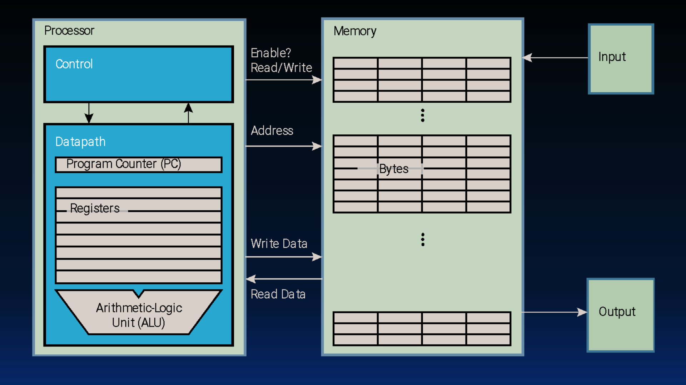
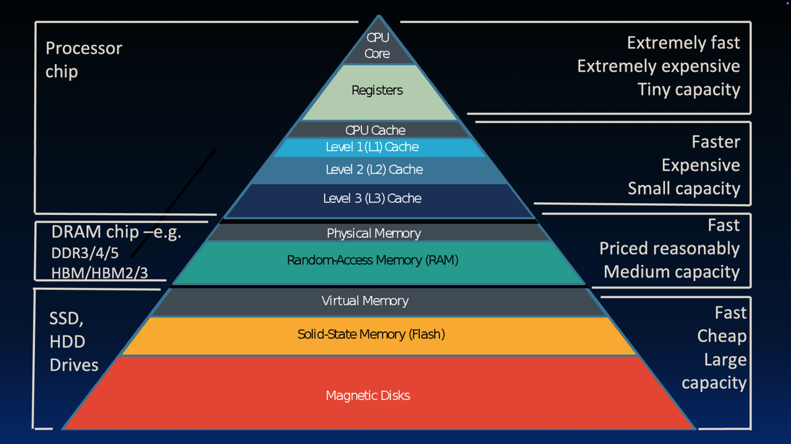

# RISC-V Introduction

> [L09 RISC-V Intro | CS 61C Course Notes](https://notes.cs61c.org/content/rv-intro/)

## What's RISC-V?

**RISC-V** is an open, free **Instruction Set Architecture (ISA, [指令集架构](../指令集架构的状态机模型.md#指令集架构的本质))** — the contract between software and hardware: which instructions exist, what registers look like, and how memory is accessed. Different CPUs speak different ISAs (x86, ARM, RISC-V, …). We study RISC-V because it is simple, real, and open: anyone can use it without paying license fees.

!!! info "RISC vs. CISC"
    Think of an ISA as the **vocabulary** a CPU understands.

    - **CISC** (*Complex Instruction Set Computer*, 复杂指令集计算机): many powerful instructions; one instruction may do several steps at once (e.g. load from memory *and* compute). Programs can be shorter, but the hardware is harder to design and speed up. Classic example: **x86**.

    - **RISC** (*Reduced Instruction Set Computer*, 精简指令集计算机): a small set of simple, fast instructions. Complex work is built by combining many simple ones (usually by the compiler). Hardware stays simpler and can run faster. Examples: **ARM**, **MIPS**, **RISC-V**.

    Trade-off: a RISC program often needs *more* instructions, but each one is cheap — so the program can still finish faster.

## Elements of Architecture

### Conceptual Layout of a Computer



- **Processor**: responsible for computing. eg. Central Processing Unit (CPU).

    Inside the processor, there is a Control Unit (CU) and a Data Path (DP). The main elements of the data path are the registers and the execution unit, typically called the Arithmetic Logic Unit (ALU).

- **Main Memory**: responsible for long-term data(include program code and runtime data) storage.

- **Input/Output (I/O) Devices**: responsible for input and output. eg. Keyboard, Mouse, Printer, etc.

### Memory Hierarchy



Based on the Principle of Locality([局部性原理](../../操作系统/408/虚拟内存管理.md#局部性原理)), the memory hierarchy is designed to trade off between cost and performance. The higher the level, the more expensive and slower the memory, but the larger the capacity and the faster the access speed.

## RISC-V ISA

### RV32I Registers

The RISC-V ISA has 32 general-purpose registers, named $x_0$ to $x_{31}$.

!!! info "The impact of the number of registers on computer systems"
    - *Too many registers would slow the machine down and be extremely expensive*. 

    - *Too few registers would require (among other things) extremely complicated compiler logic*.

#### Register Size

In RV32I, the word size is 32 bits, so each register is 32 bits wide, which means that each register can store a 32-bit value.

#### The Zero Register

Register `x0`, which has register name zero. This special [zero register](https://en.wikipedia.org/wiki/Zero_register) is *hardwired to zero*, and we cannot change its value.

!!! tip "Why `x0`?"
    Contrary to intuition, it is extremely helpful to have a register-sized representation of zero handy for a multitude of operations. The RISC-V architects thought so too, and were willing to sacrifice one fewer data register in order to specify zero directly on the processor.

### Arithmetic Instructions

In RISC-V, “arithmetic” often means **ALU work**: add/sub, bitwise logic, and shifts. Most of these use a fixed order of operands:

```text
op  rd, rs1, rs2     # result → rd; inputs from rs1 and (usually) rs2
op  rd, rs1, imm     # last input is a constant baked into the instruction
```

Same idea as C’s `a = b + c`, except assembly names the destination **first** (`rd`, then sources). Full opcode tables refer to [RV32I Reference Card · Arithmetic](RV32I%20Reference%20Card.md#Arithmetic).

#### `ADD` and `SUB`

| Instruction | Meaning | In C |
|:------------|:--------|:-------|
| `add rd, rs1, rs2` | `R[rd] = R[rs1] + R[rs2]` | `a = b + c;` |
| `sub rd, rs1, rs2` | `R[rd] = R[rs1] − R[rs2]` | `a = b - c;` |

Imagine `a = b + c` with `a↔x1`, `b↔x2`, `c↔x3`:

```asm
add x1, x2, x3
```

One C line may need several RISC-V lines. For `a = b + c + d - e` (`a↔x10`, others in `x1`…`x4`):

```asm
add x10, x1, x2    # temp = b + c
add x10, x10, x3   # temp = temp + d
sub x10, x10, x4   # a = temp - e
```

!!! tip "Operand Order"
    `add` is commutative (`b+c` = `c+b`). **`sub` is not**: always `R[rs1] − R[rs2]`. Overflow wraps, no trap in the base ISA[^wrap-trap].

#### Immediates

An **immediate** is a numeric constant whose bits live *inside* the machine instruction, available “immediately,” without loading from another register first.

##### `ADDI`

| Instruction | Meaning | In C |
|:------------|:--------|:-------|
| `addi rd, rs1, imm` | `R[rd] = R[rs1] + imm` | `f = g + 10;` |

```asm
addi x3, x4, 10      # f = g + 10
addi x3, x4, -10     # f = g - 10   (no separate subi!)
```

!!! warning "No `subi`"
    RISC keeps the ISA small. Immediates are **signed**, so subtracting a constant is just `addi` with a negative imm. Don’t look for `subi` in RV32I.

`x0` + `addi` also covers everyday idioms (often written as [pseudoinstructions](RV32I%20Reference%20Card.md#Pseudoinstructions)) for convenience:

| Idea | Real instruction | Pseudo |
|:-----|:-----------------|:-------|
| copy register | `addi rd, rs, 0` | `mv rd, rs` |
| small constant | `addi rd, x0, imm` | `li rd, imm` |
| do nothing | `addi x0, x0, 0` | `nop` |

#### Bitwise Operations

Bitwise ops work **bit by bit** on the whole register (AND / OR / XOR). Each has a register–register form and an immediate form:

| Op | Register–register | With immediate |
|:---|:------------------|:---------------|
| AND | `and rd, rs1, rs2` | `andi rd, rs1, imm` |
| OR | `or rd, rs1, rs2` | `ori rd, rs1, imm` |
| XOR | `xor rd, rs1, rs2` | `xori rd, rs1, imm` |

##### Pseudoinstruction `NOT`

There is **no** hardware `not` opcode. Flip every bit by XORing with all-ones (`-1` in [two’s complement](Number%20Representation.md#Twos-Complement)):

| Pseudo | Meaning | Expands to |
|:-------|:--------|:-----------|
| `not rd, rs` | `R[rd] = ~R[rs]` | `xori rd, rs, -1` |

!!! info "Why `-1` in Origin ASM?"
    In 32-bit two’s complement, `-1` is `0xFFFFFFFF`, XOR with `1` on every bit inverts that bit. No `noti`: inverting a constant yourself is the same as writing the inverted constant.

##### Shift Left

| Instruction | Meaning |
|:------------|:--------|
| `sll rd, rs1, rs2` | `R[rd] = R[rs1] << R[rs2]` (low bits of `rs2` = shift amount) |
| `slli rd, rs1, imm` | `R[rd] = R[rs1] << imm` |

Vacated **low** bits become `0`. Only one left-shift flavor (`sll` / `slli`): “logical” and “arithmetic” left shifts do the same thing, so RISC-V does not add `sla`.

##### Shift Right

In C, `>>` on a signed vs unsigned value may differ. In RISC-V, **you pick the instruction**:

| Instruction | Fill vacated **high** bits with | Treats `rs1` like |
|:------------|:--------------------------------|:------------------|
| `srl` / `srli` | `0` (logical / zero-extend) | unsigned |
| `sra` / `srai` | copies of the sign bit (arithmetic) | signed |

```asm
srl  t0, t1, t2    # logical  >> ; zeros enter from the left
sra  t0, t1, t2    # arithmetic >> ; sign bit is copied in
srli t0, t1, 4
srai t0, t1, 4
```

Shift amount for RV32I: only the low **5** bits matter (0…31).


[^wrap-trap]: [Wrap and Trap - RV32I Reference Card](RV32I%20Reference%20Card.md#Wrap-and-Trap)