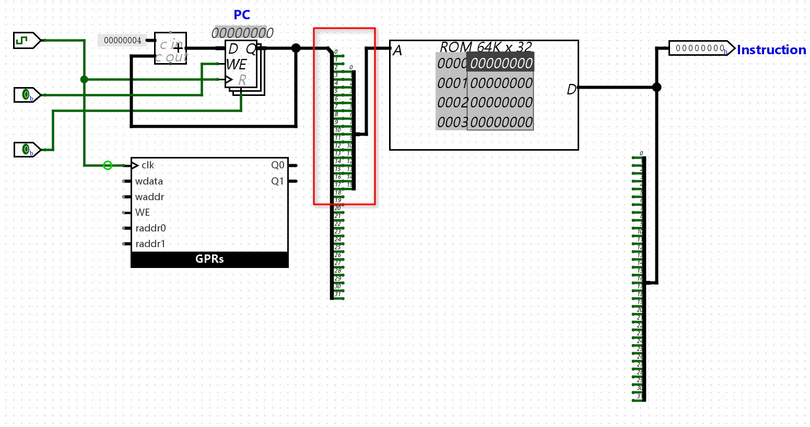
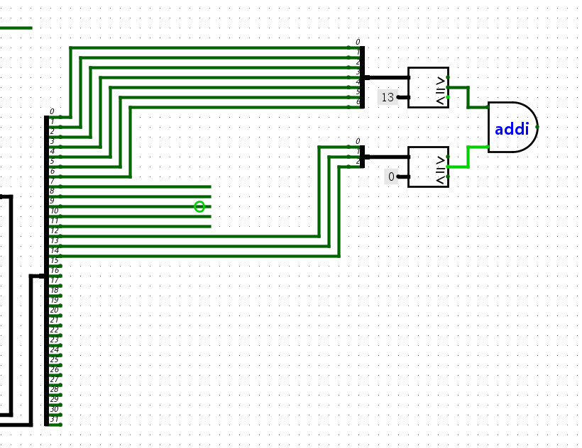
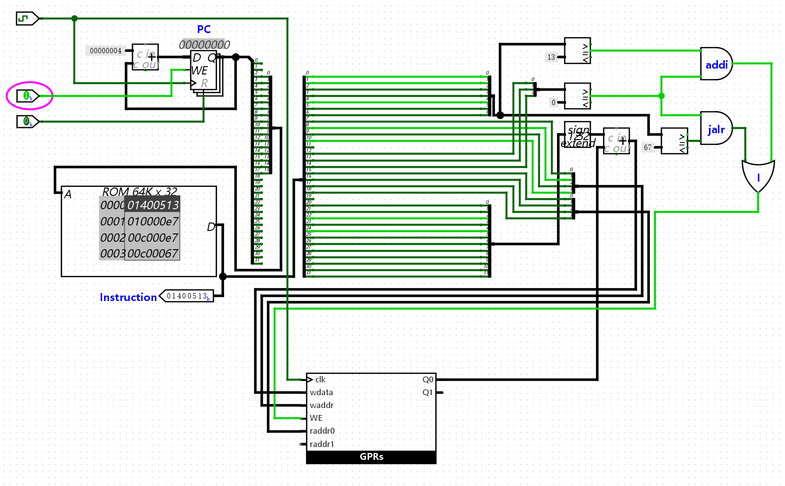
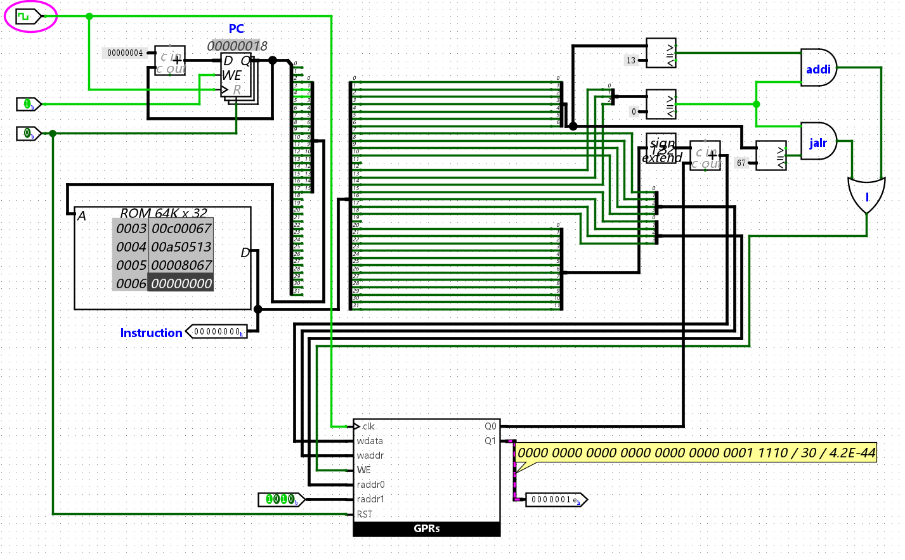
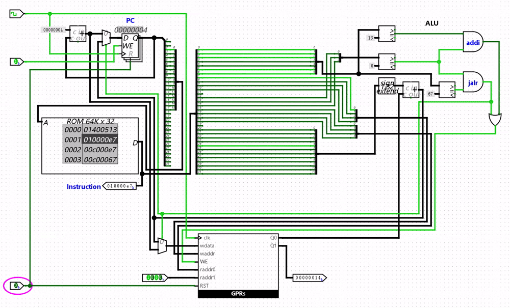
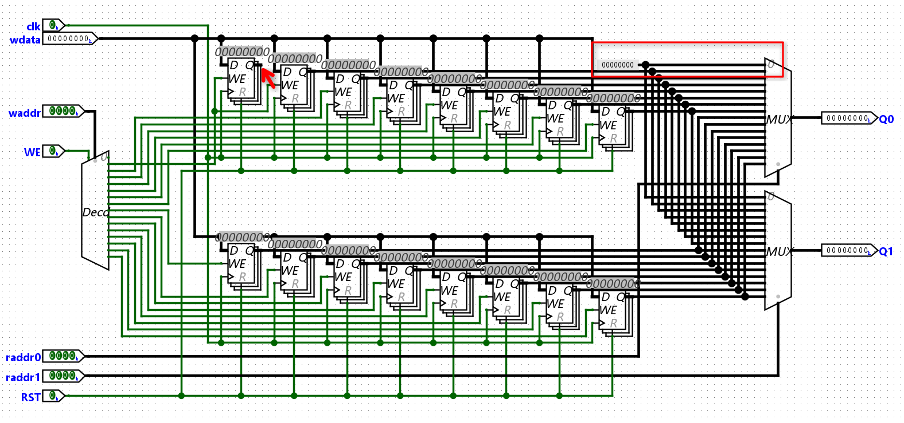
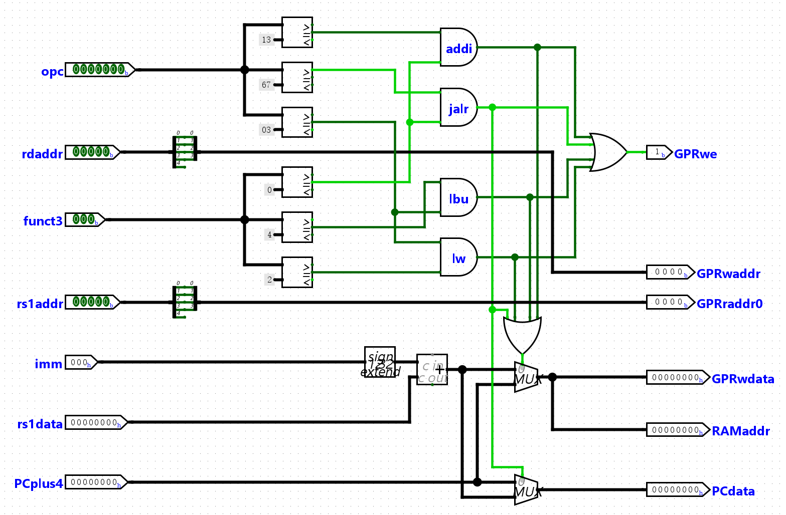
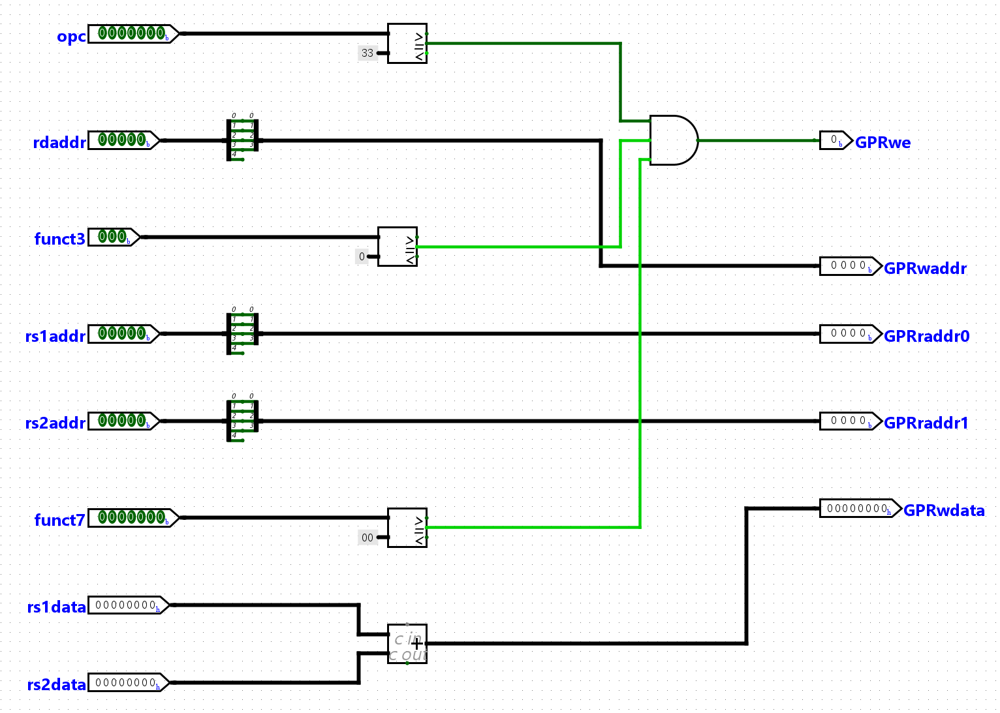
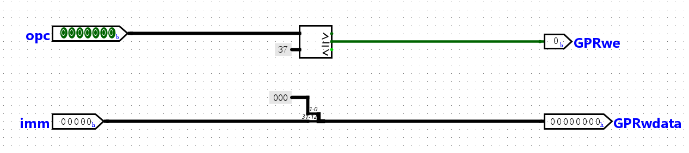

# minirv32处理器

> [F6 功能完备的迷你RISC-V处理器 | 一生一芯 v24.07 学习讲义](https://ysyx.oscc.cc/docs/2407/f/6.html)

## minirv32 ISA

[一生一芯 F6](https://ysyx.oscc.cc/docs/2407/f/6.html) 从 RV32I 中抽出**8条**指令，组成迷你指令集**minirv**。用它们组合即可模拟其余 RV32I 功能，从而不必一次实现完整的四十多条指令。

在实现前，需要先明确计算机[各个部件](risc-v/RISC-V%20Introduction.md#Conceptual-Layout-of-a-Computer)的规格与约定，以及指令集的编码规则。

除下面出现的特别约定外，**其余细节与 RV32I 相同**（定长 32 位指令、字节编址、立即数符号扩展、`x0` 恒为 0 等）。完整的 RV32I ISA 可参考[RV32I Reference Card](risc-v/RV32I%20Reference%20Card.md)。

### PC

- 位宽 **32 bit**（与 RV32I 的 XLEN 一致），按**字节地址**计数。

- **初值为 `0`**。

- 顺序执行时每次 `PC ← PC + 4`（一条指令占 4 字节）；`jalr` 会改写 PC。

### ROM

存放**指令**的只读存储器（*Read-Only Memory*），供取指使用。相对 [sCPU 里 $16\times 8$ 的指令 ROM](支持数列求和的sCPU.md#取指)，这里要换成能装下 32 位 RISC-V 指令的规格。

- **数据位宽 32 bit**

- ROM 的**地址位宽**应按实际需要的指令条数（深度）来选即可，做成 32 意味着约 $2^{32}$ 个字，仿真里既不现实（Logisim只支持最大24位的地址位宽）也无必要。

- 行大小：单行

- 是否允许未对齐：否

### RAM

minirv32的`lw`、`lbu`、`sw`、`sb`指令都访问它；只有取指用ROM不够，因为store指令包含**写入**操作。

- **数据位宽 32 bit**（一个字）；ISA 仍按字节编址，故 `lbu`、`sb`要在字内选出正确字节。

- **地址**：与 ROM 类似，ISA 用完整的字节地址 `R[rs1]+imm`；若电路 RAM 也是 32 位数据口，实现时同样要处理好字地址 / 字节使能，而不是盲目接满 32 根地址线。

- 启用方式：使用字节启用

- RAM型：非易失性

- 使用清除销：否

- 触发器：上升沿

- 异步读取：是

- 读写控制：使用字节启用

- 数据总线实现：用于读写的独立数据总线

### GPR

- 数量上不采用[RV32I](risc-v/RV32I%20Reference%20Card.md#Register-Convention)的32个，而是与[RV32E](risc-v/RV32I%20Reference%20Card.md#Other-Base-in-RISC-V)一致：**16** 个，原始命名为 `x0`–`x15`。

- 每个寄存器的数据位宽为 **32 bit**。

- `x0` / `zero` [硬接线为 0](https://en.wikipedia.org/wiki/Zero_register)：读恒为 0，写忽略。与 [sISA](支持数列求和的sCPU.md#引入新指令后的sISA约定) 里可当作普通数据寄存器的 `R[0]` 不同。

### 支持的指令

接下来的设计将支持以下 8 种指令：

```text
31         25 24    20 19   15 14    12 11        7 6        0
+------------+--------+-------+--------+-----------+----------+
|  0000000   |  rs2   |  rs1  |  000   |    rd     | 0110011  |  add   R[rd]=R[rs1]+R[rs2]
+------------+--------+-------+--------+-----------+----------+
|      imm[11:0]      |  rs1  |  000   |    rd     | 0010011  |  addi  R[rd]=R[rs1]+imm
+------------+--------+-------+--------+-----------+----------+
|              imm[31:12]              |    rd     | 0110111  |  lui   R[rd]=imm<<12
+--------------------------------------+-----------+----------+
|      imm[11:0]      |  rs1  |  010   |    rd     | 0000011  |  lw    R[rd]=M[R[rs1]+imm]
+------------+--------+-------+--------+-----------+----------+
|      imm[11:0]      |  rs1  |  100   |    rd     | 0000011  |  lbu   zero-ext byte load
+------------+--------+-------+--------+-----------+----------+
| imm[11:5]  |  rs2   |  rs1  |  010   | imm[4:0]  | 0100011  |  sw    M[R[rs1]+imm]=R[rs2]
+------------+--------+-------+--------+-----------+----------+
| imm[11:5]  |  rs2   |  rs1  |  000   | imm[4:0]  | 0100011  |  sb    store low byte
+------------+--------+-------+--------+-----------+----------+
|      imm[11:0]      |  rs1  |  000   |    rd     | 1100111  |  jalr  R[rd]=PC+4; PC=(R[rs1]+imm)&~1
+------------+--------+-------+--------+-----------+----------+
```

涉及的指令布局类型有：**R**（`add`）、**I**（`addi` / `lw` / `lbu` / `jalr`）、**S**（`sw` / `sb`）、**U**（`lui`）。格式总览见 [Instruction Format by Type](risc-v/RV32I%20Reference%20Card.md#Instruction-Format-by-Type)。

#### 算术运算指令

| Instruction | Description | Type | Opcode | funct3 | funct7 |
|:------------|:------------|:----:|:------:|:------:|:------:|
| `add rd, rs1, rs2` | `R[rd] = R[rs1] + R[rs2]` | R | `0110011` | `000` | `0000000` |
| `addi rd, rs1, imm` | `R[rd] = R[rs1] + imm`（imm 符号扩展） | I | `0010011` | `000` | — |
| `lui rd, imm` | `R[rd] = imm << 12`（低 12 位清零） | U | `0110111` | — | — |

`addi` 可配合 `x0` 装小立即数；大常数常用 `lui` + `addi` 拼出。

#### 加载-存储指令

实际就是[操作内存](risc-v/RV32I%20Reference%20Card.md#Memory)的指令，之所以称之为加载-存储指令，是因为RISC-V采用[加载-存储架构](risc-v/RV32I%20Reference%20Card.md#Core-Concepts)，只有load和store指令可以访问内存，ALU指令只能访问寄存器。

| Instruction | Description | Type | Opcode | funct3 |
|:------------|:------------|:----:|:------:|:------:|
| `lw rd, imm(rs1)` | 读字：`R[rd] = M[R[rs1]+imm][31:0]` | I | `0000011` | `010` |
| `lbu rd, imm(rs1)` | 读字节并**零扩展**到 32 位 | I | `0000011` | `100` |
| `sw rs2, imm(rs1)` | 写字：`M[R[rs1]+imm] = R[rs2]` | S | `0100011` | `010` |
| `sb rs2, imm(rs1)` | 写字节：只更新目标字中的对应字节 | S | `0100011` | `000` |

#### 控制指令

minirv32只实现一条控制流指令，用于**间接跳转**（也可做函数返回：`jalr x0, ra, 0`）。

| Instruction | Description | Type | Opcode | funct3 |
|:------------|:------------|:----:|:------:|:------:|
| `jalr rd, rs1, imm` | `R[rd] = PC+4`；`PC = (R[rs1]+imm) & ~1` | I | `1100111` | `000` |

!!! note "`jalr`指令的控制原理"
    顺序执行时 CPU 每拍只做 `PC ← PC + 4`. `jalr` 要把这条默认路径打断, 同时做两件事:

    1. **留下回家的路**: 把**本条指令的下一条地址** `PC+4` 写入 `rd` (常选 `ra`). 子程序结束时再用 `jalr x0, ra, 0` 跳回来. 若 `rd` 是 `x0`, 链接被丢掉, 相当于只跳不记 (如停机环 `jalr zero, 12(zero)`).

    2. **改下一条从哪取指**: 新 PC 不是 `PC+4`, 而是寄存器里的地址再加立即数: `R[rs1] + imm`. 这叫**间接跳转**: 目标可以来自 `ra`, 也可以是 `zero + 立即数` 这种绝对地址.

    写入 PC 前还要执行 `... & ~1`:

    - `~` (按位取反): `1` 只有最低位是 1, `~1` 变成「最低位为 0, 其余为 1」的掩码 (32 位即 `0xFFFFFFFE`).

    - `&` (按位与): 两位都是 1 结果才是 1. 于是 `x & ~1` **只把 `x` 的最低位清成 0**, 高位原样保留.

    目的是保证跳转目标是**偶数地址**. RISC-V 指令至少按 2 字节对齐, **奇数地址无法正确取指**; 规范要求硬件在 `jalr` 时强制对齐, 即使 `R[rs1]+imm` 算出来是奇数. minirv32 只有 4 字节定长指令, 合法目标通常已是 4 的倍数, 但仍按完整 RV32I 语义清 bit 0.

    从电路视角来看就是: 译码认出 `jalr` 后, PC 的下一地址改选 `(R[rs1]+imm) & ~1`, 写回 GPR 的数据改选 `PC+4`.

## 电路实现

### 取指与PC更新

针对取指和PC更新，本质上无非就是计数器（PC寄存器加加法器）加指令存储器的组合，电路结构可直接参考[sCPU](支持数列求和的sCPU.md#取指)。

但这里需要解决一个ISA与电路上的抽象差异：

!!! info "不同视角下的地址抽象"
    - **ISA 视角的地址**：RISC-V 按**字节**编址，PC 是 32 位字节地址，理论可覆盖约 $2^{32}$ 字节（即所谓的4GB地址空间）。顺序下一条指令在 `PC+4`。

    - **电路视角的地址**：Logisim 等元件里，若 ROM **数据宽度 = 32**，则每个地址对应的是一个**字**，因此不能把 PC 的 32 位原样当 ROM 地址线，需要进行分线处理。
    
    常见做法是用 `PC[31:2]`（等价于 `PC >> 2`）做字地址——低 2 位在按字取指时恒为 `00`。同时 ROM 地址位宽往往远小于 32，只需再截出低若干位接到 ROM。

    !!! example
        若ROM的地址位宽为 $16$，则ROM只能存 $2^{16}$ 条指令，地址线只要**16**根；字地址还要丢掉字节地址的最低 2 位。

        用分线器（Splitter）从 32 位 PC 上拆出：

        | PC 位段 | 位数 | 接到哪里 |
        |:--------|:----:|:---------|
        | `PC[1:0]` | 2 | **悬空 / 不接**（取指对齐时应为 `00`） |
        | `PC[17:2]` | 16 | 接入 ROM 的地址线 `A[15:0]` |
        | `PC[31:18]` | 14 | **悬空 / 不接**（当前小 ROM 用不到；程序须装在低地址） |

        也就是说 `ROM_A = PC[17:2]`。等价于先 `PC >> 2` 得到字地址，再取低 16 位:

        

        ISA手册里的「内存」是字节编址的抽象 $M[\textit{addr}]$；板上的 ROM/RAM 组件往往按「深度 × 数据宽度」配置。两者对不齐时，就用这种**分线 / 截位**把 ISA 地址接到电路端口上。
    
    下面在实现时若未对这里的地址抽象有足够充分的理解, 可能就会[陷入误区](#JALR指令).

### `ADDI`指令

#### 操作码译码

首先观察`addi`指令的格式:

```text
31         25 24    20 19   15 14    12 11        7 6        0
+------------+--------+-------+--------+-----------+----------+
|      imm[11:0]      |  rs1  |  000   |    rd     | 0010011  |  addi  R[rd]=R[rs1]+imm
+------------+--------+-------+--------+-----------+----------+
```

显然, 用于标识`addi`指令的字段有:

- `inst[6:0]` 的**opcode**: `0x13`(`0010011`)

- `inst[14:12]` 的**funct3**: `000`

至于为什么还有个 `funct3` 字段, 参考RV32I Reference Card 的 [Why use multiple fields to encode an instruction?](risc-v/RV32I%20Reference%20Card.md#Arithmetic)信息栏.

由于minirv32实现的指令只有8种, 操作码编码较为稀疏, 使用译码器反而会带来一些不便. 因此可以考虑直接使用**比较器**直接比较指令中的操作码字段是否与`addi`指令的编码一致[^addi-opc-dec]:

```py
is_addi = (inst[6:0] == `0x13`) && (inst[14:12] == `0x00`)
```



#### 操作数译码

在`addi`指令中, 操作数译码方面主要需要注意的是立即数的位扩展问题:

在约定中我们提到, GPR的数据位宽是32位的, 而`addi`指令的立即数位宽显然没有这么大, 这时就需要考虑**位扩展**. 扩展的方式一般有两种:

1. 一种是称为**零扩展**(zero extension), 就是简单粗暴的**高位补零**, 我们在实现[sCPU](支持数列求和的sCPU.md#执行)时就是采用的这种方式.

2. 另外一种叫**符号扩展**(sign extension), 这种方式是在高位添加[补码](cs61c/Number%20Representation.md#Twos-Complement)的符号位.

    !!! note "符号扩展的数学原理"
        符号扩展前后，[补码](cs61c/Number%20Representation.md#Twos-Complement)解释下的**真值不变**。能证明多扩 1 位，即可利用数学归纳法扩展到任意位。

        设 $k$ 位补码

        $$
        A = (a_{k-1}a_{k-2}\cdots a_0)_2,\qquad
        [A]_补 = -a_{k-1}\cdot 2^{k-1} + \sum_{i=0}^{k-2} a_i\cdot 2^i.
        $$

        符号扩展 1 位：把符号位 $a_{k-1}$ **再抄一份**到最高位，得到 $k+1$ 位数

        $$
        A' = (a_{k-1}\,a_{k-1}\,a_{k-2}\cdots a_0)_2.
        $$

        - 若 $a_{k-1}=0$（非负）：高位补的也是 `0`，加权式不变，显然 $[A']_补=[A]_补$。

        - 若 $a_{k-1}=1$（负）：

            $$
            \begin{align}
            [A]_补
              &= -2^{k-1} + \sum_{i=0}^{k-2} a_i\cdot 2^i, \\[0.5em]
            [A']_补
              &= -2^{k} + a_{k-1}\cdot 2^{k-1} + \sum_{i=0}^{k-2} a_i\cdot 2^i \\
              &= -2^{k} + 2^{k-1} + \sum_{i=0}^{k-2} a_i\cdot 2^i
                 \quad(a_{k-1}=1) \\
              &= -2^{k-1} + \sum_{i=0}^{k-2} a_i\cdot 2^i
                 = [A]_补.
            \end{align}
            $$

        因此扩 1 位真值不变。对目标宽度反复做「扩 1 位」，由归纳可知扩到任意更长位宽（含 32 位）真值仍不变。

        !!! example "4 位 → 5 位"
            $-3$ 的 4 位补码是 `1101`（$-8+4+1=-3$）。符号扩展为 `11101`：

            $$
            -16 + 8 + 4 + 1 = -3,
            $$

            与扩展前相同。

Logisim中自带位扩展器, 可根据配置选择是零扩展还是符号扩展.

测试`addi`指令时除了下面用到的测试指令外, 还需要考虑**立即数是负数**的情况, 可以考虑使用以下程序进行测试:

```asm
ffa00513  addi a0, zero, -6
00150513  addi a0, a0, 1
00550513  addi a0, a0, 5
```

这是一个连续加法 $-6 + 1 + 5 = 0$ 的程序, 测试时应该可以观察到`a0`的值最终为0.

### `JALR`指令

观察`jalr`指令的格式:

```text
31         25 24    20 19   15 14    12 11        7 6        0
+------------+--------+-------+--------+-----------+----------+
|      imm[11:0]      |  rs1  |  000   |    rd     | 1100111  |  jalr  R[rd]=PC+4; PC=(R[rs1]+imm)&~1
+------------+--------+-------+--------+-----------+----------+
```

不难发现其实和[addi](#ADDI指令)的指令格式几乎一致, 都是**I 型**, `imm[11:0]`, `rs1`, `funct3`, `rd` 所在位段相同, 唯一的区别在`opcode` (`addi` 为 `0010011`, `jalr` 为 `1100111`).

运算方面, 两条指令对**操作数**的处理也是一致的:

| 步骤 | `addi` | `jalr` |
|:-----|:-------|:-------|
| 读寄存器 | 读 `R[rs1]` | 读 `R[rs1]` (同一根 `rs1` 字段) |
| 立即数 | 取出 `imm[11:0]` 并**符号扩展**到 32 位 | 同上 (I 型立即数编码方式相同) |
| ALU | `R[rs1] + imm` | `R[rs1] + imm` (跳转目标地址的计算) |

**加法器算的都是"基址寄存器 + 符号扩展后的立即数"**, `addi` 把和写回 `rd`; `jalr` 把和送去更新 `PC` (再清最低位: `& ~1`), 同时另需 `PC+4` 写入 `rd` 作链接地址. 差异在**结果往哪送** (写回 GPR vs 改 PC), 不在操作数怎么算.

因此前面为 `addi` 搭好的 `rs1` 读口, 立即数分线/符号扩展和加法器可以直接复给 `jalr`; 控制逻辑上只需多识别 `opcode`, 并在 `jalr` 时把 ALU 输出接到 PC (而非 GPR 写回), 另用 `PC+4` 作为 `rd` 的写回数据.

这意味着我们可以很大程度地复用前面实现 `addi` 指令时的电路, 只需要在电路上再添加比较 `jalr` 的 `opcode` 的逻辑即可, `funct3` 字段 (同为 `000`) 也可以直接复用前面的实现:



这时我们已经可以编写一些只基于这两个指令的简单程序进行简单验证了:

```asm
00000000 <_start>:
   0:	01400513          	addi	a0,zero,20
   4:	010000e7          	jalr	ra,16(zero) # 10 <fun>
   8:	00c000e7          	jalr	ra,12(zero) # c <halt>

0000000c <halt>:
   c:	00c00067          	jalr	zero,12(zero) # c <halt>

00000010 <fun>:
  10:	00a50513          	addi	a0,a0,10
  14:	00008067          	jalr	zero,0(ra)
```

!!! warning "字节地址与字地址问题的实例"
    在[取指与PC更新](#取指与PC更新)中我们提到, 反汇编 / 文档里的 `0`, `4`, `8`, `c`, `10`, `14` 是**PC 字节地址**; Logisim 里数据宽度为 32 的 ROM 却按**字**编址, 实际取指地址是 `ROM_A = PC[17:2]` (即 `PC >> 2`).

    因此上面这段程序装进 ROM 时, 应对齐成**连续 6 个字**, 中间不应按字节地址去留空:

    | 文档中的 PC (字节) | ROM 字地址 | 机器码 |
    |:-------------------|:----------:|:-------|
    | `0x0` | `0` | `01400513` |
    | `0x4` | `1` | `010000e7` |
    | `0x8` | `2` | `00c000e7` |
    | `0xc` | `3` | `00c00067` |
    | `0x10` | `4` | `00a50513` |
    | `0x14` | `5` | `00008067` |

    也就是 ROM 内容应类似:

    ```text
    01400513 010000e7 00c000e7 00c00067 00a50513 00008067
    ```

    初学者在看到文档写 `PC=0x4`时, 可能会产生误区, 认为应该在 ROM 的下标 `0x4` 填指令, 并在 `0x1..0x3` 留空. 那样只有 `PC=0x0` 时能取到第一条 `addi`; 执行到 `PC=0x4` 时取的是 `ROM[0x1]=0x00000000`, 后面的跳转目标也会全部错位, 仿真结果会和预期完全对不上.

    调试时若盯着 ROM 面板, 会看到字地址 `0x1` / `0x5`; 文档对照应该采用字节 PC `0x4` / `0x14`. 两者相差的就是那个 `<< 2`, 不是程序本身装错了.

!!! info
    注意这里采用的寄存器名称并不是ISA中的原始命名, 而是[ABI助记符](risc-v/RV32I%20Reference%20Card.md#Register-Convention).

    这里用到的寄存器有:

    | Register(s) | ABI 助记符 | 用途 |
    |:------------|:-----------|:-----|
    | `x0` | `zero` | 恒为 0；作 `addi` / `jalr` 的基址时，立即数就是绝对地址 |
    | `x1` | `ra` | 返回地址；`jalr` 把 `PC+4` 写进 `ra`，便于子程序跳回 |
    | `x10` | `a0` | 参数 / 返回值寄存器；本程序里用来保存累加结果 |

逐行简要分析上面的程序:

| PC | 指令 | 效果 |
|:---|:-----|:-----|
| `0x0` | `addi a0, zero, 20` | `x10 ← 20` |
| `0x4` | `jalr ra, 16(zero)` | `x1 ← 8`；跳到 `0x10`（`<fun>`） |
| `0x10` | `addi a0, a0, 10` | `x10 ← 30` |
| `0x14` | `jalr zero, 0(ra)` | 不写链接寄存器；`PC ← x1 = 8` |
| `0x8` | `jalr ra, 12(zero)` | `x1 ← 12`；跳到 `0xc`（`<halt>`） |
| `0xc` | `jalr zero, 12(zero)` | `PC ← 12`，原地循环，程序停在这里 |

最终 **`x10 = 30`**:



`<halt>` 用 `jalr` 跳回自身, 相当于停机环; `<fun>` 用 `ra` 保存返回地址, 再用 `jalr zero, 0(ra)` 返回.

!!! bug
    上面的实现实际上有个致命但并不是很明显的问题 (其实还是挺明显的, 在仿真时停下来思考一下`jalr`指令的作用就会很快发现问题): 虽然寄存器的值最后是符合预期的, 但是在执行到最后的`0xc`时, 程序并没有如预期般陷入指令自旋, 这说明`jalr`指令的执行实际上是有问题的.

    其实当时PC仍只会 `+4`, `jalr` 并没有改 PC, 也没有把 `PC+4` 链进 `ra`. 程序只是按 ROM 顺序一路落到 `0x10` 的 `addi`, `a0` 碰巧加到了 30; 到了文档里的 `0xc` 时也不会原地自旋. 对照上面的逐行轨迹 (调用 → `<fun>` → 返回 → `<halt>`), 说明控制流根本没按 `jalr` 语义走.

    `jalr` 相对 `addi`, 操作数计算可以共用, 但结果必须分流.

    因此正确的实现与执行效果应为:

    

    除此之外还要考虑[零寄存器 `x0`](risc-v/RISC-V%20Introduction.md#The-Zero-Register)与其他通用寄存器的区别, **读恒为 0, 写忽略**:

    
    
    若不加以区分, 即使跳转已经接对, 仍可能出现`a0`的末态对了但在程序结束后还是进不了指令自旋的情况:

    - `0x14` 的 `jalr zero, 0(ra)` 会把 `PC+4` 写进 `x0`

    - 随后 `0x8` 的 `jalr ra, 12(zero)` 用的基址已不是 0, 目标变成 `x0+12`, 也就跳转不到 `0xc`

    - 即便到了 `0xc`, `jalr zero, 12(zero)` 也会污染 `x0`, 导致下一拍跳出自旋

### I型指令汇总解码

随着指令数量的叠加, 电路也会越来越复杂. 倘若还是将所有的电路全部全部挤在main电路中, 布线难度会急剧攀升, 因此从实现第三条指令开始, 我们应该开始考虑将电路进行模块化处理.

模块化的思路也很简单, 显然**相似的指令格式**在电路的实现上能够互相复用, 这样能够极大地简化电路的复杂度, 这时划分[指令布局类型](#支持的指令)的作用就体现出来了.

首先考虑I型指令, 其布局大致如下:

```text
31         25 24    20 19   15 14    12 11        7 6        0
+------------+--------+-------+--------+-----------+----------+
|      imm[11:0]      |  rs1  | funct3 |    rd     |  opcode  |  I: ALU imm, loads, jalr
+------------+--------+-------+--------+-----------+----------+
```

除了上面已实现的`addi`和`jalr`指令外, 在minirv32中, I型指令还包括`lbu`和`lw`指令:

#### `LBU`指令

`lbu`指令用于从内存中**加载一个字节**, 并将其**零扩展**到32位. 加载的地址与下面的`lw`指令相同, 都是`R[rs1] + imm`.

观察`lbu`指令的格式:

```text
31         25 24    20 19   15 14    12 11        7 6        0
+------------+--------+-------+--------+-----------+----------+
|      imm[11:0]      |  rs1  |  100   |    rd     | 0000011  |  lbu   zero-ext byte load
+------------+--------+-------+--------+-----------+----------+
```

- opcode: `0x03`(`0000011`)

- funct3: `100`

- rd: `inst[11:7]`

- rs1: `inst[19:15]`

- imm[11:0]: `inst[31:20]`

#### `LW`指令

`lw`指令用于从内存中**加载一个32位的字**.

观察`lw`指令的格式:

```text
31         25 24    20 19   15 14    12 11        7 6        0
+------------+--------+-------+--------+-----------+----------+
|      imm[11:0]      |  rs1  |  010   |    rd     | 0000011  |  lw    R[rd]=M[R[rs1]+imm]
+------------+--------+-------+--------+-----------+----------+
```

- opcode: `0x03`(`0000011`)

- funct3: `010`

- rd: `inst[11:7]`

- rs1: `inst[19:15]`

- imm[11:0]: `inst[31:20]`

#### 电路实现

综合四条指令的特点, 可以得出以下实现要点:

- 指令解析抽象

    - `opcode`有三种数值: `0x13`(`0010011`), `0x03`(`0000011`)和`0x67`(`1100111`), 分别对应`addi`, `lbu`/`lw`和`jalr`指令.

    - `funct3`也有三种数值: `0x0`(`000`), `0x4`(`100`)和`0x2`(`010`), 分别对应`addi`/`jalr`, `lbu`和`lw`指令.

    - 立即数与通用寄存器地址布局一致.

- 寄存器交互

    - 四条指令均包含`rd`字段, 均需要**写入**通用寄存器.
    
    - `jalr`指令还需要**写入PC寄存器**, **从PC寄存器读取地址**并**写回**通用寄存器:
        
        $$
        GPRs \cdot wdata = \begin{cases}
            is\_jalr \cdot (PC + 4) \\
            \overline{is\_jalr} \cdot (imm + R[rs1])
        \end{cases}
        $$

        $$
        PC \cdot D = \begin{cases}
            is\_jalr \cdot (imm + R[rs1]) \\
            \overline{is\_jalr} \cdot (PC + 4)
        \end{cases}
        $$


- 加载-存储操作

    - `lbu`和`lw`指令均需要**从内存中读取数据**, 并将其**写入**通用寄存器.

    - 加载时的内存地址为均为基址加上立即数(`R[rs1] + imm`), 这个结果**不经过寄存器**, 而是直接作为内存地址输入到内存模块中.

- 对解码结果进行分类, 有如下几种输出:

    - 指向GPRs写使能的`GPRwe`

    - GPRs的写地址`GPRwaddr`

    - GPRs`rs1`的读地址`GPRraddr0`

    - 经过解析与处理后将写入GPRs的数据`GPRwdata`

    - 经过解析与处理后得出的RAM地址信息`RAMaddr`

    - 执行`lbu`和`lw`指令时需要的RAM写使能信号`RAMwe`

    - `jalr`指令中经过处理后的PC信息`PCdata`

电路实现如下:



### R型指令解码

minirv32中目前只有`add`指令为R型指令, 其格式如下:

```text
31         25 24    20 19   15 14    12 11        7 6        0
+------------+--------+-------+--------+-----------+----------+
|  0000000   |  rs2   |  rs1  |  000   |    rd     | 0110011  |  add   R[rd]=R[rs1]+R[rs2]
+------------+--------+-------+--------+-----------+----------+
```

逻辑实际上和[sCPU](支持数列求和的sCPU.md)中的`add`指令没什么区别.

依然考虑该指令的特点:

- 指令解析抽象

    - `opcode`为`0x33`(`0110011`).
    
    - `funct3`为`0x0`(`000`).

    - `funct7`为`0x0`(`0000000`).

电路实现如下:



### U型指令解码

与R型指令一样, minirv32中也只有一个U型指令. 即`lui`指令:

```text
31         25 24    20 19   15 14    12 11        7 6        0
+------------+--------+-------+--------+-----------+----------+
|              imm[31:12]              |    rd     | 0110111  |  lui   R[rd]=imm<<12
+------------+--------+-------+--------+-----------+----------+
```

实现这个指令就更简单了.

首先逻辑同样与[sCPU](支持数列求和的sCPU.md)中的`li`指令差不多, 都是把立即数装进寄存器; 其次在指令解析层面它只有`opcode`字段需要比较.

不过需要留意的是:

- ISA 语义层面, 左移操作的目的是把这 20 位立即数放到寄存器的**高 20 位**, 低 12 位清 0, 以便再和 `addi` 的 12 位立即数拼出完整 32 位常数.

- 电路实现层面, U 型编码已经把这 20 位放在 `inst[31:12]`, 因此不必真的接一个移位器, 直接取指令的**高 20 位**, 再在低 12 位补 0 即可, 结果等价于 `imm << 12`:

    

!!! review
    回顾[sCPU](支持数列求和的sCPU.md)的`li`指令, 立即数在指令**低位**, 写入前是**高位补 0** (零扩展). `lui` 则是立即数在指令**高位字段**, 写入时**低位补 0**. 两者都是装立即数, 差别在字段位置和补零方向, 而不是「因为在高位才需要左移」.

### S型指令解码

minirv32中包含两个S型指令. S型指令的通用格式如下:

```text
31         25 24    20 19   15 14    12 11        7 6        0
+------------+--------+-------+--------+-----------+----------+
| imm[11:5]  |  rs2   |  rs1  | funct3 | imm[4:0]  |  opcode  |  S: stores
+------------+--------+-------+--------+-----------+----------+
```

S型指令最显著的特征就是需要**写入**RAM, 且均**不写回通用寄存器**.

#### `SB`指令

`sb`指令用于向内存**写入一个字节**, 只更新目标字中对应的那一个字节, 其余字节保持不变. 写入地址与`sw` / `lw` / `lbu`相同, 都是`R[rs1] + imm` (立即数需符号扩展); 要写入的数据来自`R[rs2]`的**最低 8 位**.

观察`sb`指令的格式:

```text
31         25 24    20 19   15 14    12 11        7 6        0
+------------+--------+-------+--------+-----------+----------+
|  imm[11:5] |  rs2   |  rs1  |  000   |  imm[4:0] | 0100011  |  sb    store low byte
+------------+--------+-------+--------+-----------+----------+
```

- opcode: `0x23`(`0100011`)

- funct3: `000`

- rs1: `inst[19:15]` (基址寄存器)

- rs2: `inst[24:20]` (要写入内存的数据来源)

- imm[11:5]: `inst[31:25]`

- imm[4:0]: `inst[11:7]`

与 I 型不同, S 型的 12 位立即数被拆成两段夹在`rs2`两侧, 拼起来仍是`imm[11:0]`, 再符号扩展到 32 位后与`R[rs1]`相加得到地址. 因为**不写回GPRs**, 所以没有目的寄存器编号.

#### `SW`指令

`sw`指令用于向内存**写入一个 32 位字**, 把`R[rs2]`的全部 2位写到地址`R[rs1] + imm`处.

观察`sw`指令的格式:

```text
31         25 24    20 19   15 14    12 11        7 6        0
+------------+--------+-------+--------+-----------+----------+
|  imm[11:5] |  rs2   |  rs1  |  010   |  imm[4:0] | 0100011  |  sw    M[R[rs1]+imm]=R[rs2]
+------------+--------+-------+--------+-----------+----------+
```

- opcode: `0x23`(`0100011`)

- funct3: `010`

- rs1: `inst[19:15]`

- rs2: `inst[24:20]`

- imm[11:5]: `inst[31:25]`

- imm[4:0]: `inst[11:7]`

可见`sb`与`sw`的字段布局完全一致, 只靠`funct3`区分宽度 (`000`写字节, `010`写字), 正如`lbu`与`lw`共用 load 的 opcode、靠`funct3`区分一样.

#### 电路实现

- 指令解析抽象

    - 二者的`opcode`字段完全一致, 均为`0x23`(`0100011`).

    - 译码需依靠`funct3`字段区分指令类型, `0x0`(`000`)对应`sb`, `0x1`(`001`)对应`sw`.

- 寄存器交互

    - 只有**读取**操作, 无需写回.

    - 需同时读取两个通用寄存器.

- 加载-存储操作

    - 两个指令均需要**写入**RAM, 但**不写回通用寄存器**.

    - 涉及RAM的地址解析同[I型指令的两个加载指令](#电路实现-1).


[^addi-opc-dec]: [只有两条指令的minirv处理器 - F6 功能完备的迷你RISC-V处理器 | 一生一芯 v24.07 学习讲义](https://ysyx.oscc.cc/docs/2407/f/6.html#%E8%BF%B7%E4%BD%A0risc-v%E6%8C%87%E4%BB%A4%E9%9B%86)