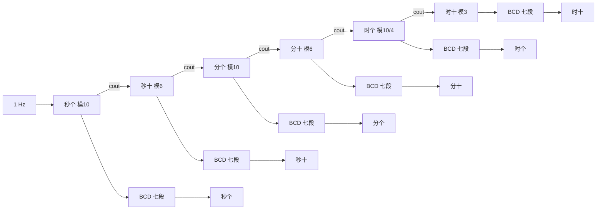

# 同步时序逻辑电路设计原理

!!! abstract
    - **时序 = 组合 + 寄存器 + 反馈**：次态逻辑、进位逻辑、七段译码仍是组合电路；真正新增的是触发器（存状态）和 $Q$ 接回组合逻辑的闭环。

    - **分析起点换成状态表**：组合逻辑从真值表出发；同步时序从状态图 / 状态表出发，再编码、再求次态方程。

    - **组合逻辑的门级映射规律不变**，只是作用对象换成次态逻辑和输出逻辑。

    - 激励就是次态，$D = Q^+$；时钟统一，使能控制「这一拍要不要变」，不要拿进位去当下一级的时钟。

    - 大系统先拆模块，例如电子时钟不必画 86400 个状态，拆成六个模 $N$ 计数器 + 进位链 + 六个 BCD 译码器即可。

[组合逻辑](组合逻辑电路.md)的输出只由**当前输入**决定；[时序逻辑](时序逻辑电路.md)的输出由**当前输入 + 当前状态**共同决定，因此必须包含存储元件。从需求到可仿真电路，同样有一条固定、可重复的流程——次态逻辑和输出逻辑仍按[组合逻辑的映射规律](组合逻辑电路的设计原理.md#逻辑表达式与门电路的映射规律)搭门，再接上触发器和反馈即可。

下文以**电子时钟（时 + 分 + 秒）**为贯穿实例：用寄存器和七段数码管显示 `HH:MM:SS`（24 小时制）。秒 $00\!\sim\!59$ 后向分进位，分 $00\!\sim\!59$ 后向时进位，时 $00\!\sim\!23$ 后回零。假设已有稳定的 1 Hz 秒脉冲作为时钟。

## 标准设计流程


| 步骤 | 做什么 | 本例 |
|:--|:--|:--|
| 1. 需求分析 | 明确输入、输出、要记住什么 | 1 Hz 时钟；显示 `HH:MM:SS`；秒满 60 进分，分满 60 进时 |
| 2. 状态抽象 | 画出状态图或列出状态表 | 秒 / 分各 60 态、时 24 态；拆成六个十进制数位 |
| 3. 状态化简 | 合并等价状态 | 每位数字都要显示，**无可合并**；靠分层避免画 86400 态 |
| 4. 状态编码 | 给每个状态分配二进制码 | **BCD**：个位 $0\!\sim\!9$（时个位在 2 点时只到 3）、十位 $0\!\sim\!5$ / $0\!\sim\!2$ |
| 5. 选择触发器 | 常用 D（其次 T、JK） | 4 位寄存器 = 4 个 [D 触发器](时序逻辑电路.md#D-触发器) |
| 6. 求方程 | 次态方程、激励方程、输出方程 | $D=Q^+$；进位 $\textit{cout}$；段码 $A\!\sim\!G$ |
| 7. 化简 | 卡诺图 / 代数 / 复用已有模块 | 比较器、加法器、2 选 1 比逐位手写 D 更省事 |
| 8. 映射实现 | 式子 → 门；状态 → 寄存器 | 见下文映射表 |
| 9. 仿真验证 | 对波形、对显示 | $00{:}59{:}59\to 01{:}00{:}00$，$23{:}59{:}59\to 00{:}00{:}00$ |
| 10. 封装 | 收成子电路 | `mod10`、`mod6`、`mod24` 时个、`clock_hhmmss` |

!!! tip "和组合逻辑流程的关系"
    第 6～8 步里的**次态逻辑、进位、七段译码**，就是[组合逻辑电路的设计原理](组合逻辑电路的设计原理.md#逻辑表达式与门电路的映射规律)的「真值表 → 表达式 → 门」。
    
    时序设计没有推翻组合流程，只是在它外面加了一圈**状态寄存器**。

## 映射规律

### 组合部分

与[组合逻辑电路的设计原理](组合逻辑电路的设计原理.md#逻辑表达式与门电路的映射规律)完全相同：

| 表达式 | 逻辑门 |
|:--|:--|
| $\overline{X}$ | 非门 |
| $X \cdot Y$ | 与门 |
| $X + Y$ | 或门 |
| $X \oplus Y$ | 异或门 |
| 积之和 SOP | 与门层 → 或门层 |

读式子的习惯不变：从最内层往外搭；公共子式（$\overline{Q_k}$、$Q=9$ 等）只做一次，多处复用。

### 时序部分

本质上就是添加了存储模块。

| 分析结果 | 映射到的元件 |
|:--|:--|
| 状态变量 $Q$ | [D 触发器](时序逻辑电路.md#D-触发器) / [寄存器](时序逻辑电路.md#寄存器) |
| 次态 $Q^+$ | 接到触发器的 $D$ 端（因为 $D = Q^+$） |
| 统一节拍 | 全部触发器的 $\textit{clk}$ 接同一时钟 |
| 状态反馈 | $Q$ 接回次态逻辑的输入 |
| 「这一拍要不要变」 | 写使能 $WE$，**不是**另接一套时钟；也不是把 $Q$ 与 $WE$ 相与 |

D 触发器的激励表是所有类型里最简单的：$D = Q^+$。JK、T 只是把同一张次态表换成另一套激励方程，后面的门映射规律不变。

### 整体结构

同步时序电路的标准骨架：

```text
输入 / 使能 ──► [组合逻辑：次态] ──► 触发器 D 端
                      ↑                    │
                      └── 状态反馈 Q ◄──────┘
            时钟 CLK ──► 全体触发器

当前状态 Q ──► [组合逻辑：输出] ──► 七段管 / 进位 / 其它输出
```

这就是[计数器](时序逻辑电路.md#计数器)里已经见过的套路：**寄存器存状态 + 组合逻辑算下一状态 + 反馈闭环**。

## 与组合逻辑的对比

| 项目 | 组合逻辑 | 同步时序逻辑 |
|:--|:--|:--|
| 记忆元件 | 无 | 触发器（状态） |
| 分析起点 | 真值表 | 状态图 / 状态表 |
| 关键中间产物 | 逻辑表达式 | 次态方程 + 激励方程 + 输出方程 |
| 门电路映射 | 见上一篇 | **完全相同**（作用在次态 / 输出上） |
| 额外连接 | 无 | 状态反馈 + 统一时钟 |
| 设计复杂度 | 较低 | 多了状态编码、触发器类型、使能级联 |

## 实例：电子时钟

寄存器 + 七段数码管，显示 **时（00～23）**、**分（00～59）** 和 **秒（00～59）**，格式 `HH:MM:SS`。秒计到 59 后清零并向分进位；分计到 59 后向时进位；时计到 23 后清零循环。时钟为 1 Hz 秒脉冲。

这是典型的同步时序系统，可拆成：

- **时序核心**：六个带使能、带回绕的计数器（秒个模 10、秒十模 6、分个模 10、分十模 6、时个按 24 进制回绕、时十模 3）

- **组合部分**：进位 / 使能逻辑 + 六个 [BCD 七段译码器](组合逻辑电路.md#BCD译码器)

程序抽象与逐位回绕见[时序逻辑电路 · 电子时钟](时序逻辑电路.md#电子时钟)。下面以标准设计流程为线索，重点放在设计细节与思路上。

### 1. 需求分析与模块划分

| 项目 | 约定 |
|:--|:--|
| 时钟 | 1 Hz，全体寄存器共用；**不要**用前级溢出当后级时钟 |
| 复位 | 异步或同步 $RST$，六个寄存器一起清零 |
| 显示 | 六只共阴极七段管，`HH:MM:SS` |
| 编码 | 每4位二进制数据对应一个 BCD 数字 |



### 2. 状态抽象

若把整钟当成一个 FSM，秒、分各 60 个状态，时 24 个状态，乘起来 86400 态，但显然不可能逐个编码，考虑基于计时原理进行分层处理。分层之后，每一位只是一个很小的计数 FSM（Finite State Machine, 有限状态机）：

| 数位 | 状态个数 | 含义 |
|:--|:--:|:--|
| 秒个 $s1$ | 10 | $0\!\sim\!9$ |
| 秒十 $s10$ | 6 | $0\!\sim\!5$ |
| 分个 $m1$ | 10 | $0\!\sim\!9$ |
| 分十 $m10$ | 6 | $0\!\sim\!5$ |
| 时个 $h1$ | 10 或 4 | $0\!\sim\!9$（$h10\neq 2$）；$0\!\sim\!3$（$h10=2$） |
| 时十 $h10$ | 3 | $0\!\sim\!2$ |

以秒个位为例（使能 $WE=1$ 时每个时钟 +1；$WE=0$ 时保持）：

| 当前 $Q$ | $WE=0$ 时次态 | $WE=1$ 时次态 | $WE=1$ 时 $\textit{cout}$ |
|:-:|:-:|:-:|:-:|
| 0 | 0 | 1 | 0 |
| 1 | 1 | 2 | 0 |
| $\cdots$ | $\cdots$ | $\cdots$ | 0 |
| 8 | 8 | 9 | 0 |
| 9 | 9 | 0 | 1 |

十位同构，只是秒/分十位在 5 回绕，时十位在 2 回绕。时个位在 $h10=2$ 时改为 3 回绕，见第 6 步。

!!! info "Moore 输出"
    数码管显示的就是当前 $Q$，输出只依赖状态、不依赖「这一拍的输入」，属于 **Moore 型**。进位 $\textit{cout}$ 可以看成状态译码，同样是组合输出。可参考[Moore machine（摩尔型有限状态机）](https://en.wikipedia.org/wiki/Moore_machine)。

### 3. 状态化简

$0,1,\ldots,9$ 每个值都要显示，彼此不等价，**不能合并**。真正省事的办法不是化简状态，而是**不要把六个数位摊成一张大表**。

### 4. 状态编码

采用 BCD，每位用 4-bit 寄存器（即使模 6 / 模 3 只用到 `0000`–`0101` / `0000`–`0010`，也保持 4 位，以便直接使用 BCD 译码器）：

| 十进制 | BCD $Q_3 Q_2 Q_1 Q_0$ |
|:-:|:-:|
| 0–9 | `0000`–`1001` |
| 0–5（分/秒十位） | `0000`–`0101` |
| 0–2（时十位） | `0000`–`0010` |

`1010`–`1111` 在正常计数中走不到，写次态方程时可当[无关项](组合逻辑电路.md#BCD译码器)。

### 5. 选择存储元件

每位一个 4 位寄存器（4 个上升沿 D 触发器，共享 $\textit{clk}$、$WE$、$RST$）。激励方程：

$$
D_i = Q_i^+
$$

六个寄存器**时钟都接 1 Hz**。下一级「该不该加一」用使能 $WE$ 控制，而不是把 $\textit{cout}$ 接到下一级的 $\textit{clk}$。

!!! warning "同步级联，不要行波时钟"
    用前级溢出当后级时钟，属于异步级联：进位链上的延迟会让各位置位时刻错开，仿真里偶发「跳数」，FPGA 上更难收时序。正确做法：

    **全体共用 $\textit{clk}$，$\textit{cout}$ 只接到下一级的 $WE$。**

### 6. 次态方程与输出方程

每一位的下一状态与进位：

$$
D =
\begin{cases}
Q & EN = 0 \\
0 & EN = 1 \land Q = Q_{\max} \\
Q+1 & EN = 1 \land Q \neq Q_{\max}
\end{cases}
\qquad
\textit{cout} = EN \land (Q = Q_{\max})
$$

| 数位 | $Q_{\max}$ | $EN$ 来自 |
|:--|:--:|:--|
| 秒个 $s1$ | 9 | 恒为 1（每秒都加） |
| 秒十 $s10$ | 5 | $s1.\textit{cout}$，即 $s1=9$ |
| 分个 $m1$ | 9 | $s10.\textit{cout}$，即 $(s1=9)\land(s10=5)$ |
| 分十 $m10$ | 5 | $m1.\textit{cout}$，即 $(s1=9)\land(s10=5)\land(m1=9)$ |
| 时个 $h1$ | 9 或 3 | $m10.\textit{cout}$，即再与 $(m10=5)$ |
| 时十 $h10$ | 2 | $h1.\textit{cout}$ |

时个位不能无条件模 10，否则 `23:59:59` 会变成 `24:00:00`。回绕条件改成：

$$
(h1\text{ 回绕}) = (h1=9) \lor \bigl((h1=3)\land(h10=2)\bigr)
$$

上表中 $h1$ 的 $Q=Q_{\max}$ 一律换成这个或项；时十位仍按 $Q=2$ 回绕，因为 $h1$ 只在 9 或 23 时产生 $\textit{cout}$，$h10=2$ 时下一次进位一定是 $23\to 00$。

比较条件是组合逻辑，可直接写成与或式（也可复用[比较器](组合逻辑电路.md#比较器)）：

$$
\begin{aligned}
(Q=9) &= Q_3\,\overline{Q_2}\,\overline{Q_1}\,Q_0, \qquad
(Q=5) = \overline{Q_3}\,Q_2\,\overline{Q_1}\,Q_0 \\
(Q=3) &= \overline{Q_3}\,\overline{Q_2}\,Q_1\,Q_0, \qquad
(Q=2) = \overline{Q_3}\,\overline{Q_2}\,Q_1\,\overline{Q_0}
\end{aligned}
$$

输出方程就是六路 BCD 译码，每位独立：

$$
(A,B,C,D,E,F,G) = \mathrm{bcd7seg}(Q_3 Q_2 Q_1 Q_0)
$$

式子整段复用[组合逻辑设计原理](组合逻辑电路的设计原理.md)里已化简的结果（BCD 还可把 `A`–`F` 当无关项再缩一点）。

### 7. 化简

可以对每个 $D_i$ 画卡诺图，但更符合前面笔记的做法是**组装已验证的组合块**：

- $Q+1$：[加法器](组合逻辑电路.md#加法器)（4 位，另一输入接常数 1）

- $Q=Q_{\max}$：[比较器](组合逻辑电路.md#比较器)，或上面的四输入与门

- 回绕：[2 选 1](组合逻辑电路.md#多路选择器)——比较为真选 `0000`，否则选 $Q+1$

- 保持：再一个 2 选 1，或把 $EN$ 接到寄存器使能端（$EN=0$ 时 $D$ 不写入，$Q$ 自然保持）

这和[计数器](时序逻辑电路.md#计数器)是同一套反馈，只是把「模 $2^n$ 自然溢出」换成了「模 10 / 模 6 / 模 24 的比较 + 回绕」。

若坚持写到门级激励，以**无使能的模 10**、D 触发器为例（非法码当无关项），最低位永远翻转：

$$
D_0 = \overline{Q_0}
$$

其余位由「二进制 +1」在 $Q=9$ 时改写为 $0000$ 得到。映射仍是：每个 $D_i$ 的布尔式 → 与/或/非/异或，输出接到第 $i$ 个触发器的 $D$ 端。

### 8. 映射实现

| 分析结果 | 实际电路 | 说明 |
|:--|:--|:--|
| 当前时 / 分 / 秒值 | 六个 4 位寄存器 | 提供记忆；$Q$ 反馈并送给译码器 |
| 次态方程 | 加法器 + 比较器 + 2 选 1 | 组合逻辑，映射规律与上一篇相同 |
| $Q=9$、$Q=5$、$Q=3$、$Q=2$ | 与门（或比较器） | 例如 $(Q=9)=Q_3\overline{Q_2}\overline{Q_1}Q_0$ |
| 时个位回绕 | 或门：$(h1=9)\lor((h1=3)\land(h10=2))$ | 避免出现 24 点 |
| 进位 $\textit{cout}$ | 与门：$EN \land (Q=Q_{\max})$ | 接到下一级 $EN$ |
| 数字 $0\!\sim\!9$ 的字形 | [BCD 七段译码器](组合逻辑电路.md#BCD译码器) | 真值表 → 表达式 → 门，六个实例 |
| 1 Hz | 全体寄存器的 $\textit{clk}$ | 同步 |
| 最终显示 | 六只七段数码管 | 段选 $A\!\sim\!G$ |

秒个位内部（其余数位结构相同，只改 $Q_{\max}$ 和 $EN$ 来源；时个位的比较改成「回绕」或项）：

```text
1 Hz CLK ──► [4-bit 寄存器 s1]
                Q ─┬─► 加法器 +1 ─┐
                   ├─► 比较 =9  ─┼► 2选1（回绕）─► D
                   └─► BCD 七段 ─► 秒个位显示
比较=9 ──► cout ──► 秒十位 EN
```

### 9. 仿真验证

在 Logisim 中：

1. 用 `Wiring → Clock` 当秒脉冲，仿真频率调快，不必真等 1 Hz。

2. 复位后应为 `00:00:00`。

3. 连续打拍，核对手动计算：`00:00:09 → 00:00:10`、`00:00:59 → 00:01:00`、`00:59:59 → 01:00:00`、`09:59:59 → 10:00:00`、`19:59:59 → 20:00:00`、`23:59:59 → 00:00:00`。

4. 任意一位置位不对，先查**该位的 $EN$ 是否在该拍为 1**，再查回绕比较（时个位尤其要查 23），最后才查译码器字形。

译码器扫 `0000`–`1001` 的方法与[组合逻辑验证](组合逻辑电路的设计原理.md#6-仿真验证)相同：显示错了回到**该段的表达式**，不要先改状态表。
