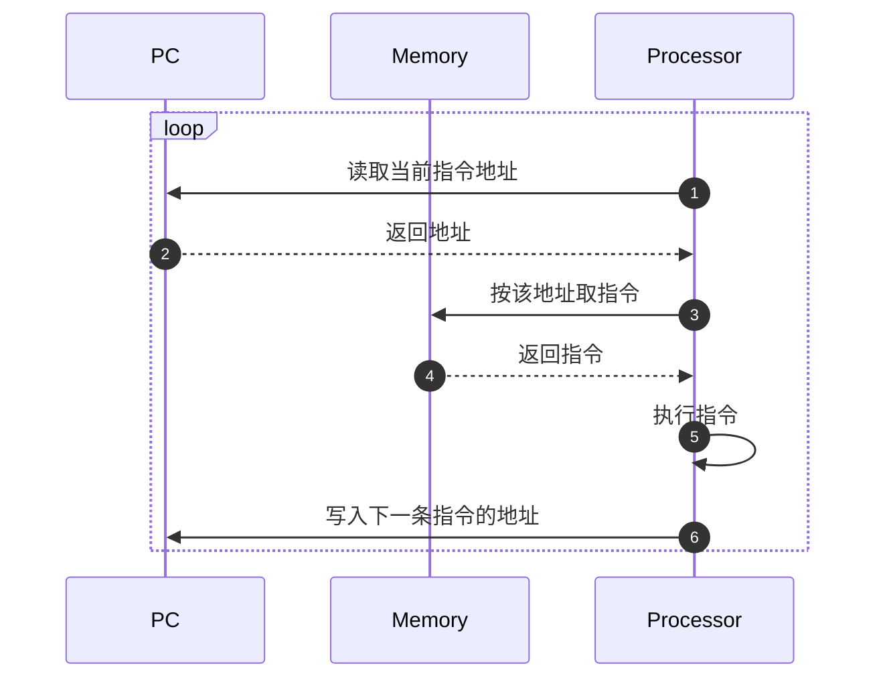

# 处理器组成及工作原理

> [F4 计算机系统的状态机模型 - 处理器的组成和工作原理 | 一生一芯 v24.07 学习讲义](https://ysyx.oscc.cc/docs/2407/f/4.html#%E5%A4%84%E7%90%86%E5%99%A8%E7%9A%84%E7%BB%84%E6%88%90%E5%92%8C%E5%B7%A5%E4%BD%9C%E5%8E%9F%E7%90%86)

## 指令模型及其编码

### 指令模型概念

现代计算机的处理器并不是一个能够独立思考并完成各种任务的智能体，而是基于一种十分“机械”的数据处理模型，因此想要其能够机械地对数据进行特定的处理操作，就应该设计一种模型来描述与控制处理器的行为。

控制处理器执行各种操作的媒介称为**指令**（*Instruction*）。

以加法操作为例，可描述为“使用加法指令将两个加数相加”，这就可以抽象出一条指令需要包含两方面的信息：

- 指令需要处理的具体数据是什么，这称为指令的**操作数**（*Operand*）字段

- 指令具体要执行什么操作，这称为指令的**操作码**（*Opcode*）字段

```text
  +------------+------------------------------+
  |   Opcode   |           Operand            |
  +------------+------------------------------+
         |                      |
         |                      +-- 处理哪些数据
         +-- 执行什么操作
```

以加法为例:

```text
  +------------+------------------------------+
  |    ADD     |     src1     |      src2     |
  +------------+------------------------------+
         |            |               |
         |            |               +-- 加数 2
         |            +-- 加数 1
         +-- 做加法
```

同时，在执行完一个操作后，如上面提到的加法操作，我们在大部分时候并不会丢弃结果，而是会希望将其储存在某处以供后续使用。

因此，处理器中需要若干用于存储数据的区域，这就是**寄存器组 / 寄存器堆**（*Register Set / Register File*）。同时，由于这样的寄存器用于处理一般数据，因此也称其为**通用寄存器**（**GPR**, *General Purpose Register*）。

!!! example "数列求和的指令模型"
    例如，要对一串自然数列进行求和操作，但是单个加法指令只能计算两个数据相加的结果，基于在[时序逻辑](时序逻辑电路.md#数列求和电路)中的程序抽象，我们就需要用到GPR中的某个寄存器来暂存中间结果，然后继续依次进行累加操作。

    基于这个例子，指令就需要在*操作数*字段中指定具体是要从哪个GPR中读取数据，以及将结果写入到哪个GPR中。而*操作码*则需要实现处理器前事先约定每种操作码对应的操作。

    这样，一条加法指令的指令模型就可以被描述为:

    ```text
                                       +-- 加数 1（从哪个 GPR 读）
                                       |
      +------------+------------+------------+------------+
      |    ADD     |    dest    |    src1    |    src2    |
      +------------+------------+------------+------------+
             |            |                        |
             |            |                        +-- 加数 2（从哪个 GPR 读）
             |            +-- 结果写入哪个 GPR
             +-- 做加法

      R[dest] = R[src1] + R[src2]
    ```

### 指令的编码

处理器作为一个数字电路，所有信息都可以采用`0`和`1`来表示，指令也不例外。上一节的 `ADD dest, src1, src2` 只是给人看的抽象写法；落到电路上，每个字段都必须变成固定长度的二进制，这就需要对指令编码。

下面以一个只有四个GPR、支持三种指令的处理器为例，分析其加法操作的编码。

由于只支持三种指令，因此操作码字段只需要两位即可区分所有指令（$2^2 = 4 > 3$）。这里约定 `00` 表示 `ADD`。

操作数同样要编码。四个GPR可以编号为 `0, 1, 2, 3`，每个编号用两位即可表示：

| 编码 | 寄存器 |
|:----:|:------:|
| `00` | `R[0]` |
| `01` | `R[1]` |
| `10` | `R[2]` |
| `11` | `R[3]` |

上一节的 `dest`、`src1`、`src2` 在编码里通常分别记为 `rd`（*destination*，目的寄存器）以及 `rs1` / `rs2`（*source*，源寄存器）。`ADD` 需要三个寄存器号，各占 2 位，因此整条指令长度为 $2+2+2+2=8$ 位：

```text
 7  6 5    4 3    2 1    0
+----+------+------+------+
| 00 | dest | src1 | src2 |
+----+------+------+------+
  |     |      |      |
  |     |      |      +-- 加数 2 的寄存器编号
  |     |      +-- 加数 1 的寄存器编号
  |     +-- 结果写入的寄存器编号
  +-- ADD 的操作码
  
R[dest] = R[src1] + R[src2]
```

其中 `R[dest]` 表示编号为 `dest` 的那个GPR里**存放的内容**，而不是编号本身。

!!! example
    二进制 `00100001` 按字段划分是：

    ```text
    00  |  10  |  00  |  01
     |     |      |      |
    ADD  dest=2 src1=0 src2=1
    ```

    $R[2] = R[0] + R[1]$

另外两种指令也会占用 8 位，但操作数字段的切分可以不同。例如要把一个常数装进寄存器时，源不再来自GPR，而是把指令里的若干位直接当成数字使用，这种操作数称为**立即数**（*Immediate*，`imm`）：

```text
 7      6 5        4 3                  0
+--------+----------+--------------------+
|   10   |   dest   |       imm          |
+--------+----------+--------------------+
     |        |              |
     |        |              +-- 要写入的立即数（高位补 0）
     |        +-- 写入哪个 GPR
     +-- LI 的操作码

R[dest] = imm
```

!!! example
    `10000101` 按字段划分是 `10 | 00 | 0101`，含义是把立即数 `5` 写入 `R[0]`。

    ```text
    | 10 | 00 | 0101 |
       |   |     |
      LI dest=0 imm=5
    ```

    $R[0] = 5$

!!! info
    编码是实现处理器之前必须事先约定的规则：同一串 `0` 和 `1`，只有按这张表来切，才有确定的含义。第三种指令的操作码预留为 `11`，其字段切分取决于它要表达的信息，后面再引入。

## 程序运行的本质

### 存储程序模型

程序本质上就是一组**指令序列**，这些指令序列按照一定的顺序执行，从而完成特定的任务。

在现代计算机中，有一套专门的机制用于控制指令序列的读取和顺序执行：

- 先将一段指令序列从外存加载到主存储器中，使得计算机能够从中取出指令并执行

- 当计算机执行完一条指令后，会自动读取下一条指令，并继续执行，直到指令序列执行完毕

- 为了能够让计算机知道接下来要执行的指令在哪，需要一个用于指示当前执行指令在存储器中位置的部件，这个部件称为**程序计数器**（*Program Counter*, **PC**）

在一个程序运行的过程中，计算机只需循环执行以下流程：



PC 本身并不取指令，它只保存「下一条指令在存储器中的位置」。通常更新 PC 就是让它指向相邻的下一条；后面会看到，某些指令也可以把 PC 改写成别的地址，从而改变执行顺序。

把一段指令序列放进存储器，再让 PC 指向第一条，计算机就会按这个循环自动执行下去。这就是**存储程序**（*Stored-Program*）模型的基本思想。

### 程序计数器

PC 指示当前（或下一条）指令在存储器中位置的方式很简单：它只**存储**这条指令的**地址**。这么看来，**PC 的本质也是一个寄存器**。

但 PC 不存放一般运算数据，因此它不属于 GPR。

通常情况下，执行完一条指令后，处理器会把 PC 更新为相邻下一条的地址；如果永远只做这件事，指令就只能按存放顺序一条接一条往下跑，无法实现循环、条件分支等控制流。

既然 PC 也是寄存器，就可以设计专门修改它的指令，从而改变「下一条去哪执行」。在前文那个三种指令的例子里，我们可以将第三种指令的操作码约定为 `11`，其编码如下：

```text
 7  6 5        2 1    0
+----+----------+------+
| 11 |   addr   | src2 |
+----+----------+------+
  |                |
  |                +-- 与 R[0] 比较的源寄存器
  +-- 若条件成立，PC 改写成该地址

if (R[0] != R[src2]) PC = addr
```

这条指令称为 `bner0`（*Branch if Not Equal r0*）：若 `R[rs2]` 与 `R[0]` **不相等**，就把 PC 写成 `addr`；否则 PC 仍按通常方式指向下一条。`addr` 占 4 位，因此可跳转到存储器中编号为 `0`～`15` 的指令位置。

!!! example
    设 `R[0] = 10`，`R[1] = 3`，当前执行到机器码 `11010001`：

    ```text
    11  |  0100  |  01
     |       |      |
    bner0  addr=4  rs2=1
    ```

    因 `R[1] ≠ R[0]`，条件成立，PC 被改写为 `4`，处理器接下来会取出地址 `4` 处的指令，而不是按顺序继续往下。若之后某次比较时 `R[1] == R[0]`，则不再跳转，执行流离开这段循环。

有了 `ADD`、`LI` 和 `bner0`，处理器就不只是「按顺序做算术」的计算器，而能**按条件**反复执行某段指令。这正是程序比单纯按键运算更强大的关键之一。

!!! example "数列求和"
    重新回到[数列求和的例子](时序逻辑电路.md#数列求和电路)。
    
    基于上面的三指令模型和四个 GPR，约定四个 GPR 的用途如下：

    | 寄存器 | 用途 |
    |:------:|:-----|
    | `r0` | 上界 $n$（此处为 $10$） |
    | `r1` | 当前项 $i$ |
    | `r2` | 部分和 $s$ |
    | `r3` | 常量 $1$，用于每次给 $i$ 加一 |
    
    计算 $1+2+\cdots+10$ 的指令序列如下（`:` 前的数值为该指令在存储器中的地址，也即 PC 的取值）：

    ```assembly
    0: LI    r0, 10      # 上界 n = 10
    1: LI    r1, 0       # i = 0
    2: LI    r2, 0       # s = 0
    3: LI    r3, 1       # 常量 1
    4: ADD   r1, r1, r3  # i = i + 1
    5: ADD   r2, r2, r1  # s = s + i
    6: BNER0 r1, 4       # 若 i != n，跳回地址 4
    7: BNER0 r3, 7       # 停机：r3 恒不等于 r0，PC 一直写回 7
    ```

    手动推定一下上面的指令序列的执行过程，可以得出各个寄存器的状态变化：

    | $PC$ | $r_0$ | $r_1$ | $r_2$ | $r_3$ | 说明 |
    |:----:|:-----:|:-----:|:-----:|:-----:|:-----|
    | $0$ | $0$ | $0$ | $0$ | $0$ | 初始状态 |
    | $1$ | $10$ | $0$ | $0$ | $0$ | 执行地址 $0$：`LI r0, 10` |
    | $2$ | $10$ | $0$ | $0$ | $0$ | 执行地址 $1$：`LI r1, 0` |
    | $3$ | $10$ | $0$ | $0$ | $0$ | 执行地址 $2$：`LI r2, 0` |
    | $4$ | $10$ | $0$ | $0$ | $1$ | 执行地址 $3$：`LI r3, 1`，进入循环 |
    | $5$ | $10$ | $1$ | $0$ | $1$ | 执行地址 $4$：$i \leftarrow 0+1$ |
    | $6$ | $10$ | $1$ | $1$ | $1$ | 执行地址 $5$：$s \leftarrow 0+1$ |
    | $4$ | $10$ | $1$ | $1$ | $1$ | 执行地址 $6$：$r_1\neq r_0$，跳回 $4$ |
    | $5$ | $10$ | $2$ | $1$ | $1$ | 再次执行地址 $4$：$i \leftarrow 1+1$ |
    | $\cdots$ | $\cdots$ | $\cdots$ | $\cdots$ | $\cdots$ | 循环继续，$i$ 每次加 $1$，$s$ 累加当前 $i$ |
    | $6$ | $10$ | $10$ | $55$ | $1$ | $i=10$，$s=1+\cdots+10=55$ |
    | $7$ | $10$ | $10$ | $55$ | $1$ | 执行地址 $6$：$r_1=r_0$，**不跳转**，顺序进入 $7$ |
    | $7$ | $10$ | $10$ | $55$ | $1$ | 执行地址 $7$：$r_3\neq r_0$，PC 写回 $7$，原地打转 |

    处理器只是按指令含义机械地更新寄存器。循环条件比较的是 **`r1`（当前项）和 `r0`（上界）**。求和结果最终落在 `r2` 中；地址 $7$ 的自跳转相当于「算完后停住」，否则 PC 会继续往后取并不存在的指令。

## 编程的本质

基于上文阐述的指令模型和存储程序模型，也就不难得出编程的本质了。上面在数列求和的例子中，我们使用了一个包含7条指令的程序来计算 $1+2+\cdots+10$ 的和，采用在[时序逻辑电路](时序逻辑电路.md#数列求和电路)中使用的“伪代码”（实际就是Python）进行描述，是编程；上面采用指令序列进行描述，也是编程。

<div class="text-center-container" style="text-align: center;">
    <strong>所谓编程，其实就是利用少量现有功能，组合描述一个完成复杂任务的过程.</strong>
</div>

指令序列的描述语言，我们称为**汇编语言**（*Assembly Language*）。汇编语言实际是指令的符号化表示，因此也称为**符号指令**（*Symbolic Instruction*）。

汇编语言的再下一层，就是机器语言（*Machine Language*）。机器语言就是指令的二进制编码，可以被处理器识别并直接执行，因此也称为**机器码**（*Machine Code*）。

上面数列求和的例子中，其中的指令序列用前文我们介绍的三指令模型编码，就可以得到如下机器码序列：

```text
10001010    # 0: LI    r0, 10     → 10 | 00 | 1010
10010000    # 1: LI    r1, 0      → 10 | 01 | 0000
10100000    # 2: LI    r2, 0      → 10 | 10 | 0000
10110001    # 3: LI    r3, 1      → 10 | 11 | 0001
00010111    # 4: ADD   r1, r1, r3 → 00 | 01 | 01 | 11
00101001    # 5: ADD   r2, r2, r1 → 00 | 10 | 10 | 01
11010001    # 6: BNER0 r1, 4      → 11 | 0100 | 01
11011111    # 7: BNER0 r3, 7      → 11 | 0111 | 11
```

相比较前文使用汇编描述的指令序列，机器码的可读性显然要差很多。

## 奇数列求和

接下来基于上面的三指令模型和四个 GPR，以计算 $10$ 以内奇数之和为例，完整走一遍「约定 → 编程 → 推演」的过程。

### 指令集约定

仍使用前文的三指令模型，编码约定不变：

| 指令 | 操作码 | 编码格式 | 语义 |
|:----:|:------:|:---------|:-----|
| `ADD` | `00` | `00 | dest | src1 | src2` | $R[\textit{dest}] = R[\textit{src1}] + R[\textit{src2}]$ |
| `LI` | `10` | `10 | dest | imm` | $R[\textit{dest}] = \textit{imm}$（高位补 $0$） |
| `BNER0` | `11` | `11 | addr | src2` | 若 $R[0] \neq R[\textit{src2}]$，则 $\textit{PC} = \textit{addr}$ |

### GPR 用途约定

与等差求和类似，但步长改为 $2$，上界取**开区间**终点 $11$（加完 $9$ 后 $i$ 变成 $11$，与 $r_0$ 相等从而退出）：

| 寄存器 | 用途 |
|:------:|:-----|
| `r0` | 循环退出界 $11$（开区间上界） |
| `r1` | 当前奇数项 $i$ |
| `r2` | 部分和 $s$ |
| `r3` | 步长常量 $2$ |

### 编程

从高级语言向下抽象。

Python代码：

```python
i, s = 1, 0
while True:
    s = s + i
    i = i + 2
    if i == 11:
        break
# s = 1+3+5+7+9 = 25
```

汇编语言描述：

```assembly
0: LI    r0, 11      # 开区间上界
1: LI    r1, 1       # i = 1
2: LI    r2, 0       # s = 0
3: LI    r3, 2       # 步长 2
4: ADD   r2, r2, r1  # s = s + i
5: ADD   r1, r1, r3  # i = i + 2
6: BNER0 r1, 4       # 若 i != 11，跳回 4
7: BNER0 r3, 7       # 停机（r3=2 恒不等于 r0=11）
```

机器码描述：

```text
10001011    # 0: LI    r0, 11     → 10 | 00 | 1011
10010001    # 1: LI    r1, 1      → 10 | 01 | 0001
10100000    # 2: LI    r2, 0      → 10 | 10 | 0000
10110010    # 3: LI    r3, 2      → 10 | 11 | 0010
00101001    # 4: ADD   r2, r2, r1 → 00 | 10 | 10 | 01
00010111    # 5: ADD   r1, r1, r3 → 00 | 01 | 01 | 11
11010001    # 6: BNER0 r1, 4      → 11 | 0100 | 01
11011111    # 7: BNER0 r3, 7      → 11 | 0111 | 11
```

与 $1+2+\cdots+10$ 的程序相比，指令序列几乎完全相同，只是改了初值、步长和循环中两条 `ADD` 的顺序（先累加当前奇数，再加步长）。

### 程序执行时的 GPR 状态变化

约定初始状态为 $(0,\,0,\,0,\,0,\,0)$：

| $PC$ | $r_0$ | $r_1$ | $r_2$ | $r_3$ | 说明 |
|:----:|:-----:|:-----:|:-----:|:-----:|:-----|
| $0$ | $0$ | $0$ | $0$ | $0$ | 初始状态 |
| $1$ | $11$ | $0$ | $0$ | $0$ | `LI r0, 11` |
| $2$ | $11$ | $1$ | $0$ | $0$ | `LI r1, 1` |
| $3$ | $11$ | $1$ | $0$ | $0$ | `LI r2, 0` |
| $4$ | $11$ | $1$ | $0$ | $2$ | `LI r3, 2`，进入循环 |
| $5$ | $11$ | $1$ | $1$ | $2$ | $s \leftarrow 0+1$ |
| $6$ | $11$ | $3$ | $1$ | $2$ | $i \leftarrow 1+2$ |
| $4$ | $11$ | $3$ | $1$ | $2$ | $r_1\neq r_0$，跳回 $4$ |
| $5$ | $11$ | $3$ | $4$ | $2$ | $s \leftarrow 1+3$ |
| $6$ | $11$ | $5$ | $4$ | $2$ | $i \leftarrow 3+2$ |
| $\cdots$ | $\cdots$ | $\cdots$ | $\cdots$ | $\cdots$ | 继续累加 $5,7,9$ |
| $6$ | $11$ | $11$ | $25$ | $2$ | 刚加完 $9$，$i$ 变为 $11$ |
| $7$ | $11$ | $11$ | $25$ | $2$ | $r_1=r_0$，不跳转，进入 $7$ |
| $7$ | $11$ | $11$ | $25$ | $2$ | 停机；结果在 `r2` |
