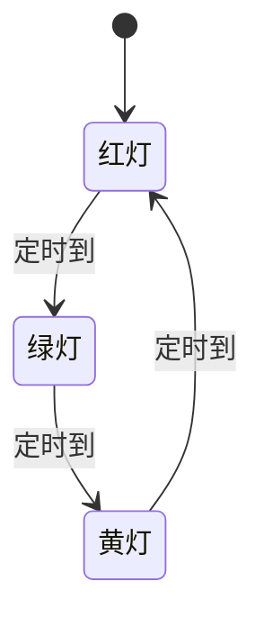
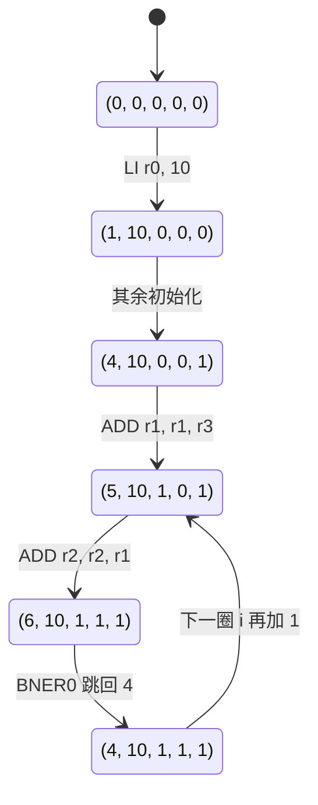

# 指令集架构的状态机模型

> [F4 计算机系统的状态机模型 - 指令集架构的状态机模型 | 一生一芯 v24.07 学习讲义](https://ysyx.oscc.cc/docs/2407/f/4.html#%E6%8C%87%E4%BB%A4%E9%9B%86%E6%9E%B6%E6%9E%84%E7%9A%84%E7%8A%B6%E6%80%81%E6%9C%BA%E6%A8%A1%E5%9E%8B)
>
> [Finite-state machine | Wikipedia](https://en.wikipedia.org/wiki/Finite-state_machine)

!!! abstract
    在[处理器组成及工作原理](处理器组成及工作原理.md)中，我们从「指令怎么编码、程序怎么跑」两个角度理解处理器的工作原理；本篇把同一套东西抽象成一个数学模型：**指令集架构（*Instruction Set Architecture*, **ISA**）就是一台只存在于纸面上的模型机，它的行为可以用状态机精确描述。**

    - **ISA 是规范，处理器是实现。** x86、ARM、RISC-V 和[处理器组成及工作原理](处理器组成及工作原理.md#指令集约定)中提到的三指令模型，都是 ISA。

    - 状态机四要素：**状态集合**、**激励事件**、**转移规则**、**初始状态**。ISA 里它们分别对应「PC + GPR + 内存」「执行指令」「指令语义」「上电后的初值」。

    - **跑程序 = 按约定（手册、编译器、CPU 设计）一步步转移状态。** 编译是把高级语言的状态机翻译成 ISA 的状态机；设计 CPU 则是用[同步时序逻辑电路](同步时序逻辑电路设计原理.md)把这台模型机做出来。

## 指令集架构的本质

上一篇里的 GPR、PC、存储器、指令编码和[存储程序](处理器组成及工作原理.md#存储程序模型)循环，在计算机领域里统称**指令集架构**（*Instruction Set Architecture*，**ISA**，也常简称指令集）。

计算机术语中常见的x86、ARM、RISC-V都是 ISA。[处理器组成及工作原理](处理器组成及工作原理.md#指令集约定)中提到的那个只有 `ADD`、`LI`、`BNER0` 三条指令的例子，同样是一种 ISA，下文把它叫做 **sISA**（*simple ISA*）。

ISA 的本质是一份**规范**：它定义一台**模型机**具备哪些功能、每条指令执行后系统该变成什么样。

模型机只存在于思维和手册里，我们先讨论「做什么」，不讨论「电路怎么连」。把原理和实现拆开，才容易看清处理器的本质；等用数字电路把这台模型机做出来，才得到真正能跑的计算机。

!!! tip
    ISA 可以看作是一份“说明书”，处理器是按说明书做出来的芯片。同一份 ISA 可以有很多种实现（Intel 和 AMD 都实现 x86）；开放的 ISA（如 RISC-V）也完全可以做出闭源商业芯片。

    在[计算机系统层次结构](408/计算机系统层次结构.md#计算机系统的层次结构)里，传统机器 $M_1$（机器指令系统）对应的就是 ISA 这一层：上面是汇编 / 操作系统 / 高级语言，下面才是具体电路。

商业 ISA 无非是 GPR 更多、指令更复杂。原理和 sISA 没有本质区别。要理解一个ISA，只需要去读相应的手册即可。

## 面向计算机系统的状态机模型

在把 ISA 说成状态机之前，首先学习一下[有限状态机](https://en.wikipedia.org/wiki/Finite-state_machine)的数学模型。它并不神秘，交通灯就是一台状态机：



一份完整的状态机定义包含四部分：

| 要素 | 含义 | 交通灯 |
|:-----|:-----|:-------|
| 状态集合 $S$ | 系统所有可能停住的样子 | $\{红, 绿, 黄\}$ |
| 激励事件集合 $E$ | 会推动系统变化的输入 | $\{定时到\}$ |
| 状态转移规则 $\delta$ | 当前状态遇到某事件后变成哪一个次态：$\delta: S \times E \to S$ | $\delta(绿, 定时到) = 黄$ |
| 初始状态 $s_0$ | 尚未发生任何事件时的状态 | 上电后的红灯 |

这样的定义在数学上不必 100% 严谨，但对理解计算机已经够用。

!!! info "数学中的状态机模型"
    在数学里，“状态机模型”通常就指一个**状态转移系统**，最常见的写法是一个四元组：

    $$
    (S,\;E,\;\delta,\;s_0)
    $$

    - $S$：状态集合。系统所有可能处于的“样子”。

    - $E$：激励事件集合。你把它理解成“推动系统变化的输入”（也可以理解成“发生了一件事”）。

    - $\delta$：转移规则。描述“在当前状态 $s \in S$ 遇到事件 $e \in E$ 后，系统进入哪个次态”：$s' = \delta(s,e)$。

    - $s_0$：初始状态。系统还没开始运行前的样子。

    一段运行（execution / trace）怎么写很简单：给定事件序列 $e_1,e_2,\\dots$，系统依次按

    $$
    s_1=\delta(s_0,e_1),\quad s_2=\delta(s_1,e_2),\quad \dots
    $$

    一路走下去。

    !!! tip "和 FSM 的关系"
        FSM（Finite-State Machine, 有限状态机）通常就是在上面这个框架下，再强调“状态集合是有限的”；而“状态机”这个词在计算机体系结构里经常用得更宽泛，本质上就是在讲同一套“状态 + 事件 + 转移规则”的思路。

回忆[时序逻辑](时序逻辑电路.md)：**状态就是那些可以稳定存储的信息。** 交叉配对反相器、锁存器、[D 触发器](时序逻辑电路.md#D-触发器)能存储 $1 bit$ 的信息；若干触发器拼成[寄存器](时序逻辑电路.md#寄存器)，就能记住一组数。计数器、[数列求和电路](时序逻辑电路.md#数列求和电路)的工作过程，其实就是「当前寄存器取值 + 组合逻辑算出下一取值 + 时钟边沿写回」，也就是状态机在电路里的样子。

[同步时序电路的设计](同步时序逻辑电路设计原理.md)正是从状态图 / 状态表出发：先规定有哪些状态、怎么转移，再编码、再映射成门和触发器。ISA 走的是同一条路，只是状态不再是几个触发器，而是整台模型机的程序员可见存储。

## 状态机视角下的ISA

把状态机四要素映射到 ISA 上：

| 要素 | 在 ISA 中是什么 |
|:-----|:----------------|
| 状态集合 $S$ | 一组具体的 **PC、GPR、内存**。全体状态就是这三者所有取值的组合：$S = PC \times GPR \times Mem$ |
| 激励事件 $E$ | **执行一条指令**（指令会改写状态） |
| 转移规则 $\delta$ | **指令的语义**：手册约定「在某状态下执行某指令后，次态是什么」 |
| 初始状态 $s_0$ | 尚未执行任何指令时的取值（上电 / 复位后的 PC、寄存器、内存） |

「执行哪条指令」并不是随便挑的：由当前状态决定——取出 $M[PC]$，再按它的语义转移。程序一旦放进内存、PC 指向开头，状态机就会自己一步步走下去。这正是[存储程序](处理器组成及工作原理.md#存储程序模型)的含义。

### sISA 的状态实例化

sISA 的转移规则就是这三条指令的语义（编码约定见[指令的编码](处理器组成及工作原理.md#指令的编码)）：

```text
 7  6 5    4 3    2 1    0
+----+------+------+------+
| 00 | dest | src1 | src2 |  R[dest] = R[src1] + R[src2]   ADD
+----+------+------+------+
| 10 | dest |     imm     |  R[dest] = imm                 LI
+----+------+------+------+
| 11 |     addr    | src2 |  if (R[0] != R[src2]) PC=addr  BNER0
+----+-------------+------+
```

普通指令执行完后，PC 还会按通常方式指向相邻下一条；`BNER0` 在条件成立时改写 PC，否则同样顺序往下。

一个状态可写成 $(PC,\, r_0,\, r_1,\, r_2,\, r_3,\, M)$。sISA 的指令**不改内存**（没有 load/store），$M$ 在整个程序运行期间不变，表示状态时可以省略它：

$$
s = (PC,\, r_0,\, r_1,\, r_2,\, r_3)
$$

!!! example "一次具体的转移"
    数列求和程序里，地址 $5$ 存放的是机器码 `00101001`，即 `ADD r2, r2, r1`，语义为 $R[2] \leftarrow R[2] + R[1]$。

    执行前状态为 $(5,\, 10,\, 1,\, 0,\, 1)$：PC 指向地址 $5$，$r_1=1$（当前项），$r_2=0$（部分和）。执行后 $r_2$ 变成 $0+1=1$，PC 顺序变为 $6$：

    $$
    \delta\bigl((5,\,10,\,1,\,0,\,1),\; \texttt{00101001}\bigr) = (6,\,10,\,1,\,1,\,1)
    $$

    这就是[上一篇推演表](处理器组成及工作原理.md#程序计数器)里的其中一步。处理器并没有「理解」求和，它只是按照事先约定好的ISA把寄存器改成次态。

### 程序运行的状态机模型

把上一篇 $1+2+\cdots+10$ 的[指令序列](处理器组成及工作原理.md#程序计数器)放进内存，初始状态约定为 $(0,\,0,\,0,\,0,\,0)$。前几步转移如下（中间两次 `LI` 省略，内存始终不变故不画出）：



循环会一直转到 $r_1 = r_0 = 10$，部分和 $r_2 = 55$，最后停在地址 $7$ 的自跳转。**程序的一次完整运行，就是从 $s_0$ 出发、按 $\delta$ 走出来的一条状态路径。**

!!! example
    状态 $(6,\,10,\,1,\,1,\,1)$ 即将执行地址 $6$ 的 `BNER0 r1, 4`。此时 $r_1=1$、$r_0=10$，次态是什么？

    条件 $r_1 \neq r_0$ 成立，PC 被改写成 $4$，GPR 不变，次态为 $(4,\,10,\,1,\,1,\,1)$——也就是图里 `s6 → s4b` 那一步。若某次比较时 $r_1=r_0$，则不跳转，PC 顺序变为 $7$，循环结束。

## 计算机系统的层次抽象

同一套状态机模型，还可以套到更高层的程序、更底层的电路上。三者对上之后，编译和 CPU 设计各自在干什么就清楚了。

| | [C 程序](../编程语言/c/C%20Basics.md) | ISA | [数字电路](时序逻辑电路.md) |
|:--|:--|:--|:--|
| 状态 | 变量 + 「执行到哪一句」的 PC | PC + GPR + 内存 | [时序元件](时序逻辑电路.md)里存的值 |
| 激励 | 执行一条语句 | 执行一条指令 | [组合逻辑](组合逻辑电路.md)算出的下一状态 |
| 转移规则 | 语句的语义 | 指令的语义 | 组合逻辑的具体逻辑 |
| 初态 | `main` 第一条语句，变量未赋值 | 复位后的 PC / 寄存器 / 内存 | 电路复位时触发器的值 |

电路那一层，就是[时序逻辑](时序逻辑电路.md)里反复出现的闭环：

```text
    +------------------+
+-->| Sequential Logic |----+
|   +------------------+    |
| next state                | current state
|                           |
|  +---------------------+  |
+--| Combinational Logic |<-+
   +---------------------+
```

寄存器存当前状态，组合逻辑算次态，时钟边沿写回——和计数器、[数列求和电路](时序逻辑电路.md#数列求和电路)同一套路。CPU 能做出来，是因为它也是「时序 + 组合」，因而也一定能从状态机来理解。

### 编译的本质

简单来说，编译的本质就是把 C 程序的状态机译成 ISA 的状态机。

计算机只能执行指令，读不懂 `sum = sum + i;`。所谓**编译**（*compile*），就是构造一个指令序列，使得C程序执行一条语句后的状态，与 ISA 执行对应指令序列后的状态，**语义上等价**。

落到具体工作上只有两件事：

1. **状态怎么对应：** C 的 PC 对到 ISA 的 PC；C 的变量对到 GPR 或内存（上一篇求和里，`i`、`s` 分别住在 `r1`、`r2`）。

2. **转移怎么对应：** 把语句译成指令序列（`sum = sum + i` 对到 `ADD r2, r2, r1`）。

高级语言的变量名更直观，循环的条件和循环体也分得更开；汇编里这些都混在指令里，要靠上下文推断。这就是[编程的本质](处理器组成及工作原理.md#编程的本质)里「用少量现有功能组合出复杂过程」在两层语言上的差别。

!!! example "同一段求和，两种状态写法"
    上一篇推演里出现过 $(6,\,10,\,1,\,1,\,1)$：部分和 $r_2=1$，当前项 $r_1=1$。写成 C 就是 $sum=1$、$i=1$。名字不同、存放位置不同，指的是同一份计算进度——编译要保证的，正是这种对齐。

### CPU 设计的本质

设计 CPU，就是构造数字电路，使得 ISA 执行一条指令后的次态，与这块电路在组合逻辑控制下的次态，**语义上等价**。

所以：

<div class="text-center-container" style="text-align: center;">
    <strong>在 CPU 上运行程序 = 用编译得到的指令序列，驱动 CPU 电路做状态转移。</strong>
</div>

微结构设计画的是「按 ISA 手册，CPU 内部该有哪些模块」；逻辑设计再把模块落成门和触发器。软件编程则发生在更上面：程序员编写写 C程序，编译器译成 ISA 指令，电路按指令转移。三层状态机在运行时叠在一起，看起来像一台机器在「执行程序」。

## ISA 手册里还有什么

指令语义只是 ISA 的一部分。完整手册通常还约定：

- **输入 / 输出：** 怎样和外界交换数据

- **系统状态：** 特权级、控制寄存器等

- **中断 / 异常：** 执行流被打断时状态如何保存和恢复

- **虚存管理：** 程序看到的地址如何映射到物理内存

- **内存模型：** 多核、乱序访问时，怎样才算「看见了同一次写入」

**凡是程序员能观察到的、执行指令会改变的东西，都属于 ISA 状态；手册是这份状态如何转移的唯一依据。**
