# 支持数列求和的sCPU

学习了[CPU的工作原理](处理器组成及工作原理.md)和[ISA的相关概念与模型](指令集架构的状态机模型.md)后，接下来就可以基于早期学习的[数字电路](同步时序逻辑电路设计原理.md)实现一个简单的CPU了。

## sISA约定

整体上仍采用[学习指令集架构时使用的sISA](指令集架构的状态机模型.md#sISA-的状态实例化)：

```text
 7  6 5    4 3    2 1    0
+----+------+------+------+
| 00 | dest | src1 | src2 |  R[dest] = R[src1] + R[src2]   ADD指令, 寄存器间加法
+----+------+------+------+
| 10 | dest |     imm     |  R[dest] = imm                 LI指令, 立即数赋值
+----+------+------+------+
| 11 |     addr    | src2 |  if (R[0] != R[src2]) PC=addr  BNER0指令, 条件跳转（若不等于R[0]则跳转）
+----+-------------+------+
```

同时还需约定各组件的位宽（与 `BNER0` 的 `addr` 字段、指令字长对齐）：

- PC 位宽 $4\,\text{bit}$，初值为 $0$

- GPR $4$ 个，位宽均为 $8\,\text{bit}$

## 处理器的指令周期

处理器在执行每条指令时，都会遵循一个固定的循环步骤进行：

1. **取指**（*Fetch*）：根据当前[PC](处理器组成及工作原理.md#程序计数器)中的值，在主存中找到对应的指令

2. **译码**（*Decode*）：将指令解码为操作码和操作数

3. **执行**（*Execute*）：根据操作码执行相应的操作，如需要更新相关的寄存器

4. 更新PC：根据指令的类型和操作结果，更新PC的值，以便下一条指令的正确执行

上述的步骤统称为一个处理器的**指令周期**（*Instruction Cycle*），是描述处理器执行指令的基本过程。

下面以`LI`指令为例，详细介绍处理器的指令周期和使用数字电路实现的思路：

### 取指

取指的目标是让处理器知道**下一条指令在哪、那一格里是什么。**

[存储程序](处理器组成及工作原理.md#存储程序模型)把指令序列按地址排在存储器里，[PC](处理器组成及工作原理.md#程序计数器)只保存「当前这条」的地址。因此电路上只要两块：

- **PC 寄存器**：记住地址

- **可寻址的存储器**：给出地址，读出该地址上的那一条指令

寄存器能存，但一次只暴露自己那一组 $Q$；存储器还要能**按地址选中其中一行**。可以把存储器看成比特矩阵：每一行是一个**存储字**（*word*），行号就是地址，行数叫**深度**（*depth*），每行位数叫**宽度**（*width*），规格写成「深度 $\times$ 宽度」。

sISA 的三条指令都不访问数据存储器，只有取指需要读指令，所以指令存储器做成只读即可：**ROM**（*Read-Only Memory*）。相对地，后面 GPR 要被 `LI` 写入，才需要 **RAM**（*Random Access Memory*）。

[PC 的本质就是寄存器](处理器组成及工作原理.md#程序计数器)。`BNER0` 的 `addr` 只有 $4\,\text{bit}$，指令最多 $16$ 条，因此 PC 做成 $4$ 位、复位为 $0$：

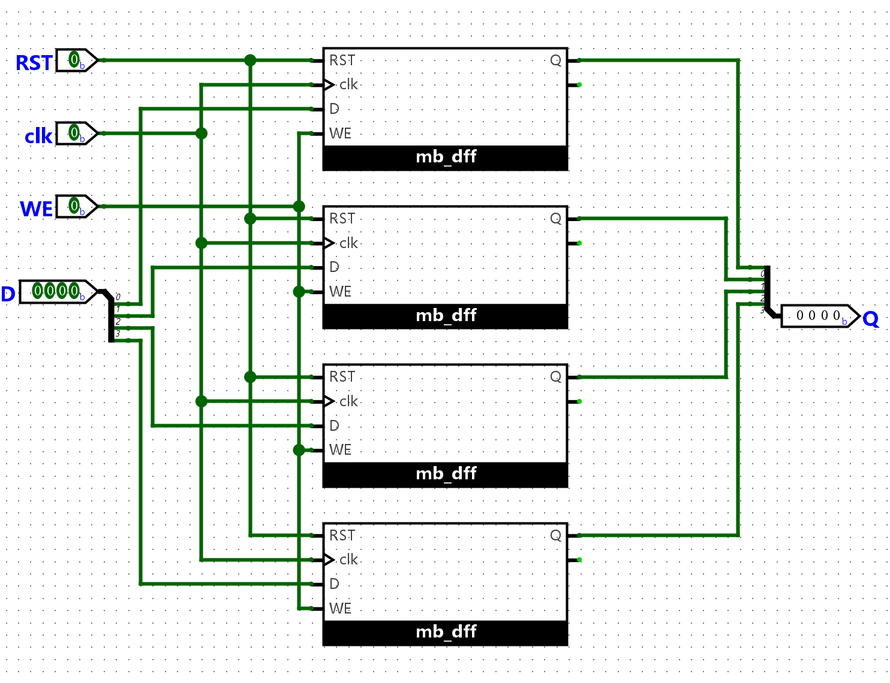

`WE`、`clk`、`RST` 的含义与[时序逻辑里的寄存器](时序逻辑电路.md#寄存器)相同：时钟边沿且 `WE=1` 时把 $D$ 写入，$Q$ 一直接到后面的地址线。

PC $4\,\text{bit}$ $\Rightarrow$ 最多 $2^4=16$ 个地址；每条指令固定 $8\,\text{bit}$（不是因为 GPR 是 $8$ 位，而是[指令编码](处理器组成及工作原理.md#指令的编码)本身就是 $8$ 位）。所以指令 ROM 的规格是 **$16\times 8$**。

实现上需要 $16$ 条**字线**（*word line*，一行一个存储字）和 $8$ 条**位线**（*bit line*，一列一位）：

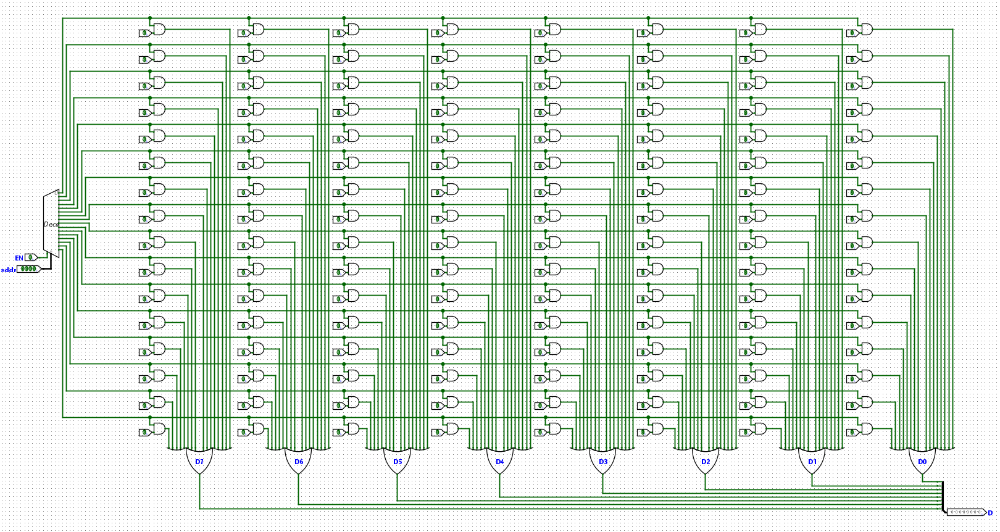

读出过程：

1. $4$ 位地址进[译码器](组合逻辑电路.md#n选1译码器)，变成 $16$ 位独热码，只拉高一行字线

2. 该行里预先接死的 $0/1$ 经与门送到 $8$ 条位线

3. 每条位线用或门汇合各行，输出这一个存储字

这和[多路选择器](组合逻辑电路.md#多路选择器)是同一套结构：地址是选择端，各存储字是数据端。**ROM**（Read-Only Memory, 只读存储器）的数据端是焊死的常数，所以功能上就是「数据端为常数的 MUX」。

取指时把 PC 的 $Q$ 接到 ROM 的地址端，ROM 的数据端就是当前指令[^1]：

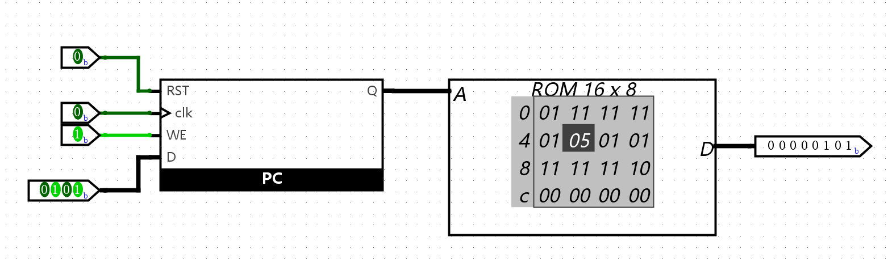

!!! example
    图中 PC $=5$，ROM 第 $5$ 字输出 `00000101`。若按数列求和程序，地址 $0$ 应放 `LI r0, 10`，即 `10001010`。把这 $16$ 个字写成求和程序的机器码，取指才和[上一篇的推演](处理器组成及工作原理.md#程序计数器)对得上。

### 译码

在纸上执行 ISA 时，看到 `LI r0, 10` 或 `10001010` 再去查手册，译码是人做的。电路里只有那一串 $0/1$，需要按ISA的约定把字段拆开。

译码分两步：

| | 做什么 | 实现 `LI` 时 |
|:--|:--|:--|
| **操作码译码** | 看 `opcode` 是哪条指令 | 暂时假定取到的都是 `LI`，可以不做 |
| **操作数译码** | 抽出本指令用到的字段 | 抽出 `dest`、`imm` |

`LI` 的布局是 `10 | dest | imm`：

```text
 7  6 5    4 3              0
+----+------+----------------+
| 10 | dest |      imm       |
+----+------+----------------+
         |           |
         |           +-- 立即数（4 bit，写入前高位补 0 成 8 bit）
         +-- 写入哪个 GPR（2 bit）
```

从电路视角来看，本质上就是**位抽取**：

- `inst[5:4]` $\rightarrow$ 写地址 `waddr`（接到 GPR）

- `inst[3:0]` 高位补 $0$ $\rightarrow$ $8$ 位立即数 `imm`（即 $\{0000,\ \textit{inst}[3:0]\}$）

因此只要需要使用分线器按ISA进行分位即可。

!!! tip
    后续添加 `ADD` / `BNER0` 时，再用 $2$-$4$ [译码器](组合逻辑电路.md#2-4-译码器)解析 `inst[7:6]`，独热码当作控制信号去选则对应的数据通路。现在仅实现`LI`指令，无需处理指令的高两位。

### 执行

`LI` 的语义只有一句：$R[\textit{dest}] \leftarrow \textit{imm}$（高位补 $0$）。所以执行阶段要的是**按寄存器号写入对应GPR**。

GPR 一次只动其中几个寄存器，因此它也是可寻址存储器；又要被指令写入，所以可以看作是 **RAM**（Random Access Memory, 随机访问存储器）。读出结构和 ROM 几乎一样，只是存储单元换成[D 触发器](时序逻辑电路.md#D-触发器)；写入还要共享的数据总线 `wdata`、写使能 `EN`，以及把地址译成某一行的 `WE`。

sISA 只有 $4$ 个 GPR、寄存器号 $2\,\text{bit}$，每个 $8\,\text{bit}$，因此 RAM 规格是 **$4\times 8$**，即 $4$ 个 $8\,\text{bit}$ 寄存器（GPR）构成的集合：

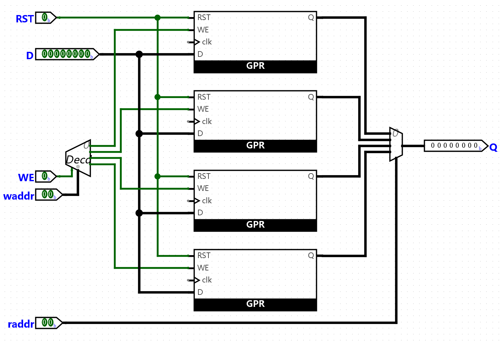

时钟边沿到来时，只有 `dest` 选中的那一个寄存器更新；其余保持。这就是[状态机](指令集架构的状态机模型.md)里 $\delta$ 对 GPR 的那一次改写。

### 更新PC

`LI` 不改控制流，执行完只要让 PC 指向相邻下一条：$PC \leftarrow PC + 1$。

把 PC 的 $Q$ 送进一个 $4$ 位[加法器](组合逻辑电路.md#加法器)（另一输入接常数 $1$），和再接回 PC 的 $D$，`WE` 保持有效，本质上就是[计数器](时序逻辑电路.md#计数器)。$4$ 位加法按模 $16$ 回绕，和 ROM 的地址范围一致。

!!! tip "BNER0 的接口"
    后续实现 `BNER0` 跳转时，PC 的 $D$ 就不再永远是 $PC+1$，而要在 $PC+1$ 和指令里的 `addr` 之间用[多路选择器](组合逻辑电路.md#多路选择器)二选一。现在可以先把选择端接地，固定走 $+1$。

把四步串起来：PC $\rightarrow$ ROM $\rightarrow$ 抽出 `dest`/`imm` $\rightarrow$ 写入 GPR $\rightarrow$ PC 加一。复位后连续给时钟，就能依次执行求和程序开头的那几条 `LI`指令：

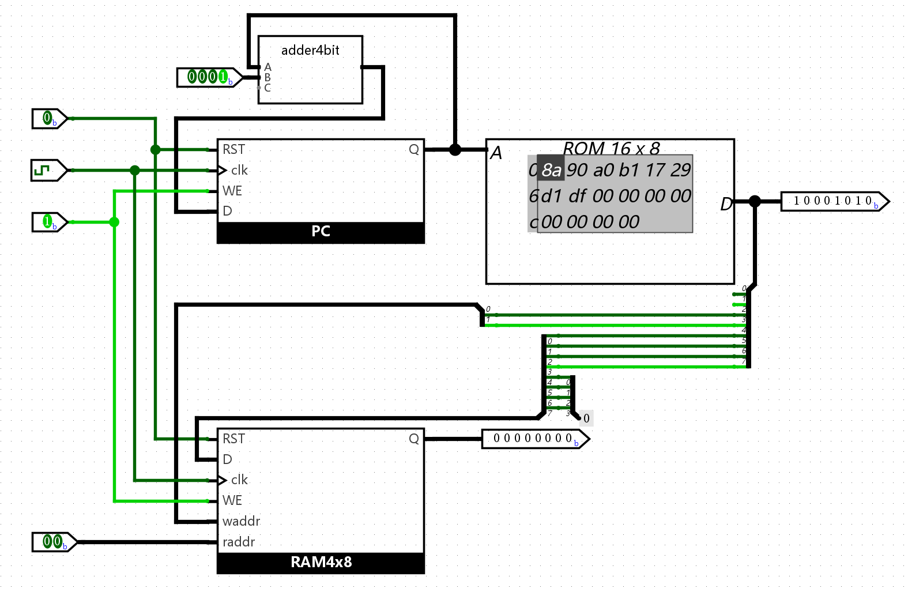

按照介绍[ISA 模型推演](处理器组成及工作原理.md#程序执行时的-GPR-状态变化)，在执行完求和程序开头的几个`LI`指令后，$4x8 \text{RAM}$ 四个寄存器的值从 $0$ 到 $3$ 应该分别为 $10, 0, 0, 1$。

可以通过修改RAM最下方的读地址输入来选择对应的GPR并观察RAM的输出来判断是否符合预期：

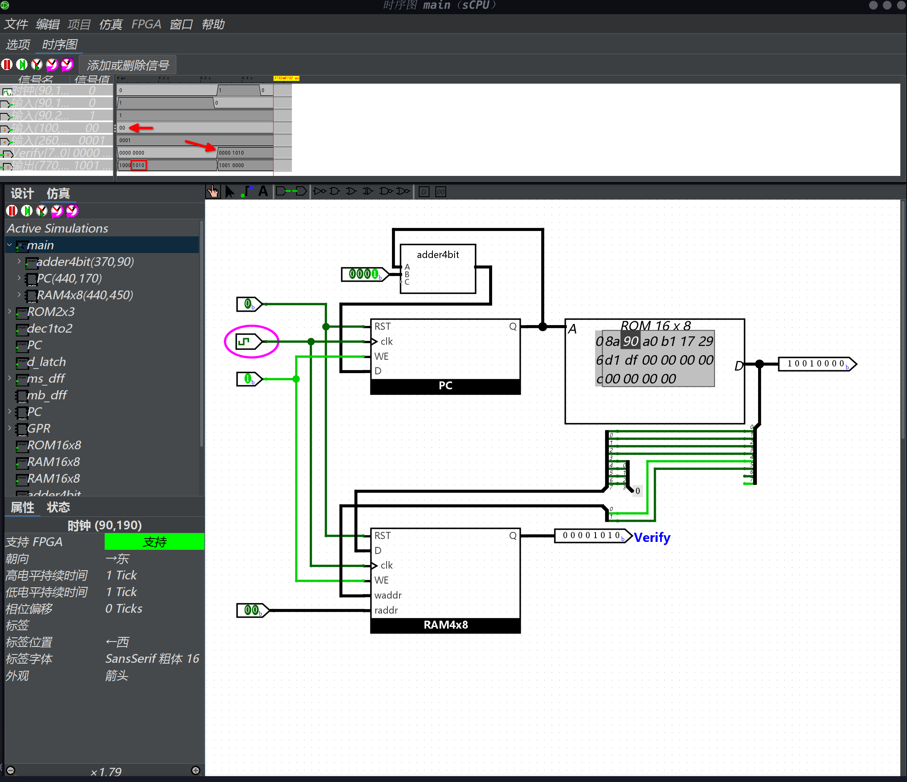

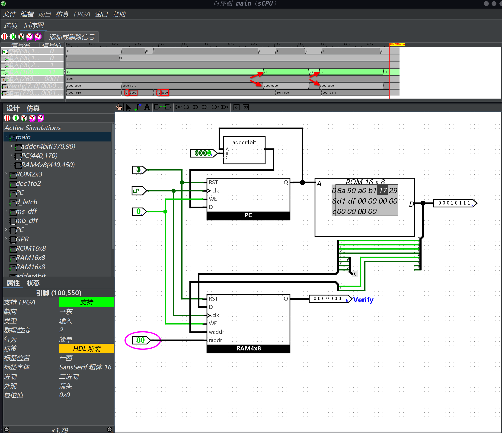

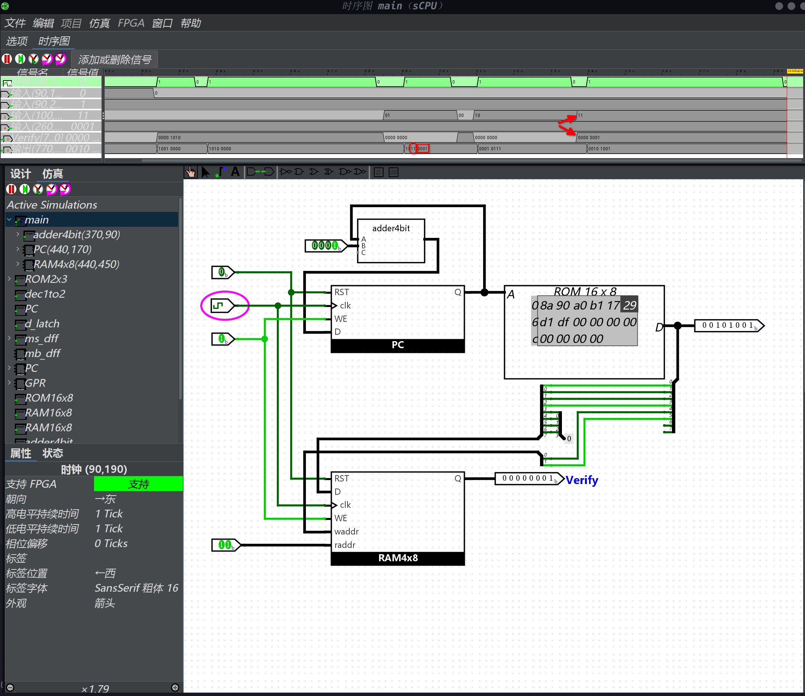

## 完整的sCPU

取指和 $PC+1$ 对三条指令都一样，可以直接复用。扩展实现的核心是让sCPU能够**识别出当前执行的是哪类指令**，以及当几条指令抢同一条线时，用控制信号把数据拨到对的地方。

各指令的预期行为如下：

| 指令 | `wdata` | `WE` | `raddr0` | 下一 PC |
|:----:|:--------:|:------:|:---------:|:--------:|
| `ADD` | 加法器 | $1$ | `src1` | $PC+1$ |
| `LI` | 立即数 | $1$ | - | $PC+1$ |
| `BNER0` | - | $0$ | 常数 $0$ | 不等则 `addr`，否则 $PC+1$ |

### ADD

`ADD` 的语义为 $R[\textit{dest}] = R[\textit{src1}] + R[\textit{src2}]$。和 `LI` 比，多了「从两个寄存器读、相加、再写回」。

#### 译码扩展

`opcode` 只有 $2$ 位，用一片 $2$-$4$ [译码器](组合逻辑电路.md#2-4-译码器)即可，输出独热码当作控制信号：

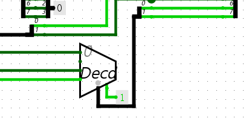

| `inst[7:6]` | 独热（$Y_3 Y_2 Y_1 Y_0$） | 指令 |
|:-----------:|:------------------------:|:----:|
| `00` | `0001` | `ADD` |
| `01` | `0010` | 保留 |
| `10` | `0100` | `LI` |
| `11` | `1000` | `BNER0` |

按照sISA的约定，先将从ROM中取出的指令进行位拆分：

```text
 7  6 5    4 3    2 1    0
+----+------+------+------+
| 00 | dest | src1 | src2 |
+----+------+------+------+
         |      |      |
         |      |      +-- inst[1:0] → raddr1
         |      +-- inst[3:2] → raddr0
         +-- inst[5:4] → waddr（与 LI 相同）
```

#### GPR扩展

`LI` 只写、不读；但是 `ADD` 要**同时**读两个源操作数、写一个目的操作数。单端口 RAM 同一时刻只能给一个地址，所以 GPR 要扩成**两读一写**：

| 端口 | 信号 | `ADD` 时接到 |
|:--|:--|:--|
| 读口 1 | `raddr1` | `src1` / $R[\textit{src1}]$ |
| 读口 2 | `raddr2` | `src2` / $R[\textit{src2}]$ |
| 写口 | `waddr` / `wdata` / `WE` | `dest` / 加法结果 / 与`LI`进行组合 |

电路上就是在原来的 $4$ 个寄存器上再挂一路读：[多路选择器](组合逻辑电路.md#多路选择器)按 `raddr` 从四路 $Q$ 里挑一个。写口仍是 $2$-$4$ 译码器生成 `WE`。这种「同一拍按多个地址访问」的存储器叫**多端口 RAM**（*multi-port RAM*），顾名思义，就是可以同时从多个端口读/写（这里是两读一写）。每加一个口，就要多一套选择 / 译码逻辑：

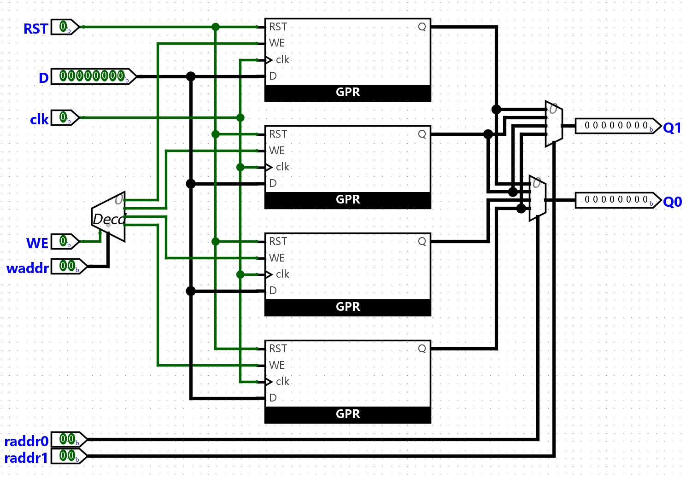

读出之后，两个 $8$ 位源操作数进[加法器](组合逻辑电路.md#加法器)，和就是 `ADD` 的写回值。问题是 `GPR.wdata` 已经被 `LI` 的立即数占用了。一条指令不可能既是 `ADD` 又是 `LI`，因此在写口前加一个 $2$ 选 $1$；

选择端接指令译码器的 $Y_0$，用于判断当前是否为加法指令，是则选择加法器通路，不是则走立即数。`WE` 在 `ADD` / `LI` 时都为 $1$，因此可以直接将译码器的 $Y_0$ 和 $Y_2$ 相或接入 `WE`：

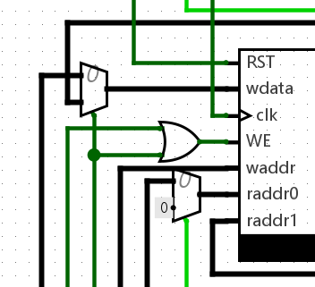

!!! bug
    下面组装完成后的电路有个不易察觉的错误：接入译码器的 `inst[7:6]` 的分线器线序其实是反接了的（正确接法应该是*朝东、递增分配*），但是由于译码器输出本身也接错了，因此最后阴差阳错地正确执行了。

    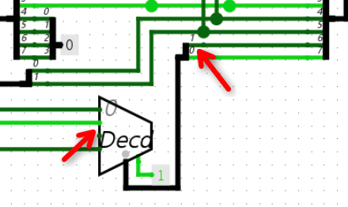

    下面才是正确的接法：

    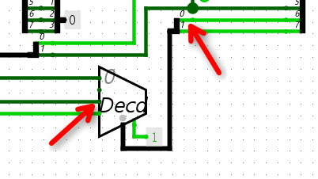

    好在发现得及时（在[扩展新指令](#扩展新指令)前），否则在扩展新指令时又要进行一堆繁琐的排错与调试（事实上，笔者已经因为线序的问题被折磨了不少时间）。这里笔者也是进行了上面的组合逻辑分析才发现了这个巧合，事实证明验证与分析还是很重要的。

### BNER0

`BNER0` 的语义为若 $R[0] \neq R[\textit{src2}]$，则 $PC \leftarrow \textit{addr}$，否则 $PC+1$。

注意这个指令**总是不写 GPR**。

依旧先按照sISA进行位拆分：

```text
 7  6 5              2 1    0
+----+----------------+------+
| 11 |      addr      | src2 |
+----+----------------+------+
              |            |
              |            +-- inst[1:0]，与 ADD 的 src2 同一段 → 仍接 raddr1
              +-- inst[5:2] → 跳转目标（4 bit，与 PC 同宽）
```

还要读隐含的 $R[0]$。`raddr0` 已被 `ADD` 的 `src1` 占用，同样用 $2$ 选 $1$：当前是 `BNER0` 时选常数 `00`，否则选 `src1`。

**只有指令类型为 `BNER0`（译码器输出为 $Y_3$） *且*源操作数不等于 $R[0]$ 中的值才把 PC 写成 `addr`**。

因此将从 GPRs 中读出的两个操作数使用进行[比较器](组合逻辑电路.md#比较器)（相等则输出 $1$）比较后将输出与译码器的 $Y_3$ 相与后作为选择端接入多路选择器，选择端为 $1$ 时选择 `addr`，否则选择 $PC+1$：

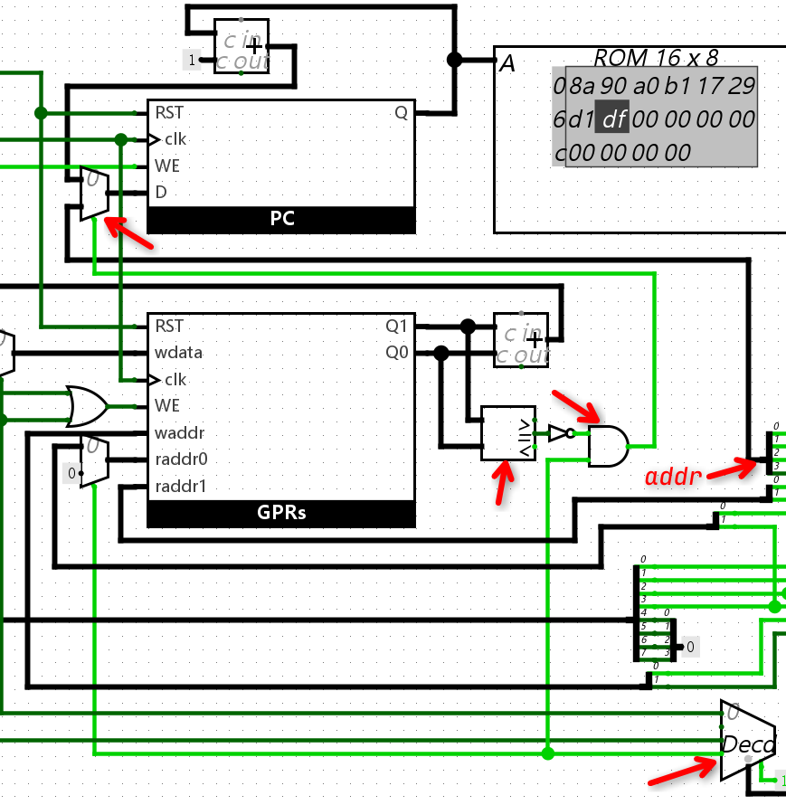

执行 `BNER0` 指令时GPRs的 `WE` 必须拉低，否则会按 `dest` 的位型（其实是 `addr` 的高 $2$ 位）误写某个 GPR。实现上也很简单：只让需要写入GPR的指令进行组合后接入 `WE`（上面介绍 `ADD` 的[GPR扩展](#GPR扩展)已经介绍了如何实现）即可。

这些选择全部由操作码译码器的独热码（再加比较结果）驱动。GPR、加法器、比较器、ROM 是**数据通路**；译码器和那些 MUX 的选择端是**组合控制逻辑**。指令从 ROM 出来之后，电路只受控制信号驱动，这就是[上一篇](指令集架构的状态机模型.md)学习的**在 CPU 上跑程序 = 用指令序列驱动电路做状态转移**。

全部接上后开启模拟运行完整求和程序，最后 PC 输出 $Q$ 应停在 $7$（地址 $7$ 的自跳转），$r_2=55$。

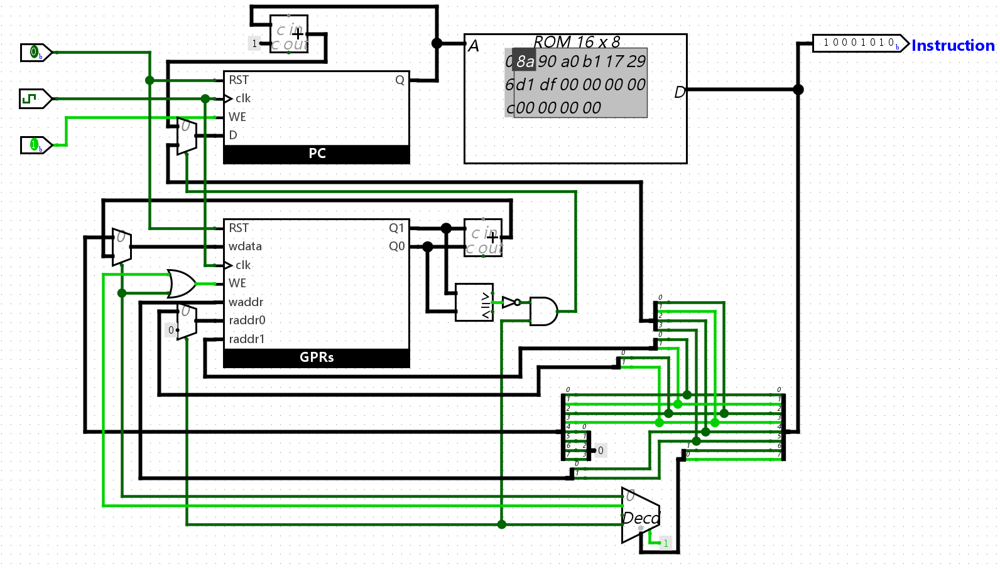

可以在 `Ctrl-1` 模式下点击对应组件输出的线路观察其中的值：

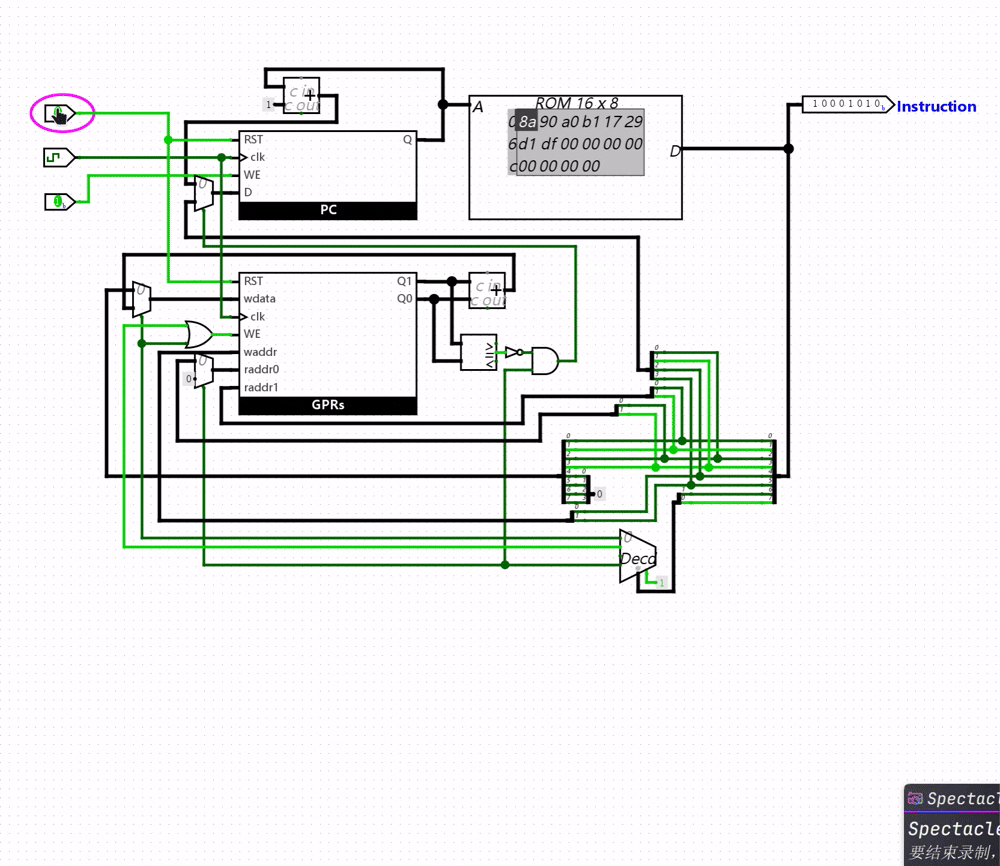

## 扩展新指令

在设计sISA时，我们还保留了一个未使用的指令类型 `01`。由于当前的sCPU尚未包含输出功能，因此我们可以考虑实现一个 `OUT` 指令，用于将某个寄存器的内容输出到外设（这里的外设不妨就采用在学习组合逻辑电路时实现的[十六进制数码管译码器](组合逻辑电路.md#四位输入的七段数码管译码器)）。

### 设计思路

不妨自下而上地进行考量：

考虑到我们应该尽可能地复用已实现的电路，同时尽可能不修改已有的电路（否则基于前面提到的[多端口RAM](#GPR扩展)的概念，完全可以力大砖飞直接再加一个读端口），以及一个十分明显但重要的前提条件：**`OUT` 指令与 `BNER0` 指令相同，执行时总是不写GPR**。

因此我们几乎连接入GPRs的连线都无需修改，只需要考虑一个读操作（全盘交给指令即可）和读出的数据怎么译码输出到数码管（hex7seg）就可以了：

```text
 7  6 5              2 1    0
+----+----------------+------+
| 01 |     unused     |  rs  |
+----+----------------+------+

OUT rs → 读取GPRs中的 rs 寄存器，并将其译码输出到数码管
```

比如，我们希望监控求和过程中 $r_1$ 的变化，就可以在原有求和程序的求和循环中插入一两条这样的指令：

```text
...
4: OUT r1       # 输出 r1 的值
...
8: OUT r1       # 再完成所有求和操作后输出 r1 的值
9: BNER0 r3, 8  # 跳转到地址 8 继续执行
```

按照新引入的指令，译成机器码就应该是这样：

```text
...
01000001    # 4: OUT r1 -> 01 | 0000 | 01
...
01000001
11100011    # 9: BNER0 r3, 8 -> 11 | 1000 | 11
```

### 电路实现

实现后的整体电路就是这样的：

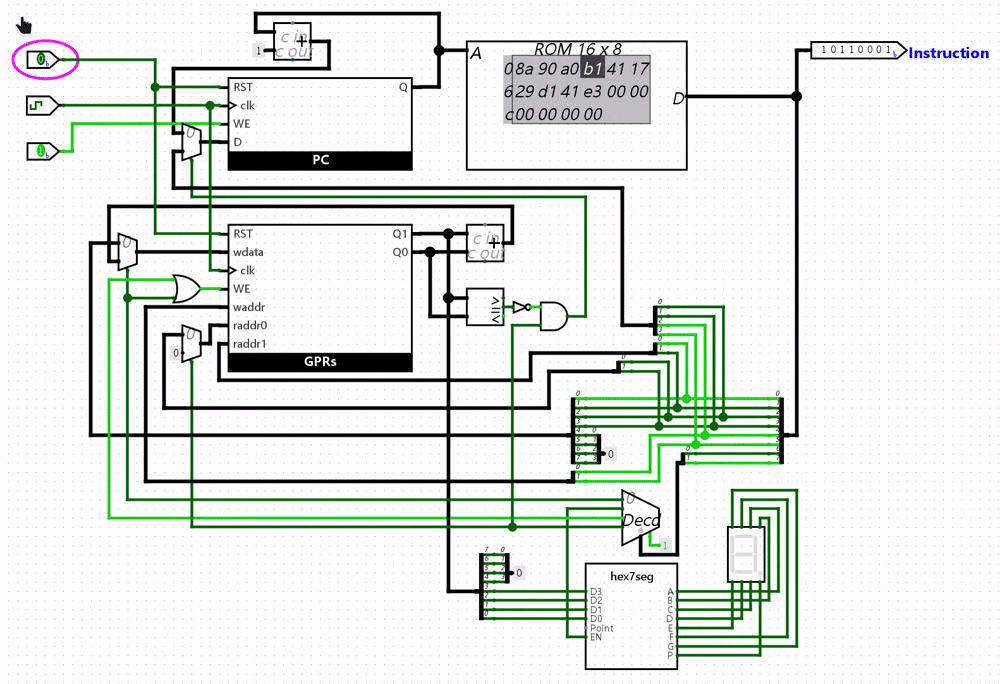

可以看出实际只添加了译码输出到数码管的逻辑，同时这里为了体现 `OUT` 指令的实行时机，把指令译码器的 $Y_1$ 接到了数码管译码器的使能端，也就是说只有在执行 `OUT` 指令时数码管才会显示信息；

同时基于对求和程序的修改（第 $8$ 条指令输出 $r_1$ 的最后结果，第 $9$ 条指令又会跳转到地址 $8$），最后数码管上会在显示 $r_1$ 的终值（十六进制 $A$）和熄灭间反复横跳。

## 奇数列求和

### 引入新指令后的sISA约定

```text
 7  6 5    4 3    2 1    0
+----+------+------+------+
| 00 | dest | src1 | src2 |  R[dest] = R[src1] + R[src2]   ADD指令, 寄存器间加法
+----+------+------+------+
| 01 |   unused    |  rs  |  R[rs] -> hex7seg              OUT指令, 输出寄存器 rs 的值
+----+-------------+------+
| 10 | dest |     imm     |  R[dest] = imm                 LI指令, 立即数赋值
+----+------+------+------+
| 11 |     addr    | src2 |  if (R[0] != R[src2]) PC=addr  BNER0指令, 条件跳转（若不等于R[0]则跳转）
+----+-------------+------+
```

### 编程与执行

回到[奇数列求和](处理器组成及工作原理.md#奇数列求和)的例子，在原有的奇数列求和程序上，我们也基于新引入的 `OUT` 指令，添加一些用于监控寄存器变化的指令：

```text
0: LI    r0, 11      # 开区间上界
1: LI    r1, 1       # i = 1
2: LI    r2, 0       # s = 0
3: LI    r3, 2       # 步长 2
4: OUT r1            # 输出GPR r1的值
5: ADD   r2, r2, r1  # s = s + i
6: ADD   r1, r1, r3  # i = i + 2
7: BNER0 r1, 4       # 若 i != 11，跳回 4
8: OUT r1            # 输出GPR r1的值
9: BNER0 r3, 8       # 在8-9之间反复横跳（r3=2 恒不等于 r0=11）
```

译成机器码：

```text
10001011    # 0: LI    r0, 11     → 10 | 00 | 1011
10010001    # 1: LI    r1, 1      → 10 | 01 | 0001
10100000    # 2: LI    r2, 0      → 10 | 10 | 0000
10110010    # 3: LI    r3, 2      → 10 | 11 | 0010
01000001    # 4: OUT r1           → 01 | 0000 | 01
00101001    # 5: ADD   r2, r2, r1 → 00 | 10 | 10 | 01
00010111    # 6: ADD   r1, r1, r3 → 00 | 01 | 01 | 11
11010001    # 7: BNER0 r1, 4      → 11 | 0100 | 01
01000001    # 8: OUT r1           → 01 | 0000 | 01
11100011    # 9: BNER0 r3, 8      → 11 | 1000 | 11
```

写入ROM并执行：

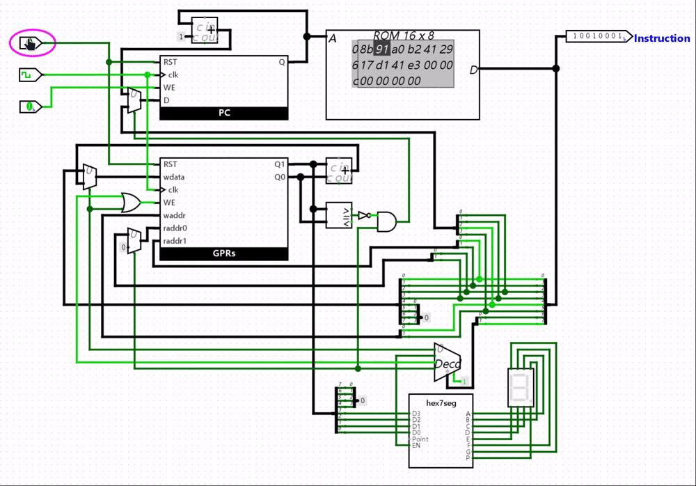

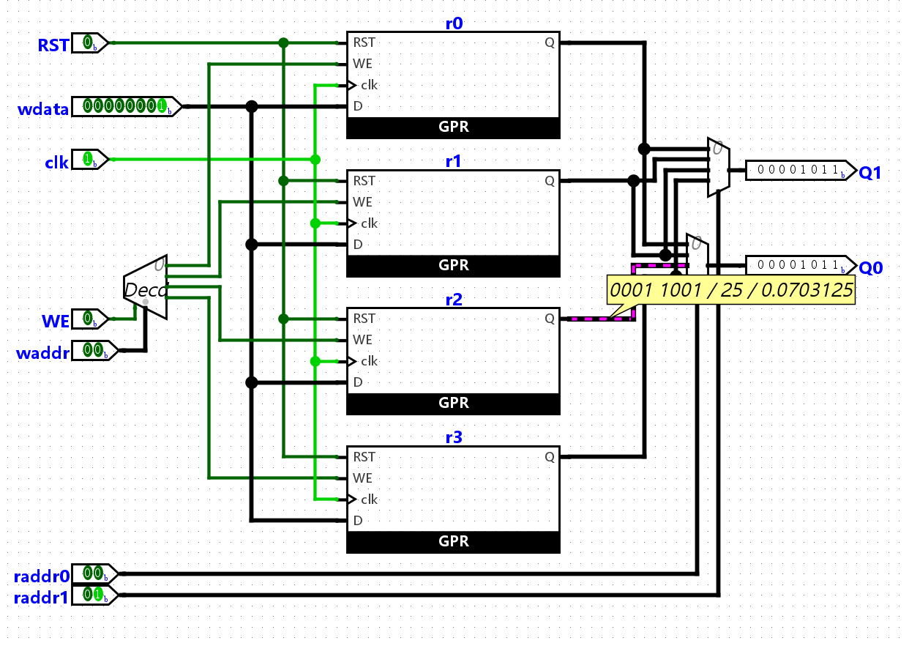

## sCPU与专用求和电路的对比

两套电路算的都是 $1+2+\cdots+10=55$，但状态机的更新方式完全不同。

[时序逻辑里的数列求和电路](时序逻辑电路.md#数列求和电路)把算法焊死在连线上：一个寄存器存 $i$、一个存 $s$，每个时钟边沿**并行**做 $s \leftarrow s+i$ 和 $i \leftarrow i+1$。没有指令、没有 PC，控制流就是「一直加」。要改成奇数和或换一个上界，得改加法器输入、比较条件或复位值——等于重做一块专用芯片。

sCPU 把同一件事拆成 ROM 里的指令序列：先 `LI` 填寄存器，再 `ADD` / `BNER0` 循环。每拍只执行**一条**指令，所以软件里必须写成先加 $i$ 再加 $s$（或反过来，按程序顺序），不能像专用电路那样同一拍改两个变量。换算法通常只改 ROM（后面的 `OUT` 也是插几条指令），数据通路可以不动。

| | 专用求和电路 | sCPU |
|:--|:--|:--|
| 状态 | 两个寄存器 $i,s$ | PC + 四个 GPR（+ 指令 ROM） |
| 一拍做什么 | 固定的两步算术 | 由当前指令决定 |
| 改算法 | 改电路 | 改程序 |
| 面积 / 延迟 | 小、每拍吞吐高 | 大、求和要几十拍 |
| 能做什么 | 几乎只会求和 | 任何能用 sISA 写出来的事 |
| 优点 | 硬件少；每拍并行更新 $i$、$s$，十来个周期就能到 55；没有取指/译码，**实现与控制简单** | 算法在 ROM 里，改程序就能换任务（奇数和、`OUT` 都不必改数据通路）；加法器 / GPR / 比较器被所有指令分时共用；**泛用性强** |
| 缺点 | 换上界、改成奇数和、要显示或停机，都得改门级连线；没有程序，复用不到别的作业上 | 面积大（PC、ROM、译码、MUX）；每拍只做一条指令；还要处理 `WE`、字段重叠、线序等控制细节 |

专用电路赢在**为这一个任务把组合逻辑用满**；处理器赢在**同一套加法器、比较器被所有指令分时复用**。

这也是在[ISA状态机模型](指令集架构的状态机模型.md)中学习过的概念：专用电路的 $\delta$ 写在门上；sCPU 的 $\delta$ 写在手册里，程序只是在选每一拍走哪一条。

两种实现都能从 $s_0$ 执行到 $s=55$，只是一种实现方式不能改道，另一种实现方式把执行路径用ISA描述并以[存储程序](处理器组成及工作原理.md#存储程序模型)的形式放进了存储器。


[^1]: 这里稍微偷了个懒：16x8的ROM的原理并不难理解，但是在Logisim中绘制起来却是相当繁琐，布线上需要考虑很多细节，因此这里使用的是Logisim自带的ROM.