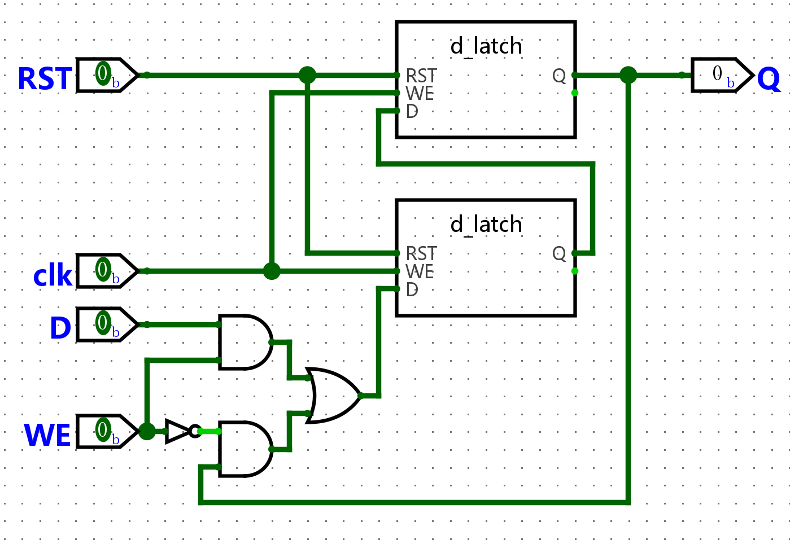
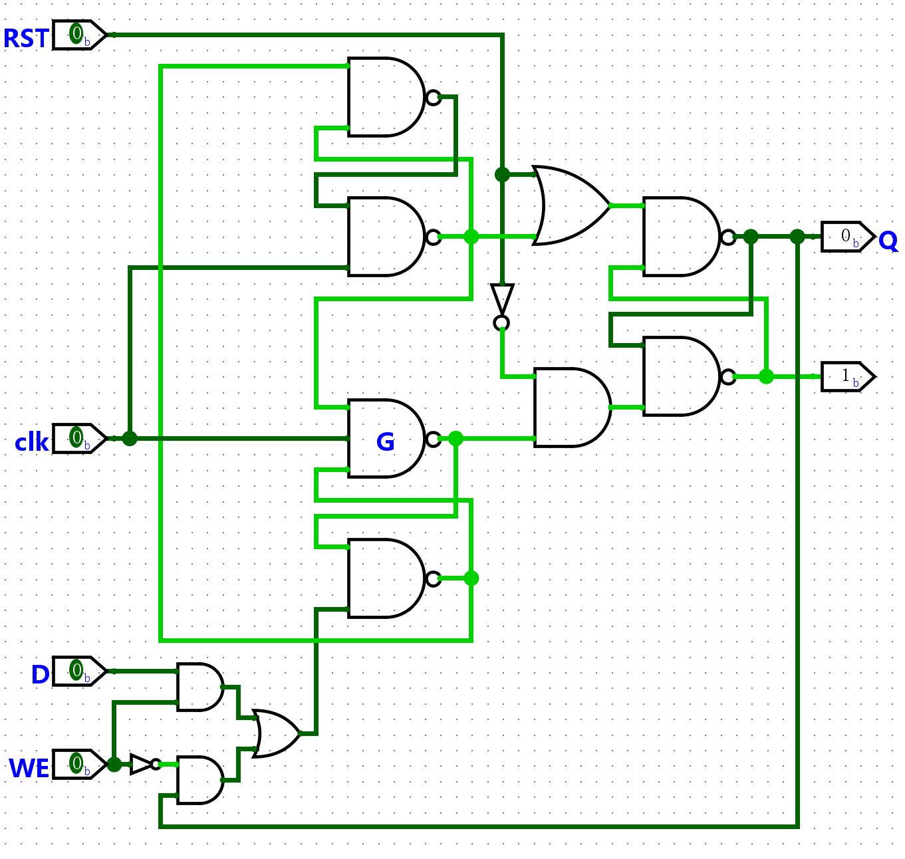
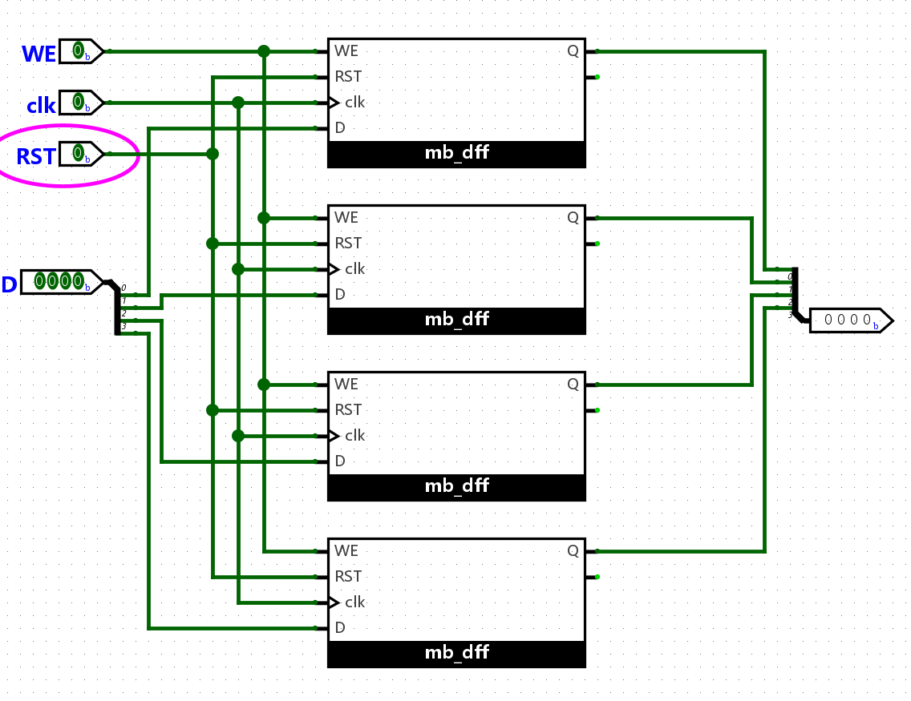
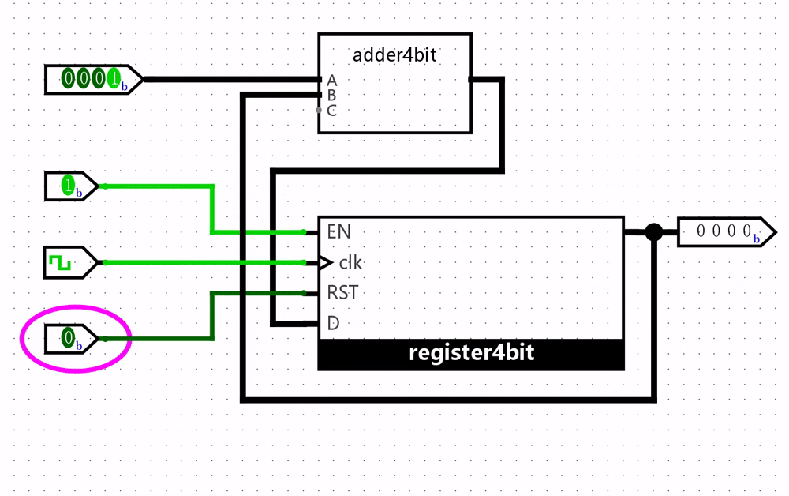
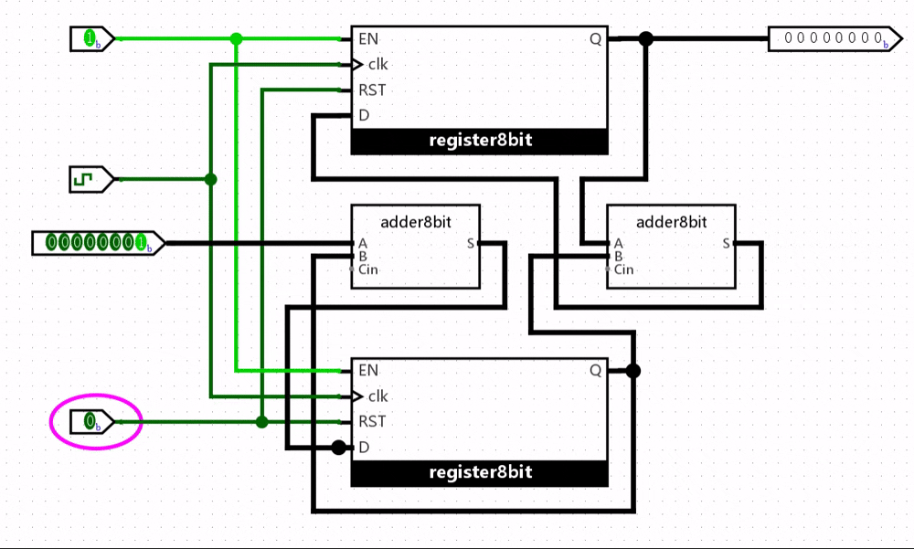
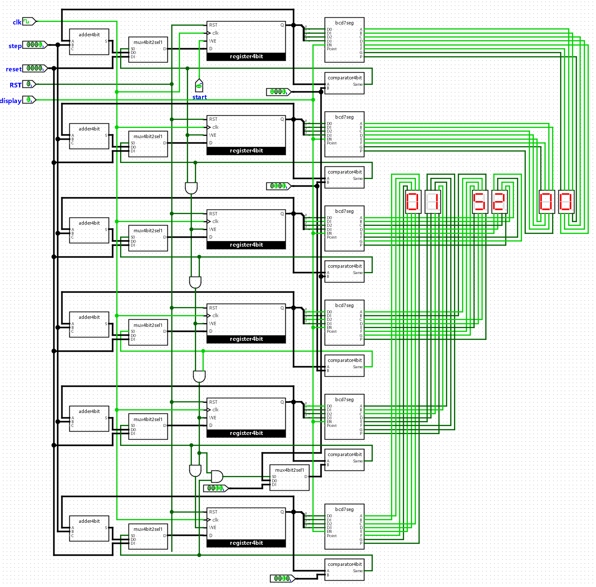
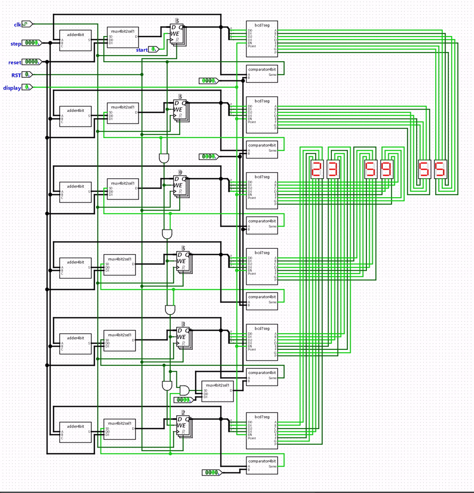

# 时序逻辑电路

> [F3 数字逻辑电路基础 - 时序逻辑电路 | 一生一芯 v24.07 学习讲义](https://ysyx.oscc.cc/docs/2407/f/3.html#%E6%97%B6%E5%BA%8F%E9%80%BB%E8%BE%91%E7%94%B5%E8%B7%AF)

[组合逻辑电路](组合逻辑电路.md)的一个显著特点就是**电路输出完全由当前输入决定**。但在计算机体系结构中，状态机模型使我们常常需要存储和更新某些状态，这就要求我们需要设计一种电路，具备以下特性：

1. 可以读取电路的**旧状态**

2. 可以**更新**电路的状态

具备上述功能的电路称为**时序逻辑电路**（*Sequential Logic Circuit*），其输出由当前输入和电路旧状态共同决定。

## 交叉配对反相器

可以存储状态的最简电路是**交叉配对反相器**（*Cross-Coupled Inverters*）：两个反相器的输出交叉接到对方的输入，形成反馈环。


图中上方反相器输出为 $Q$，下方输出为 $\overline{Q}$。设信号经线网再经反相器传播的总延迟为 $T$，电路行为可分四种情况：

| $Q$ | $\overline{Q}$ | 新 $Q$ | 新 $\overline{Q}$ | 说明 |
|:-:|:-:|:-:|:-:|:-|
| 0 | 0 | 1 | 1 | **亚稳态**（*metastable*）：两态间震荡，无法表示有效信息 |
| 0 | 1 | 0 | 1 | 稳定，存储 `0`（从 $Q$ 读出） |
| 1 | 0 | 1 | 0 | 稳定，存储 `1` |
| 1 | 1 | 0 | 0 | **亚稳态** |

也就是说：当 $Q \neq \overline{Q}$ 时，经过延迟 $T$ 后状态不变——电路能稳定保存 1 bit；当 $Q = \overline{Q}$ 时会反复翻转，设计中必须避免。

!!! info "只能读、不能写"
    交叉配对反相器**没有外部输入**，稳定后无法主动改写状态，实际中几乎不能单独使用。后面的 S-R 锁存器把反相器换成或非门，就是为了补上「可更新」这一环。

## 锁存器

### S-R 锁存器

把交叉配对反相器中的反相器换成**或非门**，就得到 **S-R 锁存器**（*Set-Reset Latch*）：$S$（Set）负责置 `1`，用于置位，$R$（Reset）负责置 `0`，用于复位。


图中当前 $S=1$、$R=0$，故 $Q=1$（置位态）。按输入分四种情况：

| $S$ | $R$ | $Q$ | 说明 |
|:-:|:-:|:-:|:-|
| 0 | 0 | 保持 | 两个或非门退化为反相器，行为与交叉配对反相器相同 |
| 0 | 1 | 0 | **复位**：上方或非门输出恒为 `0`，$Q$ 被清零 |
| 1 | 0 | 1 | **置位**：下方或非门输出恒为 `0`，$Q$ 被置一 |
| 1 | 1 | 禁止 | 两输出皆为 `0`，不是合法存储态 |

!!! warning
    $S=R=1$ 时 $Q=\overline{Q}=0$。若再同时回到 $S=R=0$，等价于让交叉配对反相器从 $Q=\overline{Q}=0$ 启动 → **亚稳态**。Logisim 会报「检测到振荡 / Oscillation apparent」，需要重置仿真。

    

!!! tip "$\overline{S}$-$\overline{R}$ 锁存器"
    把或非门换成与非门同样能做锁存器，但控制端变成低有效：$\overline{S}=\overline{R}=1$ 时保持，$0$ 才置位/复位；禁止输入是 $\overline{S}=\overline{R}=0$。真值表如下：

    | $\overline{S}$ | $\overline{R}$ | $Q$ | 说明 |
    |:-:|:-:|:-:|:-|
    | 0 | 0 | 禁止 | 两输出皆为 `1`，不是合法存储态；回到 `11` 会进亚稳态 |
    | 0 | 1 | 1 | **置位**（$\overline{S}$ 低有效）：对应与非门输出恒为 `1`，$Q$ 被置一 |
    | 1 | 0 | 0 | **复位**（$\overline{R}$ 低有效）：对应与非门输出恒为 `1`，$Q$ 被清零 |
    | 1 | 1 | 保持 | 两个与非门退化为反相器，行为与交叉配对反相器相同 |

    

### D 锁存器

S-R 锁存器有禁止输入 $S=R=1$，在其前面加若干门电路，把 4 种输入**限制成 3 种合法组合**，并引入写使能。这就构成 **D 锁存器**（*D Latch* / *Data Latch*）：$D$ 为数据，$WE$ 为写使能（*Write Enable*）。


图中前置逻辑为：

$$
R = WE \cdot \overline{D},\quad S = WE \cdot D
$$

因此 $S$ 与 $R$ **永不同时为 `1`**（$WE=0$ 时二者皆 `0`；$WE=1$ 时二者互补）。图中当前 $WE=1$、$D=0$，故 $R=1$、$S=0$，$Q=0$。

| $WE$ | $D$ | $S$ | $R$ | $Q$ | 说明 |
|:-:|:-:|:-:|:-:|:-:|:-|
| 0 | X | 0 | 0 | 保持 | 写使能无效，退化为 S-R 保持态 |
| 1 | 0 | 0 | 1 | 0 | 经数据通路写入 `0` |
| 1 | 1 | 1 | 0 | 1 | 经数据通路写入 `1` |

!!! tip "电平触发 / 透明"
    $WE=1$ 时 $Q$ 跟随 $D$ 变化，称为**透明**（*transparent*）；$WE=0$ 时锁住旧值。锁存器是**电平触发**（*level-triggered*）的：使能有效期间，输入变化会立刻传到输出——这既方便，也是后面同步电路要改用边沿触发元件的原因。

!!! note "带 RST 的 D 锁存器"
    $WE$在置0时，Data端无效，无论如何改变D端输入，已经写入的数据都会保持不变：

    

    这时若希望在不依赖写使能的情况下清空锁存器中的数据，就需要实现一个**异步复位**端口：

    | | 用 $D=0$ 写入 | 用 $RST$ 清零 |
    |:-|:-|:-|
    | 含义 | 数据通路写入数值 `0` | 控制通路强制清空 |
    | 条件 | 通常要 $WE=1$，且 $D$ 必须为 `0` | 拉高 $RST$ 即可 |
    | 典型用途 | 正常存数 | 上电初始化、全局清零、异常恢复 |

    在内部 S-R 上令：

    $$
    R' = R + RST,\quad S' = S\cdot\overline{RST}
    $$

    即 $RST=1$ 时强制进入复位态（$R'=1,\,S'=0$），且不会出现 $S'=R'=1$：

    

!!! note "位翻转"
    把 $Q$ 取反接回 $D$，并令 $WE=1$：预期 $Q$ 在 `0`/`1` 间翻转，但会因组合环路立刻震荡（Oscillation apparent）：
    
    
    
    根因正是电平触发——输出一变又立刻改写输入。

## 同步电路与异步电路

复杂系统里常有多个模块要按顺序协作。例如一个加法操作需要各个模块按顺序完成「读数据 → 加法 → 写回」三步，同时保证*读完才能算，算完才能写*。

这就需要实现**同步关系**：让事件 A 发生在事件 B 之后。和操作系统中[进程同步](../操作系统/408/同步与互斥.md#同步)的概念类似。

支撑这种关系的机制大体有两类：

### 同步电路

**同步电路**（*Synchronous Circuit*）靠**全局周期性时钟**（*clock*）统一节拍。时钟在高低电平间翻转；一次高 + 一次低构成一个**周期**。关心的时刻主要是边沿：

- **正边沿 / 上升沿**（*positive edge*）：低 → 高  

- **负边沿 / 下降沿**（*negative edge*）：高 → 低  

```text
clk（理想方波，边沿瞬时翻转）

    ↑ 上升沿                 ↓ 下降沿
    |                       |
    +-------+       +-------+       +-------+
    |       |       |       |       |       |
----+       +-------+       +-------+       +---
    |←—— 一个周期 ——→|
```

上面的时钟信号示意是*理想状态*下的，实际的信号在翻转电平时会有一定的**时延** $t_r$（*rise time*，低→高）与 $t_f$（*fall time*，高→低），边沿呈斜坡而非垂直跳变：

```text
clk（实际，含翻转时延）

    ↑ 上升沿                     ↓ 下降沿
    |                           |
    +-------+           +-------+           +-------+
   /         \         /         \         /         \
--+           +-------+           +-------+           +---
```

存储元件**仅在指定边沿**写入，并在后续周期内稳定读出。于是可以把「读 / 算 / 写」拆到不同时钟周期，由边沿保证先后顺序。

!!! warning "电平触发与边沿触发"
    上面提到，锁存器是**电平触发**：$Q$ 的输出变化取决于$WE$和$D$的输入，不取决于时钟信号的变化：

    
    
    这样无法保证同步电路「只在边沿采样、随后周期稳定保持」。
    
    在同步电路中，我们需要一种**只有在时钟信号变化时才将输入传播到输出端的存储元件**，我们称其为**边沿触发**（*edge-triggered*）元件。下面提到的[D 触发器](#D-触发器)就是一种边沿触发的存储元件。

### 异步电路

**异步电路**（*Asynchronous Circuit*）不用全局时钟，而靠模块间的**局部握手 / 通信信号**约定「你做完了我再做」。

| | 同步电路 | 异步电路 |
|:-|:-|:-|
| 同步手段 | 全局时钟边沿 | 局部通信信号 |
| 设计与分析 | 相对简单，时序边界清晰 | 更复杂，易出竞态 |
| 功耗 | 时钟一直翻转，通常更高 | 可按需活动，潜力更低 |
| 业界现状 | **主流** | 特定低功耗 / 高速场景 |

## D 触发器

**D 触发器**（*D Flip-Flop*）是一种边沿触发的存储元件，基于锁存器搭建。其由两个 D 锁存器组成，一个用于采样输入，一个用于输出，可在时钟信号维持电平时阻塞输入信号的传播。

D触发器有多种实现方式，最常见的由两个D锁存器组成的触发器叫做**主从式D触发器**（*Master-Slave D Flip-Flop*）：

### 主从式D触发器


图中**下方**为**主锁存器**（*master*），**上方**为**从锁存器**（*slave*）。数据串行穿过二者：输入 $D$ → 主锁存器 → 从锁存器 → 输出 $Q$。时钟接法为：

$$
WE_{\text{主}} = \overline{\textit{clk}},\quad WE_{\text{从}} = \textit{clk}
$$

二者**永远一开一关**：任一时刻最多只有一级透明，输入 $D$ 无法直通到输出 $Q$。整体因此表现为**上升沿触发**：


工作过程分三阶段：

1. **数据准备**（$\textit{clk}=0$）  

    主锁存器 $WE=1$，透明，跟随外部 $D$；从锁存器 $WE=0$，锁住旧值。外部 $Q$ **不变**，$D$ 的变化只进入主锁存器。

2. **采样**（$\textit{clk}$ 上升沿 $0\to 1$）  

    主锁存器 $WE$ 变为 `0`，把边沿到来前的 $D$ **锁住**；同时从锁存器的 $WE$ 变为 `1`，把主锁存器里刚锁住的值传到 $Q$。这是整个触发器**唯一改写输出**的瞬间。

3. **维持**（$\textit{clk}=1$）  

    主锁存器保持关闭，后续 $D$ 变化进不来；从锁存器虽透明，但输入（主锁存器的 $Q$）已冻结，故外部 $Q$ 在整个高电平期间保持稳定。

| $\textit{clk}$ | 主 $WE$ | 从 $WE$ | 主锁存器 | 从锁存器 / 外部 $Q$ |
|:-:|:-:|:-:|:-|:-|
| 0 | 1 | 0 | 透明，跟随 $D$ | 保持 |
| $0\to 1$ | $1\to 0$ | $0\to 1$ | 锁住边沿前的 $D$ | 透明，输出被更新 |
| 1 | 0 | 1 | 保持 | 透明但输入不变，$Q$ 稳定 |

!!! note "主从式D触发器边缘触发的工作原理"
    单个 D 锁存器在 $WE=1$ 的整段时间里 $Q$ 都跟着 $D$ 跑。主从结构用两级「错开使能」把这条通路掐断：高电平时主关、低电平时从关，只在边沿交接的那一下把数据递出去。

!!! example "带复位功能的D触发器"
    先前在搭建D锁存器时，就已经实现了带复位功能的D锁存器。因此现在只需要添加一个 $RST$ 端口，将其连接到主从D锁存器上的 $RST$ 端口即可：
    
    

!!! example "位翻转"
    相比较D锁存器，由于D触发器是边沿触发的，只有在时钟信号翻转时才会将输入传播到输出，不像D锁存器那样输入会直接反馈到输出上，因此不会产生震荡现象：

    

!!! example "下降沿触发的D触发器"
    把非门改接到从锁存器（即 $WE_{\text{主}}=\textit{clk}$，$WE_{\text{从}}=\overline{\textit{clk}}$），这时采样发生在下降沿，其余原理相同：

    

!!! info "写使能"
    实际应用中，我们通常不希望每个时钟沿都改写 $Q$。给 D 触发器加一个**写使能**（*Write Enable*，$WE$ / $EN$）：时钟照常接，$\textit{clk}$ 边沿到了之后还要看 $WE$ 才决定写不写。

    | $WE$ | 时钟沿到来时 | 存储的值 | 对外 $Q$ |
    |:-:|:--|:--|:--|
    | 1 | 写入 $D$ | 变为 $D$ | 新值 |
    | 0 | **不写** | 旧值不动 | **仍是旧值，照样有效** |

    这和三态门 / 七段译码器的输出使能不是一回事：后者 $EN=0$ 时对外变成 0（或高阻）；写使能 $WE=0$ 时 $Q$ **继续输出**刚才存的数。

    正确接法是在 $D$ 端做保持（数据回绕），而不是去掐时钟、也不是去挡输出。用 2 选 1（与或非即可）令真正送进触发器核的数据为：

    $$
    D_{\text{实际}} = WE\cdot D + \overline{WE}\cdot Q
    $$

    $WE=1$ 选外部 $D$；$WE=0$ 把当前 $Q$ 写回自己。每个沿都采样，使能为 0 时采到的仍是旧值，所以状态保持。图中 $WE$、$D$ 与反馈回来的 $Q$ 先进入这组组合逻辑，再进主锁存器的 $D$：

    

    $RST$ 仍走异步清零，不要和 $WE$ 绑在一起。维持-阻塞式同样把这只 2 选 1 加在核的 $D$ 前面，$Q$ 从输出锁存器直接引出。

    !!! warning "两种常见接错"
        **当成输出使能**：$Q_{\text{对外}} = Q_{\text{内部}}\cdot WE$。$WE=0$ 时对外被抹成 0，内部触发器却每个沿照样采样 $D$。计数器的进位若接到这种端口：低位还没到 9 时高位对外是 0、内部已在累加；一到 9，$WE$ 拉高，内部攒着的 1 突然露出来，显示会从 `0008` 直接跳到 `0019`。

        **去门控时钟**：$\textit{clk}_{\text{eff}} = \textit{clk}\cdot WE$。看起来「没有使能就没有边沿」，但 $WE$ 若由当前 $Q$ 组合出来（例如 $WE=(Q=9)$），会在**已经过了上升沿、时钟仍为高**时才变 1，等于在高电平中途再造一次上升沿：

        ```text
        clk     ____/‾‾‾‾‾‾‾‾\____
        Q       8 → 9（就在这个上升沿）
        WE      ________/‾‾‾‾‾‾     ← 组合逻辑，边沿之后才变 1
        clk·WE  ________/‾‾‾‾       ← 假边沿，高位被多打一拍
        ```

        同步电路里「这一拍要不要变」必须走数据通路（上面的 $D_{\text{实际}}$），时钟只负责统一节拍。

    !!! tip "和锁存器 $WE$ 的差别"
        锁存器的 $WE$ 是电平触发：为 1 的整段时间里 $Q$ 跟着 $D$ 跑。触发器的写使能挂在边沿上：为 0 时该沿不更新，为 1 时**仅在边沿**写入；$WE$ 在高电平中途变化不会立刻改 $Q$。

### 维持-阻塞式D触发器

除了主从式，D触发器还有一种常见模型称为**维持-阻塞式 D 触发器**（*Maintain-Blocking D Flip-Flop*），也称边沿触发 D 触发器。



#### 结构概览

典型结构由 **6 个与非门**组成（图中左侧 4 个负责采样与阻塞，右侧 2 个组成输出端的 $\overline{S}$-$\overline{R}$ 锁存器）。可按功能拆成三块：

1. **输入准备级**：在 $\textit{clk}=0$ 时接收 $D$，预先生成置 `0` / 置 `1` 所需的互补控制。

2. **时钟开门级**：$\textit{clk}$ 接到两路与非门；仅在上升沿附近把准备好的控制送到输出锁存器。

3. **输出锁存器**：交叉配对与非门，保存并输出 $Q$、$\overline{Q}$。

实现关键是几条**反馈线**：

| 反馈线 | 作用 |
|:-|:-|
| **置 0 维持线** | 一旦决定写入 `0`，在 $\textit{clk}=1$ 期间维持该决定 |
| **置 1 阻塞线** | 同时阻止再变成 `1` |
| **置 1 维持线** | 一旦决定写入 `1`，维持该决定 |
| **置 0 阻塞线** | 同时阻止再变成 `0` |

#### 工作过程

1. **接收**（$\textit{clk}=0$）  
    时钟相关与非门被封锁，输出锁存器保持旧值。输入级打开，$D$ 被读入并准备好下一次边沿要用的置位/复位控制。此时 $Q$ **不变**。

2. **翻转**（$\textit{clk}$：$0\to 1$）  
    时钟门打开，把边沿到来瞬间的控制送到输出锁存器 → $Q\leftarrow D$。这是改写输出的时刻。

3. **封锁**（$\textit{clk}=1$）  
    翻转完成后，维持 / 阻塞反馈立刻生效：$D$ 通往输出锁存器的路径被掐断。此后整段高电平里，$D$ 再怎么变都进不来，$Q$ 保持边沿采样值。

**边沿前接收，边沿时翻转，边沿后封锁。**

| | 主从式 | 维持-阻塞式 |
|:-|:-|:-|
| 采样窗口 | 整个半周期（如 $\textit{clk}=0$ 时主锁存器一直透明） | 主要卡在上升沿附近 |
| $D$ 受干扰的时间 | 半个时钟周期内的毛刺都可能被主锁存器吃进 | 边沿一过即封锁，脆弱窗口极短 |
| 对 $D$ 的要求 | 半周期内最好别乱跳 | 只需在边沿前满足较短的建立时间（约 $2\,t_{pd}$ 量级），之后可立即变化 |

!!! tip "为何对输入的限制更宽松？"
    主从式的主锁存器在半个周期里对 $D$ **持续透明**。其对输入的限制更严，指的就是这段窗口里 $D$ 不能乱动。维持-阻塞式用反馈线在边沿后立刻锁死输入通路，所以：

    - **抗干扰更好**：高电平期间的毛刺很难再改变已采到的值；

    - **建立/保持约束更短**：允许 $D$ 更晚才稳定、边沿后更早就能变，时序上更「宽松」。

    这也是同工艺下，边沿型（维持-阻塞）往往比主从式更快、更稳的原因。

## 寄存器

每个D触发器能存储一位二进制数据，把 $n$ 个D触发器组合在一起，共享一个时钟信号和写使能，就构成了一个 $n$ 位寄存器（*Register*）。这里的 $EN$ / $WE$ 必须是上面那种「这一拍写不写」，不能做成输出与门。

例如下面是一个携带复位功能的4位寄存器：



### 寄存器的应用

有了寄存器用来暂存数据，我们可以实现很多有意思的电路。

#### 计数器

基于寄存器和组合电路里的[加法器](组合逻辑电路.md#加法器)，可以实现一个**计数器**（*counter*）：每个时钟边沿到来时，寄存器里的值加 `1`；加到全 `1` 后再翻回 `0`（自然溢出回绕）。

计数器要做的事可以写成一行状态转移：

$$
Q_{t+1} = (Q_t + 1) \bmod 2^n
$$

拆成「存」和「算」两块，正好对应寄存器与加法器：

1. **状态存放**：用 $n$ 位寄存器保存当前计数值 $Q$。

2. **下一状态计算**：把 $Q$ 接到加法器的一个输入，另一个输入接常数 `1`，得到 $Q+1$。

3. **反馈写回**：加法器的和接到寄存器的数据输入 $D$。每个时钟上升沿时 $Q \leftarrow Q+1$。

4. **回绕**：加法器按模 $2^n$ 运算，无需额外逻辑。

这就是时序电路的经典套路：

<div class="text-center-container" style="text-align: center;">
    <strong>寄存器存状态 + 组合逻辑算下一状态 + 反馈闭环</strong>
</div>

!!! tip "和位翻转的关系"
    前面把 $\overline{Q}$ 接回 $D$ 的一位翻转，其实就是「下一状态 = 当前取反」。计数器只是把「取反」换成了「加一」——同一个反馈结构，换一块组合逻辑。

下面是一个4位计数器的实现：



#### 数列求和电路

这个初见或许会觉得有难度，但实际上只要明确等差数列求和过程的程序本质，就可以很容易地实现这个电路。

依然是拆成「存」和「算」。求 $1+2+\cdots+n$ 的程序本质只有两个变量、每步做两件事：

1. **存当前项** $i$：等差数列正加到哪一项（对应计数器寄存器）

2. **存部分和** $s$：已经累加过的结果（对应累加寄存器）

3. **算新的和**：$s \leftarrow s + i$

4. **算下一项**：$i \leftarrow i + 1$

用伪代码来表示则更为清晰：

```python
i = 0          # 当前项
s = 0          # 部分和
while True:    # 每个时钟上升沿执行一次
    s = s + i  # 先用旧的 i 累加
    i = i + 1  # 再准备下一项
```

硬件里这两句是**同一拍并行**完成的：两个寄存器同时采样当前的 $D$，加法器用的都是边沿前的旧 $i$、$s$，不会用到「已经加一后的 $i$」。所以软件里必须先 `s = s + i` 再 `i = i + 1`，顺序反了就会变成 $s \leftarrow s+(i+1)$，和电路不一致。

从 $i=0$ 起加不影响结果（$0$ 是加法单位元）。要得到 $1+2+\cdots+10=55$，让电路跑到 $i$ 经过 `0..10` 即可。

因此只需在计数器上再加一块「累加」：一个加法器把计数器输出的当前项加进部分和，一个寄存器把新的和存下来并输出。

下面是一个8位等差数列求和电路的实现：



!!! info
    上面的示意图只展示了 $1 + 2 + \cdots + 10$ 的求和过程。但由于实现的数据位宽为 $8$ 位，实际这个求和电路最多可以支持 $1 + 2 + \cdots + 15$ 的无损求和。

#### 电子时钟

基于用寄存器和七段数码管，可以实现带「时」「分」「秒」的电子时钟。从状态表到门级的完整设计流程见[同步时序逻辑电路设计原理](同步时序逻辑电路设计原理.md)。

核心不是做一个很大的二进制计数器，而是 **六个十进制数位 + 逢限进位**，再接到已有的 [BCD 七段译码器](组合逻辑电路.md#BCD译码器) 上显示 `HH:MM:SS`（24 小时制，$00{:}00{:}00\!\sim\!23{:}59{:}59$）。

##### 程序抽象

人读的是 `HH:MM:SS`，每位都是十进制。秒、分是 **60 进制**（个位模 10，十位模 6）；时是 **24 进制**（个位在 $0\!\sim\!1$ 点时模 10，在 2 点时只计到 3）：

```python
s1, s10 = 0, 0   # 秒个位 0–9，秒十位 0–5
m1, m10 = 0, 0   # 分个位 0–9，分十位 0–5
h1, h10 = 0, 0   # 时个位 0–9（20–23 时只到 3），时十位 0–2

while True:      # 每个时钟上升沿 = 走过 1 秒
    s1 += 1
    if s1 == 10:
        s1 = 0
        s10 += 1
        if s10 == 6:
            s10 = 0
            m1 += 1
            if m1 == 10:
                m1 = 0
                m10 += 1
                if m10 == 6:
                    m10 = 0
                    h1 += 1
                    if h10 == 2 and h1 == 4:  # 23 + 1 → 24 → 00
                        h1, h10 = 0, 0
                    elif h1 == 10:            # 09 → 10，19 → 20
                        h1 = 0
                        h10 += 1
```

##### 电路结构

六个 **带使能、带回绕的计数器**，共用同一个 $\textit{clk}$（同步级联——用进位当**下一级使能**，不要用前级溢出去当下一级的时钟）：

| 数位 | 寄存器 | 模 $N$ | $Q_{\max}$ |
|:-|:-|:-:|:-:|
| 秒个 $s1$ | 4 bit | 10 | 9 |
| 秒十 $s10$ | 4 bit | 6 | 5 |
| 分个 $m1$ | 4 bit | 10 | 9 |
| 分十 $m10$ | 4 bit | 6 | 5 |
| 时个 $h1$ | 4 bit | 10 或 4 | 9（$h10\neq 2$）/ 3（$h10=2$） |
| 时十 $h10$ | 4 bit | 3 | 2 |



秒、分、时十位的下一状态与进位仍是：

$$
D =
\begin{cases}
0 & Q = Q_{\max} \\
Q+1 & \text{否则}
\end{cases}
\qquad
\textit{cout} = EN \land (Q = Q_{\max})
$$

时个位的回绕条件多一条——不能无条件模 10，否则 `23:59:59` 会变成 `24:00:00`：

$$
(h1\text{ 回绕}) = (h1=9) \lor \bigl((h1=3)\land(h10=2)\bigr)
$$

$EN$ 决定这一拍要不要加，接到的是寄存器的写使能（不是输出使能，也不是下一级的时钟）；$\textit{cout}$ 接到下一级的 $WE$：

- 秒个：$WE=1$（每个时钟都加）

- 秒十：$WE = (s1=9)$

- 分个：$WE = (s1=9)\land(s10=5)$

- 分十：$WE = (s1=9)\land(s10=5)\land(m1=9)$

- 时个：$WE = (s1=9)\land(s10=5)\land(m1=9)\land(m10=5)$

- 时十：$WE = h1.\textit{cout}$，即上一式再与 $(h1\text{ 回绕})$

比较器用组合逻辑即可（例如 $Q=9$ 即 $Q_3=Q_0=1$ 且 $Q_2=Q_1=0$；$Q=3$ 即 $Q_1=Q_0=1$ 且 $Q_3=Q_2=0$）。回绕用 2 选 1：比较为真选常数 `0`，否则选加法器输出。时个位的 `sel` 用上面的「回绕」或项，不要只比 9。

显示是纯组合。每位 $Q$ → BCD 七段译码 → 一只数码管，六位并排就是 `HH:MM:SS`。六个寄存器共用 $RST$ 即可归零。



Logisim 里用 `Wiring → Clock` 当秒脉冲；仿真时可以把频率调快便于核对。重点核对 `00:00:59 → 00:01:00`、`00:59:59 → 01:00:00`、`09:59:59 → 10:00:00`、`19:59:59 → 20:00:00`、`23:59:59 → 00:00:00`。

!!! tip "和计数器的关系"
    简单来说，电子时钟的本质就是将**多个计数器级联**，每个计数器负责一个时间单位，并且通过进位信号来控制下一级计数器的使能。

    [前面的计数器](#计数器)是「无条件 $+1$、模 $2^n$ 溢出」，基于二进制计数的特点，这无需额外的组合电路逻辑。钟表只是把下一状态组合逻辑换成 **模 10 / 模 6 / 模 24，并用进位打开下一级**；寄存器仍只负责存。时个位的 $Q_{\max}$ 依赖时十位，是同一套路里唯一需要「看邻居」的回绕。
