# 时序逻辑电路

> [F3 数字逻辑电路基础 - 时序逻辑电路 | 一生一芯 v24.07 学习讲义](https://ysyx.oscc.cc/docs/2407/f/3.html#%E6%97%B6%E5%BA%8F%E9%80%BB%E8%BE%91%E7%94%B5%E8%B7%AF)

[组合逻辑电路](组合逻辑电路.md)的一个显著特点就是**电路输出完全由当前输入决定**。但在计算机体系结构中，状态机模型使我们常常需要存储和更新某些状态，这就要求我们需要设计一种电路，具备以下特性：

1. 可以读取电路的**旧状态**

2. 可以**更新**电路的状态

具备上述功能的电路称为**时序逻辑电路**（*Sequential Logic Circuit*），其输出由当前输入和电路旧状态共同决定。

## 交叉配对反相器

可以存储状态的最简电路是**交叉配对反相器**（*Cross-Coupled Inverters*）：两个反相器的输出交叉接到对方的输入，形成反馈环。

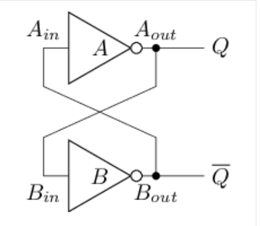

图中上方反相器输出为 $Q$，下方输出为 $\overline{Q}$。设信号经线网再经反相器传播的总延迟为 $T$，电路行为可分四种情况：

| $Q$ | $\overline{Q}$ | 新 $Q$ | 新 $\overline{Q}$ | 说明 |
|:-:|:-:|:-:|:-:|:-|
| 0 | 0 | 1 | 1 | **亚稳态**（*metastable*）：两态间震荡，无法表示有效信息 |
| 0 | 1 | 0 | 1 | 稳定，存储 `0`（从 $Q$ 读出） |
| 1 | 0 | 1 | 0 | 稳定，存储 `1` |
| 1 | 1 | 0 | 0 | **亚稳态** |

也就是说：当 $Q \neq \overline{Q}$ 时，经过延迟 $T$ 后状态不变——电路能稳定保存 1 bit；当 $Q = \overline{Q}$ 时会反复翻转，设计中必须避免。

!!! info "只能读、不能写"
    交叉配对反相器**没有外部输入**，稳定后无法主动改写状态，实际中几乎不能单独使用。后面的 S-R 锁存器把反相器换成或非门，就是为了补上「可更新」这一环。

## 锁存器

### S-R 锁存器

把交叉配对反相器中的反相器换成**或非门**，就得到 **S-R 锁存器**（*Set-Reset Latch*）：$S$（Set）负责置 `1`，用于置位，$R$（Reset）负责置 `0`，用于复位。

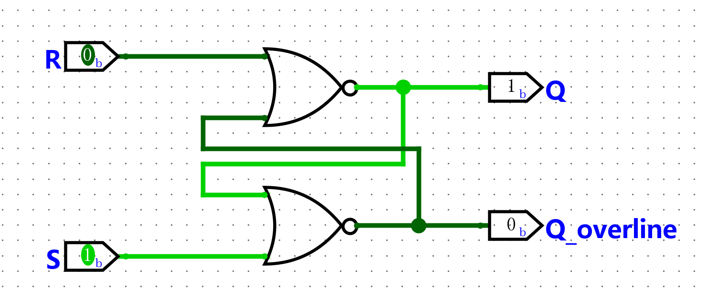

图中当前 $S=1$、$R=0$，故 $Q=1$（置位态）。按输入分四种情况：

| $S$ | $R$ | $Q$ | 说明 |
|:-:|:-:|:-:|:-|
| 0 | 0 | 保持 | 两个或非门退化为反相器，行为与交叉配对反相器相同 |
| 0 | 1 | 0 | **复位**：上方或非门输出恒为 `0`，$Q$ 被清零 |
| 1 | 0 | 1 | **置位**：下方或非门输出恒为 `0`，$Q$ 被置一 |
| 1 | 1 | 禁止 | 两输出皆为 `0`，不是合法存储态 |

!!! warning
    $S=R=1$ 时 $Q=\overline{Q}=0$。若再同时回到 $S=R=0$，等价于让交叉配对反相器从 $Q=\overline{Q}=0$ 启动 → **亚稳态**。Logisim 会报「检测到振荡 / Oscillation apparent」，需要重置仿真。

    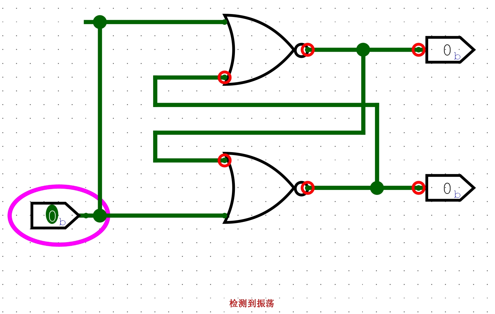

!!! tip "$\overline{S}$-$\overline{R}$ 锁存器"
    把或非门换成与非门同样能做锁存器，但控制端变成低有效：$\overline{S}=\overline{R}=1$ 时保持，$0$ 才置位/复位；禁止输入是 $\overline{S}=\overline{R}=0$。真值表如下：

    | $\overline{S}$ | $\overline{R}$ | $Q$ | 说明 |
    |:-:|:-:|:-:|:-|
    | 0 | 0 | 禁止 | 两输出皆为 `1`，不是合法存储态；回到 `11` 会进亚稳态 |
    | 0 | 1 | 1 | **置位**（$\overline{S}$ 低有效）：对应与非门输出恒为 `1`，$Q$ 被置一 |
    | 1 | 0 | 0 | **复位**（$\overline{R}$ 低有效）：对应与非门输出恒为 `1`，$Q$ 被清零 |
    | 1 | 1 | 保持 | 两个与非门退化为反相器，行为与交叉配对反相器相同 |

    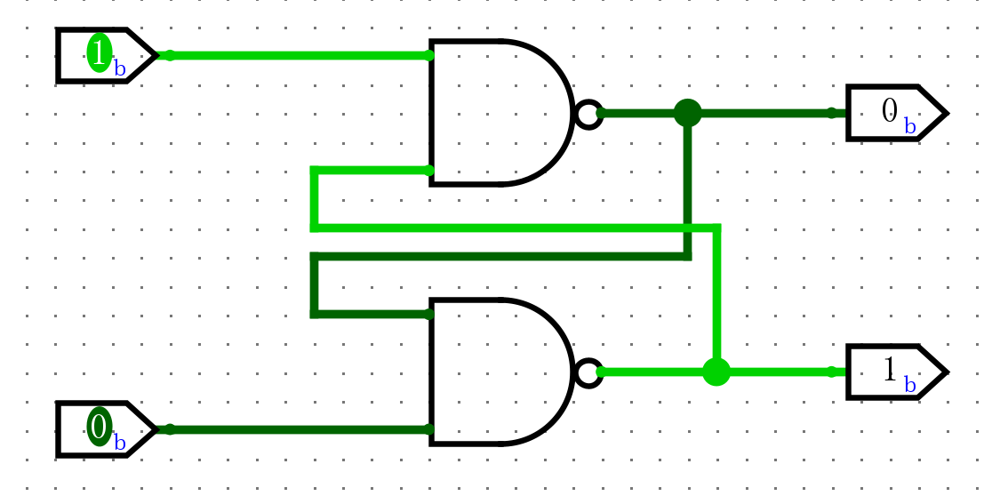

### D 锁存器

S-R 锁存器有禁止输入 $S=R=1$，在其前面加若干门电路，把 4 种输入**限制成 3 种合法组合**，并引入写使能。这就构成 **D 锁存器**（*D Latch* / *Data Latch*）：$D$ 为数据，$WE$ 为写使能（*Write Enable*）。

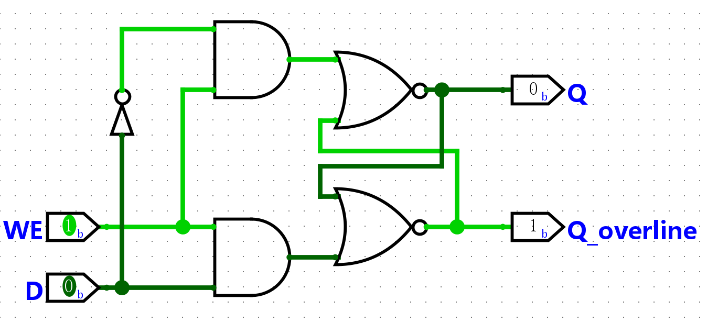

图中前置逻辑为：

$$
R = WE \cdot \overline{D},\quad S = WE \cdot D
$$

因此 $S$ 与 $R$ **永不同时为 `1`**（$WE=0$ 时二者皆 `0`；$WE=1$ 时二者互补）。图中当前 $WE=1$、$D=0$，故 $R=1$、$S=0$，$Q=0$。

| $WE$ | $D$ | $S$ | $R$ | $Q$ | 说明 |
|:-:|:-:|:-:|:-:|:-:|:-|
| 0 | X | 0 | 0 | 保持 | 写使能无效，退化为 S-R 保持态 |
| 1 | 0 | 0 | 1 | 0 | 经数据通路写入 `0` |
| 1 | 1 | 1 | 0 | 1 | 经数据通路写入 `1` |

!!! tip "电平触发 / 透明"
    $WE=1$ 时 $Q$ 跟随 $D$ 变化，称为**透明**（*transparent*）；$WE=0$ 时锁住旧值。锁存器是**电平触发**（*level-triggered*）的：使能有效期间，输入变化会立刻传到输出——这既方便，也是后面同步电路要改用边沿触发元件的原因。

!!! note "带 RST 的 D 锁存器"
    $WE$在置0时，Data端无效，无论如何改变D端输入，已经写入的数据都会保持不变：

    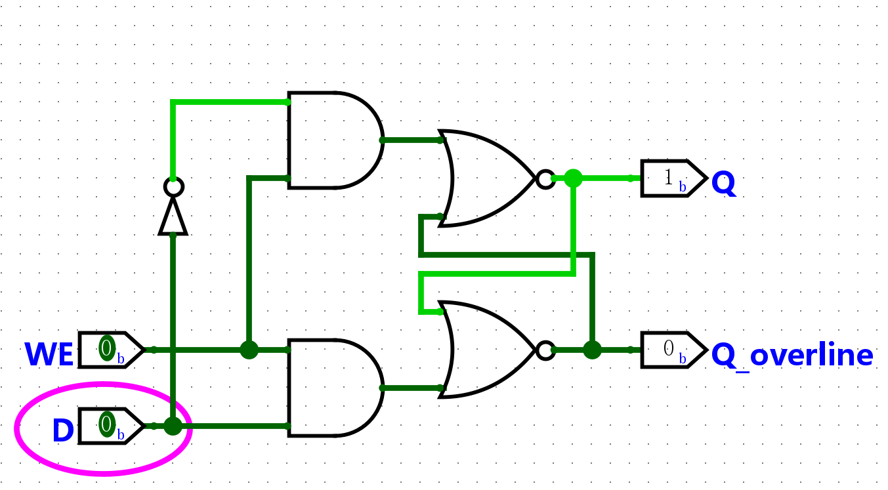

    这时若希望在不依赖写使能的情况下清空锁存器中的数据，就需要实现一个**异步复位**端口：

    | | 用 $D=0$ 写入 | 用 $RST$ 清零 |
    |:-|:-|:-|
    | 含义 | 数据通路写入数值 `0` | 控制通路强制清空 |
    | 条件 | 通常要 $WE=1$，且 $D$ 必须为 `0` | 拉高 $RST$ 即可 |
    | 典型用途 | 正常存数 | 上电初始化、全局清零、异常恢复 |

    在内部 S-R 上令：

    $$
    R' = R + RST,\quad S' = S\cdot\overline{RST}
    $$

    即 $RST=1$ 时强制进入复位态（$R'=1,\,S'=0$），且不会出现 $S'=R'=1$：

    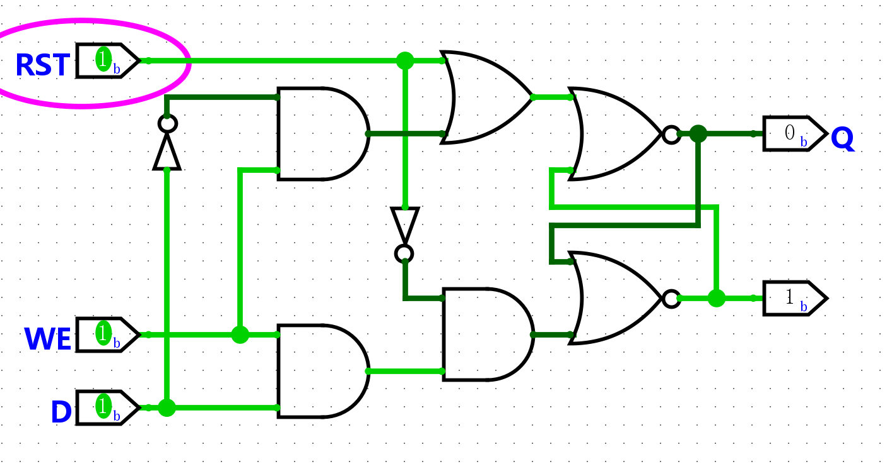

!!! note "位翻转"
    把 $Q$ 取反接回 $D$，并令 $WE=1$：预期 $Q$ 在 `0`/`1` 间翻转，但会因组合环路立刻震荡（Oscillation apparent）：
    
    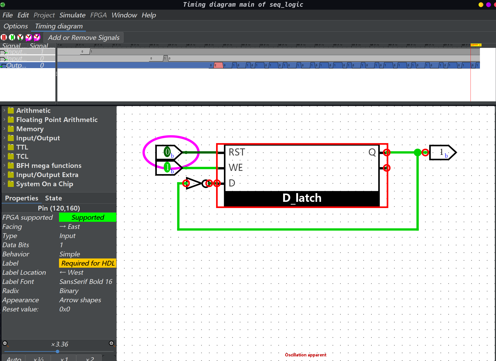
    
    根因正是电平触发——输出一变又立刻改写输入。

## 同步电路与异步电路

复杂系统里常有多个模块要按顺序协作。例如一个加法操作需要各个模块按顺序完成「读数据 → 加法 → 写回」三步，同时保证*读完才能算，算完才能写*。

这就需要实现**同步关系**：让事件 A 发生在事件 B 之后。和操作系统中[进程同步](../操作系统/408/同步与互斥.md#同步)的概念类似。

支撑这种关系的机制大体有两类：

### 同步电路

**同步电路**（*Synchronous Circuit*）靠**全局周期性时钟**（*clock*）统一节拍。时钟在高低电平间翻转；一次高 + 一次低构成一个**周期**。关心的时刻主要是边沿：

- **正边沿 / 上升沿**（*positive edge*）：低 → 高  

- **负边沿 / 下降沿**（*negative edge*）：高 → 低  

```text
clk（理想方波，边沿瞬时翻转）

    ↑ 上升沿                 ↓ 下降沿
    |                       |
    +-------+       +-------+       +-------+
    |       |       |       |       |       |
----+       +-------+       +-------+       +---
    |←—— 一个周期 ——→|
```

上面的时钟信号示意是*理想状态*下的，实际的信号在翻转电平时会有一定的**时延** $t_r$（*rise time*，低→高）与 $t_f$（*fall time*，高→低），边沿呈斜坡而非垂直跳变：

```text
clk（实际，含翻转时延）

    ↑ 上升沿                     ↓ 下降沿
    |                           |
    +-------+           +-------+           +-------+
   /         \         /         \         /         \
--+           +-------+           +-------+           +---
```

存储元件**仅在指定边沿**写入，并在后续周期内稳定读出。于是可以把「读 / 算 / 写」拆到不同时钟周期，由边沿保证先后顺序。

!!! warning "电平触发与边沿触发"
    上面提到，锁存器是**电平触发**：$Q$ 的输出变化取决于$WE$和$D$的输入，不取决于时钟信号的变化：

    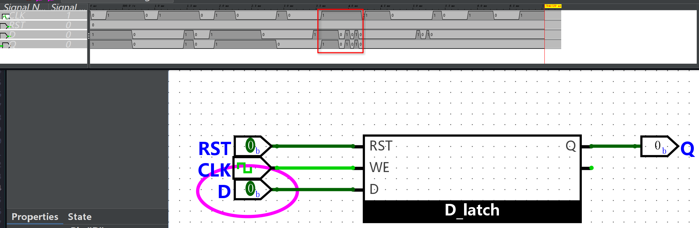
    
    这样无法保证同步电路「只在边沿采样、随后周期稳定保持」。
    
    在同步电路中，我们需要一种**只有在时钟信号变化时才将输入传播到输出端的存储元件**，我们称其为**边沿触发**（*edge-triggered*）元件。下面提到的[D 触发器](#D-触发器)就是一种边沿触发的存储元件。

### 异步电路

**异步电路**（*Asynchronous Circuit*）不用全局时钟，而靠模块间的**局部握手 / 通信信号**约定「你做完了我再做」。

| | 同步电路 | 异步电路 |
|:-|:-|:-|
| 同步手段 | 全局时钟边沿 | 局部通信信号 |
| 设计与分析 | 相对简单，时序边界清晰 | 更复杂，易出竞态 |
| 功耗 | 时钟一直翻转，通常更高 | 可按需活动，潜力更低 |
| 业界现状 | **主流** | 特定低功耗 / 高速场景 |

## D 触发器

**D 触发器**（*D Flip-Flop*）是一种边沿触发的存储元件，基于锁存器搭建。其由两个 D 锁存器组成，一个用于采样输入，一个用于输出，可在时钟信号维持电平时阻塞输入信号的传播。

D触发器有多种实现方式，最常见的由两个D锁存器组成的触发器叫做**主从式D触发器**（*Master-Slave D Flip-Flop*）：

### 主从式D触发器

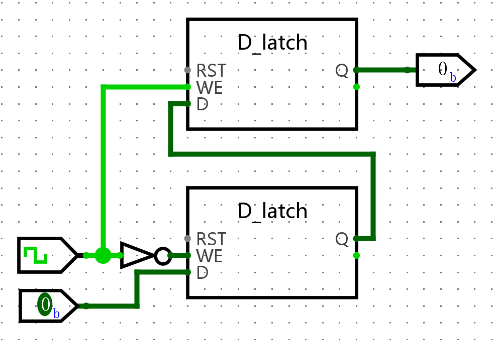

图中**下方**为**主锁存器**（*master*），**上方**为**从锁存器**（*slave*）。数据串行穿过二者：输入 $D$ → 主锁存器 → 从锁存器 → 输出 $Q$。时钟接法为：

$$
WE_{\text{主}} = \overline{\textit{clk}},\quad WE_{\text{从}} = \textit{clk}
$$

二者**永远一开一关**：任一时刻最多只有一级透明，输入 $D$ 无法直通到输出 $Q$。整体因此表现为**上升沿触发**：

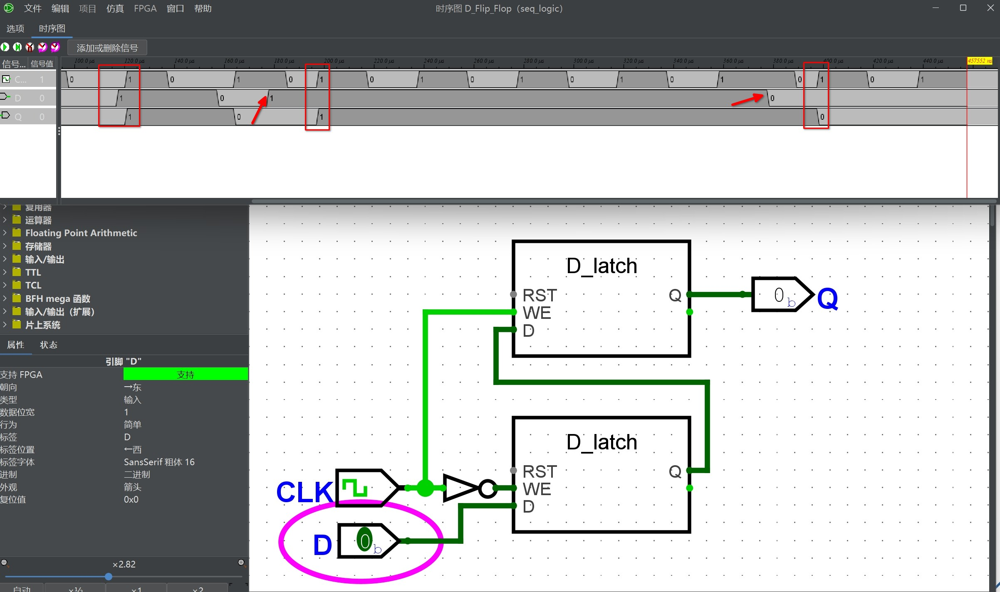

工作过程分三阶段：

1. **数据准备**（$\textit{clk}=0$）  

   主锁存器 $WE=1$，透明，跟随外部 $D$；从锁存器 $WE=0$，锁住旧值。外部 $Q$ **不变**，$D$ 的变化只进入主锁存器。

2. **采样**（$\textit{clk}$ 上升沿 $0\to 1$）  

   主锁存器 $WE$ 变为 `0`，把边沿到来前的 $D$ **锁住**；同时从锁存器的 $WE$ 变为 `1`，把主锁存器里刚锁住的值传到 $Q$。这是整个触发器**唯一改写输出**的瞬间。

3. **维持**（$\textit{clk}=1$）  

   主锁存器保持关闭，后续 $D$ 变化进不来；从锁存器虽透明，但输入（主锁存器的 $Q$）已冻结，故外部 $Q$ 在整个高电平期间保持稳定。

| $\textit{clk}$ | 主 $WE$ | 从 $WE$ | 主锁存器 | 从锁存器 / 外部 $Q$ |
|:-:|:-:|:-:|:-|:-|
| 0 | 1 | 0 | 透明，跟随 $D$ | 保持 |
| $0\to 1$ | $1\to 0$ | $0\to 1$ | 锁住边沿前的 $D$ | 透明，输出被更新 |
| 1 | 0 | 1 | 保持 | 透明但输入不变，$Q$ 稳定 |

!!! note "主从式D触发器边缘触发的工作原理"
    单个 D 锁存器在 $WE=1$ 的整段时间里 $Q$ 都跟着 $D$ 跑。主从结构用两级「错开使能」把这条通路掐断：高电平时主关、低电平时从关，只在边沿交接的那一下把数据递出去。

!!! example "带复位功能的D触发器"
    先前在搭建D锁存器时，就已经实现了带复位功能的D锁存器。因此现在只需要添加一个 $RST$ 端口，将其连接到主从D锁存器上的 $RST$ 端口即可：
    
    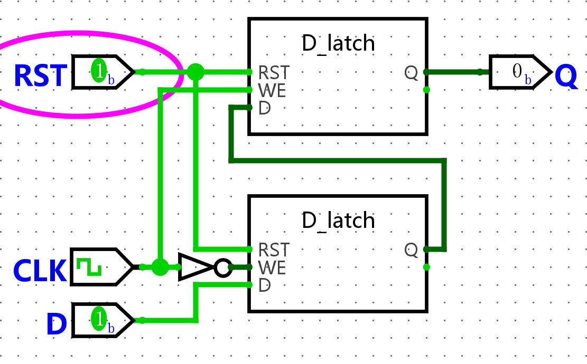

!!! example "位翻转"
    相比较D锁存器，由于D触发器是边沿触发的，只有在时钟信号翻转时才会将输入传播到输出，不像D锁存器那样输入会直接反馈到输出上，因此不会产生震荡现象：

    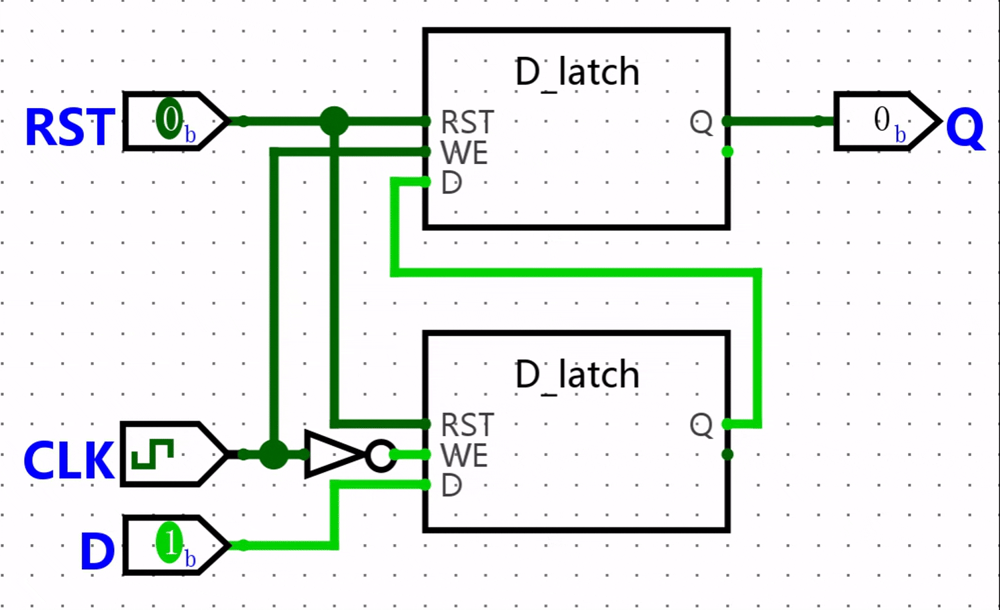

!!! example "下降沿触发的D触发器"
    把非门改接到从锁存器（即 $WE_{\text{主}}=\textit{clk}$，$WE_{\text{从}}=\overline{\textit{clk}}$），这时采样发生在下降沿，其余原理相同：

    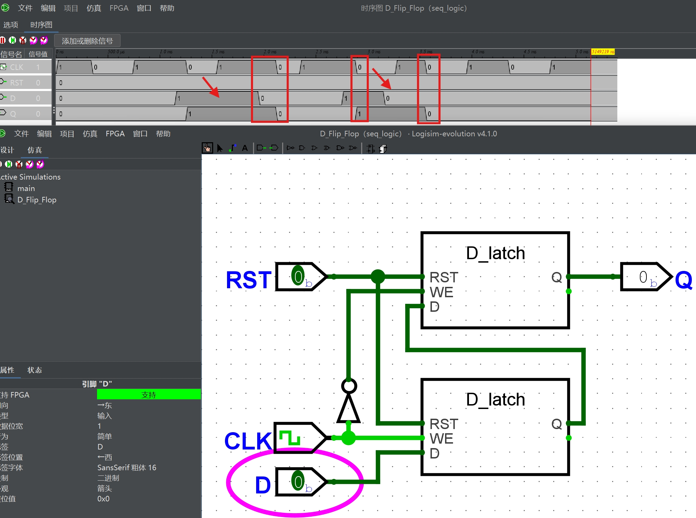

### 维持-阻塞式D触发器
