# 组合逻辑电路

> [F3 数字逻辑电路基础 | 一生一芯 v24.07 学习讲义](https://ysyx.oscc.cc/docs/2407/f/3.html)

## 译码器

**译码器**（*decoder*）把 $n$ 位二进制输入翻译成最多 $2^n$ 路输出信号。

### n选1译码器

最常见的一类译码器是 **n 选 1 译码器**（*1-of-n decoder*）：把输入看成无符号整数 $i$，只让**第 $i$ 路输出为 `1`，其余为 `0`**。

这种「恰好一路为 `1`」的编码叫**独热码**（*one-hot*）。

!!! example
    译码器输出的是一组**选择线**，不是直接写出十进制字形。例如输入 `10`₂ 时令 $Y_2=1$，是在「选中第 2 路」，数值上对应十进制 2，但电路层面仍是二进制电压。显示数字要靠后面的七段管译码等模块。

#### 2-4 译码器

2 位输入 $A_1 A_0$，4 位输出 $Y_3 Y_2 Y_1 Y_0$。行为：输入值 $i$ 时 $Y_i = 1$，其余为 `0`。

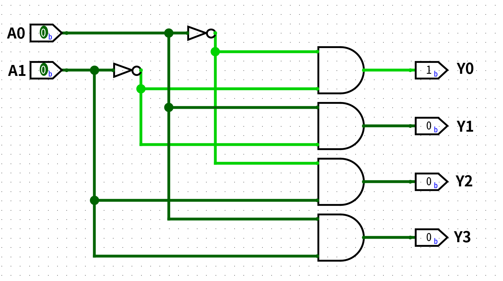

图中 Logisim 当前状态：$A_1=A_0=0$，因此只有最上方的与门满足条件，$Y_0=1$（绿线为高电平）。

**真值表：**

| $A_1$ | $A_0$ | | $Y_3$ | $Y_2$ | $Y_1$ | $Y_0$ |
|:-:|:-:|:-:|:-:|:-:|:-:|:-:|
| 0 | 0 | | 0 | 0 | 0 | 1 |
| 0 | 1 | | 0 | 0 | 1 | 0 |
| 1 | 0 | | 0 | 1 | 0 | 0 |
| 1 | 1 | | 1 | 0 | 0 | 0 |

**逻辑表达式**（与真值表、上图连线一致）：

$$
\begin{aligned}
Y_0 &= \overline{A_1}\,\overline{A_0} \\
Y_1 &= \overline{A_1}\,A_0 \\
Y_2 &= A_1\,\overline{A_0} \\
Y_3 &= A_1\,A_0
\end{aligned}
$$

**电路结构：**

- 两个非门：产生 $\overline{A_1}$、$\overline{A_0}$

- 四个 2 输入与门：每种输入组合对应一路输出

!!! tip "和地址的关系"
    计算机里 n 选 1 译码器常用于寻址：输入是**地址**，输出是各存储单元 / 设备上的**片选信号**——地址对应的那一根拉高，其余保持低。

#### 译码器的级联扩展

> [Cascading of Decoders](https://www.tutorialspoint.com/article/cascading-of-decoders)

在logisim中，可使用子电路功能将一个电路模块进行封装以提升复用性。

将上面的 2-4 译码器封装为一个子电路，命名为 `decoder_24`。利用译码器的**可级联特性**，我们可以将两个 `decoder_24` 级联成一个 3-8 译码器：

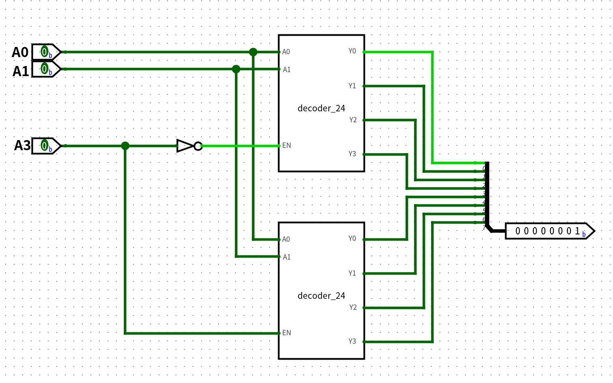

注意这里与上面实现的 2-4 译码器略有不同，添加了一个使能输入 `EN`：

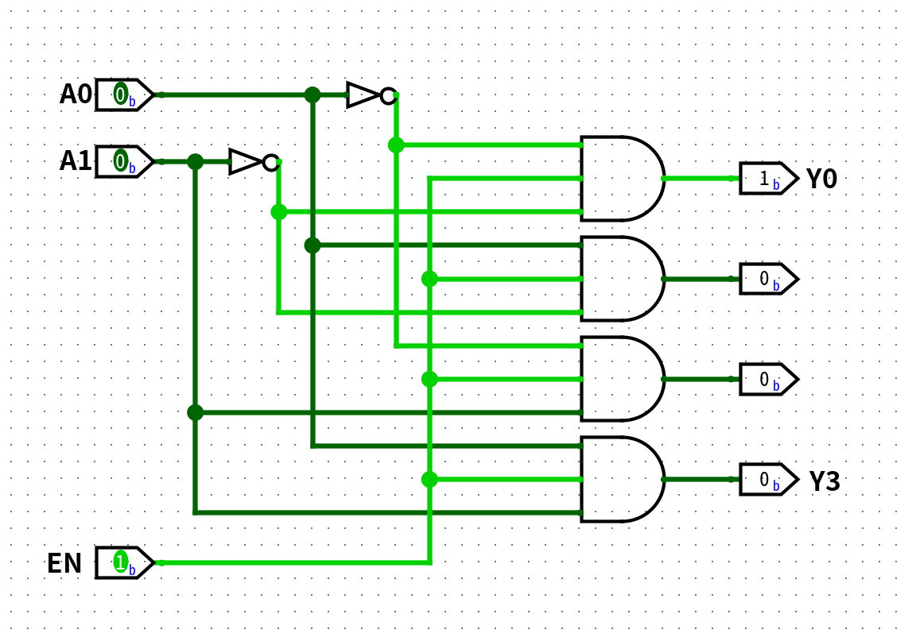

每个与门多接一路 `EN`，于是

$$
\begin{aligned}
Y_0 &= EN\cdot\overline{A_1}\,\overline{A_0} \\
Y_1 &= EN\cdot\overline{A_1}\,A_0 \\
Y_2 &= EN\cdot A_1\,\overline{A_0} \\
Y_3 &= EN\cdot A_1\,A_0
\end{aligned}
$$

- `EN = 0`：四路输出全为 `0`，整片子电路相当于关掉

- `EN = 1`：行为与无使能的 2-4 完全相同

级联时用最高位 $A_2$ 当片选：一片接 $EN = A_2$（负责 $Y_4\!\sim\!Y_7$），另一片接 $EN = \overline{A_2}$（负责 $Y_0\!\sim\!Y_3$）；$A_1 A_0$ 并联接到两片。同一时刻只有一片被打开，输出才仍是独热的 3-8 译码。

!!! tip "级联的推广"
    以此类推：用 **两片带使能的 $(n-1)\to 2^{n-1}$ 译码器** 可拼成 $n\to 2^n$ 译码器（数量正好 $\frac{2^n}{2^{n-1}}=2$）。

    - 低 $n-1$ 位 $A_{n-2}\ldots A_0$：**并联**接到两片

    - 最高位 $A_{n-1}$ 作片选：下片 `EN` 接 $\overline{A_{n-1}}$（输出 $Y_0\!\sim\!Y_{2^{n-1}-1}$），上片 `EN` 接 $A_{n-1}$（输出 $Y_{2^{n-1}}\!\sim\!Y_{2^n-1}$）

    - 若子模块本身已有总使能 `EN`，则两片实际为 $EN·¬A_{n-1}$ 与 $EN·A_{n-1}$

    模块复用时不必再改内部每个与门——使能是子电路的管脚；只有拆到门级时，才表现为每路 $Y_i = EN\cdot m_i$。如此递归下去，可一直拆到 2-4。

### 转码器

#### 七段数码管译码器

> [通过门电路实现三位 LED 译码器 | 果冻的猿宇宙](https://spcp.xiaogd.net/gate/led-decoder-by-gate.html)

前面的 n 选 1 译码器输出的是**独热码**（选中哪一路）。**七段数码管译码器**（*7-segment LED decoder*）则不同：它把二进制数**转码**成「字形」，这时输出不再是「第 $i$ 路为 1」，而是同时驱动多根段选线，拼出人眼可读的数字。因此它属于**转码器**，而不是独热译码器。

七段数码管由 7 根 LED 段组成，习惯记为 $A\!\sim\!G$（有的资料用小写 $a\!\sim\!g$）：

```
    A
  F   B
    G
  E   C
    D   H
```

这里采用 **3 位输入** $I_2 I_1 I_0$ 表示无符号整数 $0\!\sim\!7$，共 8 种字形；每位输出 `1` = 点亮该段（共阴极习惯）。

##### 数学原理

本质上是设计一个布尔函数。

设计入口只有一张真值表：对每个数字，规定 $A\!\sim\!G$ 哪些段该亮。输入记 $I_2 I_1 I_0$（下表与常见 0–7 字形一致）：

| 十进制 | $I_2$ | $I_1$ | $I_0$ | | $A$ | $B$ | $C$ | $D$ | $E$ | $F$ | $G$ |
|:-:|:-:|:-:|:-:|:-:|:-:|:-:|:-:|:-:|:-:|:-:|:-:|
| 0 | 0 | 0 | 0 | | 1 | 1 | 1 | 1 | 1 | 1 | 0 |
| 1 | 0 | 0 | 1 | | 0 | 1 | 1 | 0 | 0 | 0 | 0 |
| 2 | 0 | 1 | 0 | | 1 | 1 | 0 | 1 | 1 | 0 | 1 |
| 3 | 0 | 1 | 1 | | 1 | 1 | 1 | 1 | 0 | 0 | 1 |
| 4 | 1 | 0 | 0 | | 0 | 1 | 1 | 0 | 0 | 1 | 1 |
| 5 | 1 | 0 | 1 | | 1 | 0 | 1 | 1 | 0 | 1 | 1 |
| 6 | 1 | 1 | 0 | | 1 | 0 | 1 | 1 | 1 | 1 | 1 |
| 7 | 1 | 1 | 1 | | 1 | 1 | 1 | 0 | 0 | 0 | 0 |

每一段都是输入的一个布尔函数。例如「$A=1$ 的最小项」对应数字 $\{0,2,3,5,6,7\}$，可写成积之和（SOP）；若某段为 `0` 的行更少，也可以先写 $\overline{A}$ 再整体取反（往往门更少）。

化简后的一组常用实现：

$$
\boxed{
\begin{aligned}
A &= \overline{\overline{I_1}\,(I_2 \oplus I_0)} \\
B &= \overline{I_2\,(I_1 \oplus I_0)} \\
C &= \overline{\overline{I_2}\,I_1\,\overline{I_0}} = I_2 + \overline{I_1} + I_0 \\
D &= \overline{\overline{I_1}\,(I_2 \oplus I_0) + I_2 I_1 I_0} \\
E &= \overline{I_0 + I_2\,\overline{I_1}} \\
F &= \overline{I_1}\,\overline{I_0} + I_2\,(I_1 \oplus I_0) \\
G &= (I_2 \oplus I_1) + I_2\,\overline{I_0} \\
H &= P
\end{aligned}
}
$$

##### 门电路实现

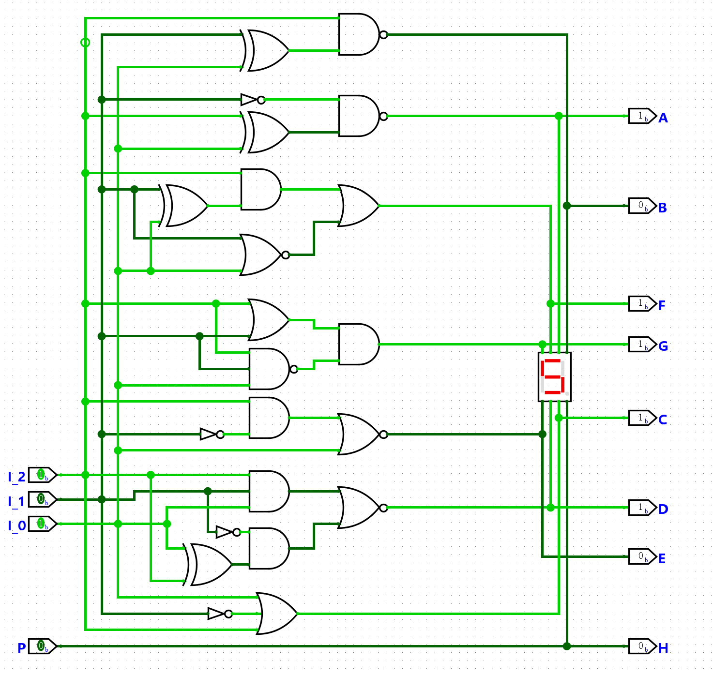

图中 Logisim 当前状态：

| 引脚 | 电平 | 含义 |
|:--|:--:|:--|
| $I_2 I_1 I_0$ | `1 0 1` | 二进制 $101_2 = 5$ |
| $P$ | `0` | 小数点关闭 |
| $A B C D E F G$ | `1 0 1 1 0 1 1` | 与上表「数字 5」一行一致 |
| $H$ | `0` | $H=P$，小数点灭 |

!!! note "和 n 选 1 的对比"
    输入同为 `101` 时：3-8 译码器只拉高 $Y_5$；七段译码器则同时拉高 $A,C,D,F,G$ 五根线。前者回答「选谁」，后者回答「怎么画成 5」。

#### 四位输入的七段数码管译码器

三位输入最多覆盖 $0\!\sim\!7$。单个数码管还能较清楚地显示部分字母，因此可以扩成 **4 位输入** $I_3 I_2 I_1 I_0$，按十六进制显示 $0\!\sim\!9$ 与 $A\!\sim\!F$（对应十进制 10–15）。

##### 数学原理

与三位译码器相同：每一段仍是 $S(I_3,I_2,I_1,I_0)$ 这一个布尔函数，只是变量从 3 个变成 4 个、真值表从 8 行变成 **16 行**。

**设计流程**

1. **定字形**：先约定 $0\!\sim\!F$ 各亮哪些段（共阴极：`1` = 亮）。

2. **列真值表**：$I_3$ 为最高位；$0\!\sim\!7$ 与上一节三位表一致，$8\!\sim\!F$ 按十六进制字形补全。

3. **逐段求式**：对 $A\!\sim\!G$ 分别处理——为 `1` 的行多就写 SOP（最小项之和），为 `0` 的行少就先写 $\overline{S}$ 再取反。

4. **化简**：四变量卡诺图（$4\times4$ 格）、代数定律，或 Q-M 法；目标是缩短积之和 / 和之积。

5. **核对**：用 16 种输入逐段对照真值表。

**完整真值表**（$0\!\sim\!7$ 见上节；此处列出 $8\!\sim\!F$）：

| 字符 | $I_3$ | $I_2$ | $I_1$ | $I_0$ | | $A$ | $B$ | $C$ | $D$ | $E$ | $F$ | $G$ |
|:-:|:-:|:-:|:-:|:-:|:-:|:-:|:-:|:-:|:-:|:-:|:-:|:-:|
| 8 | 1 | 0 | 0 | 0 | | 1 | 1 | 1 | 1 | 1 | 1 | 1 |
| 9 | 1 | 0 | 0 | 1 | | 1 | 1 | 1 | 1 | 0 | 1 | 1 |
| A | 1 | 0 | 1 | 0 | | 1 | 1 | 1 | 0 | 1 | 1 | 1 |
| b | 1 | 0 | 1 | 1 | | 0 | 0 | 1 | 1 | 1 | 1 | 1 |
| C | 1 | 1 | 0 | 0 | | 1 | 0 | 0 | 1 | 1 | 1 | 0 |
| d | 1 | 1 | 0 | 1 | | 0 | 1 | 1 | 1 | 1 | 0 | 1 |
| E | 1 | 1 | 1 | 0 | | 1 | 0 | 0 | 1 | 1 | 1 | 1 |
| F | 1 | 1 | 1 | 1 | | 1 | 0 | 0 | 0 | 1 | 1 | 1 |

!!! info "十六进制 vs BCD"
    - **十六进制**：上表 16 行全定义，显示 `0`–`F`。

    - [BCD](#BCD译码器)：只保证 `0000`–`1001` 显示 0–9；`1010`–`1111` 标为无关项，电路往往更小，但非法输入字形不保证。

##### 门电路实现

参照[组合逻辑电路的设计原理](组合逻辑电路的设计原理.md)，实现的门电路如下：

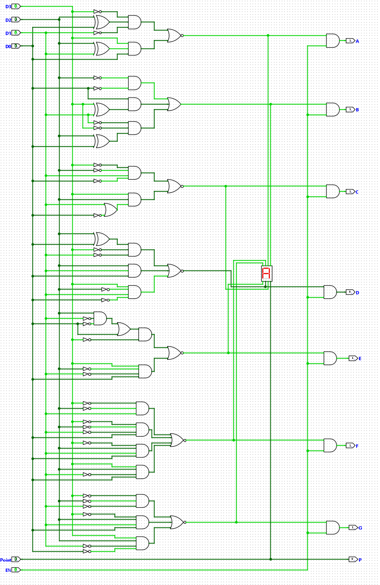

!!! tip "规模与习惯"
    四位全部门级实现比三位大约多一倍以上的门与连线；**先保证真值表正确，再抠化简**。若某段 SOP 项太多，可对该段单独重画卡诺图，或暂用 ROM / 组合逻辑表生成初版，再改回纯门电路练习化简。

#### BCD译码器

**BCD**（*Binary-Coded Decimal*，二-十进制编码）用 **4 位二进制**表示一个十进制数字 $0\!\sim\!9$，合法码只有：

| 十进制 | BCD（$I_3 I_2 I_1 I_0$） |
|:-:|:-:|
| 0–9 | `0000`–`1001` |

`1010`–`1111` 在 BCD 里**非法**。因此 **BCD → 七段** 译码器与前面的[十六进制七段译码器](#四位输入的七段数码管译码器)同为 4 入 7 出，但设计约定不同：

- **合法输入** `0000`–`1001`：显示数字 0–9（字形与上表 $0\!\sim\!9$ 一致）

- **非法输入** `1010`–`1111`：标为**无关项**（$X$）——化简时可任意当成 `0`/`1`，换来更少的门；换代价是非法输入时字形不保证

（若作业要求非法时「只亮小数点」，则不能当无关项，需另加非法检测，见文末 tip。）

##### 真值表

共阴极：`1` = 点亮。$0\!\sim\!7$ 与[三位七段表](#数学原理)相同；$8$、$9$ 与十六进制表相同；非法行写 $X$。

| 十进制 | $I_3$ | $I_2$ | $I_1$ | $I_0$ | | $A$ | $B$ | $C$ | $D$ | $E$ | $F$ | $G$ |
|:-:|:-:|:-:|:-:|:-:|:-:|:-:|:-:|:-:|:-:|:-:|:-:|:-:|
| 0 | 0 | 0 | 0 | 0 | | 1 | 1 | 1 | 1 | 1 | 1 | 0 |
| 1 | 0 | 0 | 0 | 1 | | 0 | 1 | 1 | 0 | 0 | 0 | 0 |
| 2 | 0 | 0 | 1 | 0 | | 1 | 1 | 0 | 1 | 1 | 0 | 1 |
| 3 | 0 | 0 | 1 | 1 | | 1 | 1 | 1 | 1 | 0 | 0 | 1 |
| 4 | 0 | 1 | 0 | 0 | | 0 | 1 | 1 | 0 | 0 | 1 | 1 |
| 5 | 0 | 1 | 0 | 1 | | 1 | 0 | 1 | 1 | 0 | 1 | 1 |
| 6 | 0 | 1 | 1 | 0 | | 1 | 0 | 1 | 1 | 1 | 1 | 1 |
| 7 | 0 | 1 | 1 | 1 | | 1 | 1 | 1 | 0 | 0 | 0 | 0 |
| 8 | 1 | 0 | 0 | 0 | | 1 | 1 | 1 | 1 | 1 | 1 | 1 |
| 9 | 1 | 0 | 0 | 1 | | 1 | 1 | 1 | 1 | 0 | 1 | 1 |
| — | 1 | 0 | 1 | 0 | | X | X | X | X | X | X | X |
| — | 1 | 0 | 1 | 1 | | X | X | X | X | X | X | X |
| — | 1 | 1 | 0 | 0 | | X | X | X | X | X | X | X |
| — | 1 | 1 | 0 | 1 | | X | X | X | X | X | X | X |
| — | 1 | 1 | 1 | 0 | | X | X | X | X | X | X | X |
| — | 1 | 1 | 1 | 1 | | X | X | X | X | X | X | X |

##### 逻辑表达式

对每一段做四变量卡诺图，把 `1010`–`1111` 当无关项，可得一组积之和（与上表 $0\!\sim\!9$ 逐行核对过）：

$$
\boxed{
\begin{aligned}
A &= I_3 + I_1 + I_2 I_0 + \overline{I_2}\,\overline{I_0} \\
B &= \overline{I_2} + I_1 I_0 + \overline{I_1}\,\overline{I_0} \\
C &= I_2 + \overline{I_1} + I_0 \\
D &= I_3 + I_1\,\overline{I_0} + I_1\,\overline{I_2} + \overline{I_2}\,\overline{I_0} + I_2\,\overline{I_1}\,I_0 \\
E &= I_1\,\overline{I_0} + \overline{I_2}\,\overline{I_0} \\
F &= I_3 + I_2\,\overline{I_0} + I_2\,\overline{I_1} + \overline{I_1}\,\overline{I_0} \\
G &= I_3 + I_1\,\overline{I_0} + I_1\,\overline{I_2} + I_2\,\overline{I_1}
\end{aligned}
}
$$

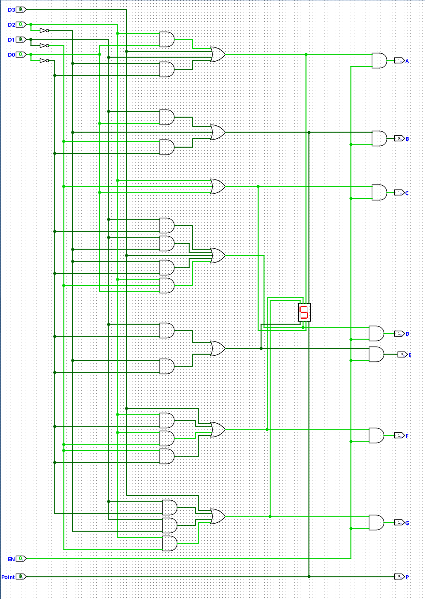

!!! tip "两种实现路线"
    - **按段化简**（上式）：门更少，适合手搭。

    - **先 4-16 译码再或**：用独热 $Y_0\!\sim\!Y_9$，每段对「该亮的那些数字」做或门（如 $A = Y_0+Y_2+Y_3+Y_5+Y_6+Y_7+Y_8+Y_9$）。思路直，门更多；非法输入自然全暗（若只或到 $Y_9$）。

!!! tip "若要求非法输入只亮小数点"
    不能再用无关项。先判非法，例如 $INV = I_3(I_2 + I_1)$，再令各段 $S' = S\cdot\overline{INV}$，小数点 $H = P + INV$。合法时与上表相同，非法时 $A\!\sim\!G$ 全灭、小数点亮。

## 编码器

**编码器**(*encoder*)的功能和n选1译码器相反, 它用于将独热码转换成相应的二进制数值。

例如, 一个4-2编码器有4位输入 $A_3, A_2, A_1, A_0$, 有2位输出 $Y_1, Y_0$, 其真值表如下. 下表在输入不为独热码时, 输出为X, 表示输出未定义(undefined), 可为任意值：

| $A_3$ | $A_2$ | $A_1$ | $A_0$ | | $Y_1$ | $Y_0$ |
|:-:|:-:|:-:|:-:|:-:|:-:|:-:|
| 0 | 0 | 0 | 1 | | 0 | 0 |
| 0 | 0 | 1 | 0 | | 0 | 1 |
| 0 | 1 | 0 | 0 | | 1 | 0 |
| 1 | 0 | 0 | 0 | | 1 | 1 |
| 其 | 它 | 情 | 况 | | X | X |

设计时只需保证独热行正确；其余行的 `X` 可当无关项，用来化简：

$$
\begin{aligned}
Y_1 &= A_3 + A_2 \\
Y_0 &= A_3 + A_1
\end{aligned}
$$

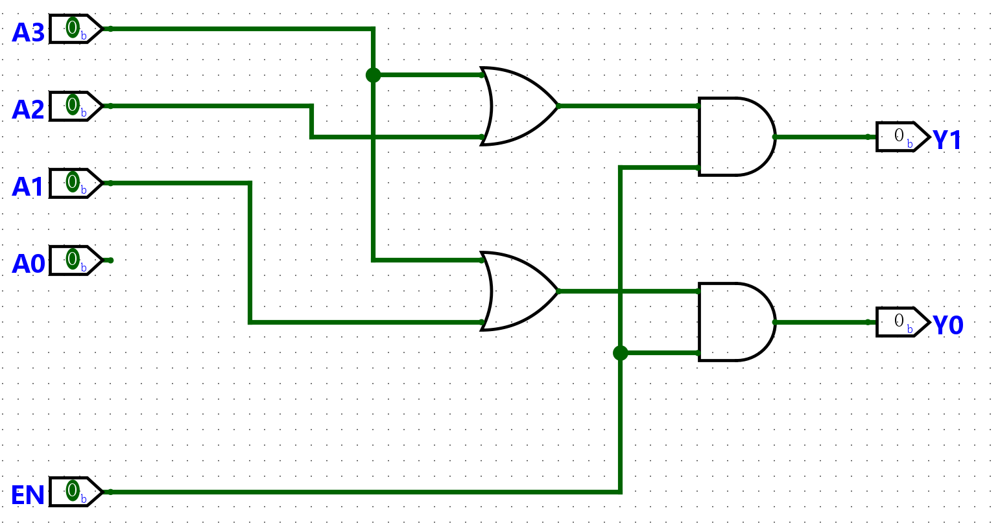

!!! note "未定义 ≠ 电路坏了"
    物理上输出仍是 `0`/`1`，只是**没有约定含义**。约定由使用者保证：想要有意义的结果，就必须送入独热码；否则后续怎么用这些比特，责任在使用者。

### 16-4编码器

16 路独热输入 $A_{15}\!\sim\!A_0$，4 位输出 $Y_3 Y_2 Y_1 Y_0$。每一位 $Y_j$ 是「下标二进制第 $j$ 位为 1」的那些输入的或：

$$
\begin{aligned}
Y_0 &= A_1 + A_3 + A_5 + A_7 + A_9 + A_{11} + A_{13} + A_{15} \\
Y_1 &= A_2 + A_3 + A_6 + A_7 + A_{10} + A_{11} + A_{14} + A_{15} \\
Y_2 &= A_4 + A_5 + A_6 + A_7 + A_{12} + A_{13} + A_{14} + A_{15} \\
Y_3 &= A_8 + A_9 + A_{10} + A_{11} + A_{12} + A_{13} + A_{14} + A_{15}
\end{aligned}
$$

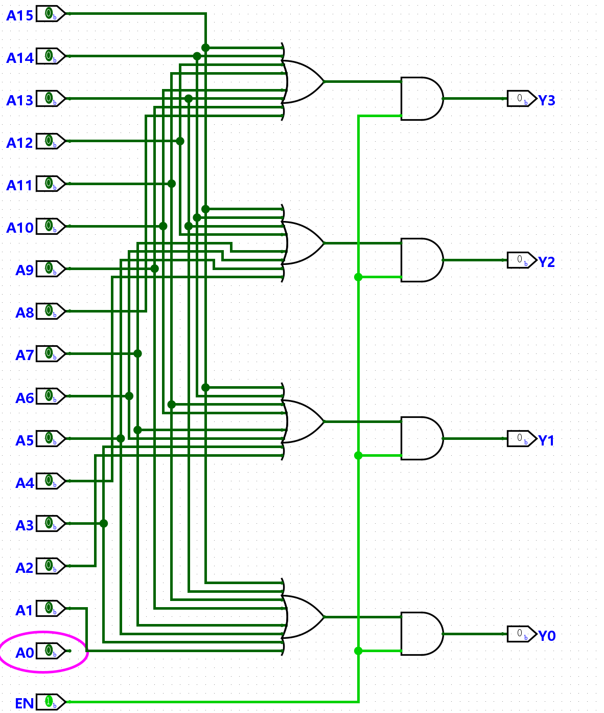

#### 连接七段数码管译码器

将16-4编码器与上面实现的[十六进制七段数码管译码器](#四位输入的七段数码管译码器)相连，这样就实现了一个**编码-译码**的闭环：

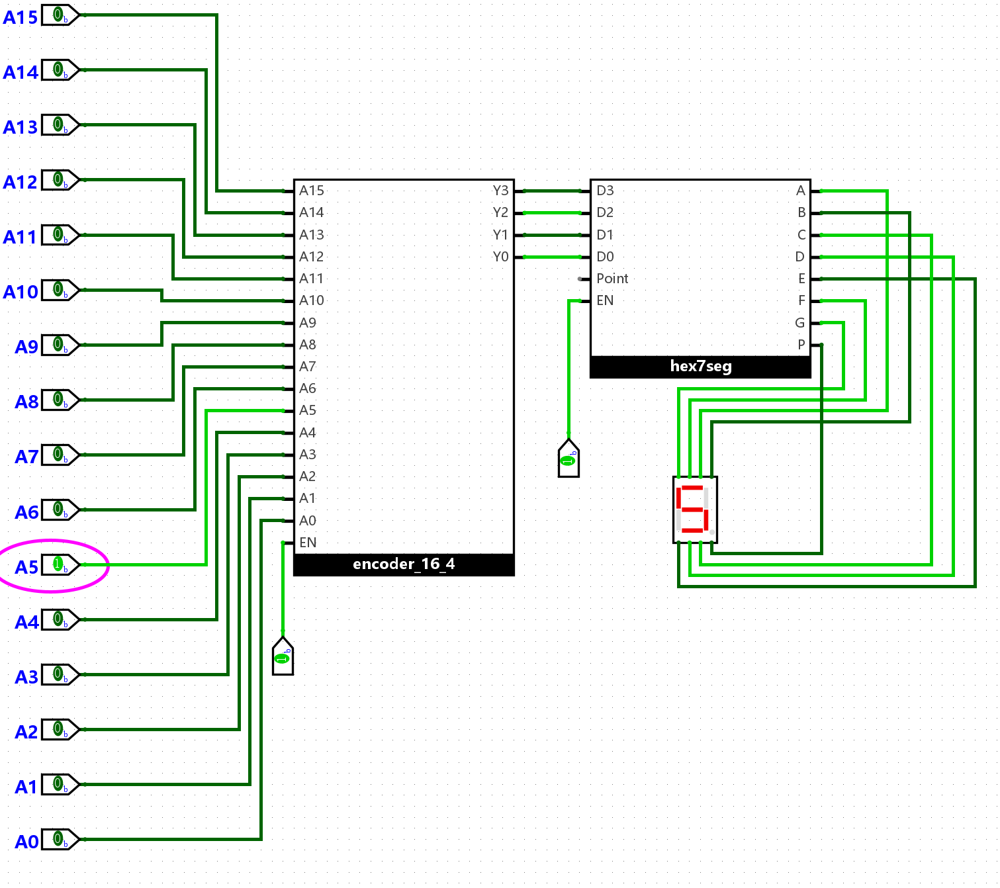

### 优先编码器

**普通编码器要求输入互斥**。

若希望**多路同时为 `1` 时仍有确定含义**，就要用 **优先编码器**（*priority encoder*）：允许输入中出现多个 `1`，此时**最高位的那个 `1` 优先被编码**。

- 输入不全为 `0`：输出最高位 `1` 的位置编号

- 输入全为 `0`：输出未定义（也可另加有效位 `V` 标明）

#### 4-2 优先编码器

4 位输入 $A_3 A_2 A_1 A_0$（$A_3$ 优先级最高），2 位输出 $Y_1 Y_0$。表中 `X` 表示该输入位可为任意值：

| $A_3$ | $A_2$ | $A_1$ | $A_0$ | | $Y_1$ | $Y_0$ |
|:-:|:-:|:-:|:-:|:-:|:-:|:-:|
| 0 | 0 | 0 | 1 | | 0 | 0 |
| 0 | 0 | 1 | X | | 0 | 1 |
| 0 | 1 | X | X | | 1 | 0 |
| 1 | X | X | X | | 1 | 1 |
| 0 | 0 | 0 | 0 | | X | X |

和译码器级联时一样，下图在基本优先编码之外加了使能 `EN`：两路输出各经一个与门被 `EN` 门控。

$$
\begin{aligned}
Y_1 &= EN\cdot(A_3 + A_2) \\
Y_0 &= EN\cdot\bigl(A_3 + \overline{A_2}\,A_1\bigr)
\end{aligned}
$$

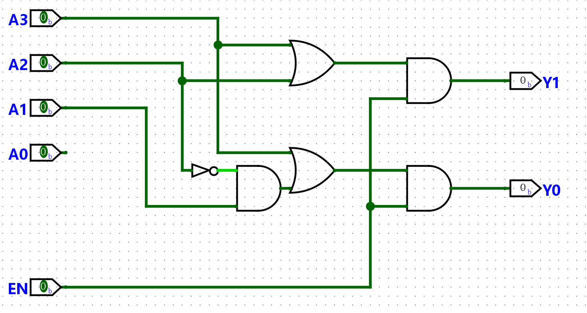

!!! tip "读式的直觉"
    $Y_1$：最高两档里有没有人；$Y_0$：在「不是 $A_2$ 抢先」的前提下，看 $A_3$ 或 $A_1$ 是否有效。和普通 4-2 相比，$Y_0$ 多了 $\overline{A_2}$，正是为了实现优先级。

#### 优先编码器的扩展

目标：用若干片带 `EN` 的 4-2 优先编码器，拼出 **16-4 优先编码器**（16 路输入 $A_{15}\!\sim\!A_0$ → 4 位编号 $Y_3 Y_2 Y_1 Y_0$，仍是「最高位的 `1` 优先」）。

思路与[译码器级联](#译码器的级联扩展)相同：**先封装可复用的子电路，再用 `EN` 做片选**——正因为上图把输出门控在 `EN` 上，未选中的片子输出恒为 `00`，多片结果才能用或门安全地并在一起。

##### 分组

把 16 路按优先级从高到低切成 4 组，每组接一片 `pe_42`（片子管脚仍叫 $A_3\!\sim\!A_0$，只是接到不同的全局输入）：

| 片子 | 接到片子的 $A_3\!\sim\!A_0$ | 组号（高 2 位） |
|:--:|:--|:--:|
| PE3 | $A_{15}\!\sim\!A_{12}$ | `11` |
| PE2 | $A_{11}\!\sim\!A_8$ | `10` |
| PE1 | $A_7\!\sim\!A_4$ | `01` |
| PE0 | $A_3\!\sim\!A_0$ | `00` |

最终编号 $=$「组号」$\|{}$「组内编号」。例如只有 $A_{13}=1$：组号 `11`、组内对应 $A_1$ → 输出 `1101`₂ $=13$。

##### 每组是否有请求

单片 `pe_42` 只看本组 4 路，**看不到别组有没有人**。级联时还要决定：

1. 打开哪一片（生成各片的 `EN`）

2. 高 2 位组号是多少

这两件事都需要一个更粗的信号：**这一组里有没有任意一路为 `1`**。记为 $V_k$（*valid* / 组有效）。它**不是**最终输出的编号，只是「本组有请求吗」的开关量。

上图没有单独引出有效脚，在片外对每组做一个 **4 输入或门** 即可：

$$
\boxed{
\begin{aligned}
V_3 &= A_{15} + A_{14} + A_{13} + A_{12} \\
V_2 &= A_{11} + A_{10} + A_9 + A_8 \\
V_1 &= A_7 + A_6 + A_5 + A_4 \\
V_0 &= A_3 + A_2 + A_1 + A_0
\end{aligned}
}
$$

- $V_k = 1$：该组至少有一路请求  

- $V_k = 0$：该组全空，可以关掉  

四个 $V_k$ 接下来有两处用法：驱动下面的 `EN` 抑制链，以及再编一次得到高 2 位组号。

##### 高组抑制低组

规则很简单：**更高组一旦有人（$V=1$），就关掉下面所有组**。用非门、与门实现：

$$
\begin{aligned}
EN_3 &= 1 \\
EN_2 &= \overline{V_3} \\
EN_1 &= \overline{V_3}\,\overline{V_2} \\
EN_0 &= \overline{V_3}\,\overline{V_2}\,\overline{V_1}
\end{aligned}
$$

读法：$EN_2$ 仅当「第 3 组没人」时为 1；$EN_1$ 仅当「第 3、2 组都没人」时为 1；以此类推。于是同一时刻至多一片 `EN=1`，只有「当前最高且确有请求」的那一组在工作。

若还需要总使能，把上面每一式再与总 `EN` 相与即可（同译码器级联里的 $EN\cdot A_{n-1}$）。

##### 拼出 4 位输出

- **低 2 位**（组内编号）：四片的 $Y_1$ 相或、$Y_0$ 相或。未使能片子被 `EN` 拉成 `00`，不会污染结果：

$$
Y_1 = Y_1^{(3)} + Y_1^{(2)} + Y_1^{(1)} + Y_1^{(0)},\quad
Y_0 = Y_0^{(3)} + Y_0^{(2)} + Y_0^{(1)} + Y_0^{(0)}
$$

- **高 2 位**（组号）：对 $(V_3,V_2,V_1,V_0)$ 再做一次 4-2 优先编码（可再实例化一片 `pe_42`，`EN` 接 `1`）：

$$
\begin{aligned}
Y_3 &= V_3 + V_2 \\
Y_2 &= V_3 + \overline{V_2}\,V_1
\end{aligned}
$$

全无请求时与单片一样，输出约定为未定义；也可另引总有效位 $V = V_3+V_2+V_1+V_0$。

最终的实现如图所示：

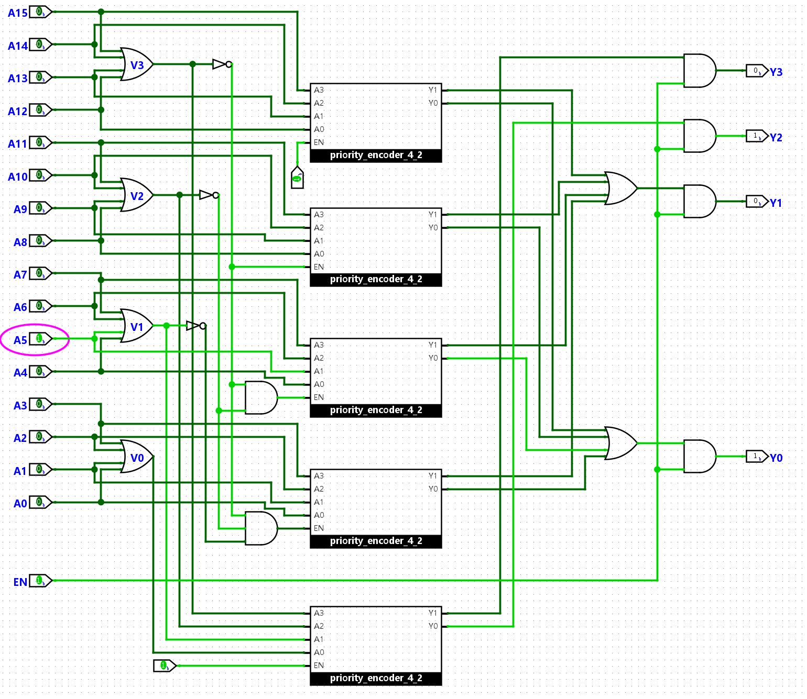

!!! tip "为什么使能输入是扩展的关键"
    若子电路没有 `EN`，四片会同时输出各自的局部编号，低 2 位无法直接或在一起。把门控做进模块后：片选在管脚上完成，级联时「加少量门」——算 $V_k$、生成 $EN_k$、或出低位、再编一次组号——不必改每片内部的优先逻辑。

## 多路选择器

**多路选择器**（*multiplexer, MUX*），也叫**多路复用器** / **选择器**：根据**选择端**的值，从多路**数据端**里挑一路送到输出。

译码器回答「选谁」（输出独热选择线）；选择器则在「选谁」之后，把被选中的那一路**数据本身**传出去。计算机要不断在多种数据来源 / 运算结果之间切换，因此选择器使用频率很高。

### 单位宽多路选择器

#### 一位二选一多路选择器

最简单的情形是 **1 位 2 选 1**：两路数据 $D_0$、$D_1$，一位选择 $S$，一路输出 $Y$。约定：

- $S = 0$ → 输出 $D_0$

- $S = 1$ → 输出 $D_1$

**真值表**（也可把 $Y$ 直接写成「等于被选中的那一路」）：

| $S$ | $D_1$ | $D_0$ | | $Y$ |
|:-:|:-:|:-:|:-:|:-:|
| 0 | 0 | 0 | | 0 |
| 0 | 0 | 1 | | 1 |
| 0 | 1 | 0 | | 0 |
| 0 | 1 | 1 | | 1 |
| 1 | 0 | 0 | | 0 |
| 1 | 0 | 1 | | 0 |
| 1 | 1 | 0 | | 1 |
| 1 | 1 | 1 | | 1 |

观察：$S=0$ 时 $Y=D_0$；$S=1$ 时 $Y=D_1$。写成布尔式：

$$
Y = \overline{S}\cdot D_0 + S\cdot D_1
$$

选择器的电路结构与 [n 选 1 译码器](#n选1译码器) 一脉相承：

1. 用 $S$ 做 1-2 译码：得到选择线 $\overline{S}$ 与 $S$（独热）

2. 两路与门：$\overline{S}\cdot D_0$、$S\cdot D_1$——未选中的那路被与成 `0`

3. 一个或门：把两路与门结果并起来，只剩被选中的数据传到 $Y$

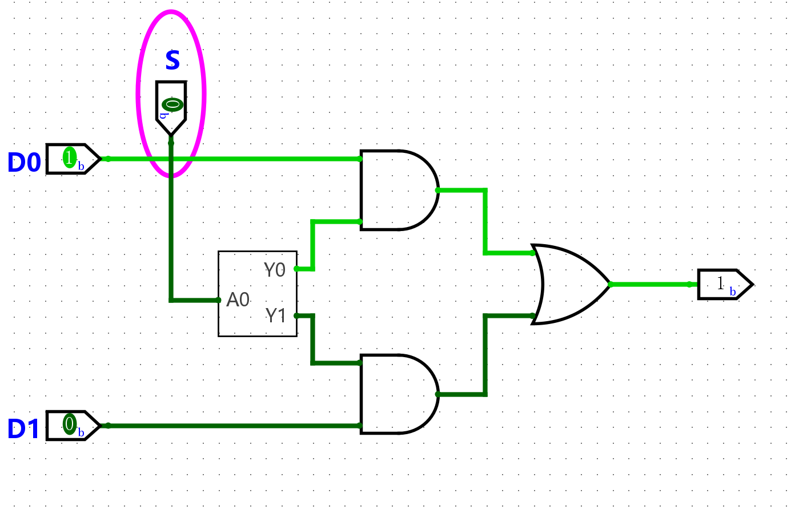

!!! tip "把选择端看成地址"
    选择信号 $S$ 就是「地址」；内部的 n 选 1 译码器生成片选，与门负责开门，或门负责汇合。这和「用地址选中存储单元」是同一套直觉，只是这里被选中的是**数据位**而不是存储体。

!!! warning
    若误写成 $Y = S\cdot D_0 + \overline{S}\cdot D_1$，则 $S=0$ 时输出的是 $D_1$，与「$S=0$ 选 $D_0$」的常见约定相反。以真值表为准。

#### 一位四选一多路选择器

把选择端扩成 2 位 $S_1 S_0$，就能在 $D_0\!\sim\!D_3$ 四路里挑一路：

$$
\begin{aligned}
Y &= \overline{S_1}\,\overline{S_0}\,D_0
   + \overline{S_1}\,S_0\,D_1
   + S_1\,\overline{S_0}\,D_2
   + S_1\,S_0\,D_3
\end{aligned}
$$

结构仍是：**2-4 译码器** → 四路与门（各接一路 $D_i$）→ 一个 4 输入或门。译码输出 $Y_i$（独热）打开对应的 $D_i$。

| $S_1$ | $S_0$ | 选中 |
|:-:|:-:|:--|
| 0 | 0 | $D_0$ |
| 0 | 1 | $D_1$ |
| 1 | 0 | $D_2$ |
| 1 | 1 | $D_3$ |

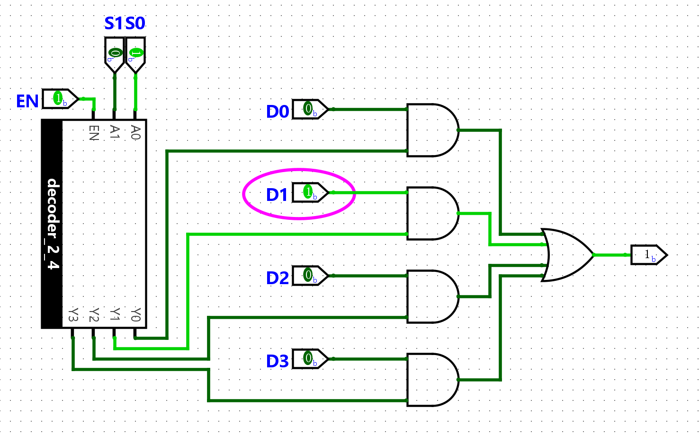

!!! tip "和译码器的复用"
    前面封装的带使能 `decoder_24` 可以直接当选择器的「地址译码」核：四路输出分别与 $D_0\!\sim\!D_3$ 相与，再或到一起。使能脚若接 `0`，整片 MUX 输出恒为 `0`，便于级联关断。

### 多位数据的选择器

上面都是**1 位宽**的数据。实际更常见的是「$w$ 位、$n$ 选 1」：每一路数据有 $w$ 根线，选择端仍只需 $\lceil\log_2 n\rceil$ 位。

**同一组选择信号 / 同一片译码器，按位复用**——第 $k$ 位各自做一套「与–或」，但译码出的选择线全部并联共用。

#### 三位四选一多路选择器

在 [一位四选一](#一位四选一多路选择器) 上把位宽扩到 3：四路数据各带 3 根线，选择端仍是 $S_1 S_0$，输出 $Y$ 也是 3 位。

记第 $i$ 路数据为 $D_i = D_{i,2} D_{i,1} D_{i,0}$（$i=0,1,2,3$），输出 $Y = Y_2 Y_1 Y_0$。每一位独立套用一位四选一的公式，选择线相同：

$$
\begin{aligned}
Y_k &= \overline{S_1}\,\overline{S_0}\,D_{0,k}
     + \overline{S_1}\,S_0\,D_{1,k}
     + S_1\,\overline{S_0}\,D_{2,k}
     + S_1\,S_0\,D_{3,k}
     \qquad (k = 0,1,2)
\end{aligned}
$$

也就是说：$S_1 S_0$ 决定「选第几路」，被选中的那一路的三个比特整体搬到 $Y$。

| $S_1$ | $S_0$ | 选中 |
|:-:|:-:|:--|
| 0 | 0 | $D_0$（即 $Y = D_{0,2} D_{0,1} D_{0,0}$） |
| 0 | 1 | $D_1$ |
| 1 | 0 | $D_2$ |
| 1 | 1 | $D_3$ |

实现有两种方式：

1. **共享译码**：一片 `decoder_24` 吃 $S_1 S_0$，四根独热选择线并联接到 **三组**「四与一或」——分别负责 bit0、bit1、bit2

    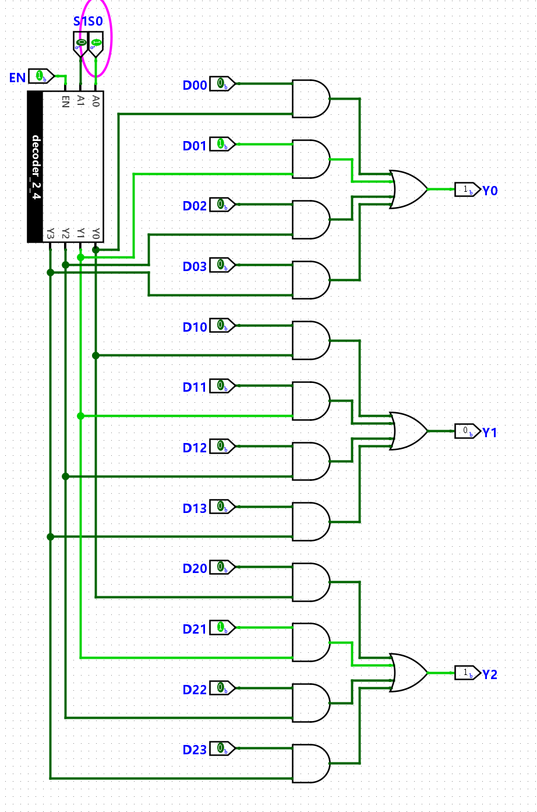

2. **封装复用**：把上面的一位四选一封成子电路 `mux_41`，实例化三片；三片的 $S_1 S_0$ **并联**，第 $k$ 片的 $D_0\!\sim\!D_3$ 接各路数据的第 $k$ 位，输出拼成 $Y_2 Y_1 Y_0$

    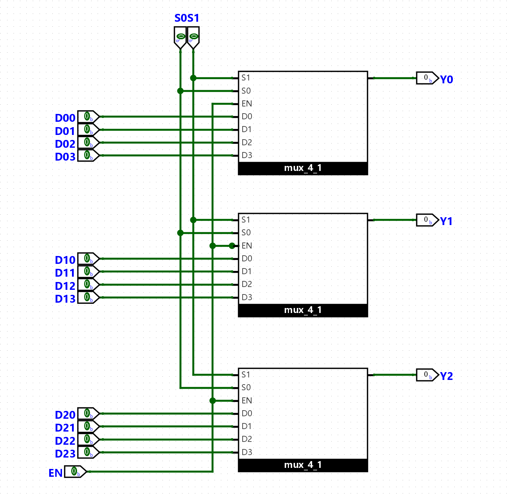

!!! tip "位宽变了，选择逻辑不变"
    从 1 位扩到 3 位，**没有新增选择端**，只是把同一套片选信号复制到每一位的数据通路上。「8 位 4 选 1」「32 位 2 选 1」，都是同一模式：$w$ 份并联的 1 位 MUX + 共享 $S$。

### 多路选择器的应用

#### 可切换进位计数制的七段数码管

下面的电路通过5个拨码开关和1个七段数码管，实现了如下功能：

其中4个拨码开关当作数据输入，剩下1个拨码开关作为进位计数制的选择，当选择信号为0时，七段数码管以十进制方式显示数据；当选择信号为1时，七段数码管以十六进制方式显示数据。

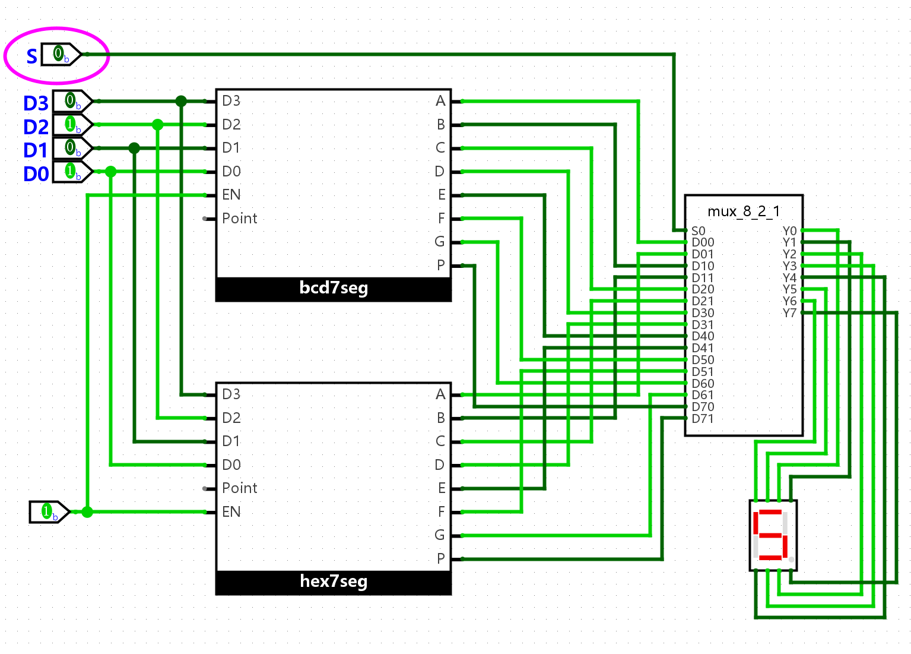

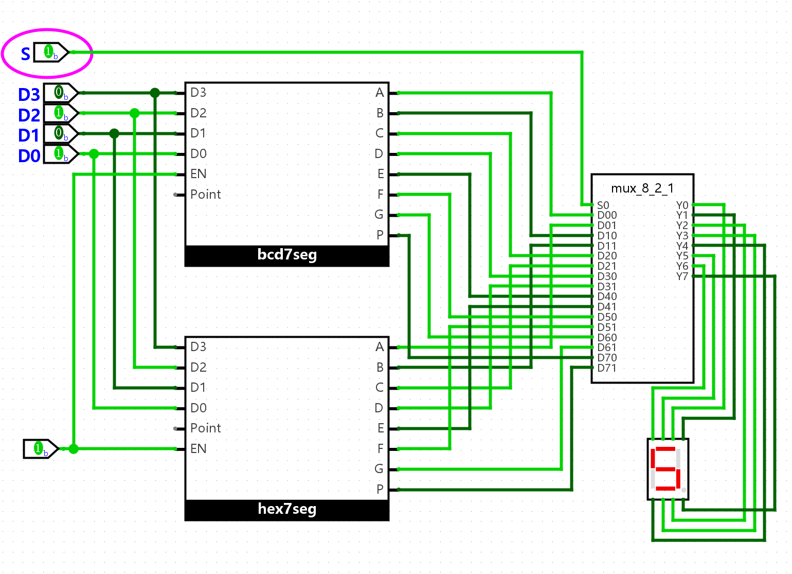

可以看出，显示的数值为0-9时，是看不出二者的区别的。但数值来到10-15时，二者的显示结果就不同了：

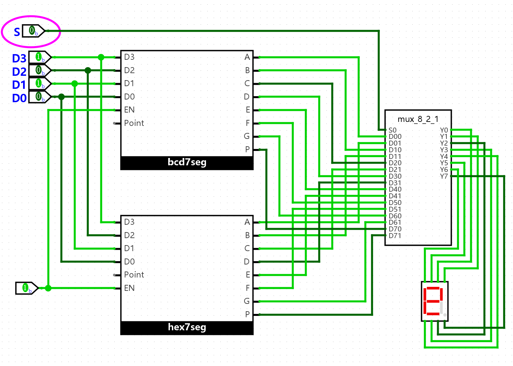

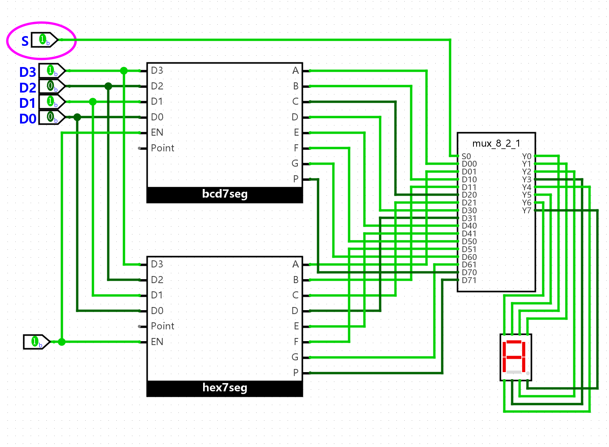

实现的原理很简单。首先实现一个八位二选一多路选择器：

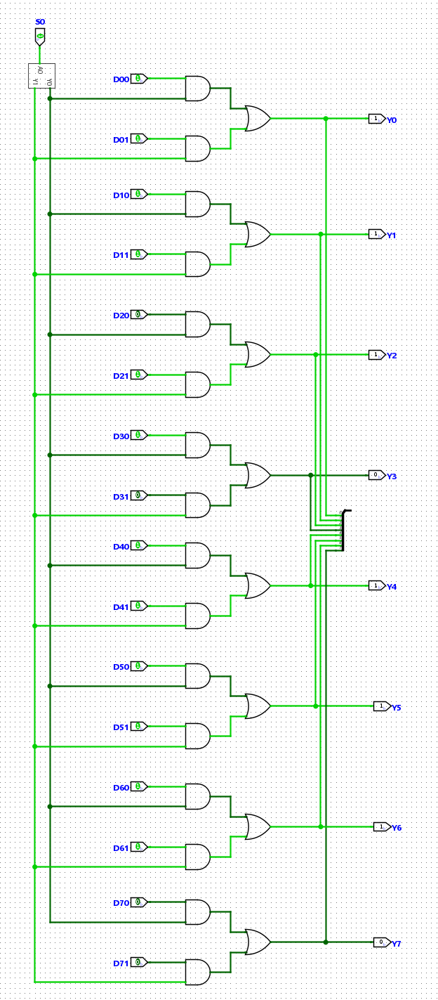

然后将[BCD译码器](#BCD译码器)和[十六进制七段数码管译码器](#四位输入的七段数码管译码器)的输出接入即可。

另外，由于这里是*二选一*，也可以不用段选上的 MUX：用 1-2 译码器（或直接用 $S$ 与 $\overline{S}$）分别接到两片译码器的 `EN`——$S=0$ 只打开 BCD，$S=1$ 只打开十六进制；未使能那片输出全 `0`，两路段选再**按位或**接到七段管，效果与八位 2 选 1 等价。

## 比较器

**比较器**(*comparator*)，用于检查两个输入是否完全一致。

由于每个异或门（和同或门）已经具备比较一位数据的功能，因此只需要将多个异或门（和同或门）组合起来，就可以比较多个位数的数据。

下面是一个四位比较器：

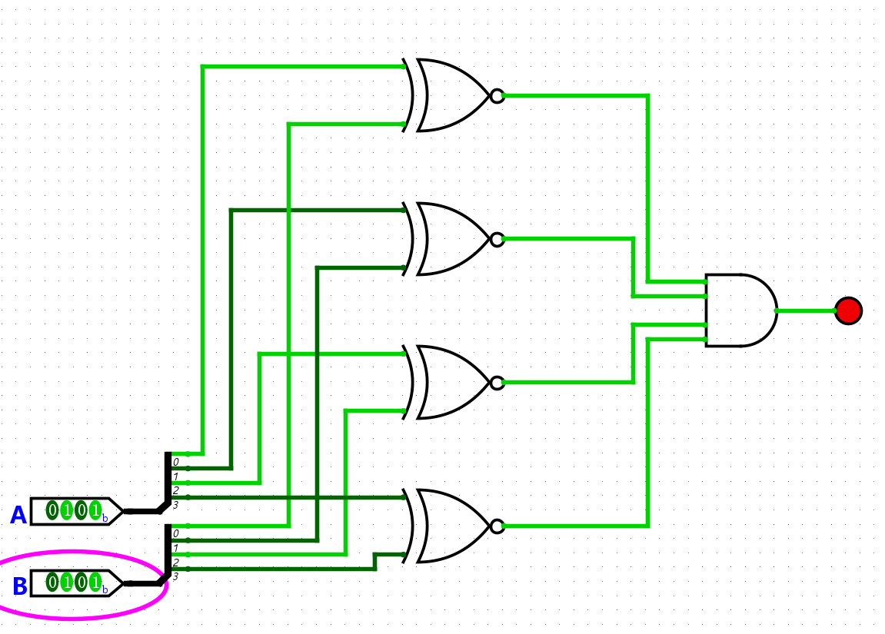

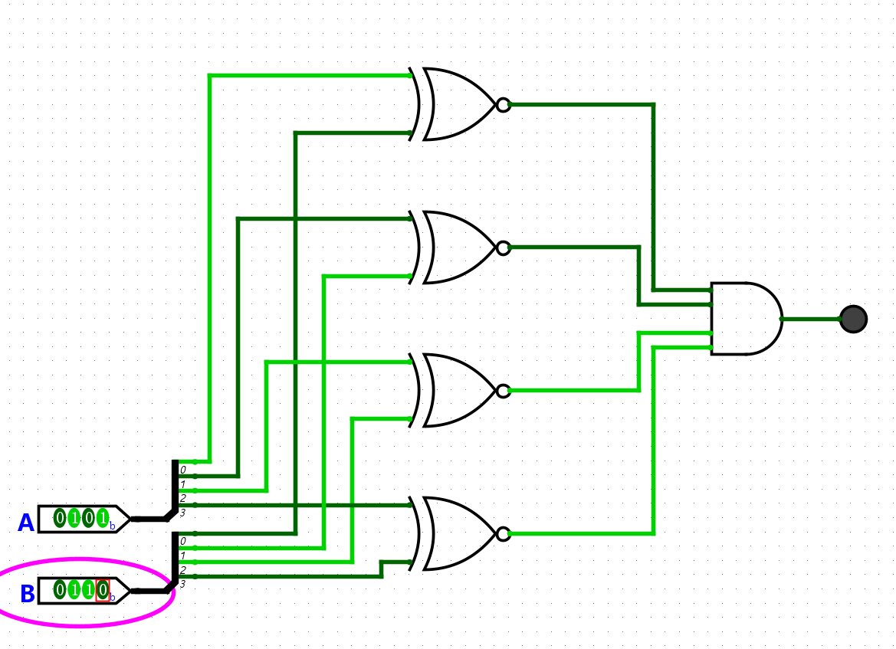

两个输入一致时LDE灯亮起，否则熄灭。

## 加法器

加法是算术运算的基础，因此**加法器**（*adder*）是数字电路里的重要组件。

### 半加器

**半加器**（*half adder, HA*）只有两个加数 $A$、$B$，输出本位和 $S$ 与进位 $C$。没有进位输入，所以叫「半」——还不足以单独扛多位加法的中间位。

| $A$ | $B$ | | $S$ | $C$ |
|:-:|:-:|:-:|:-:|:-:|
| 0 | 0 | | 0 | 0 |
| 0 | 1 | | 1 | 0 |
| 1 | 0 | | 1 | 0 |
| 1 | 1 | | 0 | 1 |

$S$ 在两加数不同时为 `1`；$C$ 仅在两加数都为 `1` 时为 `1`：

$$
S = A \oplus B,\qquad C = A\cdot B
$$

电路就是一个异或门加一个与门：

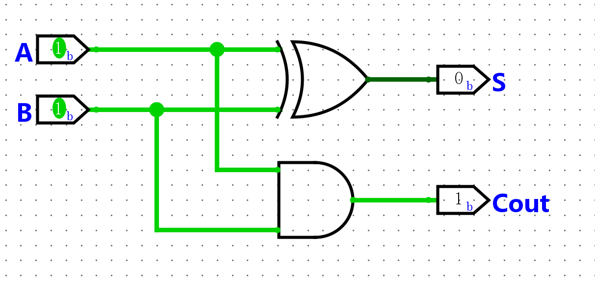

### 一位全加器

多位相加时，低位产生的进位必须参与高位运算，因此需要带**进位输入**的加法单元——**全加器**（*full adder, FA*）：

| 输入 | 含义 |
|:--|:--|
| $A$、$B$ | 本加数、被加数的当前位 |
| $C_{in}$ | 来自更低位的进位 |
| $S$ | 本位和 |
| $C_{out}$ | 送往更高位的进位 |

!!! note "半加器 vs 全加器"
    - 半加器：无 $C_{in}$，只管「两位相加」
    
    - 全加器：多一路 $C_{in}$，等价于「三位（$A,B,C_{in}$）的二进制求和」，才能级联成多位加法器

真值表如下：

| $A$ | $B$ | $C_{in}$ | | $S$ | $C_{out}$ |
|:-:|:-:|:-:|:-:|:-:|:-:|
| 0 | 0 | 0 | | 0 | 0 |
| 0 | 0 | 1 | | 1 | 0 |
| 0 | 1 | 0 | | 1 | 0 |
| 0 | 1 | 1 | | 0 | 1 |
| 1 | 0 | 0 | | 1 | 0 |
| 1 | 0 | 1 | | 0 | 1 |
| 1 | 1 | 0 | | 0 | 1 |
| 1 | 1 | 1 | | 1 | 1 |

- $S$：$A,B,C_{in}$ 里 `1` 的个数为奇数时为 `1`（三输入异或 / 奇校验）

- $C_{out}$：至少两个为 `1` 时产生进位（多数表决）

$$
\boxed{
\begin{aligned}
S &= A \oplus B \oplus C_{in} \\
C_{out} &= AB + BC_{in} + AC_{in}
\end{aligned}
}
$$

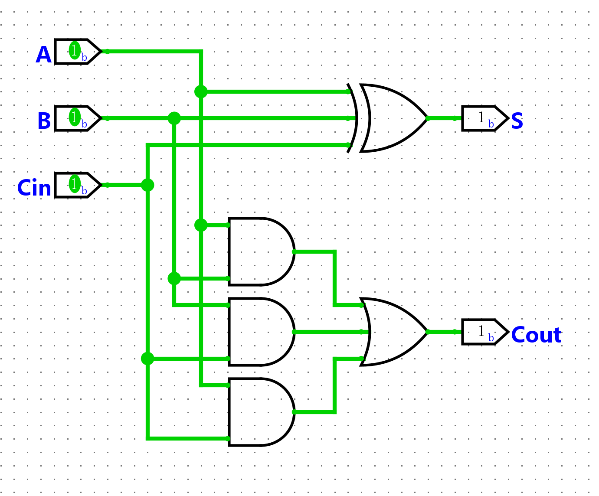

!!! warning "Logisim三输入异或门的语义调试"
    公式里的 $A\oplus B\oplus C_{in}$ 是**奇校验**：奇数个 `1` 则输出 `1`。因此 $A=B=C_{in}=1$ 时，$S=1$、$C_{out}=1$（$1+1+1_2=11_2$）。

    Logisim 里多输入 XOR 默认常是 **Exactly one**（恰好一个输入为高才输出 `1`）。此时三个 `1` 会得到 $S=0$，和全加器真值表不符，但 $C_{out}$ 用与或实现仍可能是对的——容易误以为「只错了一半」。

    因此需要选中 3 输入 XOR → 属性 *Multiple-Input Behavior* 改为 **When an odd number of inputs are on**；或改用两个 2 输入 XOR 串联：$(A\oplus B)\oplus C_{in}$。

$C_{out}$ 也可写成便于用半加器拼装的形式：

$$
C_{out} = AB + (A \oplus B)\,C_{in}
$$

要么 $A$、$B$ 本身就进位（$AB$），要么本位「半加和」为 `1` 且又吃到了 $C_{in}$。

!!! tip "用半加器拼全加器"
    两片 HA + 一个或门即可：

    1. 第一片 HA：对 $A$、$B$ 半加 → 中间和 $S_1 = A\oplus B$，中间进位 $C_1 = AB$

    2. 第二片 HA：对 $S_1$ 与 $C_{in}$ 半加 → 最终 $S = S_1\oplus C_{in}$，中间进位 $C_2 = S_1\cdot C_{in}$

    3. $C_{out} = C_1 + C_2$

    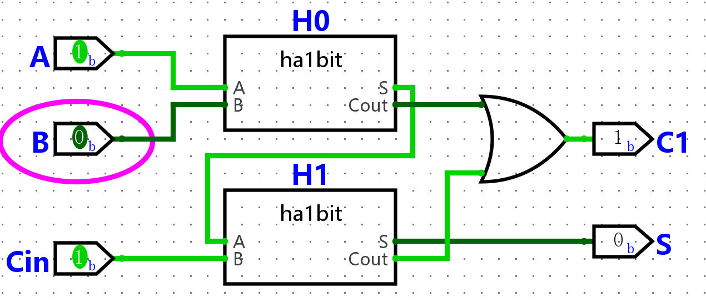

    与上面两式完全一致，只是把「异或 / 与」复用成了现成的 HA 子电路。

    !!! tip "接到多位"
        把 $n$ 个全加器按位排开：第 $i$ 位的 $C_{out}$ 接到第 $i+1$ 位的 $C_{in}$，最低位 $C_{in}$ 通常接 `0`。进位像波浪一样往高位传，就是后面的**行波进位加法器**（*ripple-carry adder, RCA*）。

### 多位全加器

将一位全加器进行级联，就可以得到多位全加器。下面是一个**四位行波进位加法器**(*4-bit ripple-carry adder, 4-bit RCA*)，使用LED指示是否产生溢出：

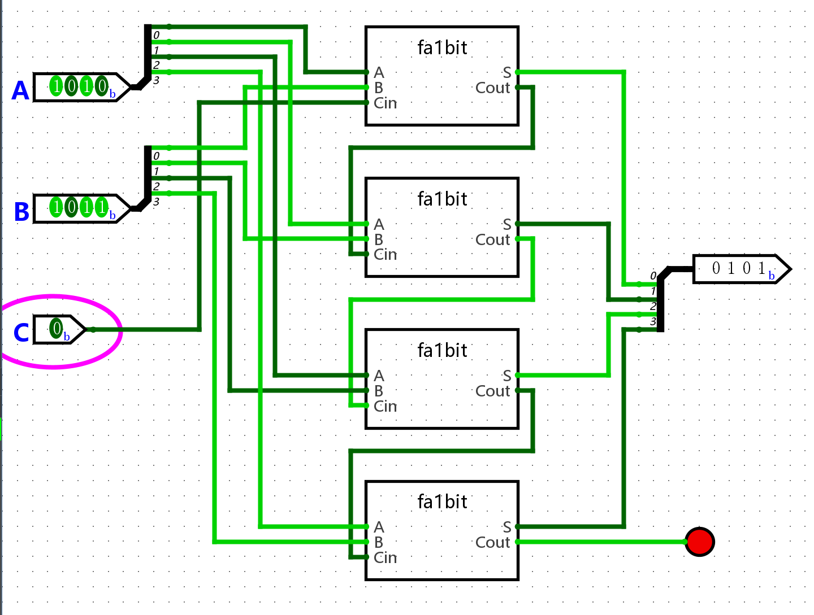

级联的思路很简单，*将低位全加器的进位输出接到高位全加器的进位输入*即可，和加法的进位传递方式一致：

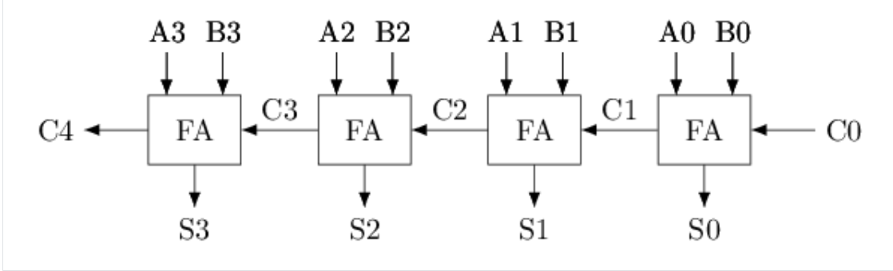

## 减法器

减法与加法对称：加法传**进位**（*carry*），减法传**借位**（*borrow*）。设计套路相同——先一位半减 / 全减，再级联成多位**行波借位减法器**。

计算 $A - B$（$A$ 被减数，$B$ 减数）；差记 $D$，借位输入 / 输出记 $B_{in}$ / $B_{out}$。

### 半减器

**半减器**（*half subtractor, HS*）只有 $A$、$B$，无低位借位。输出本位差 $D$ 与向高位的借位 $B_{out}$。

| $A$ | $B$ | | $D$ | $B_{out}$ |
|:-:|:-:|:-:|:-:|:-:|
| 0 | 0 | | 0 | 0 |
| 0 | 1 | | 1 | 1 |
| 1 | 0 | | 1 | 0 |
| 1 | 1 | | 0 | 0 |

$D$ 仍是「两比特不同则为 `1`」；$B_{out}$ 仅在「不够减」（$A=0$ 且 $B=1$）时为 `1`：

$$
D = A \oplus B,\qquad B_{out} = \overline{A}\cdot B
$$

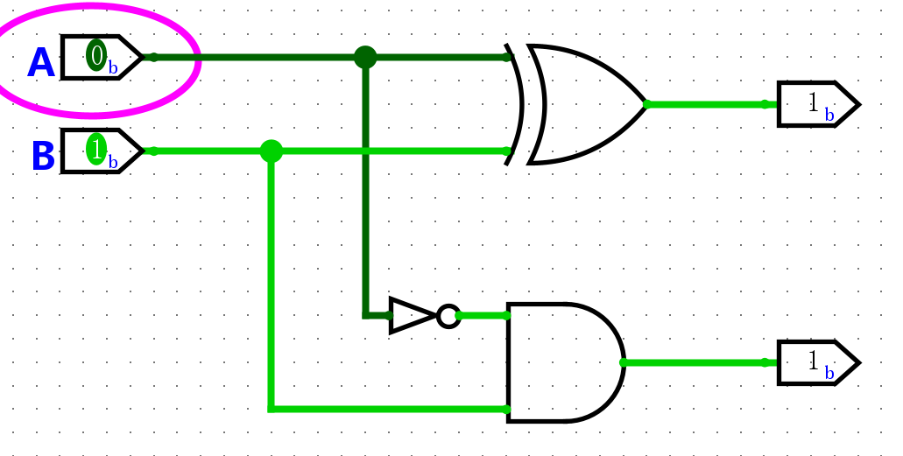

差与和的异或式相同；借位是 $\overline{A}B$，进位是 $AB$——差在被减数取反再与。

### 一位全减器

多位减法时低位可能向上借，因此需要 **全减器**（*full subtractor, FS*）：在半减基础上增加借位输入 $B_{in}$。

| 输入 / 输出 | 含义 |
|:--|:--|
| $A$、$B$ | 被减数、减数的当前位 |
| $B_{in}$ | 来自更低位的借位 |
| $D$ | 本位差 |
| $B_{out}$ | 送往更高位的借位 |

!!! note "半减器 vs 全减器"
    - 半减器：无 $B_{in}$，只管「两位相减」
    
    - 全减器：还要减去低位借来的 $1$，才能级联成多位减法器——与半加 / 全加的关系一一对应

**真值表**：

| $A$ | $B$ | $B_{in}$ | | $D$ | $B_{out}$ |
|:-:|:-:|:-:|:-:|:-:|:-:|
| 0 | 0 | 0 | | 0 | 0 |
| 0 | 0 | 1 | | 1 | 1 |
| 0 | 1 | 0 | | 1 | 1 |
| 0 | 1 | 1 | | 0 | 1 |
| 1 | 0 | 0 | | 1 | 0 |
| 1 | 0 | 1 | | 0 | 0 |
| 1 | 1 | 0 | | 0 | 0 |
| 1 | 1 | 1 | | 1 | 1 |

- $D$：与全加器的 $S$ 同形——$A,B,B_{in}$ 的奇校验（三输入异或）

- $B_{out}$：在「$A$ 不够支付 $B$ 与 $B_{in}$」时产生——化简后为三项积之和

$$
\boxed{
\begin{aligned}
D &= A \oplus B \oplus B_{in} \\
B_{out} &= \overline{A}\,B + \overline{A}\,B_{in} + B\,B_{in}
\end{aligned}
}
$$

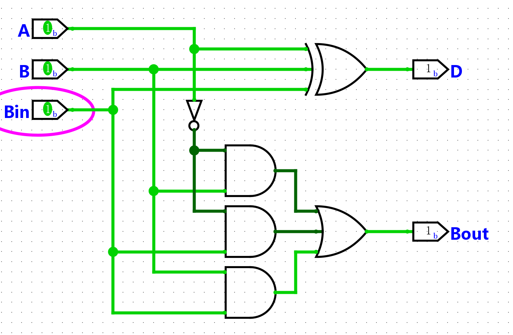

$B_{out}$ 也常写成便于用半减器拼装的形式：

$$
B_{out} = \overline{A}\,B + \overline{(A \oplus B)}\,B_{in}
$$

要么本位 $A < B$ 直接产生借位（$\overline{A}B$），要么本位差为 `0`（$A$ 与 $B$ 相同）却又被低位借走，于是继续向上借。

!!! tip "和全加器公式对照"
    | | 和 / 差 | 进位 / 借位 |
    |:--|:--|:--|
    | 全加 | $S = A\oplus B\oplus C_{in}$ | $C_{out} = AB + BC_{in} + AC_{in}$ |
    | 全减 | $D = A\oplus B\oplus B_{in}$ | $B_{out} = \overline{A}B + \overline{A}B_{in} + BB_{in}$ |

    差与和同构；借位相对进位，是把「被减数 $A$」一侧改成了 $\overline{A}$。搭电路时 3 输入异或仍须用**奇校验**语义，见[全加器处的 Logisim 提示](#一位全加器)。

#### 用半减器拼全减器

两片 HS + 一个或门，对偶于「两片 HA 拼 FA」：

1. 第一片 HS：对 $A$、$B$ 半减 → $D_1 = A\oplus B$，$B_1 = \overline{A}B$

2. 第二片 HS：对 $D_1$ 与 $B_{in}$ 半减 → $D = D_1\oplus B_{in}$，$B_2 = \overline{D_1}\,B_{in}$

3. $B_{out} = B_1 + B_2$

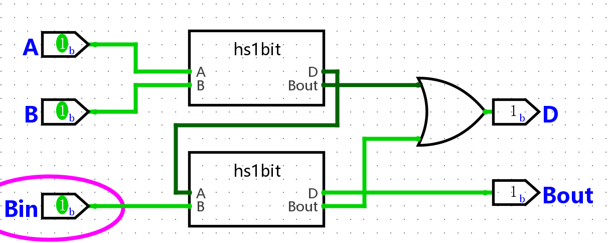

### 四位行波借位减法器

与[多位全加器](#多位全加器)一样：把 4 个全减器按位排开，第 $i$ 位的 $B_{out}$ 接到第 $i+1$ 位的 $B_{in}$；最低位 $B_{in}$ 接 `0`。借位从低位向高位「波浪」传递，称为**行波借位减法器**（*ripple-borrow subtractor*）。

- 输出 $D_3 D_2 D_1 D_0$：按无符号解释的差（若未发生向更高位的借位）

- 最高位 $B_{out}$：为 `1` 表示 $A < B$，无符号意义下「不够减」——可用 LED 指示，对应讲义里「是否产生借位」

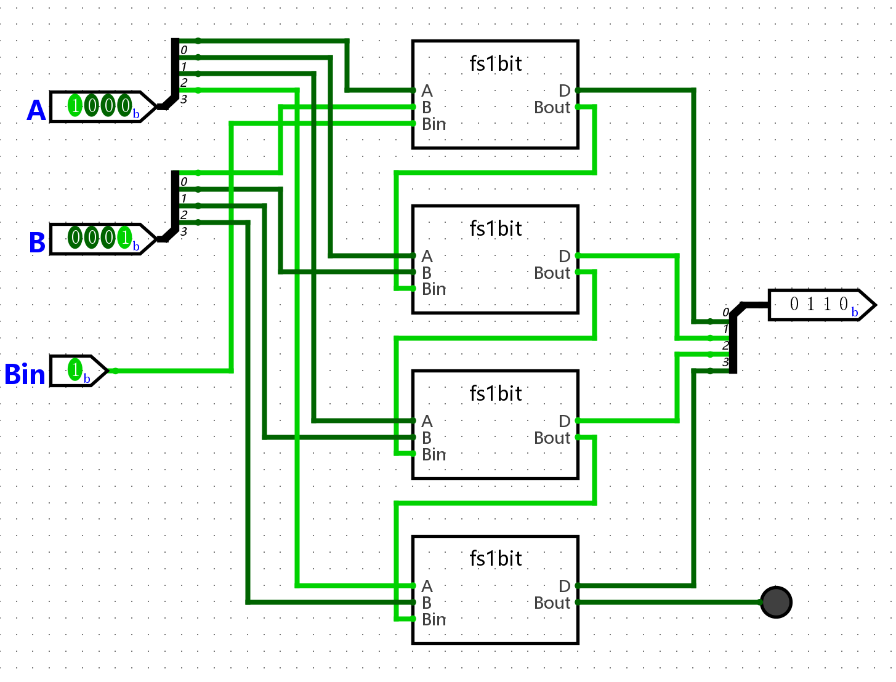

可以看出与RCA的结构几乎完全一致，只是把进位输入/输出改为了借位输入/输出。

!!! tip "用加法器做减法"
    无符号 / 稍后补码语境下常写 $A - B = A + \overline{B} + 1$：把减数按位取反，全加器链的最低 $C_{in}$ 接 `1`，即可复用 RCA。门级练习阶段先把全减器与行波借位搭熟；加减合一、原码 / 补码里的用法放到整数表示再展开。

## 现代计算机的整数编码与运算

前面的 [RCA](#多位全加器) 和 [RBS](#四位行波借位减法器) 默认把比特串当成**无符号数**。

要表示负数，先有编码约定，再谈「按该约定做加法」的电路。

!!! review "编码与表示范围"
    - [408 · 数制与编码 · 原码 / 反码 / 补码 / 移码](408/数制与编码.md#原码补码反码移码)

    - [CS61C · Number Representation](cs61c/Number%20Representation.md)（Sign-Magnitude / Ones’ Complement / Two’s Complement / Overflow）

    - [408 · 运算方法和运算电路 · 定点数的补码加减与溢出](408/运算方法和运算电路.md#定点数的补码加减运算)

原码加法器、反码加法器，以及补码加法上的溢出检测。补码本身可直接用 RCA。

### 原码加法器

原码（*sign-and-magnitude*）：最高位为符号（`0` 正 / `1` 负），其余为绝对值。

!!! review
    - [原码表示法](408/数制与编码.md#原码表示法)
    
    - [Sign-Magnitude](cs61c/Number%20Representation.md#Sign-Magnitude)

不能对整串比特直接使用 RCA。按符号分为三种情况：

| 情况 | 是否可以直接用 RCA | 正确做法 |
|:--|:--:|:--|
| 两数皆正 | 可以 | 绝对值相加，符号为 `0` |
| 两数皆负 | 否（符号会错） | 绝对值相加，符号强制为 `1` |
| 一正一负 | 否（绝对值也错） | 绝对值做减法：大减小，符号取绝对值较大一方 |

因此原码加法器 = **绝对值通路上的加法器 + 减法器 + 多路选择**，外加符号逻辑：

1. 拆开符号位 $S_A,S_B$ 与幅度 $M_A,M_B$

2. 同号（$S_A = S_B$）：$M = M_A + M_B$（RCA），结果符号 $= S_A$

3. 异号（$S_A \neq S_B$）：**用[行波借位减法器](#四位行波借位减法器)比较并相减**，分两种情况：

    - 若 $M_A \ge M_B$ 则 $M = M_A - M_B$、符号取 $S_A$

    - 若 $M_A < M_B$ 则 $M = M_B - M_A$、符号取 $S_B$

    $A - B$ 行波借位减法模块的借位输出用于符号位与两种减法情况的选择控制

1. 拼回 $\{符号, M\}$；可用多余七段管显示负号（符号为 `1` 时亮 `-`）

2. 幅度溢出检测：在同号相加且幅度进位 $C_{out} = 1$ 时为真，即 $\overline{(S_A \oplus S_B)} \cdot C_{out}$

同号走「加」、异号走「减」，数据通路选择基于控制信号的意义使用对应位数[多路选择器](#多路选择器)即可。

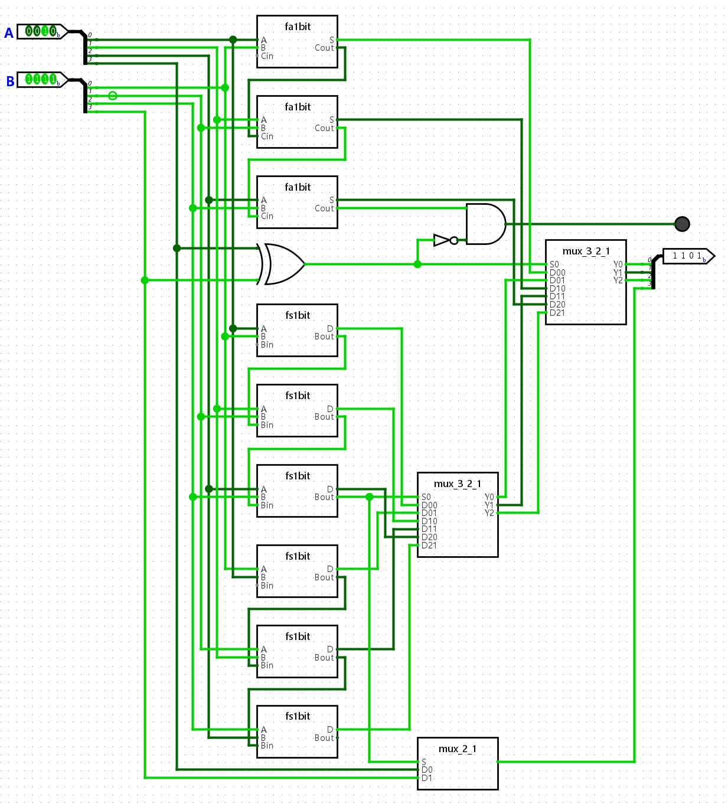

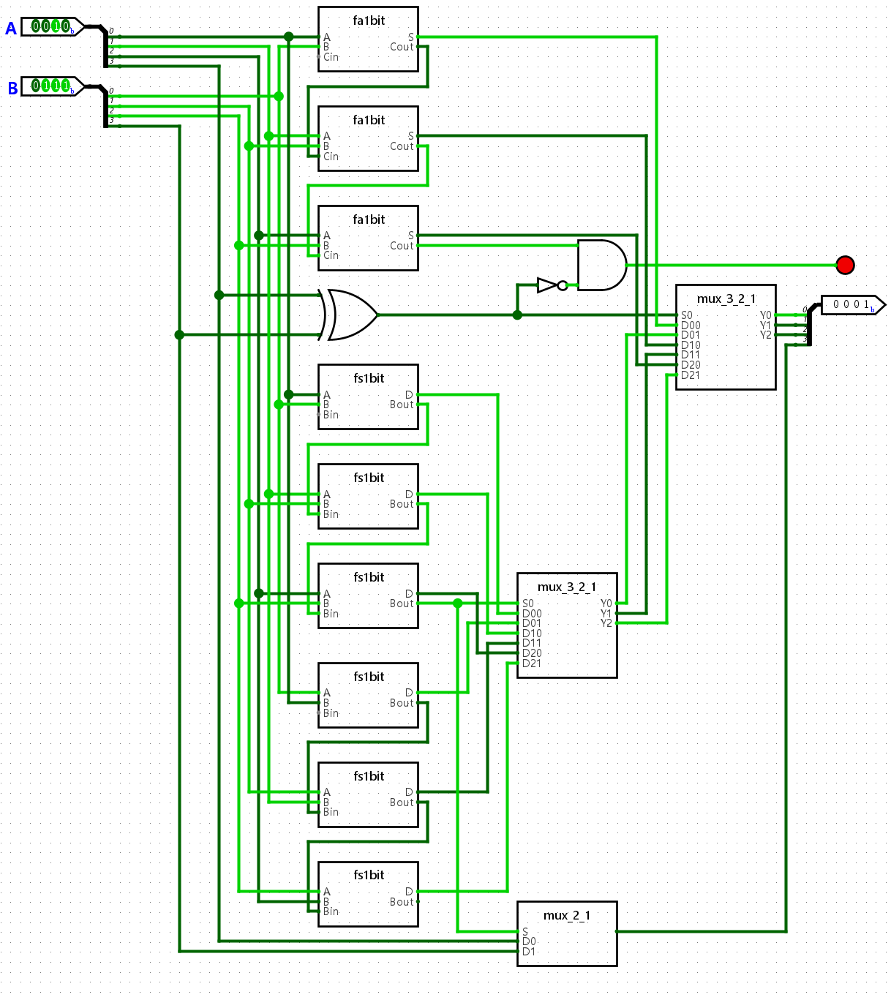

### 反码加法器

反码（*ones’ complement*）：正数同原码；负数 = 对应正数原码**按位取反**（含符号位习惯下的全比特翻转）。

!!! review
    - [反码表示法](408/数制与编码.md#反码表示法)
    
    - [Ones’ Complement](cs61c/Number%20Representation.md#Ones-Complement)

多数时候「当普通二进制加」符号也能对，但会出现：

- 互为相反数 → 全 `1`，解释为 $-0$

- 带 $-0$ 再运算、或一般「有负数参与」时，RCA 结果相对真值常**偏 1**（需要修正）

有两种搭法：

#### 经原码绕行

1. 先反码转化真值等价的原码（正数照抄；负数先按反码定义还原幅度）

2. 送入[原码加法器](#原码加法器)

3. 结果再变回反码

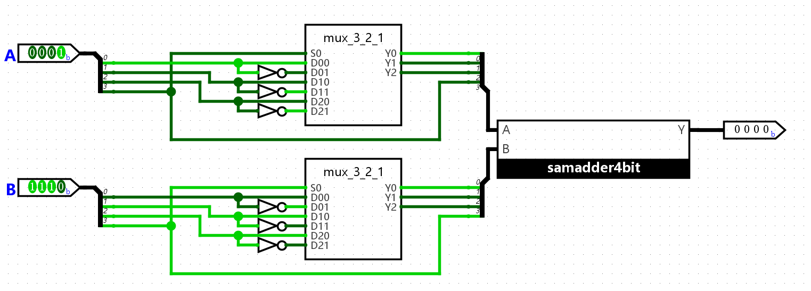

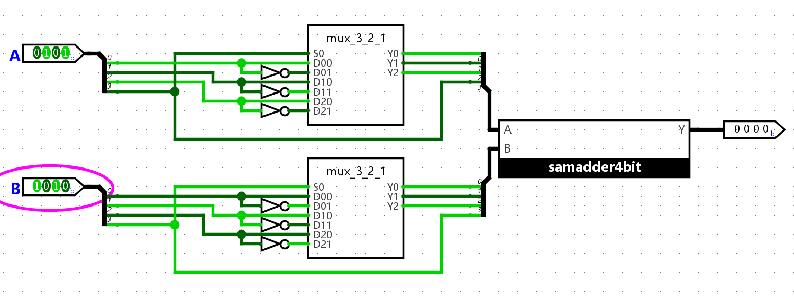

#### RCA + 循环进位

对两个反码直接做 RCA，设最高进位为 $C_{out}$：

1. 若 $C_{out} = 0$：和就是反码结果

2. 若 $C_{out} = 1$：把该进位**再加回**最低位（相当于对 RCA 的和再 $+1$）——这就是「在 RCA 上加一点电路」的常见修法

可把 $C_{out}$ 接回最低位 $C_{in}$ 做第二次加，或用一小段「和 + $C_{out}$」的增量电路。用 3～4 位例子扫一遍异号 / $-0$ 边界，核对修正后是否与十进制一致。

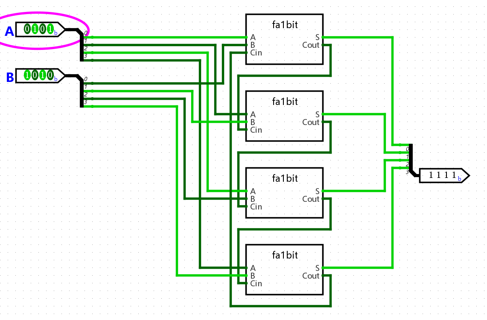

### 补码加法器及其溢出检测

补码（*two’s complement*）：正数同原码；负数 = 对应正数**按位取反再加一**。$n$ 位补码范围是 $-2^{n-1}\!\sim\!+2^{n-1}-1$（4 位即 $-8\!\sim\!+7$），且**只有一种零** `0000`。

!!! review "编码与为何 RCA 直接正确"
    - [补码表示法](408/数制与编码.md#补码表示法)

    - [Two’s Complement](cs61c/Number%20Representation.md#Twos-Complement)

相对原码 / 反码，补码的电路结论很干脆：

| 编码 | 是否可以整串直接使用 RCA | 典型额外逻辑 |
|:--|:--:|:--|
| 原码 | 否 | 拆符号、加减 MUX、幅度溢出 |
| 反码 | 近似可以 | 循环进位 / 经原码绕行；有 $+0/-0$ |
| **补码** | **可以** | 只要再加**溢出标志** $V$（可选加减合一） |

因此「补码加法器」在门级上就是：**把操作数整段（含符号位）送进已有 [RCA](#多位全加器)**，和的 MSB 即结果符号——不必像原码那样另拼符号通路，也不必像反码那样做循环进位。

#### 纯加法

1. 输入 $A$、$B$ 按**补码**解释（拨码开关拨的就是补码比特串）

2. $n$ 位 RCA：最低 $C_{in}=0$，进位链从低到高照常级联

3. 输出 $S$：整段按补码读真值；**符号 = $S_{n-1}$**，无需符号 MUX

实例化已有 4 位 RCA → $A/B$ 各接 4 位拨码 → $C_{in}$ 接地 → 和接七段 / 探针；先不接溢出灯，确认算术对再加 $V$。

#### 加减合一

数学上 $A-B = A+(-B)$，而 $(-B)$ 的补码 = $\overline{B}+1$，故：

$$
A - B = A + \overline{B} + 1
$$

电路（加减合一）：

1. 对 $B$ 的每一位接异或门，控制端记 $\texttt{Sub}$（`0` 加 / `1` 减）：$\texttt{Sub}=1$ 时送 $\overline{B}$，否则送 $B$

2. RCA 最低 $C_{in}$ 接 $\texttt{Sub}$（减时相当于再 $+1$）

3. 同一套 RCA 完成加 / 减

这就是 ALU 里常见加减单元的雏形：

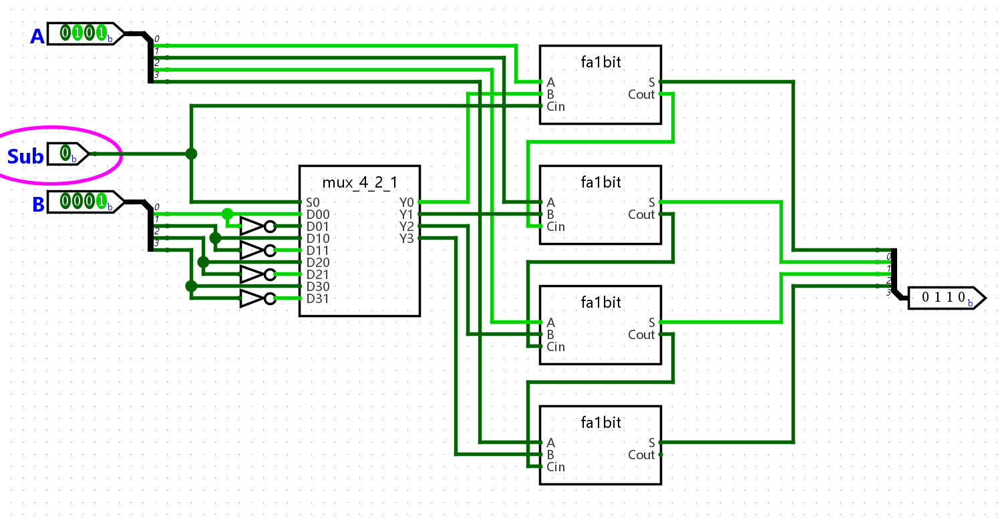

!!! tip "和行波借位减法器的关系"
    无符号 / 原码**幅度**相减仍可用 [RBS](#四位行波借位减法器)。补码减法优先复用 RCA + 取反加一，不必再维护一套借位链。

#### 溢出检测

补码表示范围有限；越过「最大正 ↔ 最小负」边界即**溢出**（*overflow*）——$S$ 的比特仍在，但按补码解释已与数学和不符。直觉：两正相加得到符号为 `1`，或两负相加得到符号为 `0`。

!!! review
    - [Integer Overflow](cs61c/Number%20Representation.md#Integer-Overflow)

    - [408 · 溢出判断](408/运算方法和运算电路.md#溢出判断)

记符号位下标为 $n-1$。符号位那一级全加器有进位入 $C_{in}^{(n-1)}$、进位出 $C_{out}$（整链最高进位），和的符号为 $S_{n-1}$，操作数符号为 $A_{n-1},B_{n-1}$。

两种等价常用判据：

1. **符号规则**：两正得负，或两负得正

$$
V = \overline{A_{n-1}}\,\overline{B_{n-1}}\,S_{n-1} + A_{n-1}\,B_{n-1}\,\overline{S_{n-1}}
$$

（做减法时，参与判据的「第二操作数」应是**送进 RCA 的那个加数**，即已取反后的 $\overline{B}$；或直接用下面的进位异或式，不牵涉符号改写。）

2. **符号位进位**：符号位进位入、出不同

$$
V = C_{in}^{(n-1)} \oplus C_{out}
$$

在 4 位 RCA 上引出符号位全加器的 $C_{in}$ 与 $C_{out}$，异或后接 LED 即可：

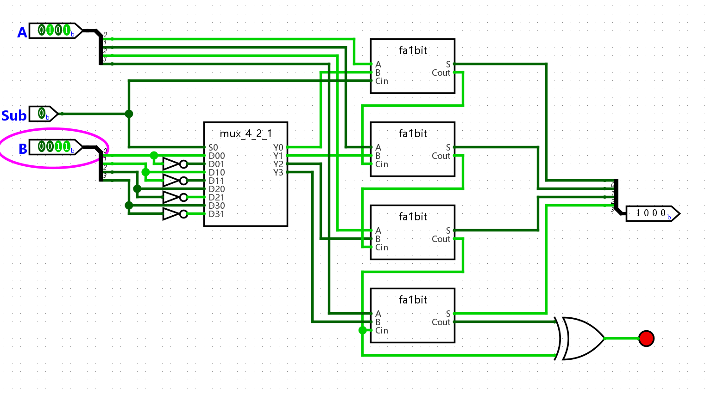

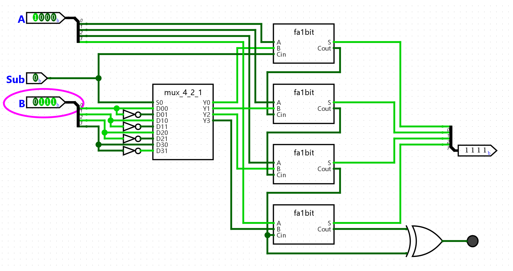

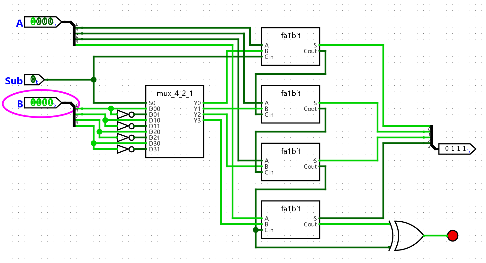

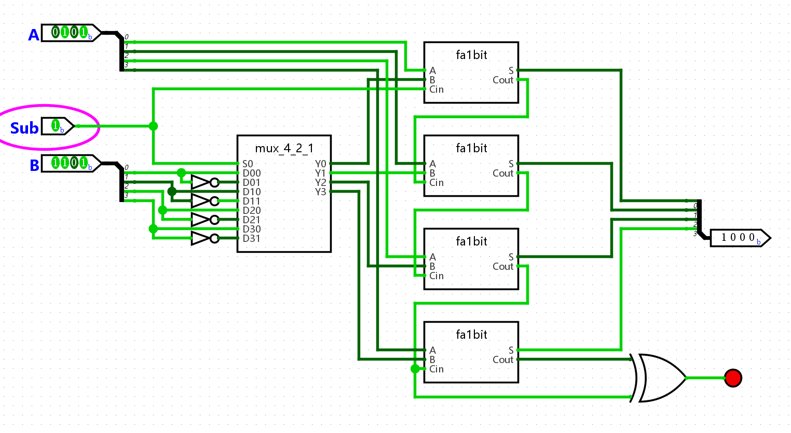

| 运算 | 编码 | 结果与说明 | $V$ |
|:--|:--|:--|:--:|
| $5+3$ | `0101`+`0011`→`1000` | $8$ 超出 → 读成 $-8$ | 1 |
| $(-8)+7$ | `1000`+`0111`→`1111` | $-1$，未越界 | 0 |
| $(-8)+(-1)$ | `1000`+`1111`→`0111` | $-9$ 超出 → 读成 $+7$ | 1 |
| $5-(-3)$ | `0101`-`1101`→`1000` | $8$，越界，同第一种情况 | 1 |

!!! tip "无符号进位 vs 有符号溢出"
    最高 $C_{out}$ = **无符号进位**；补码溢出是 $V$（LED灯）。

    例如 `1111`+`0001`：无符号有进位，补码是 $(-1)+1=0$，**$V=0$**：
    
    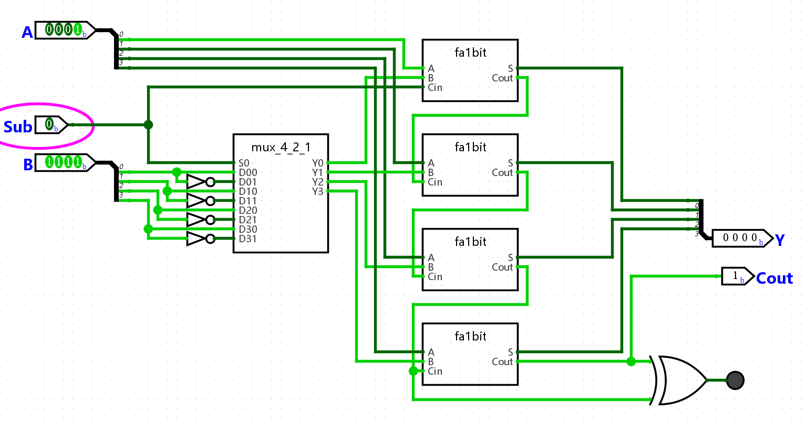
