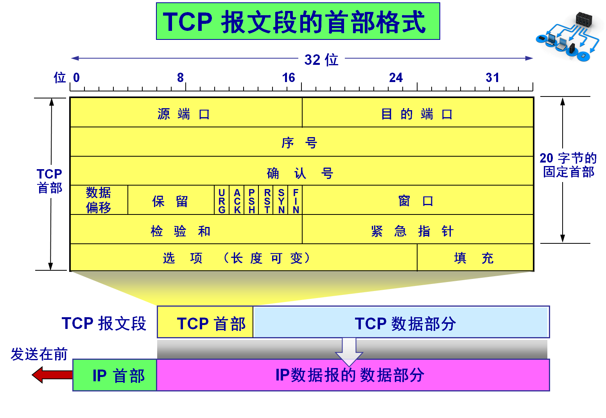
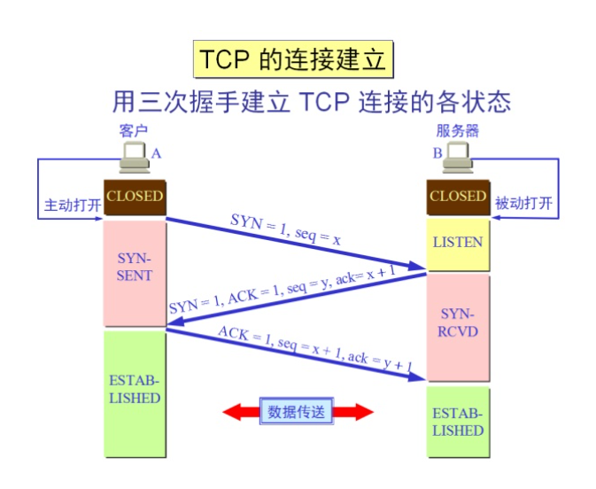
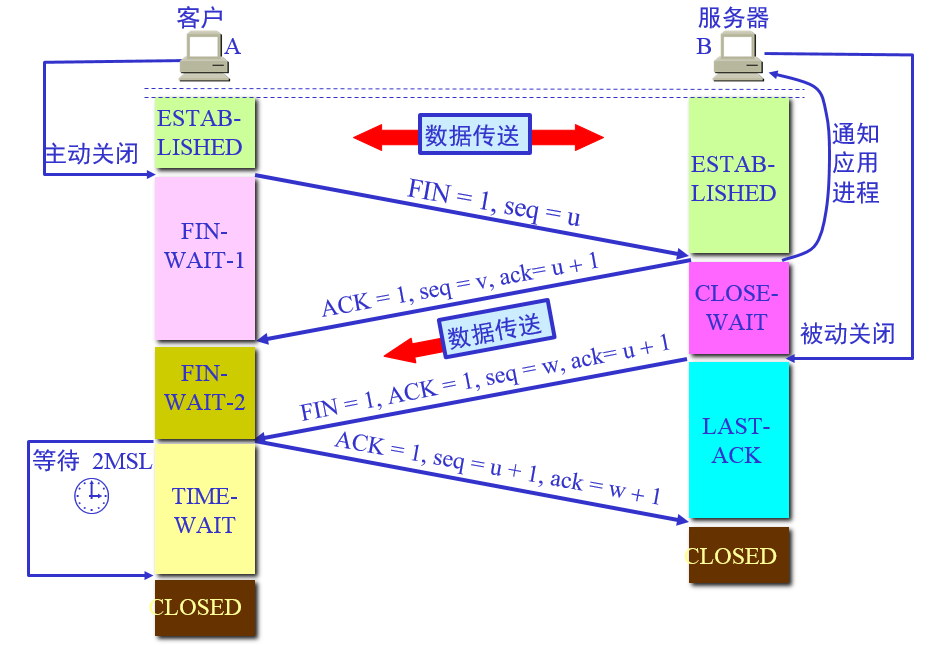
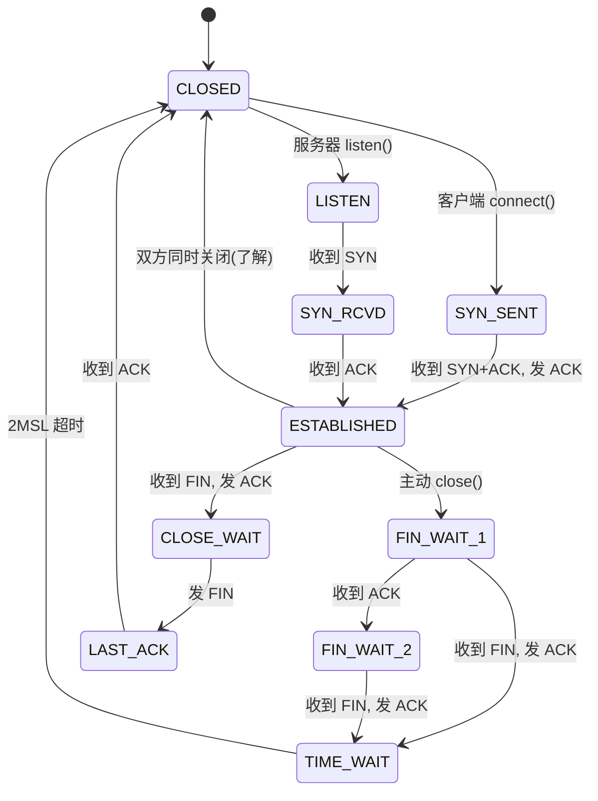
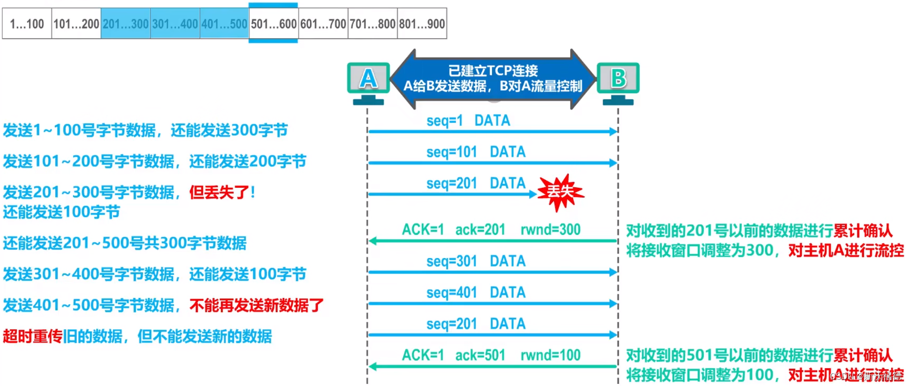
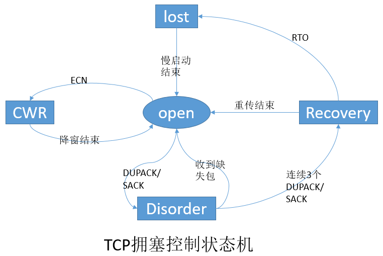
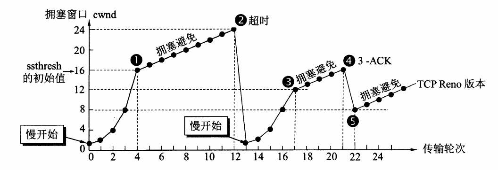
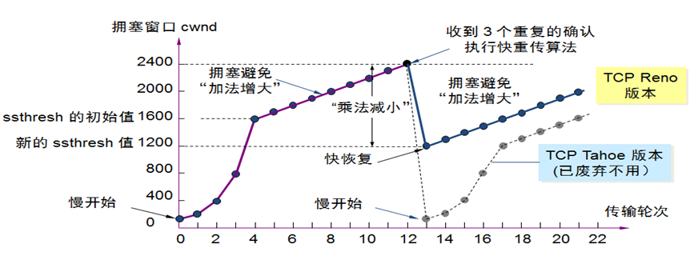

# TCP

**TCP**（*Transmission Control Protocol*, 传输控制协议）是一种建立在不可靠的IP层上的、可靠的、面向连接的、基于字节流的数据传输协议。主要解决传输的可靠、有序、无丢失、和不重复问题。

## TCP的特点

1. TCP是面向连接的传输层协议，TCP连接是一条逻辑连接。

2. 每一条TCP连接只能有两个端点，每一条TCP连接只能是一对一的。

3. TCP提供可靠交付的服务，保证传送的数据无差错、不丢失、不重复且有序。

4. TCP提供全双工通信，允许通信双方的应用进程在任何时候都能发送数据，为此TCP连接的两端都设有发送缓存和接收缓存，用来临时存放双向通信的数据。

    - 发送缓存用来暂时存放以下数据：
    
        - 发送应用程序传送给发送方TCP准备发送的数据；

        - TCP已发送但尚未收到确认的数据。

    - 接收缓存用来暂时存放以下数据：

        - 按序到达但尚未被接收应用程序读取的数据；

        - 不按序到达的数据。

5. TCP是面向字节流的，虽然应用程序和TCP的交互是一次一个数据块（大小不等），但TCP把应用程序交下来的数据仅视为一连串的无结构的字节流。

!!! tip
    TCP和UDP在发送报文时所采用的方式完全不同。

    UDP报文的长度由发送应用进程决定，而TCP报文的长度则根据接收方给出的窗口值和当前网络拥塞程度来决定。

    若应用进程传送到TCP缓存的数据块太长，则TCP就把它划分得短一些再传送；若太短，则TCP也可等到积累足够多的字节后再构成报文段发送出去。

## TCP报文段

TCP传输的数据单元称为**报文段**。其既可以用来运载数据，也可以用来建立连接、释放连接和应答。

一个TCP报文段分为首部和数据两个部分，整体向下封装在IP数据报的数据部分。首部最短为 $20B$，后面有 $4N$ 字节是根据需要而增加的选项，长度为 $4B$ 的整数倍。

### TCP报文段的首部格式与各字段的意义



#### 源端口和目的端口

各占 $2B$，共 $4B$。作用与 UDP 相同：用于标识发送端和接收端的应用进程，实现传输层的**复用与分用**。

- **源端口**：标识发送方应用进程；若不需要对方回信，可置为 0。

- **目的端口**：标识接收方应用进程；TCP 根据此字段将报文段交付给正确的应用进程。

#### 序号

占 $4B$，共 $32$ 位。表示本报文段所发送数据的**第一个字节**在整个字节流中的序号。

- TCP 面向字节流，序号按**字节**编号，而非按报文段编号。

- 建立连接时，双方会随机选择一个**初始序号**（ISN），后续序号在此基础上递增。

- 若报文段仅含控制信息（如 SYN、ACK、FIN），不含数据，则序号字段仍有效，表示发送方下一个要发送的字节的序号（纯 ACK 报文也有序号）。

#### 确认号

占 $4B$，共 $32$ 位。仅在 **ACK = 1** 时有效，表示接收方**期望收到**发送方下一个报文段的第一个字节的序号，即"已正确收到确认号之前的所有字节"。

- 采用**累积确认**：确认号 $N$ 表示已收到序号小于 $N$ 的所有字节。

- 若报文段不含确认信息（ACK = 0），则确认号字段无意义。

#### 数据偏移

占 $4$ 位。指出 TCP 报文段**数据起始处**距离 TCP 报文段起始处有多远，实际上指出了 TCP 报文段的**首部长度**。

- 以 $4B$ 为单位，最小值为 $5$（即首部 $20B$），最大值为 $15$（即首部 $60B$，含选项）。

- 作用类似 IP 首部的"首部长度"字段，用于接收方定位数据部分的起始位置。

#### 保留

占 $6$ 位，保留为今后使用，目前应置为 $0$。

#### 紧急位URG

占 $1$ 位。当 **URG = 1** 时，表明紧急指针字段有效，本报文段含有**紧急数据**，应优先交付给上层应用。

- 紧急数据是发送方应用进程插入到发送缓存最前面的数据，通常不超过 $1B$。

#### 确认位ACK

占 $1$ 位。当 **ACK = 1** 时，确认号字段有效；TCP 规定，连接建立后所有报文段的 ACK 都必须置 $1$。

- 连接建立前（如三次握手第一次），ACK 可以为 $0$。

#### 推送位PSH

占 $1$ 位。当 **PSH = 1** 时，接收方 TCP 收到该报文段后，应尽快交付给接收应用进程，而不再等待缓存填满。

- 适用于交互式应用（如 Telnet），要求接收方立即响应。

#### 复位位RST

占 $1$ 位。当 **RST = 1** 时，表明 TCP 连接出现**严重差错**（如主机崩溃、端口不存在），必须**释放连接**并重新建立。

- 也可用于拒绝非法连接请求或异常报文段。

#### 同步位SYN

占 $1$ 位。当 **SYN = 1** 时，表明这是一个**连接请求**或**连接接受**报文段。

- [三次握手](#TCP连接的建立)：第一次和第二次握手中 SYN = 1。

- 建立连接时，SYN 报文段会消耗一个序号（序号字段值为 ISN）。

#### 终止位FIN

占 $1$ 位。当 **FIN = 1** 时，表明发送方**已无数据发送**，要求释放连接。

- [四次挥手](#TCP连接的释放)：主动关闭方发送 FIN = 1 的报文段，FIN 也会消耗一个序号。

#### 窗口

占 $2B$，共 $16$ 位。用于[流量控制](#TCP流量控制)，告知发送方：接收方当前**愿意接收**的字节数量（即接收窗口 rwnd）。

- 窗口值 $W$ 表示：在确认号所指示的位置起，接收方还能再接收 $W$ 个字节。

- 发送方发送窗口 = min(rwnd, cwnd)，其中 cwnd 为拥塞窗口，由拥塞控制决定。

#### 校验和

占 $2B$。检验 TCP 报文段的**完整性**，包括首部和数据。

- 计算方式[与 UDP 相同](UDP.md#UDP校验和的计算)，采用 **16 位反码求和**，检验范围为 **伪首部 + TCP 首部 + 数据**。

- 伪首部格式与 UDP 类似，共 $12B$，含源 IP、目的 IP、协议号（TCP 为 6）、TCP 长度（首部 + 数据）。

- TCP 校验和**必须计算**，不能置 0（与 UDP 不同）。

#### 紧急指针

占 $2B$。当 **URG = 1** 时有效，指出本报文段中**紧急数据的末尾**在报文段中的位置（从序号字段值开始计数的偏移量）。

- 紧急指针 + 序号字段 = 紧急数据最后一个字节在字节流中的序号 + 1。

#### 选项

长度可变，为 $4B$ 的整数倍。常见选项包括：

| 选项 | 说明 |
|------|------|
| **MSS**（最大报文段长度） | 仅在 SYN 报文段中出现，告知对方本端缓存能接收的最大报文段长度（不含 TCP 首部） |
| **窗口扩大** | 在 SYN 报文段中协商，将窗口字段从 16 位扩大到 32 位，解决高速网络下窗口过小的问题 |
| **时间戳** | 用于 RTT 测量、防止序号回绕（PAWS）等 |
| **SACK**（选择确认） | 允许接收方告知发送方已收到的不连续字节块 |

#### 填充

若 TCP 首部长度不是 $4B$ 的整数倍，则用 $0$ 填充，使首部长度为 $4B$ 的整数倍。

## TCP连接管理

TCP是面向连接的协议，因此每个TCP连接都有三个阶段：连接建立、数据传输和连接释放。

在建立TCP连接时，需要解决以下三个问题：

- 要使每一方能够确知对方是否"准备好了"，也就是要解决"握手"问题。

- 要允许双方协商一些参数，如最大报文段长度（MSS）等，这就是"对话"。

- 能够对运输实体资源（如缓存空间、连接表中的项目等）进行分配，即进行流量控制。

TCP把连接作为最基本的抽象，每条TCP连接都有两个端点，这个端点不是主机的IP地址，不是应用进程，也不是传输层的协议端口。TCP连接的端点称为[套接字](传输层提供的服务.md#套接字)，每条TCP连接由通信的两端（两个套接字）唯一确定。

!!! info
    同一个IP地址和端口号都可以同时拥有多个TCP连接，即可以被多个TCP连接[复用](传输层提供的服务.md#复用和分用)。

TCP连接采用[客户端/服务端模式](../../操作系统/408/进程的描述与控制.md#客户端-服务器系统)，主动发起连接建立的应用进程称为**客户**（*client*），而被动等待连接建立的应用进程称为**服务器**（*server*）。

### TCP连接的建立

TCP连接的建立需要经历三个步骤，通常称为*三次握手*：



建立连接前，服务器需要处于**LISTEN**（监听）状态，等待客户端的连接请求。

1. **第一次握手**：客户端 → 服务器，发送 **SYN 报文段**。

    | 字段 | 取值 |
    |------|------|
    | SYN | 1 |
    | ACK | 0（连接建立前 ACK 可为 0，确认号无意义） |
    | seq | 客户端随机选择的初始序号，记为 $x$ |
    | 选项 | 常携带 **MSS** 等参数，供双方协商 |

    - 客户端由 **CLOSED** 进入 **SYN_SENT** 状态，等待服务器确认。

    - SYN 报文段**消耗一个序号**：客户端下一个要发送的数据字节序号为 $x + 1$。

2. **第二次握手**：服务器 → 客户端，发送 **SYN + ACK 报文段**。

    | 字段 | 取值 |
    |------|------|
    | SYN | 1 |
    | ACK | 1 |
    | seq | 服务器随机选择的初始序号，记为 $y$ |
    | ack | $x + 1$（表示期望收到客户端下一个字节序号为 $x + 1$，即已收到序号 $x$ 的 SYN） |

    - 服务器收到 SYN 后，若同意建立连接，则分配连接资源，并进入 **SYN_RCVD** 状态。

    - 服务器同样消耗一个序号：下一个要发送的字节序号为 $y + 1$。

    - 该报文段同时完成两件事：**确认**客户端的 SYN（ACK=1），以及**发起**自己的 SYN（SYN=1），因此称为 SYN + ACK。

3. **第三次握手**：客户端 → 服务器，发送 **ACK 报文段**。

    | 字段 | 取值 |
    |------|------|
    | SYN | 0 |
    | ACK | 1 |
    | seq | $x + 1$（SYN 已消耗序号 $x$，故从 $x + 1$ 起） |
    | ack | $y + 1$（确认服务器的 SYN，期望收到序号 $y + 1$ 起的字节） |

    - 客户端收到 SYN + ACK 后，向服务器发送确认，然后进入 **ESTABLISHED** 状态。

    - 服务器收到 ACK 后，进入 **ESTABLISHED** 状态。至此，TCP 连接建立完成，双方可开始全双工数据传输。

    - 第三次握手的 ACK **可以不携带数据**；若携带数据，则该数据也会占用序号。

!!! abstract
    设客户端 ISN 为 $x$，服务器 ISN 为 $y$，则三次报文可简记为：

    ```
    ① 客户端 → 服务器：SYN=1, seq=x
    ② 服务器 → 客户端：SYN=1, ACK=1, seq=y, ack=x+1
    ③ 客户端 → 服务器：ACK=1, seq=x+1, ack=y+1
    ```

    记忆要点：**SYN 消耗一个序号**，故确认号总是 **对方 ISN + 1**；连接建立后所有报文 **ACK 均为 1**。

#### 为什么要三次握手？

1. **确认双方收发能力**：第一次握手证明客户端"能发能收"；第二次握手证明服务器"能收能发"，且客户端"能收"；第三次握手证明客户端"能发"，服务器"能收"。两次握手无法可靠确认客户端的接收能力。

2. **协商初始序号**：双方各自随机选择 ISN，通过 seq 与 ack 字段同步，为后续按序传输和确认奠定基础。

3. **防止已失效的连接请求建立连接**（408 经典考点）：若客户端发出的 SYN 因网络滞留，客户端超时后重发 SYN 并完成连接、数据传输、释放连接；滞留的旧 SYN 稍后到达服务器时，若仅两次握手，服务器会误以为是新连接请求而建立连接，浪费资源并可能传错数据。三次握手下，服务器回复 SYN + ACK 后，客户端发现该连接已不存在，不会发送第三次 ACK，连接便不会真正建立。

#### 第三次 ACK 丢失会怎样？

- **客户端**：已收到 SYN + ACK，认为连接已建立，进入 **ESTABLISHED**，可开始发送数据。

- **服务器**：未收到第三次 ACK，仍停留在 **SYN_RCVD**，会**超时重传** SYN + ACK。

- **恢复方式**：若客户端随后发送的数据报文中 ACK=1 且 ack 正确，服务器收到后也会进入 **ESTABLISHED**；否则服务器多次重传 SYN + ACK 后可能关闭该半连接。

#### 连接建立过程中的状态转换

| 角色 | 发送/收到 | 状态变化 |
|------|-----------|----------|
| 客户端 | 发送 SYN | CLOSED → **SYN_SENT** |
| 客户端 | 收到 SYN + ACK，发送 ACK | SYN_SENT → **ESTABLISHED** |
| 服务器 | 监听中 | **LISTEN** |
| 服务器 | 收到 SYN，发送 SYN + ACK | LISTEN → **SYN_RCVD** |
| 服务器 | 收到 ACK | SYN_RCVD → **ESTABLISHED** |

### TCP连接的释放

TCP 连接是全双工的，每个方向的数据传输**独立关闭**。因此释放连接需要经过四个步骤，通常称为*四次挥手*：



设连接已建立，客户端主动关闭，服务器被动关闭。客户端当前下一个要发送的字节序号为 $u$，服务器为 $v$（均为双方当前 seq，而非 ISN）。

1. **第一次挥手**：客户端 → 服务器，发送 **FIN 报文段**。

    | 字段 | 取值 |
    |------|------|
    | FIN | 1 |
    | ACK | 1（连接建立后 ACK 恒为 1） |
    | seq | $u$ |
    | ack | 当前期望收到的对方序号（若本段无新确认信息，仍携带此前正确的 ack） |

    - 客户端应用进程调用关闭连接，TCP 进入 **FIN_WAIT_1** 状态。

    - FIN 报文段**消耗一个序号**：客户端此后不再发送数据（仍 **可以接收** 数据），下一个序号应为 $u + 1$。

    - 客户端发出 FIN 只表示"我这边没有数据要发了"，**并不立即切断接收方向**。

2. **第二次挥手**：服务器 → 客户端，发送 **ACK 报文段**。

    | 字段 | 取值 |
    |------|------|
    | FIN | 0 |
    | ACK | 1 |
    | ack | $u + 1$（确认已收到客户端的 FIN） |

    - 服务器收到 FIN 后，进入 **CLOSE_WAIT** 状态，并通知应用进程：客户端请求关闭连接。

    - 此时 TCP 连接处于**半关闭**（*half-close*）状态：客户端 → 服务器方向已关闭，服务器 → 客户端方向仍可继续传输数据。

    - 若服务器仍有数据未发完，可在此阶段继续发送，客户端仍需接收。

3. **第三次挥手**：服务器 → 客户端，发送 **FIN 报文段**。

    | 字段 | 取值 |
    |------|------|
    | FIN | 1 |
    | ACK | 1 |
    | seq | $w$（服务器当前序号；若第二步之后未再发送数据，则 $w = v$） |
    | ack | $u + 1$ |

    - 服务器应用进程确认无数据要发后，向客户端发送 FIN，进入 **LAST_ACK** 状态。

    - FIN 同样**消耗一个序号**，服务器下一个序号为 $w + 1$。

4. **第四次挥手**：客户端 → 服务器，发送 **ACK 报文段**。

    | 字段 | 取值 |
    |------|------|
    | FIN | 0 |
    | ACK | 1 |
    | ack | $w + 1$（确认服务器的 FIN） |

    - 客户端收到 FIN 后，进入 **TIME_WAIT** 状态，并发送最后的 ACK。

    - 服务器收到 ACK 后，进入 **CLOSED** 状态，连接在服务器一侧释放完毕。

    - 客户端需等待 **2MSL**（*Maximum Segment Lifetime*，报文段最大生存时间，通常取 $2 \times 60s = 120s$）后才进入 **CLOSED** 状态。

!!! abstract
    设客户端关闭前下一个发送序号为 $u$，服务器发送 FIN 时序号为 $w$，则四次报文可简记为：

    ```
    ① 客户端 → 服务器：FIN=1, seq=u
    ② 服务器 → 客户端：ACK=1, ack=u+1
    ③ 服务器 → 客户端：FIN=1, seq=w
    ④ 客户端 → 服务器：ACK=1, ack=w+1
    ```

    记忆要点：**FIN 消耗一个序号**，故对 FIN 的确认号总是 **对方 seq + 1**；与三次握手中 SYN 消耗序号的规则一致。

#### 为什么要四次挥手？

TCP 是全双工通信，每个方向的连接必须**分别关闭**：

- 第一次挥手：主动关闭方声明"我这边发完了"。

- 第二次挥手：被动关闭方确认收到，但**可能还有数据要发**。

- 第三次挥手：被动关闭方也发完了，再发 FIN。

- 第四次挥手：主动关闭方确认，完成双向释放。

因此 ACK（确认对方 FIN）与 FIN（声明己方发完）通常**分开发送**，形成四次。若被动关闭方收到 FIN 时已无数据要发，可将第二次 ACK 与第三次 FIN **合并**为一条 **FIN + ACK** 报文段，报文段数变为三条，但逻辑上仍是四步。

#### 为什么客户端要等待 2MSL？

主动关闭方在发送最后一次 ACK 后进入 **TIME_WAIT**，需等待 2MSL 才能关闭，原因如下：

1. **保证最后一个 ACK 能到达被动关闭方**：若第四次 ACK 丢失，服务器会超时重传 FIN；客户端在 TIME_WAIT 内仍可重发 ACK，否则服务器无法正确关闭。

2. **防止旧连接报文段干扰新连接**：等待 2MSL 可使本连接在网络中滞留的报文段全部消失，避免下次使用相同四元组（源 IP、源端口、目的 IP、目的端口）建立新连接时被误当作旧报文。

#### 连接释放过程中的状态转换

| 角色 | 发送/收到 | 状态变化 |
|------|-----------|----------|
| 主动关闭方 | 发送 FIN | ESTABLISHED → **FIN_WAIT_1** |
| 主动关闭方 | 收到 ACK | FIN_WAIT_1 → **FIN_WAIT_2** |
| 主动关闭方 | 收到 FIN，发送 ACK | FIN_WAIT_2 → **TIME_WAIT** |
| 主动关闭方 | 等待 2MSL | TIME_WAIT → **CLOSED** |
| 被动关闭方 | 收到 FIN，发送 ACK | ESTABLISHED → **CLOSE_WAIT** |
| 被动关闭方 | 发送 FIN | CLOSE_WAIT → **LAST_ACK** |
| 被动关闭方 | 收到 ACK | LAST_ACK → **CLOSED** |

!!! info
    - **CLOSE_WAIT** 过多通常说明被动关闭方应用进程未及时调用 `close()`，属于编程/运维问题，408 了解即可。

    - 连接释放可由**任意一方**主动发起，上述以客户端主动关闭为例；若服务器主动关闭，则双方状态角色对调。

### TCP连接的状态汇总

TCP 连接的每一端在任意时刻都处于某种**连接状态**。408 需掌握以下 $11$ 种状态及其典型转换：

| 状态 | 所在端 | 含义 |
|------|--------|------|
| **CLOSED** | 双方 | 无连接，初始/最终状态 |
| **LISTEN** | 服务器 | 监听连接请求，等待 SYN |
| **SYN_SENT** | 客户端 | 已发 SYN，等待 SYN + ACK |
| **SYN_RCVD** | 服务器 | 已收 SYN 并回 SYN + ACK，等待 ACK |
| **ESTABLISHED** | 双方 | 连接已建立，可传输数据 |
| **FIN_WAIT_1** | 主动关闭方 | 已发 FIN，等待 ACK 或对端 FIN |
| **FIN_WAIT_2** | 主动关闭方 | 已收对端 ACK，等待对端 FIN |
| **CLOSE_WAIT** | 被动关闭方 | 已收 FIN 并回 ACK，等待应用层关闭 |
| **LAST_ACK** | 被动关闭方 | 已发 FIN，等待最后 ACK |
| **TIME_WAIT** | 主动关闭方 | 已回最后 ACK，等待 2MSL |



!!! tip
    - 服务器**不会**进入 SYN_SENT、FIN_WAIT_1、FIN_WAIT_2、TIME_WAIT（标准客户端主动关闭模型下）。

    - **TIME_WAIT** 只出现在**主动关闭方**；**CLOSE_WAIT** 只出现在**被动关闭方**。

    - 连接建立成功时双方均为 **ESTABLISHED**；数据传输阶段也保持该状态。

## TCP可靠传输

TCP 在不可靠的 IP 层之上，通过**序号**、**确认**和**重传**机制实现可靠传输。发送方使用**滑动窗口**协议组织发送与确认；接收方采用**累积确认**方式回复 ACK。

### 滑动窗口

TCP 的可靠传输建立在**滑动窗口**（*sliding window*）机制之上：发送方在窗口内连续发送多个报文段，不必每发一个就等待确认，从而提高信道利用率。

发送方维护的窗口可划分为四个区域（按字节序号从低到高）：

| 区域 | 含义 |
|------|------|
| 已发送且已确认 | 无需再管 |
| 已发送但未确认 | 可能需**超时重传** |
| 允许发送但未发送 | 窗口内待发数据 |
| 不允许发送 | 超出当前发送窗口 |

接收方同样维护**接收窗口**：只允许接收序号落在窗口内的数据，对窗口外或乱序数据暂存于接收缓存。

- [发送窗口](#发送窗口接收窗口和拥塞窗口)的上界由 **min(rwnd, cwnd)** 决定（流量控制与拥塞控制共同约束）。

- 每收到一个有效 ACK，窗口便向高序号**滑动**，释放已确认空间。

- 窗口大小为 $W$ 时，在未采用选择确认（SACK）的简化模型下，发送方最多有 $W$ 个报文段"在途"（已发送未确认）；采用**后退 N 帧（GBN）**思想——若某个报文段超时，往往从该段起**连续重传**其后已发送但未确认的报文段。

### 序号

TCP 面向字节流，对传送的字节流中的**每一个字节**都编上序号。报文段首部中的序号字段表示该报文段所携带数据的**第一个字节**的序号。

- 序号空间为 $32$ 位，可循环使用；当序号增大到 $2^{32} - 1$ 后，下一个序号又回到 $0$。

- 建立连接时双方协商 ISN，后续数据的序号在 ISN 基础上递增。

- 发送方在发送窗口内可连续发送多个报文段，每个报文段的序号对应其数据首字节的编号，从而保证接收方能够按序重组字节流。

### 确认

TCP 采用**累积确认**（*cumulative acknowledgment*）：确认号 $N$ 表示接收方已正确收到序号小于 $N$ 的所有字节，期望收到序号 $N$ 起的下一个字节。

- 接收方可在收到数据后立即发送 ACK，也可**捎带确认**（*piggybacking*）——在反向数据报文中携带 ACK，提高效率。

- TCP 仅对**按序到达**的数据进行累积确认；乱序到达的字节暂存于接收缓存，等待缺漏序号补齐后再向上交付。

- 连接建立后，所有报文段的 ACK 标志位均为 $1$。

### 重传

发送方已发送但尚未收到确认的数据都保存在**重传队列**中。若[超时](#超时)仍未收到 ACK，或收到足够的[冗余 ACK](#冗余ACK冗余确认)，则重新发送相应报文段。

#### 超时

发送方每发送一个报文段，就对该报文段**设置一次重传计时器**。

- **往返时间 RTT**（*Round-Trip Time*）：从发送报文段到收到对应 ACK 的时间。TCP 根据 RTT 的加权平均值动态估算**超时重传时间 RTO**（*Retransmission TimeOut*）。

- 若在 RTO 内未收到 ACK，发送方认为该报文段**丢失或损坏**，重新发送同一报文段（序号不变）。

- 408 常考：超时重传后，发送方将 **ssthresh** 设为当前 **cwnd** 的一半，**cwnd** 置为 **1**，重新进入**慢开始**（见拥塞控制）。

#### 冗余ACK（冗余确认）

接收方对**已经确认过的报文段**再次发送 ACK，称为**冗余 ACK**（*duplicate ACK*）。

- 通常由**报文段失序**引起：后续报文段先到达，接收方重复确认当前仍缺失的序号。

- 发送方收到 **3 个冗余 ACK**（即共 4 个相同确认号）时，认为该确认号对应的报文段丢失，**立即重传**该报文段，而不必等待 RTO 超时。此即**快重传**（详见拥塞控制）。

- 与超时重传相比，快重传能更早发现单个报文段丢失，避免长时间等待计时器。

!!! tip "408 常考：两种重传对比"
    | 对比项 | 超时重传 | 冗余 ACK（快重传） |
    |--------|----------|---------------------|
    | 触发条件 | RTO 计时器到期 | 收到 3 个冗余 ACK |
    | 典型场景 | 报文段严重丢失、ACK 也丢失 | 个别报文段失序或丢失 |
    | 拥塞反应 | cwnd 置 1，慢开始 | 快恢复（见下文） |

## TCP流量控制

> [TCP协议流量控制与拥塞控制详解 | Realjf's blog](https://realjf.io/network/tcp-protocol/)

**流量控制**（*flow control*）解决的是**发送方与接收方速度不匹配**的问题，目的是防止发送方发送过快导致接收方缓存溢出。其实现依托首部**窗口**字段与滑动窗口机制。



### 接收窗口 rwnd

- 接收方在 TCP 首部**窗口**字段中通告 **rwnd**（*receiver window*），表示在确认号所指示的位置起，接收缓存中还能容纳的字节数。

- 发送方维护的**发送窗口**上限受 rwnd 约束：最多只能再发送 rwnd 个字节。

- 接收方可在每次 ACK 中**动态调整** rwnd：缓存紧张时减小，空闲时增大。

### 零窗口与持续计时器

- 若 rwnd = 0，发送方**暂停发送**数据，但可发**零窗口探测报文**（含 1 字节数据）以查询接收方窗口是否恢复。

- 发送方设有**持续计时器**（*persist timer*）：若零窗口通告因 ACK 丢失而未更新，计时器超时后发送探测报文，避免双方永久死锁。408 了解即可。

### 与拥塞控制的关系

| 机制 | 控制对象 | 窗口来源 |
|------|----------|----------|
| 流量控制 | 端到端，接收方处理能力 | rwnd（首部窗口字段） |
| 拥塞控制 | 整个网络负载 | cwnd（发送方自行维护） |

实际发送窗口 = **min(rwnd, cwnd)**：既要接收方收得下，又不能把网络压垮。

!!! info
    流量控制是**端到端**的，只关心接收方能否来得及接收；**拥塞控制**则是发送方对**整个网络**负载的调节。两者共同决定发送方实际能发多少数据。

## TCP拥塞控制

> [TCP协议流量控制与拥塞控制详解 | Realjf's blog](https://realjf.io/network/tcp-protocol/)
>
> [TCP 拥塞控制算法 | 腾讯云开发者社区](https://cloud.tencent.com/developer/article/1397562)



**拥塞控制**（*congestion control*）解决的是**过多数据注入网络**导致路由器队列堆积、吞吐量下降甚至网络瘫痪的问题。TCP 是**发送方**根据网络状况动态调整发送速率，属于**开环 + 闭环**结合的拥塞控制。

### 发送窗口、接收窗口和拥塞窗口

发送方实际可发送的数据量由以下三者共同决定：

| 概念 | 符号 | 维护方 | 含义 |
|------|------|--------|------|
| 接收窗口 | rwnd | 接收方 | 接收缓存剩余空间，通过首部窗口字段通告 |
| 拥塞窗口 | cwnd | 发送方 | 根据网络拥塞程度估计的可发送字节数 |
| 发送窗口 | — | 发送方 | **min(rwnd, cwnd)** |

- **rwnd** 实现流量控制；**cwnd** 实现拥塞控制。

- 连接刚建立时，cwnd 通常从 **1 个 MSS** 开始（慢开始）。

- 若给定 rwnd 与 cwnd，直接取较小值作为发送窗口。

### 慢开始和拥塞避免

TCP 维护一个**慢开始门限 ssthresh**（*slow start threshold*）。根据 cwnd 与 ssthresh 的关系，在**慢开始**与**拥塞避免**之间切换。

#### 慢开始算法



- 连接初始或**发生超时重传**后：cwnd = 1，ssthresh 设为超时前 cwnd 的一半，然后进入慢开始。

- 每收到一个对新数据的 ACK，cwnd 增加 **1 个 MSS**（408 常按"每 RTT 近似翻倍"理解，即指数增长）。

- 当 cwnd $\geq$ ssthresh 时，退出慢开始，进入**拥塞避免**。

#### 拥塞避免算法

- 每收到一个对新数据的 ACK，cwnd 增加 **1/cwnd 个 MSS**（即每 RTT 约增加 1 个 MSS），使窗口**线性**增长。

- 目的：接近拥塞时谨慎加窗，避免猛涨导致拥塞。

#### 网络拥塞的处理

TCP 判断网络拥塞的两种主要信号：

1. **超时重传**：认为网络严重拥塞。

    - ssthresh = cwnd / 2

    - cwnd = 1

    - 重新执行**慢开始**。

2. **收到 3 个冗余 ACK**：认为发生**个别报文段丢失**（轻度拥塞），执行[快重传](#快重传)和[快恢复](#快恢复)，而非直接 cwnd = 1。

### 快重传和快恢复

#### 快重传

- 发送方连续收到 **3 个冗余 ACK** 时，立即重传该确认号所对应的**缺失报文段**，不必等待 RTO。

- 与超时重传相比，响应更快，适合"个别报文丢失、其余报文仍到达"的场景。

#### 快恢复



快重传之后，发送方执行**快恢复**，而非慢开始：

1. ssthresh = cwnd / 2

2. cwnd = ssthresh + **3 × MSS**（因已有 3 个冗余 ACK 表明网络仍能送达部分报文）

3. 重传丢失报文段后，每收到一个**新的**冗余 ACK，cwnd 再增加 1 MSS

4. 当收到对丢失报文段的**新 ACK** 时，cwnd = ssthresh，转入**拥塞避免**

!!! tip "拥塞控制算法切换"
    ```
    连接建立     → 慢开始（cwnd 指数增长）
    cwnd ≥ ssthresh → 拥塞避免（cwnd 线性增长）
    超时重传     → ssthresh = cwnd/2, cwnd = 1, 慢开始
    3 冗余 ACK   → 快重传 + 快恢复（不置 cwnd = 1）
    ```

    记忆口诀：**超时从头（慢开始），三丢快恢（快恢复）**。

!!! example "计算示例"
    设 MSS = 1KB，初始 cwnd = 1 MSS，ssthresh = 16 KB，rwnd 足够大。

    - **慢开始**：第 1 RTT 发 1 段，第 2 RTT 发 2 段，第 3 RTT 发 4 段……直至 cwnd 达到 16 KB 进入拥塞避免。

    - **拥塞避免**：每 RTT cwnd 约 +1 MSS，线性增长。

    - 若此时 cwnd = 24 KB 且发生**超时**：ssthresh = 12 KB，cwnd = 1 KB，重新慢开始。

    - 若 cwnd = 24 KB 时收到 **3 个冗余 ACK**：ssthresh = 12 KB，cwnd = 12 + 3 = 15 MSS（15 KB），快重传后进入快恢复，而非 cwnd = 1。
