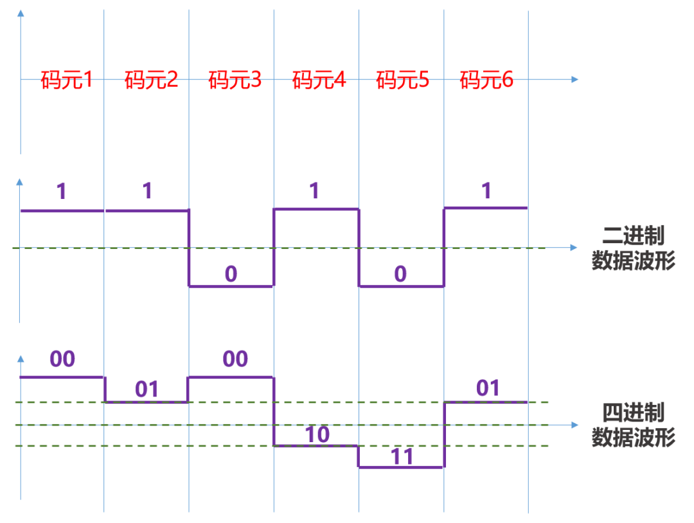
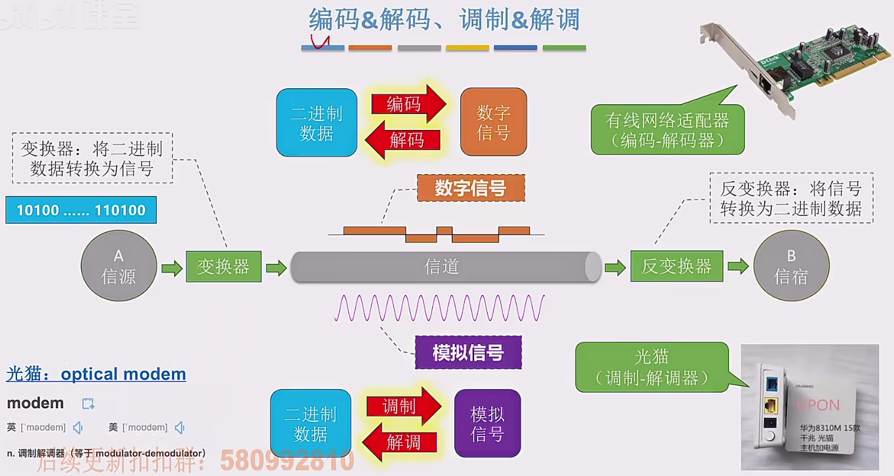
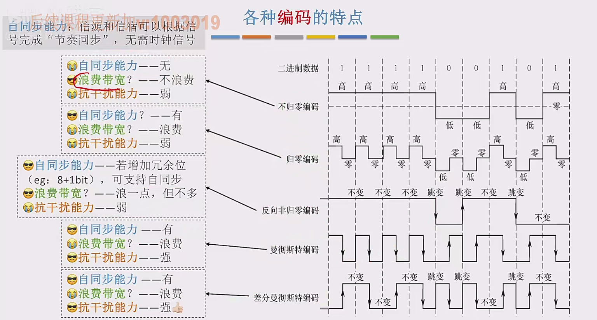
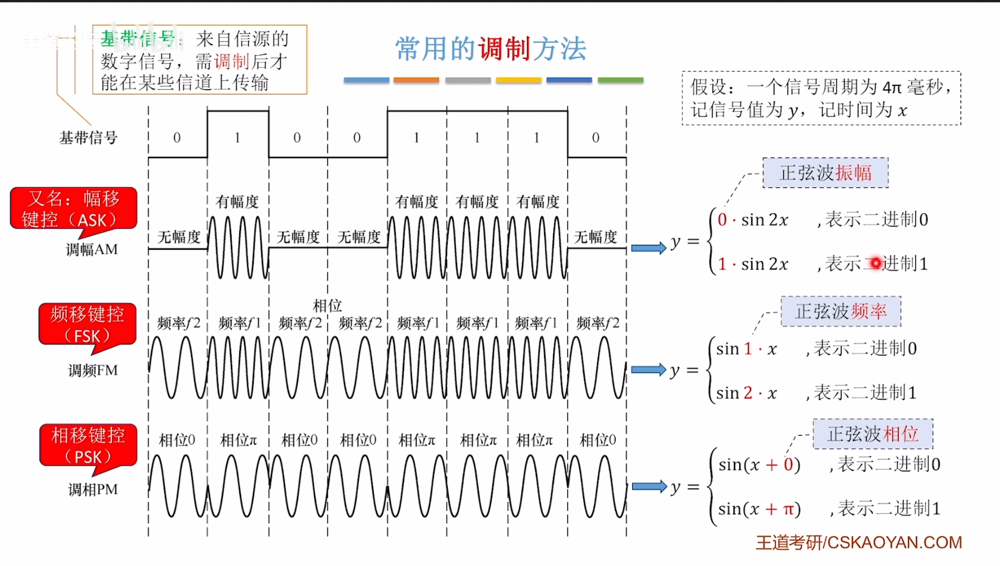
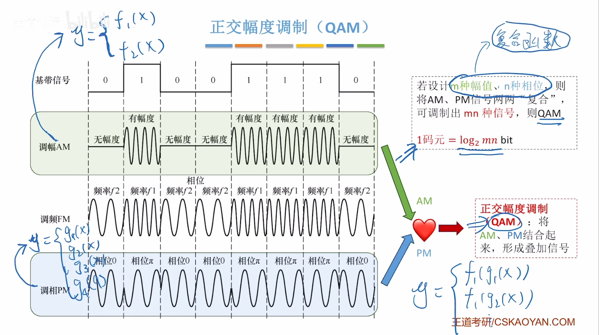

# 通信基础

## 基本概念

### 数据、信号与码元

码元是信息传输的单位，表示**单个周期**内代表一个信号的电平，1个码元可以携带多个比特的信息量。

例如，一个码元周期内，信号电平有4种可能的取值，那么这种码元则称为4进制码元，可以携带 $\log_2 4 = 2$ 比特的信息量。

### 信源、信道与信宿

字面意思

信源：产生和发送数据的源头。

信道：传输数据的通道。

信宿：接收数据的终点（归宿）。

### 速率、波特与带宽

速率：数据传输速率，单位是比特/秒（b/s）。

波特：码元传输速率，单位是波特（Baud）。

带宽：在通信原理中信道所能传输的频率范围，单位是赫兹（Hz）。为了避免和[计算机网络中的带宽](计算机网络概述.md#带宽)混淆，可以称其**频率带宽**，但二者本质都是衡量信息传输能力的指标。

## 信道的极限容量

### 奈奎斯特定理

对于一个理想低通信道（**没有噪声**、带宽有限）,

$$
极限波特率 = 2W \quad (Baud/s)
$$

其中 $W$ 为信道的频率带宽。

那么对应的，若要计算极限信息传输速率，则需要将波特率乘以每个码元可以携带的比特数。

$$
极限信息传输速率 = 2W \log_2 K \quad (b/s)
$$

其中 $K$ 为码元的进制数。

奈奎斯特定理说明：

- 在任何信道中，**码元的传输速率有上限**，超过此上限，就会出现严重的码间干扰问题，使得接收端无法完全正确识别码元。

- 信道的频率带宽 $W$ 越大，传输码元的能力越强。

- 奈氏准则给出了码元传输速率的限制，但并未限制信息传输速率，即未对一个码元最多携带多少比特的信息量做出限制。

### 香农定理

对于一个有噪声、带宽有限的信道，

$$
极限信息传输速率 = W \log_2 (1 + \frac{S}{N}) \quad (b/s)
$$

其中 $W$ 为信道的频率带宽，$S$ 为信号的平均功率，$N$ 为噪声的平均功率，$\frac{S}{N}$ 为信噪比。

!!! info "信噪比的记法"
    信噪比是一个没有单位的指标，但由于其数值通常较大，所以通常使用分贝（dB）来表示。

    $$
    \frac{S}{N} = 10 \log_{10} \frac{S}{N} \quad (dB)
    $$

    但是注意香农定理中的信噪比在计算时需要将分贝记法转换为线性值。

香农定理说明：

- 提升信道带宽、加强信号功率、降低噪声功率，都可以提高信道的极限比特率

- 结合[奈氏准则](#奈奎斯特定理)可以得出，在带宽、信噪比确定的信道上，**一个码元可以携带的比特数也是有上限的**。

## 编码与调制

### 编码与解码

#### 数字数据编码为数字信号

通常用 $1$ 表示高电平，用 $0$ 表示低电平，但也可以反过来。

归零编码（RZ）：在每个码元的中间时刻，电平发生跳变。这种方式可以把归零跳变用于同步，但在归零时需要占用部分带宽，会影响到传输效率。

非归零编码（NRZ）：在每个码元的中间时刻，电平保持不变。这种方式在收发双方存在同步问题，时钟不一致时，可能会引起误码。

反向非归零编码（NRZI）：$0$ 时电平不变，$1$ 时电平跳变。连续 $0$ 时仍无跳变，存在同步问题。

曼彻斯特编码：每个码元中间时刻必定跳变，前高后低为 $1$，前低后高为 $0$。自带时钟、同步性好，但波特率为比特率的两倍。

!!! tip
    以太网中，默认使用曼彻斯特编码作为物理层的编码方式。

差分曼彻斯特编码：码元中间时刻必定跳变，码元开始处跳变为 $0$，不跳变为 $1$。同步性好，且抗信号极性反转。

#### 模拟数据编码为数字信号

包括三个部分：**采样**、**量化**、**编码**。常用于对音频信号进行编码的[PCM编码](../../音频/PCM术语与概念.md)。

### 调制与解调

有些信道既可以传输数字信号，也可以传输模拟信号，如[双绞线](传输介质.md#双绞线)、[同轴电缆](传输介质.md#同轴电缆)等；但有的信道只能传输模拟信号，如[电磁波信道](传输介质.md#无线传输介质)。另外，模拟信号的抗干扰能力要比数字信号强，因此需要模拟信号与数字信号的转换，即调制与解调。

#### 数字数据调制为模拟信号

#### 模拟数据调制为模拟信号
