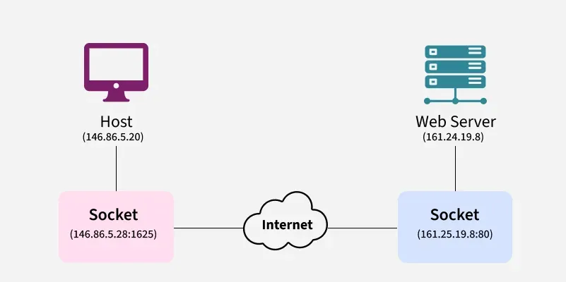
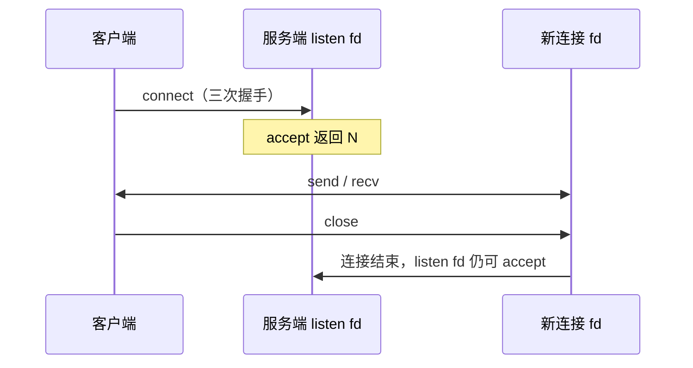
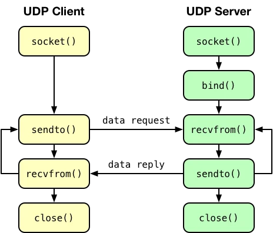
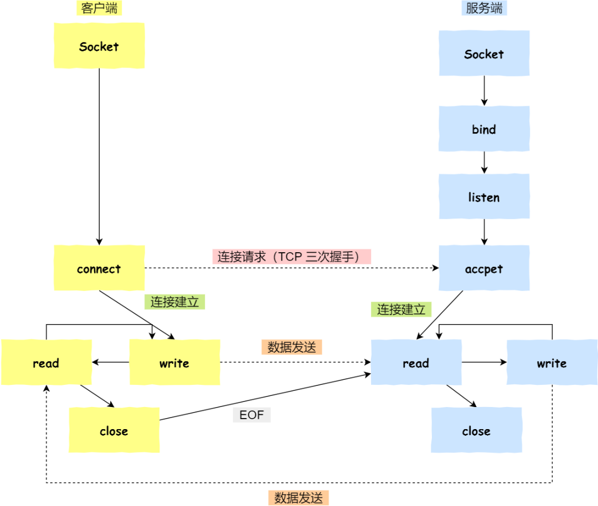

# 套接字接口

> [Socket in Computer Network | GeeksforGeeks](https://www.geeksforgeeks.org/socket-in-computer-network/)
>
> [Sockets Interface | IBM Documentation](https://www.ibm.com/docs/en/aix/7.2.0?topic=sockets-interface)

**Socket Interface（套接字接口）** 是[操作系统提供的一套标准 API](../操作系统/408/进程的描述与控制.md#套接字)，用于在进程之间进行网络通信，也可以用于本地 IPC（Inter-Process Communication, [进程间通信](../操作系统/408/进程的描述与控制.md#进程通信)）。它最早由 BSD Unix 提出，后来成为几乎所有操作系统（Linux、Windows、macOS 等）的网络编程事实标准。

**Socket Interface 是网络编程的基石**。掌握它之后，就能理解各种高层框架（Nginx、Redis、Kubernetes 中的网络部分）底层是如何工作的。

## 什么是 Socket



Socket 可以理解为**网络通信的“插座”**。一个 socket 通常包含以下信息：

- IP 地址 + 端口号（用于定位另一端）[^1]

- 协议类型（TCP、UDP 等）

- 通信状态

两个进程通过各自的 Socket 建立连接后，就可以像读写文件一样进行数据交换（send/recv）。

## Socket 的主要类型

根据协议域进行分类：

| 类型          | 英文              | 对应协议     | 特点                          | 典型用途          |
|---------------|-------------------|--------------|-------------------------------|-------------------|
| SOCK_STREAM   | 流式套接字        | TCP          | 可靠、面向连接、有序、无边界  | HTTP、HTTPS、FTP  |
| SOCK_DGRAM    | 数据报套接字      | UDP          | 不可靠、无连接、有边界        | DNS、视频流、游戏 |
| SOCK_RAW      | 原始套接字        | IP 等        | 可以直接操作 IP 层            | 网络抓包、协议实现 |
| SOCK_SEQPACKET| 顺序分组套接字    | SCTP 等      | 可靠、有序、有边界            | 电信级应用        |

最常用的是 **SOCK_STREAM (TCP)** 和 **SOCK_DGRAM (UDP)**。

## 编程语言中的API

- C/C++：直接使用 `<sys/socket.h>`（Linux）或 `winsock2.h`（Windows）

- Python：`socket` 模块，几乎和 C API 一一对应

- Rust：`std::net::TcpListener` / `std::net::TcpStream`

- Go：`net` 包（更高级抽象）

- Java：`Socket` / `ServerSocket` 类

## 主要系统调用

[TCP连接](408/TCP.md#TCP连接管理)采用[客户端/服务端模式](../操作系统/408/进程的描述与控制.md#客户端-服务器系统)，按两个不同的角色进行分类，其主要系统调用如下：

- **客户端**

    | 角色 | POSIX 系统调用 | 作用 |
    |------|----------------|------|
    | 客户端 | `socket()` | 创建未连接套接字 |
    | 客户端 | `connect()` | 向服务端发起三次握手 |
    | 客户端 | `send()` / `recv()`（或 `write` / `read`） | 双向收发数据 |
    | 客户端 | `shutdown()` / `close()` | 半关闭或释放 fd |

- **服务端**

    | 角色 | POSIX 系统调用 | 作用 |
    |------|----------------|------|
    | 服务端 | `socket()` | 创建监听套接字 |
    | 服务端 | `bind()` | 绑定本地 IP:端口 |
    | 服务端 | `listen()` | 将套接字设为监听状态 |
    | 服务端 | `accept()` | 阻塞直到有连接，**返回新的已连接 fd** |
    | 服务端 | `send()` / `recv()` | 与客户端通信（在 accept 返回的 fd 上） |
    | 服务端 | `close()` | 关闭连接 fd；监听 fd 可继续 `accept` |

- 其他重要函数

    | 接口 | 典型用途 |
    |------|----------|
    | `setsockopt()` / `getsockopt()` | `SO_REUSEADDR`（端口复用）、`SO_RCVTIMEO` / `SO_SNDTIMEO`（超时）、`TCP_NODELAY`（禁用 Nagle）、缓冲区大小 |
    | `fcntl()` | 设 `O_NONBLOCK`，配合多路复用 |
    | `select()` / `poll()` / `epoll()` / `kqueue()` | 单线程同时等待多个 fd 可读/可写；高并发服务端常用 epoll（Linux） |
    | `shutdown(how)` | `SHUT_RD` / `SHUT_WR` / `SHUT_RDWR`：半关闭，常用于发完请求后关写端仍读响应（见文末示例） |
    | `getaddrinfo()` / `freeaddrinfo()` | 解析主机名与服务名，统一 IPv4/IPv6，替代已废弃的 `gethostbyname` |
    | `getsockname()` / `getpeername()` | 查询本端或对端已解析的地址（连接建立后） |


## 其他概念

- **阻塞 vs 非阻塞**：默认是阻塞的（read/write 会卡住线程）

- **I/O 多路复用**：一个线程同时监控多个 socket（epoll 是 Linux 高性能关键）

- **字节序**：网络字节序是大端（Big-Endian），需用 `htonl`、`htons` 等转换

- **地址结构**：`sockaddr_in`（IPv4）、`sockaddr_in6`（IPv6）、`sockaddr_storage`（通用）

## TCP连接典型流程







!!! note "两个 fd 的分工"
    服务端上 **`listen` 用的套接字** 只负责排队等待连接；**`accept` 返回的套接字** 才用于与某一客户端读写。关闭客户端连接时通常只 `close(client_fd)`，监听套接字保持打开以便接受下一个连接。

### 主动连接（客户端）

主动连接用于客户端：由本端发起 `connect`，在已建立的 TCP 连接上收发数据。

1. **创建套接字** — 对应 `socket(2)`

    === "C / C++"
        ```cpp
        #include <sys/socket.h>

        int fd = socket(AF_INET, SOCK_STREAM, 0);
        ```
    === "Python"
        ```python
        import socket
        sock = socket.socket(socket.AF_INET, socket.SOCK_STREAM)
        ```
    === "Rust"
        ```rust
        use std::net::TcpStream;

        // 标准库无单独的 socket() 暴露给用户；
        // 未连接 fd 的创建与 connect 合并在 TcpStream::connect 中（见下一步）
        ```

2. **连接服务端** — 对应 `connect(2)`；推荐用 `getaddrinfo` 解析主机名与端口（支持 IPv4/IPv6）

    === "C / C++"
        ```cpp
        #include <netdb.h>
        #include <sys/socket.h>
        #include <unistd.h>

        addrinfo hints{};
        hints.ai_family = AF_UNSPEC;
        hints.ai_socktype = SOCK_STREAM;

        addrinfo* res = nullptr;
        getaddrinfo("www.example.com", "http", &hints, &res);

        int fd = socket(res->ai_family, res->ai_socktype, res->ai_protocol);
        connect(fd, res->ai_addr, res->ai_addrlen);

        freeaddrinfo(res);
        ```
    === "Python"
        ```python
        sock.connect(("www.example.com", 80))
        ```
    === "Rust"
        ```rust
        use std::net::TcpStream;

        // "host:port" 经 ToSocketAddrs 解析（内部类似 getaddrinfo）
        let mut stream = TcpStream::connect("www.example.com:80")?;
        ```

3. **通信** — 对应 `send` / `recv` 或把 socket 当字节流 `read` / `write`

    === "C / C++"
        ```cpp
        #include <cstring>
        #include <unistd.h>

        const char* request =
            "GET / HTTP/1.1\r\nHost: www.example.com\r\n\r\n";
        send(fd, request, strlen(request), 0);

        char buffer[4096];
        ssize_t n;
        while ((n = recv(fd, buffer, sizeof(buffer), 0)) > 0) {
          // 处理 buffer[0..n)
        }
        ```
    === "Python"
        ```python
        sock.sendall(b"GET / HTTP/1.1\r\nHost: www.example.com\r\n\r\n")
        data = sock.recv(4096)
        ```
    === "Rust"
        ```rust
        use std::io::{Read, Write};

        stream.write_all(
            b"GET / HTTP/1.1\r\nHost: www.example.com\r\n\r\n",
        )?;

        let mut buf = [0u8; 4096];
        loop {
            let n = stream.read(&mut buf)?;
            if n == 0 {
                break;  // 对端关闭（EOF）
            }
            // 处理 &buf[..n]
        }
        ```

4. **关闭** — `shutdown(2)` 可只关读或写；`close(2)` 释放描述符

    === "C / C++"
        ```cpp
        #include <sys/socket.h>
        #include <unistd.h>

        shutdown(fd, SHUT_WR);  // 半关闭：不再发送，仍可读响应
        close(fd);
        ```
    === "Python"
        ```python
        sock.shutdown(socket.SHUT_WR)
        sock.close()
        ```
    === "Rust"
        ```rust
        use std::net::Shutdown;

        stream.shutdown(Shutdown::Write)?;  // 半关闭写端，仍可读响应
        drop(stream);  // Drop 时自动 close(fd)
        ```

### 被动连接（服务端）

被动连接用于服务端：在本机地址上 `bind` + `listen`，用 `accept` 取出每个客户端连接。

1. **创建套接字**

    === "C / C++"
        ```cpp
        #include <sys/socket.h>

        int listen_fd = socket(AF_INET, SOCK_STREAM, 0);
        ```
    === "Python"
        ```python
        listening = socket.socket(socket.AF_INET, socket.SOCK_STREAM)
        ```
    === "Rust"
        ```rust
        use std::net::TcpListener;

        // TcpListener::bind 内部完成 socket(2) + bind(2)
        let listener = TcpListener::bind("0.0.0.0:80")?;
        ```

2. **绑定地址** — 对应 `bind(2)`；`0.0.0.0` / `INADDR_ANY` 表示监听所有网卡

    === "C / C++"
        ```cpp
        #include <arpa/inet.h>
        #include <netinet/in.h>
        #include <sys/socket.h>

        int reuse = 1;
        setsockopt(listen_fd, SOL_SOCKET, SO_REUSEADDR, &reuse, sizeof(reuse));

        sockaddr_in addr{};
        addr.sin_family = AF_INET;
        addr.sin_port = htons(80);
        addr.sin_addr.s_addr = INADDR_ANY;  // 0.0.0.0

        bind(listen_fd, reinterpret_cast<sockaddr*>(&addr), sizeof(addr));
        ```
    === "Python"
        ```python
        listening.setsockopt(socket.SOL_SOCKET, socket.SO_REUSEADDR, 1)
        listening.bind(("0.0.0.0", 80))
        ```
    === "Rust"
        ```rust
        // 上一步 bind 已指定地址；设置 SO_REUSEADDR 需 socket2 等 crate，
        // 标准库 TcpListener 未直接暴露 setsockopt
        ```

3. **监听** — 对应 `listen(2)`，第二个参数为未完成连接队列长度（backlog）

    === "C / C++"
        ```cpp
        listen(listen_fd, 16);
        ```
    === "Python"
        ```python
        listening.listen()
        ```
    === "Rust"
        ```rust
        // listen(2) 在首次 accept 前由标准库自动调用，无需手写
        ```

4. **接受连接** — 对应 `accept(2)`，**阻塞**直到有客户端完成握手

    === "C / C++"
        ```cpp
        sockaddr_in client_addr{};
        socklen_t client_len = sizeof(client_addr);
        int conn_fd = accept(listen_fd,
                             reinterpret_cast<sockaddr*>(&client_addr),
                             &client_len);
        // getpeername(conn_fd, ...) 可查看对端地址
        ```
    === "Python"
        ```python
        conn, addr = listening.accept()
        ```
    === "Rust"
        ```rust
        let (mut stream, peer_addr) = listener.accept()?;
        // peer_addr 为对端 SocketAddr
        ```

5. **通信** — 在 **accept 返回的套接字** 上读写，而不是 listening 套接字

    === "C / C++"
        ```cpp
        #include <cstring>

        char buffer[4096];
        ssize_t n = recv(conn_fd, buffer, sizeof(buffer), 0);

        const char* response = "HTTP/1.1 200 OK\r\n\r\n";
        send(conn_fd, response, strlen(response), 0);
        ```
    === "Python"
        ```python
        data = conn.recv(4096)
        conn.sendall(b"HTTP/1.1 200 OK\r\n\r\n")
        ```
    === "Rust"
        ```rust
        use std::io::{Read, Write};

        let mut buf = [0u8; 4096];
        let _n = stream.read(&mut buf)?;

        stream.write_all(b"HTTP/1.1 200 OK\r\n\r\n")?;
        ```

6. **关闭** — 先关连接套接字；需要停止服务时再关监听套接字

    === "C / C++"
        ```cpp
        #include <unistd.h>

        close(conn_fd);
        // close(listen_fd);  // 进程退出或不再 accept 时
        ```
    === "Python"
        ```python
        conn.close()
        listening.close()
        ```
    === "Rust"
        ```rust
        drop(stream);    // 关闭连接 fd
        drop(listener);  // 关闭监听 fd
        ```

## UDP 数据报流程

无连接，无 `listen` / `accept`。常用 `sendto` / `recvfrom`（未 `connect` 时）或 `send` / `recv`（已 `connect` 到固定对端时）。

| 步骤 | 客户端/通用 | 服务端 |
|------|-------------|--------|
| 创建 | `socket(AF_INET, SOCK_DGRAM, 0)` | 同左 |
| 本地地址 | 可选 `bind` | 通常 `bind` 固定端口 |
| 收发 | `sendto` / `recvfrom` | `recvfrom` 得来源地址后 `sendto` 回复 |
| 关闭 | `close` | `close` |

=== "C / C++"
    ```cpp
    #include <arpa/inet.h>
    #include <netinet/in.h>
    #include <sys/socket.h>
    #include <unistd.h>

    // 服务端：bind 固定端口，recvfrom 得来源地址后 sendto 回复
    int server_fd = socket(AF_INET, SOCK_DGRAM, 0);

    sockaddr_in server_addr{};
    server_addr.sin_family = AF_INET;
    server_addr.sin_port = htons(53);
    server_addr.sin_addr.s_addr = INADDR_ANY;
    bind(server_fd, reinterpret_cast<sockaddr*>(&server_addr),
         sizeof(server_addr));

    char buf[512];
    sockaddr_in client_addr{};
    socklen_t client_len = sizeof(client_addr);
    ssize_t n = recvfrom(server_fd, buf, sizeof(buf), 0,
                         reinterpret_cast<sockaddr*>(&client_addr),
                         &client_len);
    sendto(server_fd, buf, n, 0,
           reinterpret_cast<sockaddr*>(&client_addr), client_len);

    close(server_fd);

    // 客户端：可选 bind 到任意本地端口，直接向对端 sendto
    int client_fd = socket(AF_INET, SOCK_DGRAM, 0);

    sockaddr_in dest{};
    dest.sin_family = AF_INET;
    dest.sin_port = htons(53);
    inet_pton(AF_INET, "8.8.8.8", &dest.sin_addr);

    const char* msg = "query";
    sendto(client_fd, msg, 5, 0,
           reinterpret_cast<sockaddr*>(&dest), sizeof(dest));

    close(client_fd);
    ```

=== "Python"
    ```python
    import socket

    # 服务端
    server = socket.socket(socket.AF_INET, socket.SOCK_DGRAM)
    server.bind(("0.0.0.0", 53))
    data, addr = server.recvfrom(512)
    server.sendto(data, addr)
    server.close()

    # 客户端
    client = socket.socket(socket.AF_INET, socket.SOCK_DGRAM)
    client.sendto(b"query", ("8.8.8.8", 53))
    client.close()
    ```

=== "Rust"
    ```rust
    use std::net::UdpSocket;

    // 服务端：绑定端口后 recv_from / send_to
    let server = UdpSocket::bind("0.0.0.0:53")?;
    let mut buf = [0u8; 512];
    let (n, src) = server.recv_from(&mut buf)?;
    server.send_to(&buf[..n], src)?;

    // 客户端：可直接 send_to，无需 connect
    let client = UdpSocket::bind("0.0.0.0:0")?;
    client.send_to(b"query", "8.8.8.8:53")?;
    ```


<!--
## Rust 完整示例

Rust 标准库 `std::net` 在 TCP 上把 `socket` / `bind` / `listen` 封装进 `TcpListener`，把 `socket` / `connect` 封装进 `TcpStream`；I/O 使用 `Read` / `Write` trait，错误用 `Result` 返回。

### 客户端

```rust
use std::io::{Read, Write};
use std::net::{Shutdown, TcpStream};

fn main() -> std::io::Result<()> {
    let mut stream = TcpStream::connect("www.example.com:80")?;

    stream.write_all(b"GET / HTTP/1.1\r\nHost: www.example.com\r\n\r\n")?;
    stream.shutdown(Shutdown::Write)?;

    let mut buf = [0u8; 4096];
    loop {
        let n = stream.read(&mut buf)?;
        if n == 0 {
            break;
        }
        print!("{}", String::from_utf8_lossy(&buf[..n]));
    }
    Ok(())
}
```

### 服务端

```rust
use std::io::{Read, Write};
use std::net::TcpListener;

fn main() -> std::io::Result<()> {
    let listener = TcpListener::bind("0.0.0.0:8080")?;

    loop {
        let (mut stream, peer) = listener.accept()?;
        eprintln!("connection from {peer}");

        let mut buf = [0u8; 4096];
        let _n = stream.read(&mut buf)?;

        stream.write_all(b"HTTP/1.1 200 OK\r\n\r\n")?;
        // stream 在此作用域结束自动 drop（close）
    }
}
```

!!! tip "与 POSIX 的对应关系"
    | POSIX | Rust `std::net` |
    |-------|-----------------|
    | `socket` + `connect` | `TcpStream::connect` |
    | `socket` + `bind` + `listen` | `TcpListener::bind` |
    | `accept` | `TcpListener::accept` → `(TcpStream, SocketAddr)` |
    | `send` / `recv` | `write` / `read`（`Write` / `Read` trait） |
    | `shutdown` | `TcpStream::shutdown` |
    | `close` | `drop(stream)`（实现 `Drop`） |
    | `sendto` / `recvfrom` | `UdpSocket::send_to` / `recv_from` |

需要直接调用 `setsockopt`、`fcntl` 设非阻塞、或 `epoll` 时，常用 [`socket2`](https://docs.rs/socket2) + [`mio`](https://docs.rs/mio) / [`tokio`](https://docs.rs/tokio) 等生态库。
 -->


[^1]: [套接字 - 传输层提供的服务](408/传输层提供的服务.md#套接字)