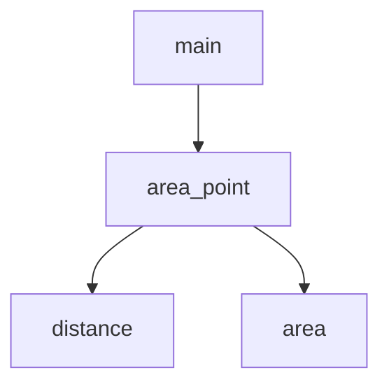

# 增量型开发

> [增量式开发 (Linux C 编程)](https://akaedu.github.io/book/ch05s02.html)
>
> [Incremental Development | Think Python](https://eng.libretexts.org/Bookshelves/Computer_Science/Programming_Languages/Think_Python_-_How_to_Think_Like_a_Computer_Scientist_(Downey)/19%3A_Fruitful_Functions/19.02%3A_Incremental_Development)

增量型开发(Incremental Development) 是一种**编程实践**, 每次只添加并验证一小段代码, 而不是一口气写完整个程序再编译运行. 核心目标是**缩短调试时间**——出错时, 问题几乎一定出在刚才改动的那几行.

!!! note "与增量模型的区别"
    软件工程生命周期里的[增量模型(Incremental Model)](https://www.geeksforgeeks.org/software-engineering/software-engineering-incremental-process-model/)指按功能模块分批交付软件; 本文讨论的是**写代码时的增量步骤**, 二者层次不同, 但"小步前进、频繁验证"的精神一致.

## 增量开发的优势

一口气写完再测试, 常见后果:

- 语法/逻辑错误堆叠, 难以定位

- 中间状态不可运行, 缺乏"已知正确的参照版本"

- 调试从"找最后一处改动"变成"通读全文"

增量开发可以把反馈周期压缩到最短: **写一点 → 跑一下 → 验证 → 再写一点**.

## 基本流程

以需求"已知圆直径两端坐标 $(x_1, y_1)$ 与 $(x_2, y_2)$, 求圆面积"为例:

### 1. 分解问题

| 子问题 | 输入 | 输出 | 可封装为 |
| --- | --- | --- | --- |
| 求两点距离 | 两端坐标 | 半径 $r$ | `distance()` |
| 求圆面积 | 半径 $r$ | 面积 $A$ | `area()` |
| 组合 | 两端坐标 | 面积 $A$ | `area_point()` |

### 2. 从骨架 (Stub) 开始

先写**语法正确、能编译运行**的最小版本, 哪怕逻辑尚未实现:

```c
double distance(double x1, double y1, double x2, double y2)
{
    return 0.0;
}
```

配一个临时 `main` 调用它. 编译通过 = 函数签名、链接、基本结构没问题, 可以建立信心继续写.

### 3. 小步添加, 每步验证

每次只加一两行, 并**事先知道期望结果**:

```c
double dx = x2 - x1;
double dy = y2 - y1;
/* 期望: dx=3.0, dy=4.0 (输入 1,2 与 4,6) */
```

验证无误后再求平方和、开方, 最终得到 `distance` 完整实现.

### 4. 用脚手架 (Scaffolding) 观察中间值

调试用的 `printf`、临时 `main`、断言等叫**脚手架**——盖房子时有用, 但不是成品的一部分.

```c
/* printf("dx is %f, dy is %f\n", dx, dy); */  /* 验证后可注释, 而非删除 */
```

注释而非删除的好处: 日后出 Bug 时可快速恢复, 比从零写调试代码省事. 成品代码应去掉或注释掉脚手架, 保持输出干净.

### 5. 用临时变量降低调试难度

一行写完:

```c
return sqrt((x2-x1)*(x2-x1) + (y2-y1)*(y2-y1));
```

简洁, 但出错时难以插入观察点, 且 `(x2-x1)` 可能重复计算. 分步写法更清晰、更好调:

```c
double dx = x2 - x1;
double dy = y2 - y1;
double dsquared = dx * dx + dy * dy;
return sqrt(dsquared);
```

程序跑通后, 若不影响可读性, 可适当合并表达式; **可读性与可调试性优先于一行炫技**.

## 组合与复用

子函数就绪后, 上层函数应**调用**而非**复制**代码:

```c
/* 推荐: 复用 */
double area_point(double x1, double y1, double x2, double y2)
{
    return area(distance(x1, y1, x2, y2));
}

/* 不推荐: 把 distance 和 area 的语句内联复制 */
```

重复代码意味着: 修 `distance` 的 Bug 时还要记得改 `area_point`. **封装小函数就是为了复用**; 调用关系形成函数的分层设计 (Stratify):



底层函数解决原子问题, 上层函数组合它们解决更大问题; 各层均可被不同调用方复用.

## 三条实践原则

1. **从可运行程序出发, 做小步改动** — 任何时刻出错, 范围都局限在最近改动

2. **用临时变量保存中间结果** — 便于打印检查, 有时还能避免重复计算

3. **成品稳定后再精简** — 去掉脚手架、合并语句, 但不牺牲可读性

## 与测试驱动开发 (TDD) 的关系

增量开发强调**短反馈循环**; [测试驱动开发(TDD)](https://increment.com/testing/the-art-and-craft-of-tdd/) 把这一点推广:

| | 增量开发 | TDD |
| --- | --- | --- |
| 验证方式 | 手动运行、`printf`、REPL | 自动化测试 |
| 典型节奏 | 写几行 → 跑一下 | 红 (写失败测试) → 绿 (最小实现) → 重构 |
| 脚手架 | 临时打印/临时代码 | 测试用例 (长期保留) |

二者可以结合, 初学者用 `printf` 增量调试; 熟练后即可开始使用测试代替打印, 脚手架从"临时代码"升级为"持久测试".

## 局限与进阶

- **步长**: 初学宜"一行一改"; 经验多了可一次写若干行, 但不应回到"整程序一次写完"

- **不适用场景**: 纯配置、一次性脚本等极短代码, 增量成本可能大于收益

- **工具演进**: `printf` 最直接; 后续可配合 `gdb`、IDE 断点、单元测试框架, 但**小步验证**的思路不变
