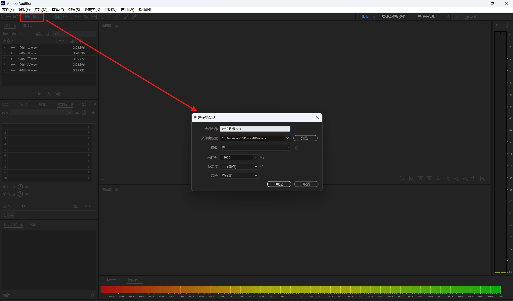
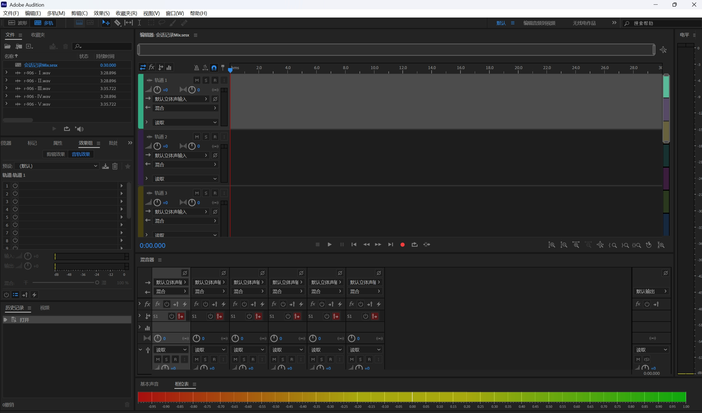
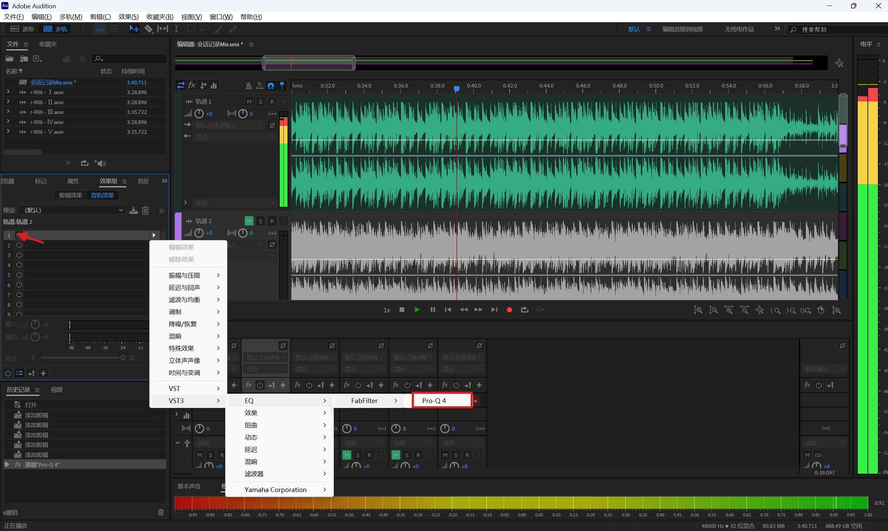
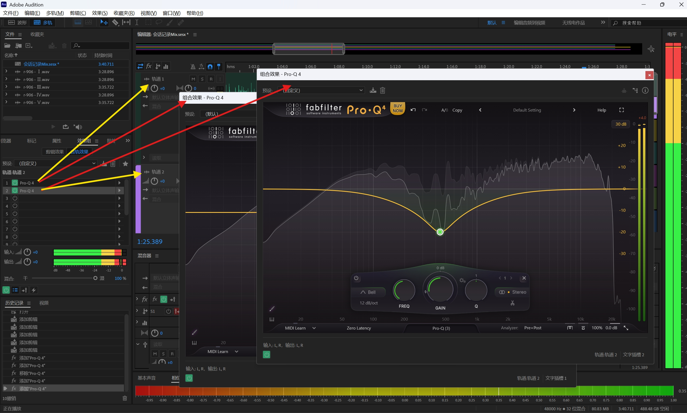
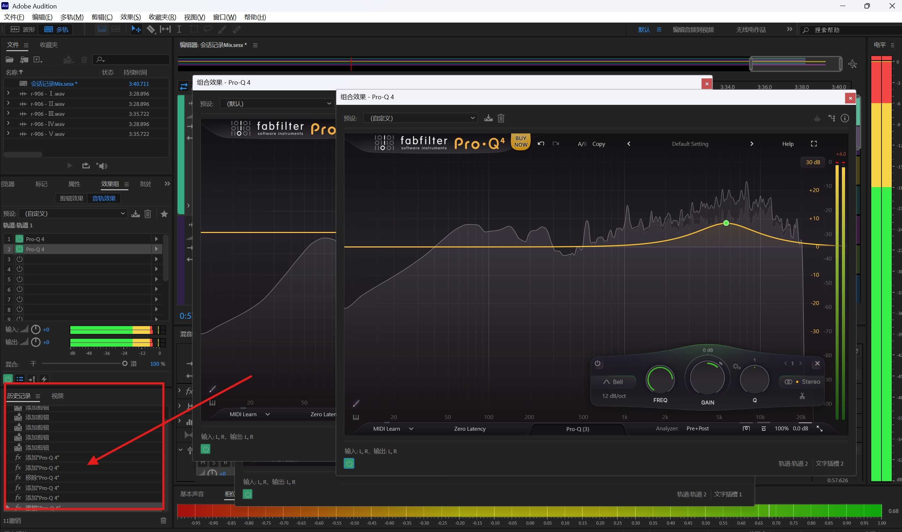
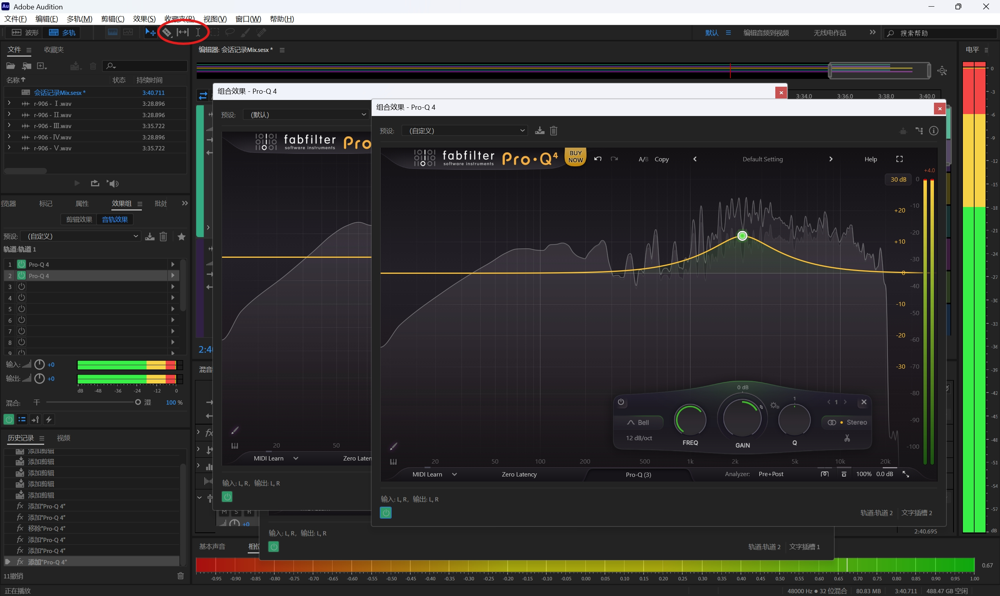
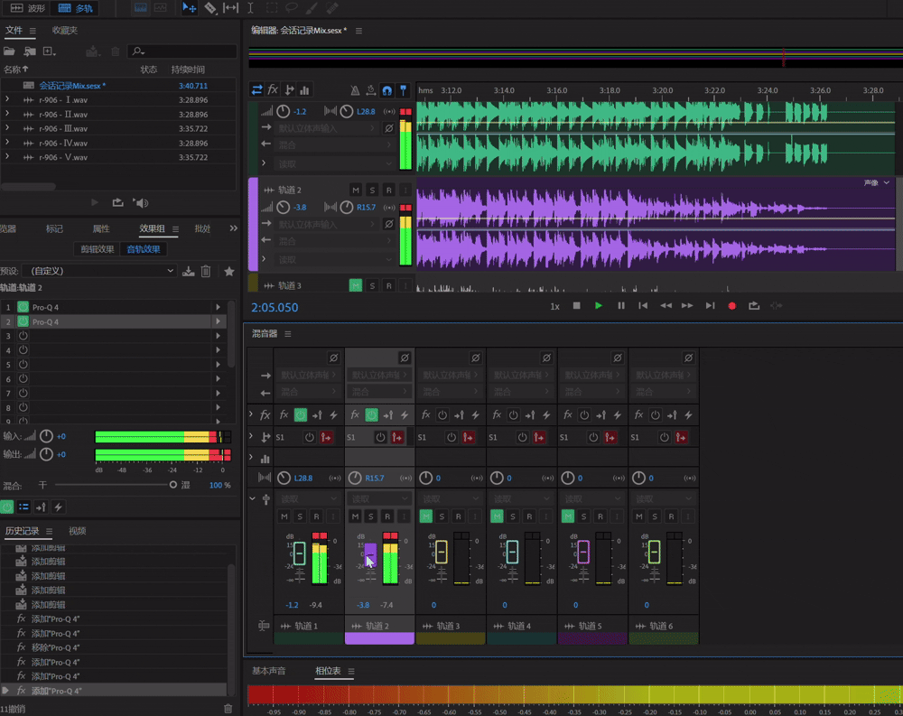

# Audition混音基础

    <iframe src="https://player.bilibili.com/player.html?isOutside=true&aid=115970710444028&bvid=BV1Pe67BsEyk&cid=35655386454&p=1&autoplay=0"
    scrolling="no" 
    border="0" 
    frameborder="no" 
    framespacing="0" 
    allowfullscreen="true"> 
    </iframe>

## Audition简介

**Adobe Audition**(以下简称AU)是由Adobe公司开发的DAW（数字音频工作站）, 具备多轨, 非破坏性混音/编辑环境以及破坏性波形编辑视图[^1].

使用AU用于混音上限并不高, 具体主要体现在**工作流深度**不够深. 但是对于基础的混音需求, AU其实是够用的.

干声 + 伴奏, 几条和声, 再做[EQ](调音混音背后的声学理论基础.md#EQ的作用) / 压缩 / 混响这类普通[混音](调音混音背后的声学理论基础.md), AU完全够用.

!!! info "上限具体在哪"
    AU 的前身是 Cool Edit Pro, 核心是波形编辑, 修复, 以及影视 / 播客后期. 多轨能推推子, 挂效果, 做自动化, 但不是按"混音师每天坐在台上"设计的.

    可能会遇到的瓶颈:

    - **信号路由偏浅**: 发送和总线都有, 但嵌套编组, VCA, 把并行压缩当常规结构来建, 都别扭. 工程到 20–40 轨以上, 组织成本会明显高于 Pro Tools / Cubase / Reaper 一类音乐 DAW.

    - **没有真正的 MIDI / 乐器轨**: 素材必须先弹成音频再进来. 歌声合成流程里引擎已经渲好了, 影响不大.

    - **音乐时间是二等公民**: 更擅长按秒, 按采样点切; 小节 / 速度图 / take 叠录都弱. 干声贴伴奏时这个问题很小.

    - **自动化和行业交接更浅**: 音量, 声像自动化能做, 但插件参数反复过轨和控制台深度不如专业混音台向的 DAW. 棚里交换的是 Pro Tools session, 这是职业路径上限, 不是翻唱封面的上限.

    现代 DAW 的求和大多足够干净; 听感差距几乎都来自编排, 增益结构, 以及[掩蔽](调音混音背后的声学理论基础.md#心理声学). AU 自带的修复 / 降噪 / 频谱编辑, 对人声干声甚至更顺手.

    换软件的理由应是某件事**做不到**, 而不是还不知道该听什么, 如果是后者换了 Cubase 也会同样卡住.

## AU的基本操作

### 多轨会话

混音工程主要在多轨会话上进行.

点击波形编辑器选项旁边的多轨编辑器按钮, 即可进入多轨会话, 若事先没有创建, AU会提示创建:

创建完多轨会话后, 可以看到两个窗口(这里是我事先把它们分开了, AU的工作区布局是可以自己调整的), 分别是**编辑器**和**混音器**, 我们的混音工作就围绕着两个界面展开:

将不同的音频扔到不同的轨道中, 这时针对不同音频的效果器就是**相互独立**的了.

然后我们就可以对不同的轨道各自进行处理了:

### 其他操作

- 界面左下角有一个"历史记录"面板, 这里记录着在AU界面上对当前会话所有的操作历史, 类似vscode中的[时间线](https://code.visualstudio.com/docs/sourcecontrol/history?referrer=vsc-search#_view-file-history-with-the-timeline-view), 可以点击其中的操作来回溯:

    

- 界面的左上方还有一些有用的工具:

    

    红圈圈起的部分从左到右分别是音轨剪辑工具, 滑动工具(用来在音轨中移动选中的音频块)和时间选择工具.

### 编辑器与混音器

二者是互通的, 在某个轨道的编辑器上变换声响旋钮, 亦或是在混音器上移动推子, 都会实时同步到另一个面板上:

## 声音信号的路由

[^1]: [Adobe Audition | Wikipedia](https://en.wikipedia.org/wiki/Adobe_Audition)
