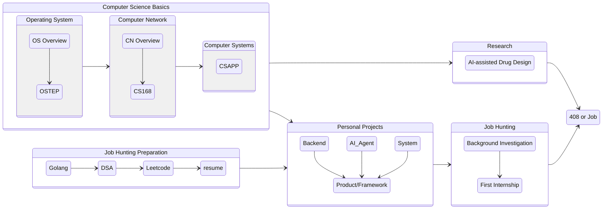

# Todo List

## Job Related Tech Stack

- [ ] Computer Science Basics

    - [ ] [小林coding | 图解计算机基础](https://xiaolincoding.com/)

- [ ] **Golang**:

    - [*] [Go语言圣经（中文版）](https://golang-china.github.io/gopl-zh/index.html) - 入门参考

    - [Go 语言中文文档](https://www.topgoer.com/) - 有[面试资料](http://mian.topgoer.com/)，但有点老了

    - [ ] [Go 语言进阶之路](https://golangstar.cn/go_series/introduction.html)

    - [ ] [Golang 主流框架](https://www.topgoer.com/%E5%BC%80%E6%BA%90/go%E5%AD%A6%E4%B9%A0%E7%BA%BF%E8%B7%AF%E5%9B%BE.html)

    - [ ] [Awesome Go | A curated list of awesome Go frameworks, libraries and software](https://awesome-go.com/)

- [ ] [bilibili Open Source Task Force | Github](https://github.com/bilibili)

- [ ] [bilibili 校园招聘](https://jobs.bilibili.com/campus)

## Computer Science Basics

- [ ] **Operating System**

    - [x] Basic concepts learning: 《王道2026操作系统考研复习指导》

    - [ ] Advanced Understanding

        - [ ] [《Operating Systems: Three Easy Pieces》](https://pages.cs.wisc.edu/~remzi/OSTEP/)

- [ ] **Computer Network**

    - [ ] [CS 168 - Introduction to the Internet: Architecture and Protocols](https://sp25.cs168.io/)

        - [ ] [Textbook | CS 168](https://textbook.cs168.io)

- [ ] Computer Systems: A Programmer's Perspective
