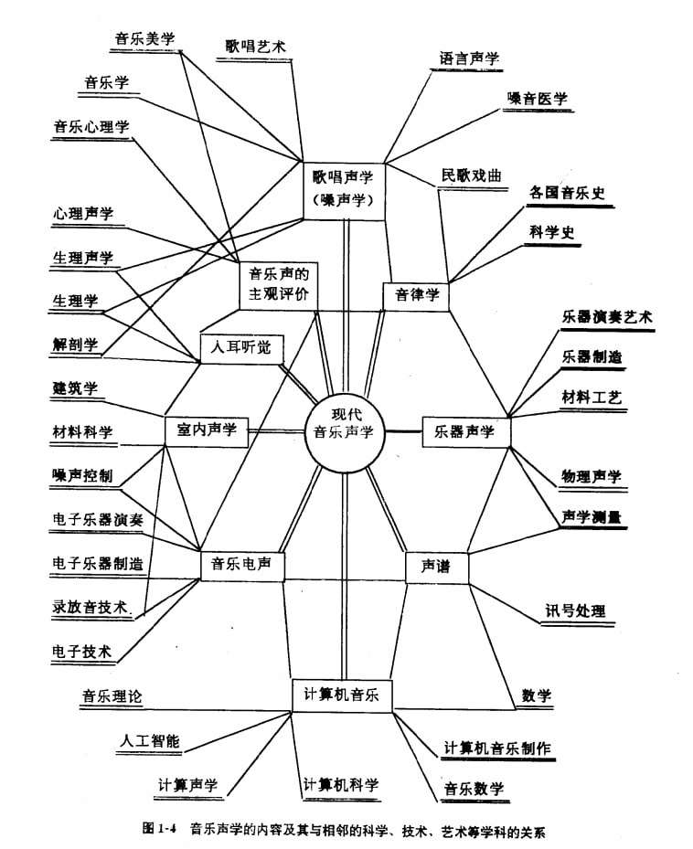
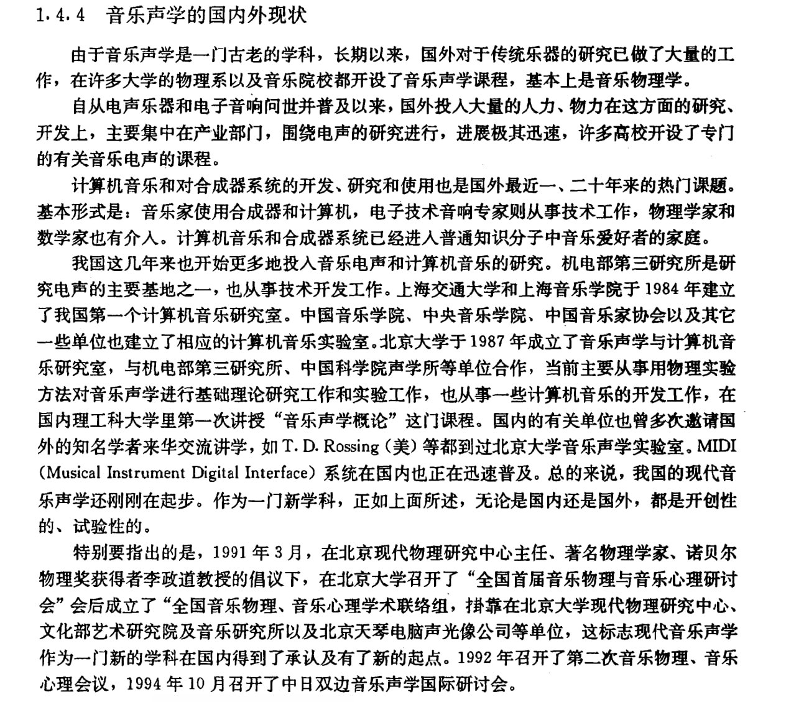

# 音乐声学概述

>[音乐声学 音响·乐器·计算机音乐·MIDI·音乐厅声学原理及应用 | 龚镇雄](https://zh.z-library.sk/book/21822775/03d975/%E9%9F%B3%E4%B9%90%E5%A3%B0%E5%AD%A6-%E9%9F%B3%E5%93%8D%E4%B9%90%E5%99%A8%E8%AE%A1%E7%AE%97%E6%9C%BA%E9%9F%B3%E4%B9%90midi%E9%9F%B3%E4%B9%90%E5%8E%85%E5%A3%B0%E5%AD%A6%E5%8E%9F%E7%90%86%E5%8F%8A%E5%BA%94%E7%94%A8.html?ts=1502)

## 现代音乐声学的内容

研究对象即为**音乐声的发生、传播、接收、其性质以及与其他物质的相互作用**，其研究内容包括：

- **音乐声的发生**: 主要包括人声、传统乐器发声和电子乐器的电震荡发声（计算机音乐也是电发声）

- **音律理论**: 系列音的产生方法及其相互间的关系

- **音乐声的传播**: 包括声源的辐射、媒质的吸收和反射

- **音乐声的接收**: 包括人耳、拾音器在各种场合对音乐声的接收（其中人耳听觉是最复杂、最精密的接收系统，**其听觉与心理过程是紧密相连的**）

- **音乐声的性质**: 包括音乐声的*物理量*——如频率、音色、音量、音强、音高等

- **音乐声与其他物质的相互作用**: 包括乐器中的耦合发声或共鸣机制、音乐声传播中的干扰、消音或控音机制等

## 现代音乐声学的基础学科

明确一个学科的基础学科有助于确定该学科的**研究方法论**与**研究工具**。

现代音乐声学的基础学科（母学科）包括:

- **物理学**

    - 声学

    - 振动与波

    - 电子学技术

- **数学**

    - 代数: 对数、数列、行列式、级数

    - 数理统计

    - 信号处理的数学方法

    - 傅氏分析

- **计算机科学与技术**

    - [音频音乐与计算机的交融——音频音乐技术 | 李伟](https://zh.z-library.sk/book/119540673/01b991/%E9%9F%B3%E9%A2%91%E9%9F%B3%E4%B9%90%E4%B8%8E%E8%AE%A1%E7%AE%97%E6%9C%BA%E7%9A%84%E4%BA%A4%E8%9E%8D%E9%9F%B3%E9%A2%91%E9%9F%B3%E4%B9%90%E6%8A%80%E6%9C%AF.html)

    - [Fundamentals of Music Processing: Using Python and Jupyter Notebooks | Meinard Müller](https://zh.z-library.sk/book/11987680/684669/fundamentals-of-music-processing-using-python-and-jupyter-notebooks.html)

- 音乐学及音乐表演艺术

- 审美学

- 心理学

## 现代音乐声学的研究方法与相邻学科

## 音乐声学的现状

